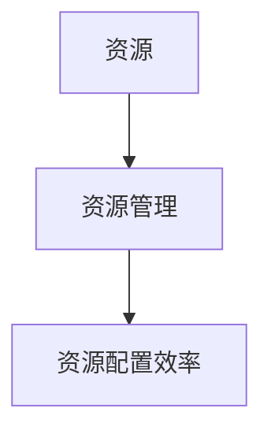

## 1.背景介绍

在当今的信息化社会，资源管理已经成为了一项至关重要的任务。无论是个人电脑还是大型数据中心，都需要对各种资源进行有效的管理，以确保系统的稳定运行和高效性能。资源管理的主要目标是优化资源配置效率，即如何有效地分配和利用有限的资源来满足系统的需求。

## 2.核心概念与联系

在讨论资源管理时，我们需要理解几个核心概念：

- **资源（Resource）**：在计算机系统中，资源是指可以被系统管理和调度的任何实体，包括CPU、内存、硬盘、网络带宽等。

- **资源管理（Resource Management）**：资源管理是指通过一系列的策略和技术，对资源进行有效的分配、调度和回收，以满足系统的需求。

- **资源配置效率（Resource Allocation Efficiency）**：资源配置效率是指资源管理的效果，即在满足系统需求的前提下，最大限度地提高资源的利用率。

这三个概念之间的联系在于，资源配置效率是衡量资源管理效果的重要指标，而资源管理则是通过对资源的有效分配、调度和回收，来提高资源配置效率。



## 3.核心算法原理具体操作步骤

资源管理的核心算法包括资源分配算法、资源调度算法和资源回收算法。下面我们分别进行详细介绍：

- **资源分配算法**：资源分配算法是指在系统中，如何将有限的资源分配给各个请求。常见的资源分配策略有静态分配策略和动态分配策略。

- **资源调度算法**：资源调度算法是指在系统中，如何调度已经分配的资源，以满足系统的需求。常见的资源调度策略有先来先服务（FCFS）、短作业优先（SJF）和优先级调度等。

- **资源回收算法**：资源回收算法是指在系统中，如何回收已经使用完的资源，以供其他请求使用。常见的资源回收策略有引用计数和标记清除等。

## 4.数学模型和公式详细讲解举例说明

在资源管理中，我们可以使用数学模型来描述和解决问题。例如，我们可以使用图论来描述资源分配问题，使用排队论来描述资源调度问题，使用垃圾收集算法来描述资源回收问题。

例如，资源分配问题可以被描述为一个图论问题。在这个图中，节点代表资源或请求，边代表资源的分配。我们的目标是找到一个最优的分配方案，即在满足所有请求的前提下，最小化资源的使用。

假设我们有n个资源和m个请求，我们可以定义一个分配矩阵A，其中$A_{ij}$表示第i个资源分配给第j个请求的数量。我们的目标是最小化$\sum_{i=1}^{n}\sum_{j=1}^{m}A_{ij}$，即资源的总使用量。

## 5.项目实践：代码实例和详细解释说明

接下来，我们将通过一个简单的例子来演示如何在Python中实现资源管理。在这个例子中，我们将使用multiprocessing模块来管理CPU资源。

```python
from multiprocessing import Pool

def f(x):
    return x*x

if __name__ == '__main__':
    with Pool(5) as p:
        print(p.map(f, [1, 2, 3]))
```

在这个例子中，我们首先导入了multiprocessing模块，然后定义了一个函数f，这个函数的作用是计算一个数的平方。然后，我们创建了一个Pool对象，这个对象可以管理多个进程。在这个例子中，我们创建了5个进程。最后，我们使用Pool对象的map方法，将函数f应用到列表[1, 2, 3]的每个元素上。

## 6.实际应用场景

资源管理在许多实际应用场景中都有广泛的应用，例如：

- **操作系统**：操作系统需要管理硬件资源，包括CPU、内存、硬盘和网络等。操作系统通过资源管理，可以有效地分配和调度资源，提高系统的性能和稳定性。

- **云计算**：在云计算中，资源管理是至关重要的。通过有效的资源管理，可以提高资源的利用率，降低运营成本，提供更好的服务。

- **大数据**：在大数据处理中，资源管理也非常重要。通过有效的资源管理，可以提高数据处理的效率，降低处理时间，提供更快的数据分析结果。

## 7.工具和资源推荐

在实际应用中，有许多工具和资源可以帮助我们进行资源管理，例如：

- **Docker**：Docker是一个开源的应用容器引擎，可以帮助我们进行资源隔离和限制。

- **Kubernetes**：Kubernetes是一个开源的容器编排工具，可以帮助我们进行资源调度和管理。

- **Hadoop**：Hadoop是一个开源的大数据处理框架，其中的YARN组件可以帮助我们进行资源管理。

## 8.总结：未来发展趋势与挑战

随着信息化社会的发展，资源管理的重要性将进一步提高。在未来，我们需要面临的挑战包括如何更有效地管理越来越复杂的资源，如何在保证系统性能的同时，降低资源的使用，如何在满足实时性需求的同时，提高资源的利用率。

## 9.附录：常见问题与解答

1. **问题：资源管理的主要目标是什么？**
答：资源管理的主要目标是优化资源配置效率，即如何有效地分配和利用有限的资源来满足系统的需求。

2. **问题：资源管理的核心算法有哪些？**
答：资源管理的核心算法包括资源分配算法、资源调度算法和资源回收算法。

3. **问题：什么是资源配置效率？**
答：资源配置效率是指资源管理的效果，即在满足系统需求的前提下，最大限度地提高资源的利用率。

作者：禅与计算机程序设计艺术 / Zen and the Art of Computer Programming