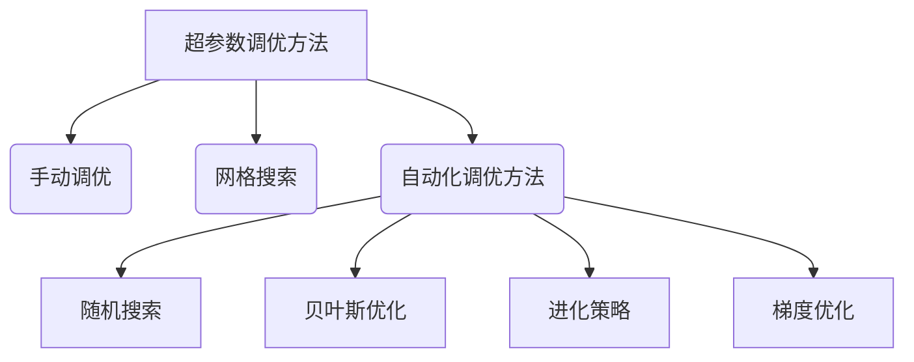
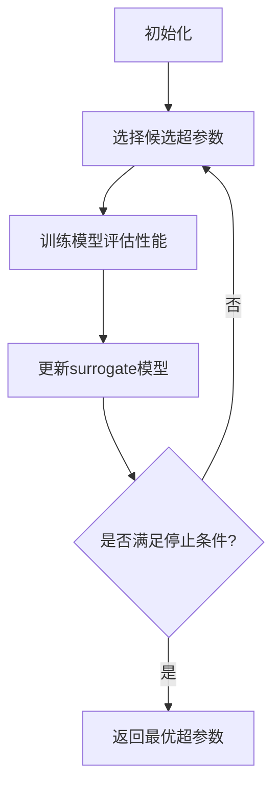
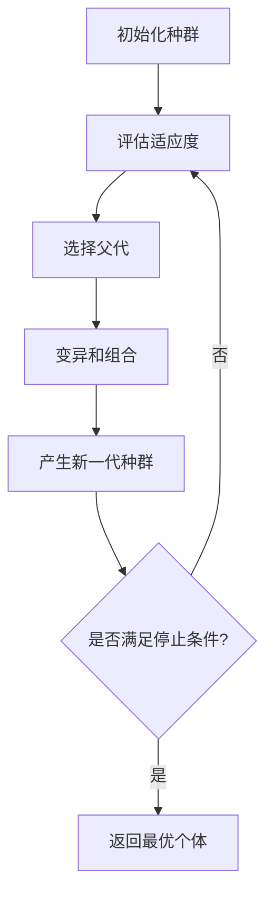
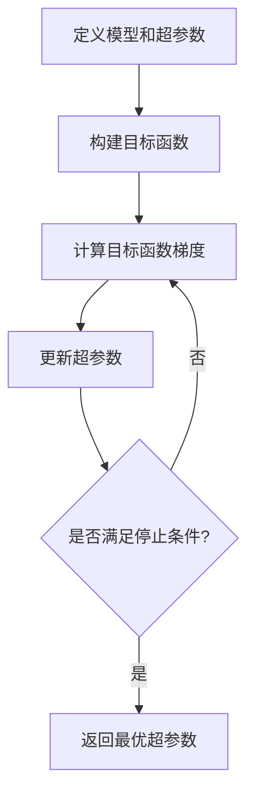

# 超参数调优与模型选择原理与代码实战案例讲解

## 1.背景介绍

### 1.1 什么是超参数?

在机器学习和深度学习模型中,除了模型权重这些可训练参数外,还存在一些无法通过模型训练学习得到的配置变量,这些变量被称为超参数(Hyperparameters)。超参数对模型的训练过程和性能有着重要影响,需要在模型训练之前被人为设置。常见的超参数包括:

- 学习率(Learning Rate)
- 正则化强度(Regularization Strength) 
- 批量大小(Batch Size)
- 网络层数和神经元数量
- 激活函数选择
- 优化器选择
- 迭代次数(Epochs)

### 1.2 为什么需要调优超参数?

由于超参数的设置直接影响模型的训练效果,因此合理地设置超参数对于获得理想的模型性能至关重要。不同的数据集和任务往往需要不同的超参数配置。一组糟糕的超参数设置可能导致模型无法有效收敛、产生过拟合或欠拟合等问题。而一组合适的超参数设置则能充分挖掘模型的潜力,提高模型的泛化性能。

### 1.3 超参数调优与模型选择的重要性

在实际应用中,超参数调优和模型选择是机器学习工作中的一个重要环节。合理地选择和调优超参数有助于:

- 提高模型的预测精度和泛化能力
- 减少模型训练时间和计算资源消耗  
- 避免过拟合和欠拟合等常见问题
- 挖掘模型的最佳性能潜力

此外,不同的机器学习任务可能需要采用不同类型的模型,选择合适的模型对于解决实际问题也至关重要。因此,超参数调优和模型选择往往需要同时进行探索和优化。

## 2.核心概念与联系

### 2.1 超参数调优的方法分类

常见的超参数调优方法可分为三大类:

1. **手动调优(Manual Tuning)**
    - 依赖专家经验和反复试错
    - 效率低下,不可行于高维复杂情况

2. **网格搜索(Grid Search)** 
    - 穷举法,设置一个超参数值网格
    - 评估所有可能的超参数组合
    - 计算开销大,难以应用于高维情况

3. **自动化调优方法**
    - 利用优化算法或机器学习方法自动搜索
    - 常见方法包括:随机搜索、贝叶斯优化、进化策略、梯度优化等
    - 计算效率高,适用于高维复杂情况

### 2.2 模型选择的标准

在机器学习任务中,没有一种模型可以应对所有情况。不同的模型在不同的任务上会有不同的表现,因此需要根据具体问题选择合适的模型。常见的模型选择标准包括:

- **模型复杂度**
    - 模型复杂度越高,拟合能力越强,但过拟合风险也越大
    - 需要权衡模型能力和防止过拟合

- **训练数据量**
    - 训练数据量少时,应选择简单模型,避免过拟合
    - 训练数据量多时,可选择复杂模型,发挥其拟合能力  

- **任务特征**
    - 不同任务对模型有不同要求,如计算效率、内存占用等
    - 需要根据任务特点选择合适的模型

- **可解释性需求**
    - 对于一些关键任务,模型可解释性很重要
    - 简单模型如线性模型往往具有较好的可解释性

- **实验结果**
    - 通过实验评估不同模型在特定任务上的性能表现
    - 基于实验结果选择最优模型

## 3.核心算法原理具体操作步骤

本节将介绍几种常见的自动化超参数调优算法的原理和操作步骤。

### 3.1 随机搜索算法

#### 3.1.1 算法原理

随机搜索是一种简单而有效的超参数调优方法。其基本思想是在给定的超参数搜索空间中随机采样,并评估对应的模型性能,最终选择性能最优的超参数组合。

相比较于网格搜索,随机搜索的优势在于:

- 无需穷举所有可能的超参数组合,计算量更小
- 对于高维超参数空间,随机搜索往往能更快地找到优秀的解

然而,随机搜索也存在一些缺陷:

- 无法利用之前的搜索结果来指导后续搜索方向
- 对于一些高度结构化的超参数空间,可能难以高效搜索

#### 3.1.2 算法步骤

1. 定义超参数搜索空间
2. 设置最大迭代次数或停止条件
3. 在搜索空间中随机采样一组超参数
4. 使用采样的超参数训练模型,评估模型性能
5. 记录当前最优超参数及其对应性能
6. 重复步骤3-5,直到达到最大迭代次数或停止条件
7. 返回最优超参数组合

### 3.2 贝叶斯优化算法

#### 3.2.1 算法原理

贝叶斯优化是一种基于surrogate模型(替代模型)的序列模型优化方法。它通过构建一个高效的surrogate模型来近似模拟目标黑盒函数(如机器学习模型的性能函数),从而避免了大量的实际函数评估,提高了搜索效率。

贝叶斯优化的核心思想是:

1. 利用已有的评估结果,构建一个surrogate模型来近似目标黑盒函数
2. 在surrogate模型上采用采集函数(Acquisition Function),权衡exploitation(利用现有结果)和exploration(探索新区域)
3. 在采集函数指引下,选择下一个最有希望改善目标函数的候选超参数
4. 重复上述过程,不断更新surrogate模型和采集函数,最终收敛获得最优解

常用的surrogate模型包括高斯过程(Gaussian Process)、随机森林(Random Forest)等;常见的采集函数有期望改善(Expected Improvement)、上确界准则(Upper Confidence Bound)等。

#### 3.2.2 算法步骤

1. 初始化surrogate模型和采集函数
2. 通过采集函数在超参数空间中选择新的候选超参数
3. 使用候选超参数训练模型,评估模型性能
4. 利用新的评估结果更新surrogate模型
5. 重复步骤2-4,直到达到预设的评估代价上限或其他停止条件
6. 返回具有最优性能的超参数组合

### 3.3 进化策略算法

#### 3.3.1 算法原理

进化策略(Evolution Strategy, ES)是一种基于进化计算思想的黑盒优化算法,常用于解决非线性、非凸等复杂优化问题。它通过模拟自然进化过程中的变异、遗传和选择等操作,在搜索空间中不断进化一组候选解,最终收敛获得最优解。

ES算法一般包含以下几个关键组成部分:

- **种群(Population)**:一组候选解的集合
- **变异(Mutation)**: 通过对候选解施加随机扰动产生新的候选解
- **组合(Recombination)**: 将多个父代候选解的部分特征组合形成新的候选解
- **选择(Selection)**: 根据适应度函数(如模型性能)评估每个候选解的优劣,保留优秀个体,淘汰劣质个体

通过不断进行变异、组合和选择操作,种群中的个体不断进化,最终收敛获得最优解。

#### 3.3.2 算法步骤

1. 初始化种群,包含一组随机的候选超参数解
2. 评估每个候选解的适应度(模型性能)
3. 根据适应度函数,从种群中选择一部分优秀个体作为父代
4. 对父代个体进行变异和组合操作,产生新的子代个体
5. 将子代个体并入种群,形成新一代种群
6. 重复步骤2-5,直到满足停止条件(如达到预设的迭代次数)
7. 返回种群中适应度最高的个体,作为最优超参数解

### 3.4 梯度优化算法

#### 3.4.1 算法原理

梯度优化算法的思路是将超参数调优问题建模为一个优化问题,通过计算目标函数(如模型性能函数)相对于超参数的梯度,并沿着梯度方向更新超参数,最终收敛到最优解。

这种方法的优点是可以利用目标函数的梯度信息,更快更有效地搜索最优解。但其缺点是需要目标函数可微,且容易陷入局部最优解。

常见的基于梯度的超参数优化算法包括:

- **反向传播(Reverse-mode Differentiation)**
    - 利用反向自动微分计算目标函数相对于超参数的梯度
    - 适用于可微分的机器学习模型,如神经网络

- **近端策略优化(Proximal Policy Optimization, PPO)**
    - 将超参数调优建模为强化学习问题
    - 使用策略梯度方法优化超参数策略

- **超梯度(Hypergradient)**
    - 将超参数视为高阶参数,目标函数为低阶参数的期望
    - 利用高阶导数(超梯度)优化超参数

#### 3.4.2 算法步骤(以反向传播为例)

1. 定义机器学习模型及其超参数
2. 构建目标函数(如模型损失函数)
3. 使用反向自动微分计算目标函数相对于超参数的梯度
4. 沿着梯度反方向更新超参数
5. 重复步骤3-4,直到满足停止条件(如梯度接近0或达到最大迭代次数)
6. 返回当前超参数作为最优解

## 4.数学模型和公式详细讲解举例说明

本节将介绍一些常用于超参数调优和模型选择的数学模型和公式,并给出具体的例子说明。

### 4.1 交叉验证

交叉验证(Cross-Validation)是一种常用的模型评估和选择方法。它的基本思想是将数据集划分为训练集和验证集,在训练集上训练模型,在验证集上评估模型性能,从而获得一个较为客观的模型泛化能力估计。

常见的交叉验证方法包括:

- **K折交叉验证(K-fold Cross-Validation)**

    将数据集平均划分为K个子集,轮流使用其中一个子集作为验证集,其余K-1个子集作为训练集,重复K次,取K次结果的平均值作为最终评估指标。

    设数据集$\mathcal{D}$包含$N$个样本,将其划分为$K$个大小相等的子集$\mathcal{D}_1, \mathcal{D}_2, \dots, \mathcal{D}_K$,在第$k$次迭代时,使用$\mathcal{D}_k$作为验证集,其余$\mathcal{D} \backslash \mathcal{D}_k$作为训练