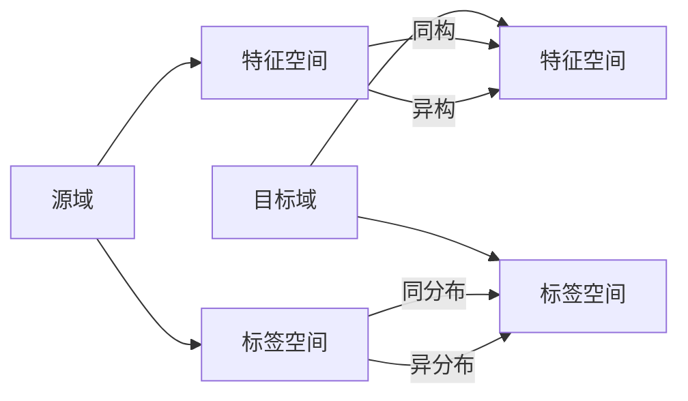

# 迁移学习(Transfer Learning) - 原理与代码实例讲解

## 1.背景介绍

### 1.1 什么是迁移学习

迁移学习(Transfer Learning)是机器学习中的一个重要分支,其目标是利用已学习过的知识来解决新的但相关的问题,从而减少在新任务上所需的训练数据量。迁移学习可以显著提高模型的学习效率和泛化能力。

### 1.2 迁移学习的重要性

在现实世界中,我们经常面临着数据量不足、标注成本高昂等问题,直接从头训练模型往往得不到理想的效果。迁移学习通过借鉴已有的知识,可以大幅降低模型训练的难度和成本。此外,迁移学习还能够加速模型的收敛速度,提升模型的性能表现。

### 1.3 迁移学习的应用场景

迁移学习在计算机视觉、自然语言处理等领域有广泛的应用。例如:

- 利用在 ImageNet 上预训练的模型来解决医学图像分类问题
- 利用在大规模语料库上预训练的词向量来解决下游的文本分类、情感分析等任务
- 利用在一个城市训练的交通流量预测模型来预测另一个城市的交通状况

## 2.核心概念与联系

### 2.1 源域和目标域

迁移学习中,我们把已有知识的来源称为源域(Source Domain),把希望解决的新问题所在的领域称为目标域(Target Domain)。源域和目标域通常具有一定的相关性,但又存在一定的差异。

### 2.2 特征空间和标签空间

对于一个机器学习任务,我们关注两个核心要素:特征空间和标签空间。特征空间定义了样本的表示方式,标签空间定义了样本的输出。迁移学习希望在特征空间或标签空间上实现知识的迁移。

### 2.3 四种迁移学习问题

根据源域和目标域在特征空间和标签空间上的异同,迁移学习可以分为以下四种问题:

1. 同构同分布(Homogeneous Domain Adaptation):特征空间相同,标签空间相同,但是边缘概率分布不同
2. 异构同分布(Heterogeneous Domain Adaptation):特征空间不同,标签空间相同
3. 同构异分布(Supervised Transfer Learning):特征空间相同,标签空间不同
4. 异构异分布(Unsupervised Transfer Learning):特征空间不同,标签空间不同



## 3.核心算法原理具体操作步骤

### 3.1 基于实例的迁移学习

基于实例的迁移学习的核心思想是从源域中选择一些与目标域相似的样本,将其添加到目标域的训练集中,从而提高模型的性能。主要步骤如下:

1. 计算源域样本和目标域样本之间的相似度
2. 选择与目标域样本相似度最高的 K 个源域样本
3. 将选择的源域样本添加到目标域训练集中
4. 在新的训练集上训练模型

常见的相似度度量方法有欧氏距离、余弦相似度等。

### 3.2 基于特征的迁移学习

基于特征的迁移学习旨在学习一个共享的特征表示,使得源域和目标域的样本在这个特征空间上更加接近。主要步骤如下:

1. 构建一个特征提取器,将源域和目标域的样本映射到共享的特征空间
2. 在特征空间上最小化源域和目标域的分布差异
3. 利用标注的源域样本训练分类器
4. 将分类器应用于目标域样本

常见的分布差异度量有最大均值差异(MMD)、中心矩量差异(CMD)等。

### 3.3 基于模型的迁移学习 

基于模型的迁移学习是利用在源域上学习到的模型参数来初始化目标域模型,然后在目标域数据上进行微调。主要步骤如下:

1. 在源域数据上训练一个基础模型
2. 将源域模型的部分或全部参数复制到目标域模型中
3. 冻结某些层的参数,只微调一部分层的参数
4. 在目标域数据上训练微调后的模型

常见的参数微调策略有微调全连接层、微调所有层等。

## 4.数学模型和公式详细讲解举例说明

### 4.1 最大均值差异(MMD)

MMD 用于度量两个分布之间的差异。给定源域样本 $\{x_i^s\}_{i=1}^{n_s}$ 和目标域样本 $\{x_j^t\}_{j=1}^{n_t}$,MMD 的计算公式为:

$$
\text{MMD}(X_s, X_t) = \left\Vert \frac{1}{n_s}\sum_{i=1}^{n_s}\phi(x_i^s) - \frac{1}{n_t}\sum_{j=1}^{n_t}\phi(x_j^t) \right\Vert_{\mathcal{H}}
$$

其中 $\phi(\cdot)$ 是将样本映射到再生核希尔伯特空间(RKHS)的特征映射函数。

举例来说,假设我们有两组数据:源域数据 $X_s=\{1,2,3,4,5\}$ 和目标域数据 $X_t=\{2,3,4,5,6\}$。如果我们选择线性核函数 $\phi(x)=x$,那么 MMD 的计算过程如下:

$$
\begin{aligned}
\text{MMD}(X_s, X_t) &= \left\Vert \frac{1}{5}(1+2+3+4+5) - \frac{1}{5}(2+3+4+5+6) \right\Vert \\
&= \left\Vert 3 - 4 \right\Vert \\
&= 1
\end{aligned}
$$

MMD 值越小,说明两个分布越接近。

### 4.2 域自适应的损失函数

在深度学习中,我们可以将 MMD 作为一个正则化项加入到损失函数中,以鼓励学习到的特征具有域不变性。设源域标签为 $\{y_i^s\}_{i=1}^{n_s}$,目标域标签为 $\{y_j^t\}_{j=1}^{n_t}$,域自适应的损失函数可以写为:

$$
\mathcal{L} = \frac{1}{n_s}\sum_{i=1}^{n_s}L(f(x_i^s), y_i^s) + \frac{1}{n_t}\sum_{j=1}^{n_t}L(f(x_j^t), y_j^t) + \lambda\text{MMD}(f(X_s), f(X_t))
$$

其中 $L(\cdot,\cdot)$ 是分类损失函数,如交叉熵损失, $f(\cdot)$ 是神经网络的特征提取器, $\lambda$ 是平衡因子。

举例来说,假设我们有一个二分类问题,源域有 3 个正样本和 2 个负样本,目标域有 2 个正样本和 3 个负样本。我们使用一个简单的神经网络 $f(x)=\sigma(wx+b)$ 作为特征提取器,其中 $\sigma$ 是 sigmoid 激活函数。如果分类损失函数选择二元交叉熵损失,那么损失函数可以写为:

$$
\begin{aligned}
\mathcal{L} = &-\frac{1}{3}\sum_{i=1}^{3}[y_i^s\log f(x_i^s) + (1-y_i^s)\log(1-f(x_i^s))] \\
&-\frac{1}{2}\sum_{i=1}^{2}[y_i^s\log f(x_i^s) + (1-y_i^s)\log(1-f(x_i^s))] \\ 
&-\frac{1}{2}\sum_{j=1}^{2}[y_j^t\log f(x_j^t) + (1-y_j^t)\log(1-f(x_j^t))] \\
&-\frac{1}{3}\sum_{j=1}^{3}[y_j^t\log f(x_j^t) + (1-y_j^t)\log(1-f(x_j^t))] \\
&+\lambda\left\Vert \frac{1}{5}\sum_{i=1}^{5}f(x_i^s) - \frac{1}{5}\sum_{j=1}^{5}f(x_j^t) \right\Vert
\end{aligned}
$$

通过最小化这个损失函数,我们可以学习到一个既能很好地分类源域样本,又能减小源域和目标域特征分布差异的模型。

## 5.项目实践:代码实例和详细解释说明

下面我们通过一个简单的代码实例来演示如何使用 PyTorch 实现基于 MMD 的域自适应。

```python
import torch
import torch.nn as nn
import torch.optim as optim
from sklearn.datasets import make_blobs
from sklearn.model_selection import train_test_split

# 生成源域和目标域数据
def generate_data():
    X_s, y_s = make_blobs(n_samples=100, centers=2, cluster_std=1.0, random_state=42)
    X_t, y_t = make_blobs(n_samples=100, centers=2, cluster_std=2.0, random_state=42)
    return X_s, y_s, X_t, y_t

# 定义域自适应神经网络
class DANN(nn.Module):
    def __init__(self, input_dim, hidden_dim, output_dim):
        super(DANN, self).__init__()
        self.feature_extractor = nn.Sequential(
            nn.Linear(input_dim, hidden_dim),
            nn.ReLU(),
            nn.Linear(hidden_dim, hidden_dim),
            nn.ReLU()
        )
        self.label_predictor = nn.Linear(hidden_dim, output_dim)
        
    def forward(self, x):
        features = self.feature_extractor(x)
        outputs = self.label_predictor(features)
        return features, outputs

# 计算 MMD 损失
def mmd_loss(x_s, x_t, kernel_mul=2.0, kernel_num=5):
    batch_size = x_s.size(0)
    kernels = []
    for i in range(kernel_num):
        kernels.append(kernel_mul ** i)
    
    xx = torch.mean(gaussian_kernel(x_s, x_s, kernels))
    yy = torch.mean(gaussian_kernel(x_t, x_t, kernels))
    xy = torch.mean(gaussian_kernel(x_s, x_t, kernels))
    return xx + yy - 2 * xy

def gaussian_kernel(x, y, kernels):
    x_size = x.size(0)
    y_size = y.size(0)
    dim = x.size(1)
    x = x.unsqueeze(1)
    y = y.unsqueeze(0)
    tiled_x = x.expand(x_size, y_size, dim)
    tiled_y = y.expand(x_size, y_size, dim)
    kernel_input = (tiled_x - tiled_y).pow(2).mean(2) / float(dim)
    return torch.exp(-kernel_input / kernels[0])

# 训练模型
def train(model, X_s, y_s, X_t, y_t, epochs=100, batch_size=32, lr=0.01, lambda_=0.1):
    dataset_s = torch.utils.data.TensorDataset(torch.from_numpy(X_s).float(), torch.from_numpy(y_s).long())
    dataloader_s = torch.utils.data.DataLoader(dataset_s, batch_size=batch_size, shuffle=True)
    
    dataset_t = torch.utils.data.TensorDataset(torch.from_numpy(X_t).float(), torch.from_numpy(y_t).long())
    dataloader_t = torch.utils.data.DataLoader(dataset_t, batch_size=batch_size, shuffle=True)
    
    optimizer = optim.Adam(model.parameters(), lr=lr)
    criterion = nn.CrossEntropyLoss()
    
    for epoch in range(epochs):
        for (x_s, y_s), (x_t, _) in zip(dataloader_s, dataloader_t):
            features_s, outputs_s = model(x_s)
            features_t, outputs_t = model(x_t)
            
            loss_s = criterion(outputs_s, y_s)
            loss_t = mmd_loss(features_s, features_t)
            loss = loss_s + lambda_ * loss_t
            
            optimizer.zero_grad()
            loss.backward()
            optimizer.step()
        
        if (epoch+1) % 10 == 0:
            print(f'Epoch [{epoch+1}/{epochs}], Loss: {loss.item():.4f}')

# 测试模型
def test(model, X, y):
    model.eval()
    with torch.no_grad():
        _, outputs = model(torch.from_numpy(X).float())
        _, predicted =