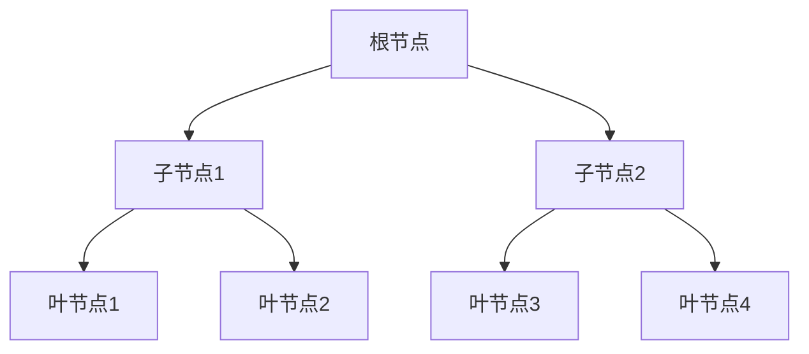

# 递归神经网络 原理与代码实例讲解

## 1.背景介绍

### 1.1 序言

在自然语言处理、计算机视觉等领域,数据通常呈现出层级或递归的结构。例如,一个句子可以分解为词语,词语又可以分解为字符;一幅图像可以分解为对象,对象又可以分解为更小的部件。传统的神经网络模型如前馈神经网络、卷积神经网络等,在处理这种层级结构数据时存在局限性。

为了更好地捕捉和利用数据的内在层级结构,递归神经网络(Recursive Neural Network, RNN)应运而生。递归神经网络本质上是一种具有递归结构的深度神经网络,能够对具有层级关系的数据进行端到端的建模,在自然语言处理和计算机视觉等领域展现出优异的性能。

### 1.2 发展历程

递归神经网络最早可以追溯到20世纪90年代中期,当时的研究主要集中在理论层面。2001年,Pollack提出了一种简单的递归神经网络结构,称为简单递归网络(Simple Recursive Network)。2003年,Socher等人提出了一种更加通用的递归神经网络模型,并将其应用于自然语言处理任务。

2010年,Socher等人提出了广为人知的递归神经张量网络(Recursive Neural Tensor Network, RNTN),用于构建语义向量表示,取得了非常好的效果。2014年,Irsoy和Cardie提出了深度递归神经网络(Deep Recursive Neural Network),通过堆叠多个递归层来增强模型的表示能力。

近年来,随着深度学习的快速发展,递归神经网络在各个领域都取得了广泛的应用,成为处理具有层级结构数据的重要工具之一。

## 2.核心概念与联系

### 2.1 递归神经网络的核心思想

递归神经网络的核心思想是将神经网络的计算过程与数据的层级结构相结合,通过递归的方式对层级数据进行建模。具体来说,递归神经网络将一个复杂的数据结构(如句子、图像等)分解为较小的子结构(如词语、对象等),然后对这些子结构进行编码,最终将所有子结构的编码合并为整个数据结构的表示。

在这个过程中,递归神经网络会重复地应用相同的权重矩阵和非线性函数,以计算每个节点的向量表示。这种递归计算方式与数据的层级结构相吻合,能够自然地捕捉数据的内在结构,从而提高模型的表示能力。

### 2.2 递归神经网络与其他神经网络的关系

递归神经网络与其他一些常见的神经网络模型有着密切的联系:

- 与前馈神经网络相比,递归神经网络能够更好地处理具有层级结构的数据,而前馈神经网络更适合处理固定长度的向量输入。
- 与循环神经网络(Recurrent Neural Network, RNN)相比,递归神经网络更适合处理具有明确层级结构的数据,而RNN更擅长处理序列数据。
- 与卷积神经网络(Convolutional Neural Network, CNN)相比,递归神经网络能够更好地捕捉数据的全局结构,而CNN更关注局部特征。

总的来说,递归神经网络是一种专门为处理层级结构数据而设计的神经网络模型,与其他神经网络模型有着complementary的关系,为不同类型的数据提供了合适的建模方式。

## 3.核心算法原理具体操作步骤

### 3.1 递归神经网络的基本结构

递归神经网络的基本结构包括以下几个核心组成部分:

1. **叶节点表示**:对于输入数据的最小单元(如词语、像素块等),需要先将其映射为一个固定长度的向量表示,作为递归的起点。
2. **合成函数**:定义了如何将两个子节点的向量表示合并为其父节点的向量表示。通常使用一个前馈神经网络或张量运算来实现。
3. **递归应用**:将合成函数递归地应用于整个层级结构,直到计算出整个数据结构的根节点表示。

我们可以使用一个简单的二叉树结构来形象地描述递归神经网络的计算过程:

对于上图所示的二叉树结构:

1. 首先将叶节点D、E、F、G映射为固定长度的向量表示$\vec{x_D}$、$\vec{x_E}$、$\vec{x_F}$、$\vec{x_G}$。
2. 使用合成函数$f$将叶节点表示合并为子节点表示:$\vec{x_B} = f(\vec{x_D}, \vec{x_E})$, $\vec{x_C} = f(\vec{x_F}, \vec{x_G})$。
3. 再次使用合成函数$f$将子节点表示合并为根节点表示:$\vec{x_A} = f(\vec{x_B}, \vec{x_C})$。

通过这种递归的方式,我们就可以获得整个数据结构的向量表示$\vec{x_A}$,并将其用于下游的任务(如分类、生成等)。

### 3.2 合成函数的设计

合成函数的设计是递归神经网络的核心部分,它决定了如何将子节点的表示合并为父节点的表示。常见的合成函数包括:

1. **前馈神经网络合成函数**:

   $$\vec{x_p} = \tanh(W_1^T[\vec{x_l};\vec{x_r}] + b_1)$$

   其中,$\vec{x_l}$和$\vec{x_r}$分别表示左右子节点的向量表示,$W_1$和$b_1$是可训练的权重矩阵和偏置向量。

2. **递归神经张量网络(RNTN)合成函数**:

   $$\vec{x_p} = \tanh(W_1^T[\vec{x_l};\vec{x_r}] + W_2^T[\vec{x_l} \otimes \vec{x_r}] + b)$$

   相比前馈神经网络合成函数,RNTN引入了一个张量项$\vec{x_l} \otimes \vec{x_r}$,用于捕捉子节点表示之间的交互关系。

3. **门控递归神经网络(GRU)合成函数**:

   $$\begin{aligned}
   z &= \sigma(W_z[\vec{x_l};\vec{x_r}] + b_z) \\
   r &= \sigma(W_r[\vec{x_l};\vec{x_r}] + b_r) \\
   \tilde{h} &= \tanh(W_h[\vec{x_l} \odot r; \vec{x_r} \odot r] + b_h) \\
   \vec{x_p} &= (1 - z) \odot \tilde{h} + z \odot (\vec{x_l} + \vec{x_r})
   \end{aligned}$$

   GRU合成函数借鉴了门控循环单元(GRU)的思想,引入了重置门$r$和更新门$z$,以更好地控制信息流动。

不同的合成函数具有不同的表达能力和计算复杂度,需要根据具体任务和数据特点进行选择和设计。通常,更复杂的合成函数能够捕捉更丰富的结构信息,但也需要更多的计算资源。

### 3.3 递归神经网络的前向计算

给定一个具有层级结构的输入数据$x$,递归神经网络的前向计算过程可以概括为以下步骤:

1. **叶节点表示初始化**:对于输入数据$x$的每个叶节点$x_i$,计算其向量表示$\vec{x_i}$。这通常是将$x_i$通过嵌入查找或前馈神经网络映射为固定长度的向量。

2. **递归计算节点表示**:使用预定义的合成函数$f$,递归地计算每个非叶节点的向量表示。对于每个非叶节点$x_p$,其向量表示$\vec{x_p}$由其子节点$x_l$和$x_r$的向量表示$\vec{x_l}$和$\vec{x_r}$计算得到:

   $$\vec{x_p} = f(\vec{x_l}, \vec{x_r})$$

   这个递归计算过程一直持续到计算出整个数据结构的根节点表示$\vec{x_{\text{root}}}$。

3. **输出层计算**:根据具体任务,将根节点表示$\vec{x_{\text{root}}}$输入到输出层(如全连接层、softmax层等),得到最终的输出$y$。

需要注意的是,递归神经网络的前向计算过程高度依赖于输入数据的结构。对于不同的层级结构,递归计算的路径会有所不同。因此,在实现递归神经网络时,通常需要使用动态计算图或符号计算等技术来有效地处理不同的输入结构。

### 3.4 递归神经网络的反向传播

与其他神经网络模型类似,递归神经网络的训练也需要通过反向传播算法来优化模型参数。但由于递归神经网络的特殊结构,反向传播过程会比前馈神经网络或循环神经网络更加复杂。

在反向传播过程中,我们需要计算每个节点表示相对于模型参数的梯度,并沿着递归计算路径将梯度传递回去。具体步骤如下:

1. **计算根节点表示梯度**:根据输出层的损失函数,计算根节点表示$\vec{x_{\text{root}}}$相对于损失函数的梯度$\frac{\partial L}{\partial \vec{x_{\text{root}}}}$。

2. **递归计算节点表示梯度**:对于每个非叶节点$x_p$,其表示梯度$\frac{\partial L}{\partial \vec{x_p}}$由其父节点的表示梯度和合成函数的梯度组合而成:

   $$\frac{\partial L}{\partial \vec{x_p}} = \frac{\partial L}{\partial \vec{x_{\text{parent}}}} \cdot \frac{\partial f}{\partial \vec{x_p}}$$

   其中,$\frac{\partial f}{\partial \vec{x_p}}$是合成函数$f$相对于$\vec{x_p}$的梯度,可以通过链式法则和自动微分技术计算得到。

3. **计算模型参数梯度**:一旦计算出每个节点表示的梯度,就可以进一步计算合成函数中的模型参数(如权重矩阵$W$、偏置向量$b$等)相对于损失函数的梯度,并使用优化算法(如SGD、Adam等)更新这些参数。

需要注意的是,由于递归神经网络的计算路径取决于输入数据的结构,因此在反向传播过程中,我们需要记录前向计算时的中间结果,以便正确计算梯度。这通常需要使用动态计算图或符号计算等技术来实现。

总的来说,递归神经网络的反向传播过程虽然比前馈神经网络更加复杂,但原理上并无太大区别。通过自动微分和动态计算图等技术,我们可以高效地实现递归神经网络的训练过程。

## 4.数学模型和公式详细讲解举例说明

在前面的章节中,我们已经介绍了递归神经网络的基本原理和算法步骤。在这一部分,我们将更深入地探讨递归神经网络的数学模型,并通过具体的例子来说明其中的公式和计算过程。

### 4.1 递归神经网络的数学表示

我们可以将递归神经网络的计算过程用一个递归函数$\Phi$来表示:

$$\vec{x_p} = \Phi(\vec{x_l}, \vec{x_r})$$

其中,$\vec{x_l}$和$\vec{x_r}$分别表示左右子节点的向量表示,$\vec{x_p}$表示父节点的向量表示。函数$\Phi$就是我们前面提到的合成函数,它定义了如何将子节点的表示合并为父节点的表示。

对于整个数据结构的根节点表示$\vec{x_{\text{root}}}$,我们可以通过递归地应用函数$\Phi$来计算:

$$\vec{x_{\text{root}}} = \Phi(\Phi(\