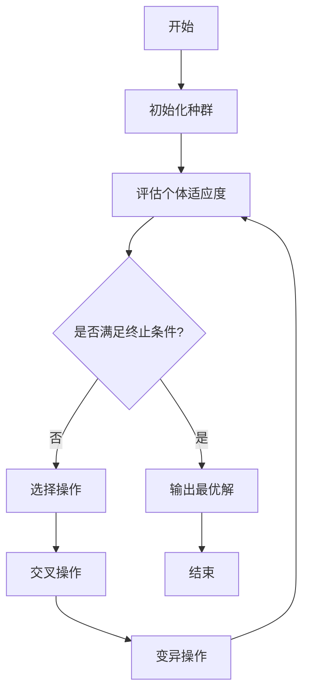

# 遗传算法(Genetic Algorithms) - 原理与代码实例讲解

## 1.背景介绍

### 1.1 什么是遗传算法?

遗传算法(Genetic Algorithms, GA)是一种启发式搜索和优化技术,源于生物进化论中的自然选择和遗传机理。它是一种模拟自然进化过程的计算模型,通过模拟生物进化中的选择、交叉和变异等过程,在问题的解空间中进行高效搜索,最终找到最优或近似最优解。

遗传算法属于进化算法的一种,是计算机科学中人工智能和计算机建模两大研究领域的交叉产物。它被广泛应用于组合优化、机器学习、信号处理、自动控制等多个领域。

### 1.2 遗传算法的发展历程

1960年,美国密歇根大学的约翰·霍兰德教授在其著作《Adaptation in Natural and Artificial Systems》中首次提出了遗传算法的概念。1975年,他与他的学生们在该校第一台连接终端的主机上运行了第一个遗传算法程序。

20世纪70年代中期,由于计算机硬件的快速发展,遗传算法开始被广泛关注和研究。1989年,大卫·戈德堡的著作《Genetic Algorithms in Search, Optimization and Machine Learning》将遗传算法引入了机器学习领域。

进入21世纪后,随着计算能力的飞速提升,遗传算法的应用范围不断扩大,在工程设计、生物信息学、经济金融等诸多领域均有广泛应用。

## 2.核心概念与联系

### 2.1 生物进化中的关键概念

遗传算法借鉴了生物进化过程中的一些关键概念:

1. **基因(Gene)**: 生物体的基本遗传单位,携带有遗传信息。
2. **染色体(Chromosome)**: 由多个基因组成的串联体,是遗传信息的载体。
3. **个体(Individual)**: 携带一条染色体的生物实体。
4. **种群(Population)**: 由多个个体组成的生物群体。
5. **适应度(Fitness)**: 衡量个体在环境中生存能力的指标。
6. **选择(Selection)**: 根据适应度大小,选择出优秀个体。
7. **交叉(Crossover)**: 两个优秀个体的染色体进行部分片段交换,产生新的个体。
8. **变异(Mutation)**: 个体染色体上的某些基因发生改变,产生新的个体。

### 2.2 遗传算法中的关键组成部分

遗传算法中包含以下几个关键组成部分:

1. **编码方式(Encoding)**: 将问题的解空间映射到一个由染色体表示的数据结构。
2. **初始种群(Initial Population)**: 随机生成一定数量的个体,作为算法的初始种群。
3. **适应度函数(Fitness Function)**: 用于评估个体的优劣程度,是算法选择的依据。
4. **选择算子(Selection Operator)**: 根据适应度函数,从种群中选择出优秀个体。
5. **交叉算子(Crossover Operator)**: 对选择出的优秀个体进行交叉操作,产生新的个体。
6. **变异算子(Mutation Operator)**: 对个体进行微小的随机变异,增加种群的多样性。
7. **终止条件(Termination Condition)**: 算法的停止准则,如达到最大迭代次数或满足期望的适应度值。

这些组成部分共同构成了遗传算法的核心框架,通过模拟生物进化过程,在解空间中进行高效搜索。

### 2.3 遗传算法流程图

遗传算法的基本流程可以用下面的Mermaid流程图表示:

该流程图展示了遗传算法的主要步骤:初始化种群、评估个体适应度、选择、交叉、变异,直至满足终止条件输出最优解。

## 3.核心算法原理具体操作步骤

### 3.1 编码方式

编码是将问题的解空间映射到遗传算法可操作的数据结构的过程。常见的编码方式包括:

1. **二进制编码**: 将解编码为0/1组成的二进制串。
2. **值编码**: 直接使用解的值作为染色体的基因。
3. **树编码**: 使用树形结构对解进行编码,常用于进化程序设计。
4. **排列编码**: 将解编码为一个排列,常用于排序和规划问题。

编码方式的选择取决于问题的性质,需要尽可能简单且高效地表示解空间。

### 3.2 初始化种群

初始化种群是随机生成一定数量的个体,作为遗传算法的初始搜索点。常见的初始化方法包括:

1. **随机初始化**: 完全随机生成初始个体。
2. **启发式初始化**: 根据问题的先验知识,生成较优质的初始个体。
3. **混合初始化**: 结合随机和启发式方法,生成多样化的初始个体。

初始化种群的质量和多样性对算法的收敛性能有重要影响。

### 3.3 适应度函数

适应度函数用于评估个体在解空间中的优劣程度,是遗传算法选择操作的基础。设计适应度函数需要注意以下几点:

1. **准确性**: 能够准确反映个体的优劣程度。
2. **高效性**: 计算适应度的时间复杂度应尽可能低。
3. **无偏性**: 不应对某些个体有明显的偏好。
4. **连续性**: 适应度值应具有一定的连续性,避免突变。

适应度函数的设计直接影响算法的收敛速度和解的质量。

### 3.4 选择操作

选择操作的目的是从当前种群中选择出优秀的个体,作为下一代种群的父本。常见的选择算子包括:

1. **轮盘赌选择(Roulette Wheel Selection)**: 个体被选择的概率与其适应度值成正比。
2. **等位归零选择(Stochastic Universal Sampling)**: 在轮盘赌选择的基础上,利用单次采样减少采样误差。
3. **锦标赛选择(Tournament Selection)**: 从种群中随机选择一定数量的个体进行比赛,适应度值高者获胜。
4. **排名选择(Ranking Selection)**: 根据个体的适应度值排名,排名靠前的个体被选择的概率更高。

选择算子的目的是在保持种群多样性的同时,逐渐提高种群的整体适应度水平。

### 3.5 交叉操作

交叉操作通过将两个优秀个体的染色体进行部分片段交换,产生新的个体,以期获得更优秀的后代。常见的交叉算子包括:

1. **单点交叉**: 在染色体的某个位置随机选取一个交叉点,交换两个个体在该点之后的基因片段。
2. **多点交叉**: 在染色体上随机选取多个交叉点,交换多个基因片段。
3. **均匀交叉**: 对每一个基因位,随机选择来自两个父本中的一个。
4. **算术交叉**: 对于值编码的染色体,新个体是两个父本的线性组合。

交叉操作是遗传算法产生新个体、增加种群多样性的关键步骤。交叉概率的设置需要权衡探索(增加多样性)和利用(保留优良基因)之间的平衡。

### 3.6 变异操作

变异操作通过对个体染色体上的某些基因进行微小的随机改变,产生新的个体,以期获得更优秀的后代。常见的变异算子包括:

1. **基本位变异**: 对二进制编码的染色体,随机改变某些基因位的0/1值。
2. **均匀变异**: 对值编码的染色体,在一个给定范围内随机改变某些基因的值。
3. **高斯变异**: 对值编码的染色体,根据高斯分布对某些基因的值进行扰动。
4. **插入变异**: 对排列编码的染色体,插入或删除某些基因。

变异操作是维持种群多样性、避免早熟收敛的重要手段。变异概率的设置需要权衡局部搜索能力和全局搜索能力之间的平衡。

## 4.数学模型和公式详细讲解举例说明

### 4.1 适应度函数建模

适应度函数是将问题的目标函数值映射到一个衡量个体适应度的值。常见的建模方法包括:

1. **线性缩放(Linear Scaling)**: 
   $$f'(x) = a \cdot f(x) + b$$
   其中$f(x)$是目标函数值,$f'(x)$是缩放后的适应度值,$a$和$b$是缩放系数。

2. **指数缩放(Exponential Scaling)**: 
   $$f'(x) = C \cdot e^{f(x)}$$
   其中$C$是一个常数,用于控制适应度值的范围。

3. **基于排名的缩放(Rank-based Scaling)**: 根据个体在种群中的排名分配适应度值,而非直接使用目标函数值。

4. **基于共享的适应度(Fitness Sharing)**: 通过惩罚相似个体的适应度值,维持种群的多样性。

适当的适应度函数建模对于算法的收敛性能至关重要。

### 4.2 选择概率计算

在选择操作中,常需要计算每个个体被选择的概率。以轮盘赌选择为例:

设有$N$个个体,第$i$个个体的适应度值为$f_i$,则第$i$个个体被选择的概率为:

$$p_i = \frac{f_i}{\sum_{j=1}^N f_j}$$

为了避免出现极小的适应度值导致个体无法被选择,可以对适应度值进行平移和缩放:

$$f_i' = a \cdot (f_i - f_{min}) + b$$

其中$f_{min}$是种群中最小的适应度值,$a$和$b$是缩放系数,确保$f_i' > 0$。

### 4.3 交叉概率和变异概率

交叉概率($p_c$)和变异概率($p_m$)是控制交叉操作和变异操作发生频率的重要参数。

- 交叉概率过高,可能导致种群多样性丢失,陷入局部最优;交叉概率过低,则难以产生新的优秀个体。
- 变异概率过高,算法将退化为随机搜索;变异概率过低,则难以跳出局部最优。

通常,交叉概率设置在0.6~0.9之间,变异概率设置在0.001~0.1之间。具体取值需要根据问题的特征进行调优。

### 4.4 其他数学模型

除了上述模型外,遗传算法还涉及其他一些数学模型,如:

- **多目标优化模型**: 将多个目标函数综合考虑,构建新的适应度函数。
- **约束处理模型**: 对于有约束条件的优化问题,需要设计惩罚函数或修复算子。
- **并行模型**: 利用多线程或多机器并行执行遗传算法,提高计算效率。
- **混合模型**: 将遗传算法与其他启发式算法或精确算法相结合,发挥各自的优势。

这些模型的引入使得遗传算法能够更好地解决复杂的实际问题。

## 5.项目实践: 代码实例和详细解释说明

下面通过一个实例,展示如何使用Python实现一个简单的遗传算法,求解具有多个局部最优解的单峰函数最大值问题。

### 5.1 问题描述

给定一个单变量函数$f(x) = x \cdot \sin(10 \pi x) + 2.0$,其值域为$[-1, 2]$,目标是找到该函数在该区间内的最大值。

该函数有多个局部最优解,是一个具有挑战性的优化问题,适合使用遗传算法求解。

### 5.2 编码方式

我们采用二进制编码的方式,将$x$的值域$[-1, 2]