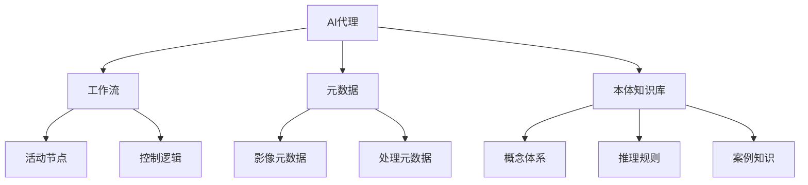

# 遥感数据处理的AI代理工作流技术

## 1.背景介绍
遥感数据处理是地球科学、环境监测、资源勘探等领域的重要技术手段。随着遥感卫星数量的增加和传感器性能的提升,遥感数据呈现出数据量大、类型多、处理复杂等特点。传统的遥感数据处理方法难以满足海量异构数据的快速处理需求。近年来,人工智能技术的发展为遥感数据处理带来了新的契机。将AI技术引入遥感数据处理工作流,构建智能化、自动化的处理流程,可以大幅提高遥感数据的处理效率和应用价值。本文将重点介绍一种基于AI代理的遥感数据处理工作流技术,探讨其核心概念、关键算法、应用实践等内容。

### 1.1 遥感数据处理面临的挑战
#### 1.1.1 数据量大
#### 1.1.2 数据类型多样
#### 1.1.3 处理流程复杂

### 1.2 人工智能技术的发展
#### 1.2.1 深度学习
#### 1.2.2 知识图谱
#### 1.2.3 智能代理

### 1.3 AI驱动的遥感数据处理
#### 1.3.1 智能化处理
#### 1.3.2 自动化流程
#### 1.3.3 知识驱动决策

## 2.核心概念与联系
本节将阐述AI代理工作流中的几个核心概念,并分析它们之间的内在联系。

### 2.1 AI代理
AI代理是一种智能化的软件实体,能够感知环境、分析决策并执行任务。它集成了机器学习、知识推理、任务规划等AI技术,可以根据任务目标自主选择处理算法和优化流程。在遥感数据处理中,AI代理作为流程的执行者和决策者,通过感知数据特征、匹配处理知识、优化任务流程,实现端到端的自动化处理。

### 2.2 工作流
工作流描述了一个任务完成的过程和规则。它由一系列活动节点组成,规定了各个活动的执行顺序、条件、数据流向等。将遥感数据处理抽象为工作流,可以清晰刻画处理过程,有利于流程的重用和优化。AI代理通过解析和执行工作流,来完成遥感数据处理任务。

### 2.3 元数据
元数据是描述数据的数据。遥感元数据包含了影像的空间、光谱、辐射等特征信息,以及处理过程的参数、算法、环境等信息。AI代理根据元数据分析影像特征,匹配适用的处理算法。元数据驱动是AI代理工作流的重要特征。

### 2.4 本体与知识库
本体定义了遥感数据处理领域的概念体系和逻辑关系。知识库基于本体构建,存储处理流程、算法参数、案例经验等结构化知识。AI代理通过本体推理和知识匹配,选择合适的处理算法和工作流。知识驱动是AI代理实现智能决策的基础。

### 2.5 概念关系
下图展示了AI代理、工作流、元数据、本体知识库之间的关系:



AI代理解析工作流,执行活动节点,根据元数据和知识库选择处理算法,最终完成遥感数据自动化处理。

## 3.核心算法原理具体操作步骤
本节介绍AI代理工作流的核心算法,包括工作流建模、元数据解析、知识推理等。

### 3.1 工作流建模
工作流建模旨在将遥感数据处理流程抽象为计算机可解析的工作流模型。主要步骤如下:

1. 定义活动节点:将处理流程划分为若干活动,每个活动完成一个相对独立的子任务,如数据预处理、特征提取、分类等。

2. 定义数据结构:设计工作流的输入输出数据格式,明确每个活动节点的输入输出。

3. 定义控制逻辑:设计活动节点的执行顺序和条件,可使用顺序、并发、选择、循环等控制结构。

4. 形式化表示:采用工作流建模语言(如BPMN、YAWL等)对工作流进行形式化描述,生成结构化的工作流模型文件。

### 3.2 元数据解析
元数据解析旨在从遥感影像元数据中提取关键信息,用于工作流节点的算法选择和参数配置。主要步骤如下:

1. 元数据读取:读取遥感影像的元数据文件,如XML、JSON等格式。

2. 信息提取:从元数据中提取关键字段,如传感器类型、波段信息、空间分辨率、辐射分辨率等。

3. 特征分析:对提取的元数据信息进行特征分析,如数据质量评估、云量检测等。

4. 语义映射:将元数据字段映射到本体概念,形成结构化的语义元数据描述。

### 3.3 知识推理
知识推理旨在利用本体知识库进行算法选择和参数配置,为工作流节点提供智能决策支持。主要步骤如下:

1. 问题抽象:将工作流节点的算法选择问题抽象为知识库查询问题,形成SPARQL等查询语句。

2. 本体推理:利用本体推理引擎(如Apache Jena)对知识库进行推理,匹配适用的处理算法。

3. 相似度计算:计算元数据特征与知识库案例的相似度,选择最相似的处理流程作为参考。

4. 参数优化:根据案例知识优化算法参数,提高处理精度和效率。

5. 决策生成:输出推理结果,包括匹配的处理算法、优化的参数配置等,指导工作流节点执行。

## 4.数学模型和公式详细讲解举例说明
本节以遥感影像分类任务为例,详细讲解AI代理工作流中的关键数学模型和公式。

### 4.1 支持向量机分类模型
支持向量机(SVM)是常用的遥感影像分类算法。其基本思想是在特征空间中寻找最优分类超平面,使得不同类别的样本间隔最大化。给定训练样本集$D=\{(x_1,y_1),(x_2,y_2),...,(x_n,y_n)\}$,其中$x_i$为特征向量,$y_i\in\{-1,+1\}$为类别标签,SVM分类模型可表示为:

$$
\min_{w,b} \frac{1}{2}||w||^2 + C\sum_{i=1}^{n}\xi_i \\
s.t. \quad y_i(w\cdot x_i+b) \geq 1-\xi_i, \quad \xi_i \geq 0, \quad i=1,2,...,n
$$

其中,$w$为分类超平面的法向量,$b$为偏置项,$\xi_i$为松弛变量,$C$为惩罚因子。求解上述优化问题,可得SVM分类决策函数:

$$
f(x) = sign(w^* \cdot x + b^*)
$$

对于非线性可分问题,可引入核函数$K(x,z)$将特征映射到高维空间,得到非线性SVM分类决策函数:

$$
f(x) = sign(\sum_{i=1}^{n}\alpha_i^* y_i K(x,x_i) + b^*)
$$

常用的核函数包括多项式核、高斯核等。

### 4.2 数据质量评估模型
遥感影像的数据质量会影响分类精度。AI代理通过元数据分析,对影像质量进行评估。以云量评估为例,设影像像元集合为$P=\{p_1,p_2,...,p_m\}$,云像元集合为$C=\{c_1,c_2,...,c_k\}$,则影像云量$R$可表示为:

$$
R = \frac{|C|}{|P|} = \frac{k}{m}
$$

其中,$|C|$和$|P|$分别表示云像元和全部像元的数量。一般根据云量将影像质量划分为高、中、低三个等级:

$$
Q = \begin{cases} 
high, & R \leq 10\% \\
medium, & 10\% < R \leq 30\% \\
low, & R > 30\%
\end{cases}
$$

### 4.3 知识推理规则
AI代理通过知识推理为工作流节点选择合适的算法。以SVM分类节点为例,设影像元数据特征为$F=\{f_1,f_2,...,f_n\}$,候选SVM算法为$A=\{a_1,a_2,...,a_m\}$,知识库中的推理规则可表示为:

$$
\forall f_i \in F, \exists a_j \in A, s.t. \quad match(f_i, a_j) = true
$$

其中,$match$为特征和算法的匹配函数。例如,对于高光谱影像,匹配规则可表示为:

$$
match(f_i, a_j) = \begin{cases}
true, & f_i=''high\underline{ }spectral'' \wedge a_j=''SVM\underline{ }poly'' \\
false, & otherwise
\end{cases}
$$

即高光谱影像适合使用多项式核函数的SVM算法。

### 4.4 案例相似度计算
AI代理还可根据知识库中的历史案例,为工作流节点提供参数配置参考。以SVM分类节点为例,设当前影像元数据特征为$F_c$,知识库中第$i$个案例的元数据特征为$F_i$,则两者的相似度$S_i$可用余弦相似度计算:

$$
S_i = \frac{F_c \cdot F_i}{||F_c|| \cdot ||F_i||}
$$

选择相似度最高的案例,将其SVM参数作为当前节点的参数初始值,再进行优化求解。

## 5.项目实践：代码实例和详细解释说明
本节给出一个基于Python的AI代理工作流实现示例。以遥感影像分类任务为例,演示元数据解析、知识推理、算法选择等关键步骤。

### 5.1 工作流定义
使用PyDroneKit库定义工作流,主要包括数据输入、预处理、特征提取、分类、结果输出等节点:

```python
from dronekit import DroneWorkflow, DataInput, Preprocess, FeatureExtract, Classify, DataOutput

# 定义工作流
workflow = DroneWorkflow()

# 数据输入节点
input_node = DataInput(name='input', 
                       metadata={'type': 'multispectral', 
                                 'bands': ['Red','Green','Blue','NIR'], 
                                 'gsd': 0.5})
workflow.add_node(input_node)

# 预处理节点
preprocess_node = Preprocess(name='preprocess')
workflow.add_node(preprocess_node)
workflow.add_link(input_node, preprocess_node)

# 特征提取节点
feature_node = FeatureExtract(name='feature')
workflow.add_node(feature_node)
workflow.add_link(preprocess_node, feature_node)

# 分类节点
classify_node = Classify(name='classify', 
                         algorithm='SVM')
workflow.add_node(classify_node)
workflow.add_link(feature_node, classify_node)

# 结果输出节点  
output_node = DataOutput(name='output')
workflow.add_node(output_node)
workflow.add_link(classify_node, output_node)
```

### 5.2 元数据解析
从影像元数据中提取关键信息,评估数据质量:

```python
import xmltodict

# 读取元数据文件
with open('metadata.xml', 'r') as f:
    metadata = xmltodict.parse(f.read())
    
# 提取元数据信息
sensor_type = metadata['sensor']['type']
band_names = metadata['bands']['band']
cloud_cover = float(metadata['quality']['cloud_cover'])

# 数据质量评估
if cloud_cover <= 0.1:
    quality = 'high' 
elif cloud_cover <= 0.3:
    quality = 'medium'
else:
    quality = 'low'
```

### 5.3 知识推理
根据元数据特征,从知识库中推理适用的分类算法:

```python
from owlready2 import *

# 加载本体和知识库
onto = get_ontology('drone_ontology.owl').load()

# 本体推理
with onto: