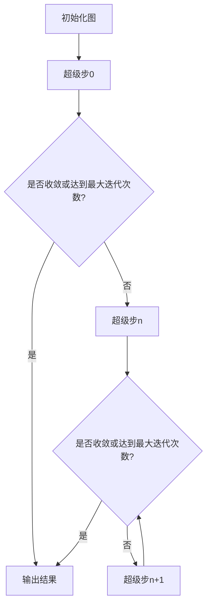

# 量化投资策略:利用Pregel发现隐藏模式

## 1.背景介绍

### 1.1 量化投资的兴起

随着计算能力的不断提高和大数据时代的到来,量化投资策略在金融领域受到了广泛关注。传统的投资决策过程往往依赖于人工分析和主观判断,存在效率低下、偏见影响等问题。而量化投资则是利用数学模型、统计方法和计算机算法来分析历史数据,发现潜在的投资机会,并自动执行交易决策。

量化投资策略能够快速处理海量数据,消除人为偏差,提高投资决策的客观性和一致性。同时,它还可以捕捉人眼难以发现的微小变化和隐藏模式,从而获得超额收益。因此,量化投资策略在对冲基金、投资银行和资产管理公司中得到了广泛应用。

### 1.2 大规模图数据挖掘的重要性

在金融领域,许多实体之间存在着复杂的关系网络,例如公司与公司之间的合作关系、个人与机构之间的投资关系等。这些关系网络可以用图数据结构来表示,每个实体作为一个节点,实体之间的关系作为边连接。通过对这些图数据进行挖掘和分析,可以发现隐藏的模式和洞察,为量化投资策略提供有价值的信息。

然而,随着数据规模的不断增长,传统的图数据挖掘算法面临着可扩展性和效率的挑战。因此,需要一种能够在大规模图数据上高效运行的分布式图计算框架,以满足量化投资策略对实时性和准确性的需求。

## 2.核心概念与联系

### 2.1 Pregel介绍

Pregel是Google提出的一种大规模图并行计算框架,它基于"顶点并行"的思想,将图分割成多个分片,每个分片由一个计算单元处理。Pregel采用超级步(Superstep)的迭代模式,在每个超级步中,每个顶点并行执行用户定义的函数,并与邻居顶点进行消息传递。

Pregel的核心概念包括:

1. **顶点(Vertex)**: 表示图中的节点,存储节点的值和状态。
2. **边(Edge)**: 表示顶点之间的连接关系。
3. **超级步(Superstep)**: Pregel计算的迭代单位,每个超级步包含并行计算和消息传递两个阶段。
4. **消息(Message)**: 顶点之间传递的数据单元,用于传递计算结果或状态。
5. **聚合器(Aggregator)**: 用于在超级步之间进行全局信息的聚合和传递。

Pregel的执行流程如下:

在每个超级步中,顶点并行执行用户定义的计算函数,根据计算结果发送消息给邻居顶点。当所有顶点的状态达到收敛或者达到最大迭代次数时,Pregel计算结束并输出最终结果。

### 2.2 Pregel在量化投资中的应用

在量化投资领域,Pregel可以用于挖掘隐藏在复杂关系网络中的投资模式和机会。例如,通过分析公司之间的合作关系图,可以发现潜在的并购目标或者新兴的产业集群;通过分析个人与机构之间的投资关系图,可以发现机构投资者的偏好和策略。

利用Pregel进行图数据挖掘的优势在于:

1. **高效并行计算**: Pregel采用分布式计算模型,可以在大规模图数据上实现高效的并行计算。
2. **灵活的算法定制**: 用户可以根据具体需求定制顶点计算函数和消息传递规则,实现各种图算法。
3. **容错和可扩展**: Pregel具有良好的容错性和可扩展性,可以在大规模集群上运行,处理PB级别的图数据。

通过将Pregel与机器学习、统计分析等技术相结合,可以开发出更加智能和高效的量化投资策略。

## 3.核心算法原理具体操作步骤

### 3.1 Pregel计算模型

Pregel采用"思考-计算-传递"的计算模型,具体操作步骤如下:

1. **初始化阶段**:
   - 将输入图数据划分为多个分片,每个分片由一个计算单元处理。
   - 为每个顶点分配初始值和状态。

2. **迭代计算阶段**:
   - 进入超级步迭代。
   - 每个顶点并行执行用户定义的`compute()`函数,根据当前值和状态进行计算。
   - 顶点可以通过`sendMessage()`函数向邻居顶点发送消息。
   - 消息被缓存,直到当前超级步结束。

3. **消息传递阶段**:
   - 将缓存的消息按照目标顶点进行分组和混洗。
   - 每个顶点并行执行`combine()`函数,对收到的消息进行合并和处理。
   - 顶点根据处理结果更新自身的值和状态。

4. **全局同步阶段**:
   - 通过聚合器(`Aggregator`)计算全局统计信息。
   - 判断是否达到收敛条件或者达到最大迭代次数。
   - 如果没有收敛,进入下一个超级步,重复步骤2和3。

5. **输出结果阶段**:
   - 当达到收敛条件或者达到最大迭代次数时,Pregel计算结束。
   - 输出每个顶点的最终值作为计算结果。

### 3.2 PageRank算法在Pregel上的实现

PageRank是一种著名的链接分析算法,它被广泛应用于网页排名和社交网络影响力分析等领域。在Pregel上实现PageRank算法的步骤如下:

1. **初始化阶段**:
   - 将网页图数据划分为多个分片。
   - 为每个网页顶点分配初始的PageRank值,通常设置为 $\frac{1}{N}$,其中N是网页总数。

2. **迭代计算阶段**:
   - 进入超级步迭代。
   - 每个网页顶点执行`compute()`函数,根据当前PageRank值和出链接数量计算新的PageRank值:

     $$PageRank(p_i) = \frac{1-d}{N} + d \sum_{p_j \in In(p_i)} \frac{PageRank(p_j)}{Out(p_j)}$$

     其中:
     - $d$是阻尼系数,通常设置为0.85。
     - $In(p_i)$是指向网页$p_i$的入链接集合。
     - $Out(p_j)$是网页$p_j$的出链接数量。

   - 网页顶点通过`sendMessage()`函数将新计算的PageRank值的 $\frac{1}{Out(p_j)}$ 部分发送给出链接的目标网页。

3. **消息传递阶段**:
   - 将发送的消息按照目标网页进行分组和混洗。
   - 每个网页顶点执行`combine()`函数,将收到的消息求和,作为下一次迭代的PageRank值。

4. **全局同步阶段**:
   - 通过聚合器计算PageRank值的总和,判断是否收敛(总和的变化小于阈值)。
   - 如果没有收敛,进入下一个超级步,重复步骤2和3。

5. **输出结果阶段**:
   - 当达到收敛条件或者达到最大迭代次数时,输出每个网页的最终PageRank值。

通过在Pregel上实现PageRank算法,可以高效地计算大规模网页图的链接分析,为网页排名和其他应用提供支持。

## 4.数学模型和公式详细讲解举例说明

在量化投资策略中,数学模型和公式扮演着重要的角色。它们能够帮助我们量化和建模投资过程中的各种因素,从而提高决策的准确性和效率。在这一部分,我们将详细讲解一些常见的数学模型和公式,并通过实际案例进行说明。

### 4.1 马尔可夫链模型

马尔可夫链是一种广泛应用于金融时间序列分析的数学模型。它描述了一个随机过程,其中未来状态的概率分布只依赖于当前状态,而与过去的状态无关。马尔可夫链可以用于建模股票价格、利率等金融变量的动态变化。

马尔可夫链的状态转移概率矩阵$P$定义如下:

$$P = \begin{bmatrix}
p_{11} & p_{12} & \cdots & p_{1n} \\
p_{21} & p_{22} & \cdots & p_{2n} \\
\vdots & \vdots & \ddots & \vdots \\
p_{n1} & p_{n2} & \cdots & p_{nn}
\end{bmatrix}$$

其中,$p_{ij}$表示从状态$i$转移到状态$j$的概率。

假设我们有一只股票的历史价格数据,希望利用马尔可夫链模型预测未来价格的变化。我们可以将股票价格的变化划分为几个状态(例如,上涨、持平、下跌),然后根据历史数据估计状态转移概率矩阵$P$。接下来,给定当前的股票价格状态,我们可以使用$P$计算未来各个状态的概率分布,从而做出投资决策。

### 4.2 均值-方差投资组合理论

均值-方差投资组合理论(Mean-Variance Portfolio Theory)是现代投资组合管理的基础理论,由哈里·马科维茨(Harry Markowitz)于1952年提出。该理论旨在通过优化投资组合的预期收益和风险之间的权衡,构建有效前沿(Efficient Frontier)。

设有$n$种资产,其预期收益率向量为$\vec{r} = (r_1, r_2, \cdots, r_n)^T$,协方差矩阵为$\Sigma$。投资组合的权重向量为$\vec{w} = (w_1, w_2, \cdots, w_n)^T$,满足$\sum_{i=1}^n w_i = 1$。则投资组合的预期收益率$R_p$和风险(标准差)$\sigma_p$可以表示为:

$$R_p = \vec{w}^T \vec{r}$$

$$\sigma_p = \sqrt{\vec{w}^T \Sigma \vec{w}}$$

我们的目标是在给定的预期收益率$R_p^*$下,最小化投资组合的风险$\sigma_p$,或者在给定的风险水平$\sigma_p^*$下,最大化预期收益率$R_p$。这可以通过求解以下优化问题来实现:

$$\begin{array}{ll}
\underset{\vec{w}}{\text{minimize}} & \vec{w}^T \Sigma \vec{w} \\
\text{subject to} & \vec{w}^T \vec{r} = R_p^* \\
& \sum_{i=1}^n w_i = 1
\end{array}$$

或者

$$\begin{array}{ll}
\underset{\vec{w}}{\text{maximize}} & \vec{w}^T \vec{r} \\
\text{subject to} & \vec{w}^T \Sigma \vec{w} = \sigma_p^{*2} \\
& \sum_{i=1}^n w_i = 1
\end{array}$$

通过求解这些优化问题,我们可以得到在不同风险水平下的最优投资组合权重向量$\vec{w}^*$,从而构建出有效前沿曲线。投资者可以根据自身的风险偏好,在有效前沿上选择合适的投资组合。

### 4.3 蒙特卡罗模拟

蒙特卡罗模拟是一种基于重复随机抽样的计算方法,常用于量化金融领域的风险管理和定价等应用。它通过构建概率模型,模拟潜在的未来情景,从而评估相关的风险和收益。

以期权定价为例,我们可以利用蒙特卡罗模拟来估计期权的公允价值。假设标的资产的价格服从几何布朗运动:

$$dS_t = \mu S_