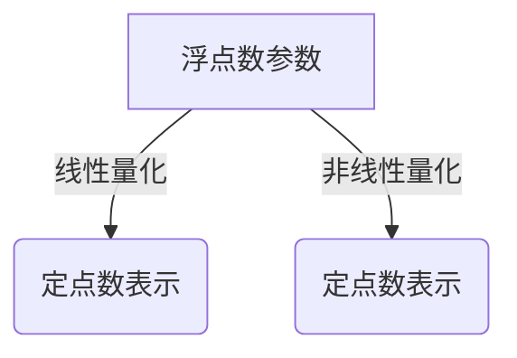

# 量化：压缩模型，部署到移动设备

## 1. 背景介绍

### 1.1 移动设备的硬件限制

移动设备如手机和平板电脑在功耗、内存和计算能力方面都受到硬件的限制。这些限制使得在移动设备上部署大型深度学习模型变得极具挑战。大多数现代深度学习模型都是在具有强大GPU和大量内存的服务器上进行训练的,但移动设备通常只有CPU和有限的内存。

### 1.2 模型压缩的重要性

为了在移动设备上高效地部署深度学习模型,我们需要减小模型的大小和计算量。这就是模型压缩的目的。通过模型压缩技术,我们可以显著减小模型的大小,降低计算量和内存占用,同时尽可能保持模型的准确性。

### 1.3 量化压缩技术概述

量化是一种常用的模型压缩技术。它将原始的32位或16位浮点数模型参数转换为较低比特宽度的定点数表示,从而减小模型大小。常见的量化方法包括权重量化、激活量化和混合量化等。量化可以大幅减小模型大小,同时通过硬件加速提高推理速度。

## 2. 核心概念与联系

### 2.1 量化的基本概念

量化是将浮点数模型参数映射到一组有限的离散值的过程。这些离散值通常是定点数,比特宽度较低。量化可分为线性量化和非线性量化两种方式。

#### 2.1.1 线性量化

线性量化将浮点数参数线性映射到定点数表示。它包括以下步骤:

1. 计算浮点数参数的最小值和最大值
2. 根据量化比特宽度计算量化间隔(scale)
3. 将浮点数参数四舍五入到最近的定点数值

$$
q(x) = \lfloor \frac{x}{s} \rceil \times s
$$

其中 $q(x)$ 是量化后的定点数值, $s$ 是量化间隔。

#### 2.1.2 非线性量化

非线性量化采用非线性映射函数,如对数函数或基于查找表的映射。它可以更好地捕获小值参数的细节,但计算开销较大。



### 2.2 权重量化与激活量化

权重量化是指将模型权重从浮点数表示量化为定点数表示。激活量化则是量化神经网络层之间的激活值(中间输出)。

通常,权重量化对模型精度的影响较小,而激活量化会导致更大的精度损失。因此,混合量化同时对权重和激活进行量化,可以在模型大小和精度之间取得更好的平衡。

### 2.3 量化感知训练

为了减小量化带来的精度损失,我们可以采用量化感知训练(Quantization-Aware Training, QAT)。在这种方式下,模型在训练时就使用量化的权重和激活,使得模型能够适应量化操作。QAT可以显著提高量化模型的精度。


## 3. 核心算法原理具体操作步骤

### 3.1 权重量化算法步骤

1. **计算权重张量的最小值和最大值**

对于权重张量 $W$,计算其最小值 $w_{min}$ 和最大值 $w_{max}$。

$$
w_{min} = \min(W), \quad w_{max} = \max(W)
$$

2. **计算量化间隔**

根据量化比特宽度 $N$ 和量化方式(对称或非对称),计算量化间隔 $s$。

对称量化:
$$
s = \frac{w_{max} - w_{min}}{2^N - 1}
$$

非对称量化:
$$
s = \max(|w_{min}|, w_{max}) / (2^{N-1} - 1)
$$

3. **量化权重**

对每个权重值 $w$ 进行量化:

$$
q(w) = \lfloor \frac{w}{s} + z \rceil \times s
$$

其中 $z$ 是量化偏移,对称量化时 $z=0$,非对称量化时 $z=2^{N-1}$。

4. **解量化**

在推理时,需要将量化权重解量化为浮点数:

$$
w' = q(w) \times s
$$

### 3.2 激活量化算法步骤

1. **计算激活张量的最小值和最大值**

对于激活张量 $A$,计算其最小值 $a_{min}$ 和最大值 $a_{max}$ 用于确定量化范围。

$$
a_{min} = \min(A), \quad a_{max} = \max(A)
$$

2. **计算量化间隔**

根据量化比特宽度 $N$,计算量化间隔 $s$。

$$
s = \frac{a_{max} - a_{min}}{2^N - 1}
$$

3. **量化激活**

对每个激活值 $a$ 进行量化:

$$
q(a) = \lfloor \frac{a - a_{min}}{s} \rceil \times s + a_{min}
$$

4. **解量化**

在推理时,需要将量化激活解量化为浮点数:

$$
a' = q(a)
$$

### 3.3 量化感知训练算法步骤

1. **初始化浮点数模型**

使用标准方法训练一个浮点数精度的模型。

2. **插入模拟量化节点**

在模型的关键位置(如卷积层输入和输出)插入模拟量化节点,用于模拟量化和解量化操作。

3. **更新量化参数**

在训练过程中,持续更新量化参数(如量化间隔),使量化操作能够很好地适应当前的权重和激活分布。

4. **微调量化模型**

使用标准优化器(如SGD)微调带有模拟量化节点的量化模型,使其适应量化操作。

5. **导出量化模型**

训练结束后,导出最终的量化模型权重用于部署。

通过量化感知训练,模型可以在训练时就适应量化操作,从而减小量化带来的精度损失。

## 4. 数学模型和公式详细讲解举例说明

在上一节中,我们介绍了量化的核心算法步骤。现在让我们通过具体例子来详细解释其中的数学模型和公式。

### 4.1 线性量化公式解释

假设我们有一个 4x4 的浮点数权重矩阵:

$$
W = \begin{bmatrix}
    0.25 & -0.12 & 0.38 & 0.05\\
    0.19 & -0.42 & 0.27 & -0.16\\
    0.33 & 0.09 & -0.29 & 0.41\\
    -0.07 & 0.34 & 0.18 & -0.25
\end{bmatrix}
$$

我们要将其量化为 8 比特定点数表示。首先计算权重矩阵的最小值和最大值:

$$
w_{min} = -0.42, \quad w_{max} = 0.41
$$

然后计算量化间隔 $s$,对于对称量化:

$$
s = \frac{w_{max} - w_{min}}{2^8 - 1} = \frac{0.83}{255} \approx 0.0033
$$

接下来,我们对每个权重值进行量化:

$$
q(0.25) = \lfloor \frac{0.25}{0.0033} \rceil \times 0.0033 = 0.0264 \\
q(-0.12) = \lfloor \frac{-0.12}{0.0033} \rceil \times 0.0033 = -0.0132 \\
\cdots
$$

得到量化后的权重矩阵:

$$
Q(W) = \begin{bmatrix}
    0.0264 & -0.0132 & 0.0396 & 0.0066\\
    0.0198 & -0.0429 & 0.0297 & -0.0165\\
    0.0363 & 0.0099 & -0.0297 & 0.0429\\
    -0.0066 & 0.0363 & 0.0198 & -0.0264
\end{bmatrix}
$$

在推理时,我们需要将量化权重解量化为浮点数:

$$
w' = q(w) \times s
$$

### 4.2 激活量化公式解释

假设我们有一个 1x4 的浮点数激活向量:

$$
A = \begin{bmatrix}
    0.7 & -0.2 & 0.4 & 1.1
\end{bmatrix}
$$

我们要将其量化为 8 比特定点数表示。首先计算激活向量的最小值和最大值:

$$
a_{min} = -0.2, \quad a_{max} = 1.1
$$

然后计算量化间隔 $s$:

$$
s = \frac{a_{max} - a_{min}}{2^8 - 1} = \frac{1.3}{255} \approx 0.0051
$$

接下来,我们对每个激活值进行量化:

$$
q(0.7) = \lfloor \frac{0.7 - (-0.2)}{0.0051} \rceil \times 0.0051 + (-0.2) = 0.6949 \\
q(-0.2) = \lfloor \frac{-0.2 - (-0.2)}{0.0051} \rceil \times 0.0051 + (-0.2) = -0.2000 \\
\cdots
$$

得到量化后的激活向量:

$$
Q(A) = \begin{bmatrix}
    0.6949 & -0.2000 & 0.3949 & 1.0000
\end{bmatrix}
$$

在推理时,我们直接使用量化后的激活值,无需解量化操作。

通过上述例子,我们可以更好地理解量化公式在实际应用中的含义和计算过程。

## 5. 项目实践:代码实例和详细解释说明

在这一节,我们将通过实际的代码示例来演示如何使用PyTorch对模型进行量化。我们将基于MNIST手写数字识别任务,训练一个小型卷积神经网络模型,然后对其进行量化并在移动设备上部署。

### 5.1 定义模型

首先,我们定义一个简单的卷积神经网络模型:

```python
import torch.nn as nn

class ConvNet(nn.Module):
    def __init__(self):
        super(ConvNet, self).__init__()
        self.conv1 = nn.Conv2d(1, 32, 3, 1)
        self.conv2 = nn.Conv2d(32, 64, 3, 1)
        self.dropout1 = nn.Dropout2d(0.25)
        self.dropout2 = nn.Dropout2d(0.5)
        self.fc1 = nn.Linear(9216, 128)
        self.fc2 = nn.Linear(128, 10)

    def forward(self, x):
        x = self.conv1(x)
        x = nn.functional.relu(x)
        x = self.conv2(x)
        x = nn.functional.max_pool2d(x, 2)
        x = self.dropout1(x)
        x = torch.flatten(x, 1)
        x = self.fc1(x)
        x = nn.functional.relu(x)
        x = self.dropout2(x)
        x = self.fc2(x)
        output = nn.functional.log_softmax(x, dim=1)
        return output
```

### 5.2 训练浮点数模型

接下来,我们使用PyTorch内置的MNIST数据集,并训练一个浮点数精度的模型:

```python
import torch
import torchvision
import torchvision.transforms as transforms

# 加载数据集
transform = transforms.Compose([transforms.ToTensor(), transforms.Normalize((0.1307,), (0.3081,))])
train_dataset = torchvision.datasets.MNIST(root='./data', train=True, download=True, transform=transform)
test_dataset = torchvision.datasets.MNIST(root='./data', train=False, download=True, transform=transform)

# 定义数据加载器
train_loader = torch.utils.data.DataLoader(train_dataset, batch_size=64, shuffle=True)
test_loader = torch.utils.data.DataLoader(test_dataset, batch_size=64, shuffle=False)

# 实例化模型
model = ConvNet()

# 定义损失函数和优化器
criterion = nn.CrossEntropyLoss()
optimizer = torch.optim.Adam(model.parameters(), lr=0.001)

# 训练模型
for epoch in range(10):
    running_loss = 0.0
    for i, data in enumerate(train_loader, 0):
        inputs, labels = data
        optimizer.zero_grad()
        outputs = model(inputs)
        loss = criterion(outputs, labels)
        loss.backward()
        optimizer.step