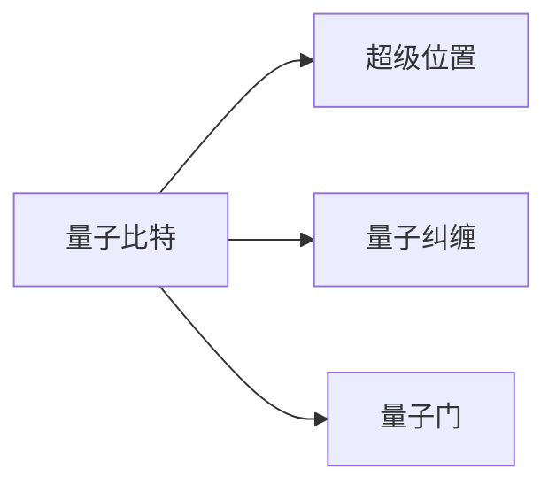

## 1.背景介绍

量子计算是一种基于量子力学的计算方式，它利用量子比特（qubits）进行信息处理，这种方式在理论上可以极大地提高计算能力。量子计算的研究和发展已经成为全球科技领域的热点，各大科技公司和研究机构都在积极投入资源进行研究和开发。

## 2.核心概念与联系

量子计算的核心概念主要包括量子比特、超级位置、纠缠和量子门等。量子比特是量子计算的基本单元，与经典计算的比特不同，量子比特可以同时处于0和1的状态，这就是超级位置。量子纠缠是量子力学的一种奇特现象，两个或多个量子比特可以形成一种特殊的关联，使得一个量子比特的状态改变会立即影响到另一个量子比特，这种关联超越了空间距离。量子门则是量子计算中实现逻辑运算的基本操作。



## 3.核心算法原理具体操作步骤

量子计算的核心算法包括量子傅里叶变换、量子搜索算法和量子因子分解等。这些算法利用量子比特的超级位置和纠缠等特性，实现了比经典计算更高效的信息处理。例如，量子搜索算法可以在$O(\sqrt{N})$的时间内找到目标，而经典搜索算法需要$O(N)$的时间。

## 4.数学模型和公式详细讲解举例说明

量子计算的数学模型主要基于线性代数和概率论。量子比特的状态可以用一个复数向量来表示，例如，一个量子比特的状态可以表示为$\alpha|0\rangle + \beta|1\rangle$，其中$\alpha$和$\beta$是复数，满足$|\alpha|^2 + |\beta|^2 = 1$。量子门则可以用单位阵来表示，例如，Hadamard门可以表示为

$$
H = \frac{1}{\sqrt{2}}\begin{bmatrix} 1 & 1 \\ 1 & -1 \end{bmatrix}
$$

## 5.项目实践：代码实例和详细解释说明

量子计算的实践主要通过量子计算模拟器来进行。例如，IBM的Qiskit和Google的Cirq等。以下是一个使用Qiskit实现量子搜索算法的例子：

```python
from qiskit import QuantumCircuit, execute, Aer

qc = QuantumCircuit(2)
qc.h([0, 1])
qc.cz(0, 1)
qc.h([0, 1])
qc.z([0, 1])
qc.cz(0, 1)
qc.h([0, 1])

result = execute(qc, Aer.get_backend('statevector_simulator')).result()
print(result.get_statevector())
```

## 6.实际应用场景

量子计算的潜在应用场景非常广泛，包括优化问题、搜索问题、模拟问题和密码学等。例如，量子搜索算法可以用于大数据搜索，量子模拟可以用于模拟复杂的化学反应，量子优化可以用于解决运筹学问题，量子密码学可以用于实现无条件安全的通信。

## 7.工具和资源推荐

量子计算的学习和研究资源包括IBM的Qiskit、Google的Cirq、Microsoft的Quantum Development Kit等。这些工具都提供了量子计算模拟器和量子算法库，可以帮助你更好地理解和实践量子计算。

## 8.总结：未来发展趋势与挑战

量子计算的发展前景十分广阔，但也面临着许多挑战，包括量子比特的稳定性、量子错误纠正、量子软件的开发等。然而，随着科技的进步，这些挑战正在逐步被克服，我们有理由相信，量子计算将在不久的将来为我们的生活和工作带来深远的影响。

## 9.附录：常见问题与解答

在这里，我将回答一些关于量子计算的常见问题。

Q1: 量子计算是否会取代经典计算？

A1: 量子计算并不会取代经典计算，而是与经典计算互补。对于一些特定的问题，量子计算可能有更高的效率，但对于大部分日常的计算任务，经典计算仍然是最有效的方式。

Q2: 量子计算是否会破解所有的密码？

A2: 量子计算确实可以破解一些经典的密码算法，例如RSA。但这并不意味着所有的密码都会被破解，因为我们可以设计新的量子安全的密码算法。

作者：禅与计算机程序设计艺术 / Zen and the Art of Computer Programming