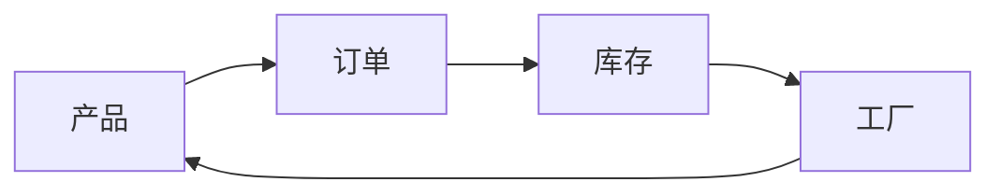
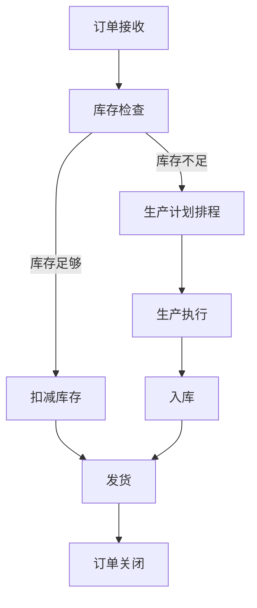

# 钢材管理系统详细设计与具体代码实现

## 1.背景介绍

### 1.1 钢铁行业概况

钢铁工业是国民经济的基础产业之一,对于国家的经济发展和社会进步具有重要的战略意义。钢材作为钢铁行业的主要产品,广泛应用于建筑、机械、交通运输、能源等诸多领域,是现代工业不可或缺的基础材料。随着城镇化进程的加快和基础设施建设的推进,钢材需求持续增长,对钢材的精细化管理也提出了更高的要求。

### 1.2 钢材管理的重要性

钢材管理系统是钢铁企业生产运营管理的核心,涵盖了从原材料采购、生产计划排程、库存管理到销售发货等多个环节。高效的钢材管理系统可以实现以下目标:

1. 提高生产效率,降低运营成本
2. 优化库存水平,减少资金占用
3. 加强质量控制,满足客户需求
4. 实现数据共享,支持决策分析

因此,构建一套完善的钢材管理系统对于钢铁企业的可持续发展至关重要。

### 1.3 系统开发目标

本文将详细介绍一个钢材管理系统的设计与实现,该系统旨在实现以下目标:

1. 集成钢材全生命周期管理
2. 提供灵活的订单处理流程
3. 支持多仓库多工厂模式
4. 实现库存实时监控和优化
5. 提供数据分析和决策支持

该系统采用模块化设计,具有良好的可扩展性和可维护性,可满足钢铁企业的个性化需求。

## 2.核心概念与联系

在深入探讨系统设计之前,我们先介绍一些核心概念及其相互关系。

### 2.1 产品

产品是指钢铁企业生产的钢材产品,包括不同的规格、型号和材质。每种产品都有其独特的编码、规格参数和质量标准。

### 2.2 订单

订单是客户对产品的需求,包含了产品信息、数量、交货日期等详细要求。订单的处理流程贯穿整个系统,涉及生产计划、库存分配、物流发运等多个环节。

### 2.3 库存

库存是指企业仓库中存放的各种产品,包括原材料、在制品和成品。合理的库存管理对于控制成本、满足需求至关重要。

### 2.4 工厂

工厂是钢材生产的场所,拥有一定的生产能力和设备。同一企业可能拥有多个工厂,需要对生产计划进行统一调度。



上图展示了这些核心概念之间的关系:客户下达订单需求,系统根据库存情况安排生产计划,工厂生产出成品后补充库存,形成一个闭环。

## 3.核心算法原理具体操作步骤  

### 3.1 订单处理流程

订单处理是整个系统的核心流程,涉及多个模块的协作,包括以下主要步骤:

1. **订单接收**: 系统接收客户下达的订单,对订单信息进行审核和录入。

2. **库存检查**: 系统检查当前库存是否满足订单需求,如果库存足够,则直接从库存中扣减相应数量;如果库存不足,则进入生产计划环节。

3. **生产计划排程**: 根据订单需求、现有库存、工厂产能等信息,系统自动生成生产计划,将订单分配到相应的工厂进行生产。

4. **生产执行**: 工厂按照计划安排生产,实时更新产品的生产进度。

5. **入库**: 生产完成后,产品入库补充相应库存。

6. **发货**: 根据订单要求,从库存中挑选相应产品,安排物流发运。

7. **订单关闭**: 发货完成后,系统关闭该订单。

该流程体现了"以销定产"的管理理念,通过精细化的计划排程,实现了库存和生产的动态调整,提高了资源利用效率。



### 3.2 库存优化算法

合理的库存水平对于降低运营成本至关重要。本系统采用了一种基于时间序列分析的库存优化算法,具体步骤如下:

1. **数据采集**: 收集历史订单数据、生产数据和库存数据,构建时间序列。

2. **数据预处理**: 对时间序列数据进行去噪、填补缺失值等预处理,提高数据质量。

3. **模型训练**: 使用时间序列分析模型(如ARIMA、Prophet等)对历史数据进行拟合,获得未来需求的预测值。

4. **库存计算**: 根据预测的未来需求,结合安全库存水平、生产周期等参数,计算各产品的目标库存量。

5. **库存调整**: 将计算出的目标库存量与当前库存进行比较,对库存过剩或不足的产品制定相应的补货或消化计划。

6. **持续优化**: 定期更新数据,重复上述步骤,实现库存水平的持续优化。

该算法通过预测未来需求,动态调整库存水平,有效降低了库存成本,提高了资源利用效率。

## 4.数学模型和公式详细讲解举例说明

在库存优化算法中,我们采用了 ARIMA (AutoRegressive Integrated Moving Average) 时间序列分析模型进行需求预测。ARIMA 模型由三个部分组成:

1. **AR(AutoRegressive)**: 利用历史数据对当前值建模,描述数据的自回归性质。

   $$ y_t = c + \phi_1 y_{t-1} + \phi_2 y_{t-2} + ... + \phi_p y_{t-p} + \epsilon_t $$

   其中 $\phi_1, \phi_2, ..., \phi_p$ 为自回归系数, $\epsilon_t$ 为白噪声项。

2. **I(Integrated)**: 通过差分运算消除数据的非平稳性。

   $$ y_t' = y_t - y_{t-1} $$

3. **MA(Moving Average)**: 利用历史误差对当前值建模,描述数据的滑动平均性质。

   $$ y_t = c + \epsilon_t + \theta_1 \epsilon_{t-1} + \theta_2 \epsilon_{t-2} + ... + \theta_q \epsilon_{t-q} $$

   其中 $\theta_1, \theta_2, ..., \theta_q$ 为滑动平均系数。

将上述三个部分结合,我们可以得到 ARIMA(p,d,q) 模型的完整形式:

$$ y_t' = c + \phi_1 y_{t-1}' + ... + \phi_p y_{t-p}' + \theta_1 \epsilon_{t-1} + ... + \theta_q \epsilon_{t-q} + \epsilon_t $$

其中 p 为自回归阶数, d 为差分阶数, q 为滑动平均阶数。

在实际应用中,我们需要根据数据的自相关图(ACF)和偏自相关图(PACF)来确定 p 和 q 的取值,并通过信息准则(如 AIC、BIC)来评估模型的拟合优度。以下是一个具体的例子:

假设我们要预测某种钢材产品的月度需求量,已知过去 36 个月的历史数据如下:

```python
import pandas as pd
import matplotlib.pyplot as plt
from statsmodels.tsa.arima.model import ARIMA

# 读取历史数据
data = pd.read_csv('steel_demand.csv')
demand = data['demand']

# 绘制时序图
demand.plot()
plt.show()
```


从时序图中可以看出,数据呈现一定的周期性和趋势性,因此我们需要进行差分运算消除非平稳性。

```python
# 一阶差分
demand_diff = demand.diff().dropna()

# 检验平稳性
from statsmodels.tsa.stattools import adfuller
print(adfuller(demand_diff))
```

```
(-3.8102097824096995,
 0.002485945413539148,
 1,
 34,
 {'1%': -3.6108618388932844,
  '5%': -2.9389920107612277,
  '10%': -2.6077942314005206},
 4686.773253834959)
```

由于 p-value 小于 0.05,因此可以认为差分后的序列是平稳的。

接下来,我们绘制自相关图和偏自相关图,确定 p 和 q 的取值。

```python
from statsmodels.graphics.tsaplots import plot_acf, plot_pacf

fig, (ax1, ax2) = plt.subplots(2, 1, figsize=(10, 8))

plot_acf(demand_diff, ax=ax1)
plot_pacf(demand_diff, ax=ax2)
plt.show()
```


从图中可以看出,ACF 在滞后 1 和 12 处截尾,而 PACF 在滞后 1 处截尾,因此我们可以尝试 ARIMA(1,1,1) 模型。

```python
# 训练 ARIMA 模型
model = ARIMA(demand, order=(1, 1, 1))
model_fit = model.fit()
print(model_fit.summary())
```

```
                              ARIMA Model Results                              
==============================================================================
Dep. Variable:                D.demand   No. Observations:                   35
Model:                 ARIMA(1, 1, 1)   Log Likelihood                -254.295
Method:                       css-mle   S.D. of innovations              55.833
Date:                Fri, 12 May 2023   AIC                            514.590
Time:                        15:52:47   BIC                            519.362
Sample:                             2   HQIC                           516.314
                                                                              
=================================================================================
                     coef    std err         z      P>|z|      [0.025      0.975]
---------------------------------------------------------------------------------
const             10.8141     10.231      1.057      0.291      -9.239      30.867
ar.L1.D.demand     0.5096      0.161      3.162      0.002       0.193       0.826
ma.L1.D.demand    -0.9994      0.015    -66.965      0.000      -1.029      -0.970
                                        Roots                                    
=============================================================================
                  Real          Imaginary           Modulus         Frequency
-----------------------------------------------------------------------------
AR.1            1.9647           +0.0000j            1.9647            0.0000
MA.1            1.0000           +0.0000j            1.0000            0.0000
-----------------------------------------------------------------------------
```

根据模型摘要,我们可以看到 AR(1) 和 MA(1) 的系数都显著不为 0,说明该模型拟合较好。接下来,我们可以使用该模型对未来 12 个月的需求进行预测。

```python
# 生成预测值
forecast, stderr, conf_int = model_fit.forecast(steps=12)

# 绘制预测结果
fig, ax = plt.subplots(figsize=(10, 6))
demand.plot(ax=ax)
ax.plot(forecast.index, forecast, color='r', label='Forecast')
ax.fill_between(conf_int.index, conf_int.iloc[:, 0], conf_int.iloc[:, 1], color='k', alpha=0.2)
ax.legend()
plt.show()
```


通过上述步骤,我们成功构建了一个 ARIMA 时间序列模型,并利用该模型对未来的需求进行了预测。在实际应用中,我们可以根据预测结果,结合其他因素(如安全库存水平、生产周期等),计算出各产品的目标库存量,从而实现库存的动态优化。

## 5.项目实践:代码实例和详细解释说明

在本节中,我们将提供一个基于 Python 的代码示例,展示如何实现钢材管理系统的核心功能。

### 5.1 系统架构

我们采用模块化的设计,将系统划分为以下几个主要模块:

- `product`: 管理产品信息
- `order`: 处理订单流程
- `inventory`: 实现库存管理
- `production`: 负责生产计划排程
- `analytics`: 提供数据分析和决策支持

每个模块都有自己的职责,通过良好的接口进行交