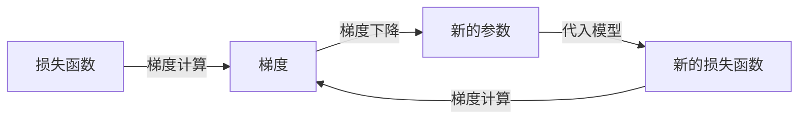

## 1.背景介绍

随机梯度下降（Stochastic Gradient Descent, SGD）是一种优化算法，广泛应用于机器学习和深度学习中。它的主要目标是最小化一个函数，这个函数通常是模型的损失函数。SGD在处理大规模数据集时，优于传统的梯度下降法，因为它每次只处理一个训练样本，计算速度快，能快速收敛。

## 2.核心概念与联系

SGD的核心概念是梯度下降。梯度可以理解为函数在某一点的方向导数，它指向函数增长最快的方向。而梯度下降则是沿着梯度的反方向进行迭代，以此来找到函数的最小值。

在SGD中，每次迭代只使用一个样本来计算梯度，这就是“随机”二字的由来。这种方法的优点是计算速度快，但缺点是迭代过程会有噪声，收敛速度不稳定。



## 3.核心算法原理具体操作步骤

SGD的操作步骤可以概括为以下几步：

1. 随机选择一个样本；
2. 计算该样本的梯度；
3. 沿着梯度的反方向更新参数；
4. 重复以上步骤，直到满足停止条件。

## 4.数学模型和公式详细讲解举例说明

假设我们有一个损失函数$L(\theta)$，其中$\theta$是模型的参数。SGD的更新公式为：

$$
\theta = \theta - \eta \nabla L(\theta)
$$

其中，$\eta$是学习率，$\nabla L(\theta)$是损失函数的梯度。这个公式表明，我们每次都沿着梯度的反方向更新参数。

## 5.项目实践：代码实例和详细解释说明

以下是一个使用Python实现SGD的简单例子：

```python
import numpy as np

def SGD(f, theta0, alpha, num_iters):
    """ 
    Args:
        f: The function to optimize. It should take a single argument and yield two outputs,
           a cost and the gradient with respect to the arguments.
        theta0: The initial point to start SGD from.
        alpha: The learning rate.
        num_iters: Total number of iterations to run SGD for.
    Returns:
        theta: The parameter value after SGD finishes.
    """
    start_iter = 0
    theta= theta0
    for iter in xrange(start_iter + 1, num_iters + 1):
        _, grad = f(theta)
        theta = theta - (alpha * grad)  # The update rule.
    return theta
```

## 6.实际应用场景

SGD在许多实际应用场景中都有使用，例如深度学习的训练、大规模数据集的处理、在线学习等。

## 7.工具和资源推荐

- Scikit-learn: 一个强大的Python机器学习库，其中包含了SGD的实现；
- TensorFlow: 一个开源的深度学习框架，可以方便地实现SGD等优化算法。

## 8.总结：未来发展趋势与挑战

SGD虽然简单，但在处理大规模数据集和深度学习模型训练时非常有效。然而，由于其收敛速度不稳定，因此有许多改进的SGD算法被提出，例如Momentum、AdaGrad、Adam等。

## 9.附录：常见问题与解答

Q: SGD和梯度下降有什么区别？
A: SGD每次只使用一个样本来计算梯度，而梯度下降则使用所有样本。

Q: 为什么说SGD有噪声？
A: 因为SGD每次只使用一个样本来计算梯度，这个样本可能并不能代表整个数据的特性，因此引入了噪声。

作者：禅与计算机程序设计艺术 / Zen and the Art of Computer Programming