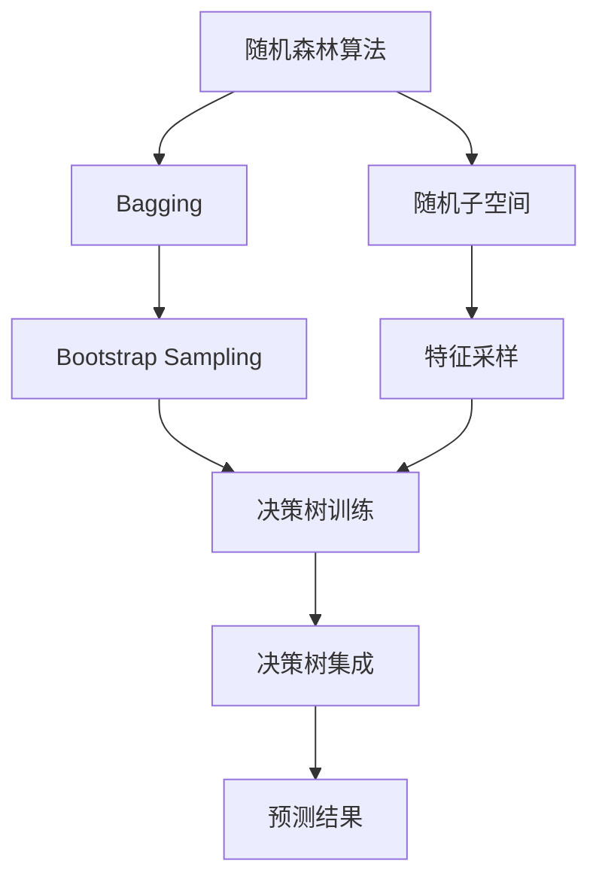

# 随机森林 原理与代码实例讲解

## 1.背景介绍

### 1.1 什么是随机森林？

随机森林(Random Forest)是一种流行的集成学习算法,它由多个决策树组成,每个决策树在训练数据的不同子空间上进行构建。通过综合多个决策树的预测结果,随机森林能够提高模型的准确性和鲁棒性,避免了单一决策树容易过拟合的问题。

随机森林在分类和回归问题中都有广泛的应用,被认为是最有效的机器学习算法之一。它不仅能够处理高维数据,还能够自动估计特征的重要性,并且对异常值的鲁棒性很强。

### 1.2 随机森林的发展历史

随机森林算法最早由Leo Breiman于2001年提出,用于解决数据集的分类和回归问题。它是在决策树算法的基础上发展而来,旨在通过构建多个决策树来降低过拟合风险,提高模型的泛化能力。

随机森林算法的核心思想是引入随机性,在构建每个决策树时,通过有放回地从原始训练集中随机抽取样本,并在每个节点上随机选择特征进行分裂。这种随机性使得每个决策树之间存在差异,从而降低了单个决策树的方差,提高了整体模型的性能。

近年来,随机森林算法在各个领域得到了广泛的应用,包括图像识别、自然语言处理、生物信息学等,展现出了优秀的性能。随着计算能力的提高和大数据时代的到来,随机森林算法也在不断发展和优化,以适应更加复杂的数据和任务。

## 2.核心概念与联系

### 2.1 集成学习

随机森林属于集成学习(Ensemble Learning)的范畴。集成学习是将多个弱学习器(weak learners)组合成一个强学习器(strong learner)的过程,旨在提高模型的泛化能力和预测精度。

集成学习的核心思想是通过训练多个不同的模型,然后将它们的预测结果进行组合,从而获得比单个模型更好的性能。常见的集成学习方法包括Bagging(Bootstrap Aggregating)、Boosting等。

随机森林采用了Bagging的策略,即通过从原始训练集中有放回地抽取多个子集,分别训练不同的决策树,最终将这些决策树的预测结果进行平均或投票,得到最终的预测结果。

### 2.2 决策树

决策树(Decision Tree)是一种基本的机器学习算法,它通过递归地对特征空间进行划分,构建一个树状结构,用于对新的样本进行预测。

决策树具有可解释性强、可视化、处理高维数据等优点,但也存在过拟合、对训练数据的微小变化敏感等缺点。

随机森林算法通过构建多个决策树,并引入随机性来降低单个决策树的方差,从而提高了模型的泛化能力和鲁棒性。每个决策树在训练时都会从原始训练集中随机抽取一个子集,并在每个节点上随机选择一部分特征进行分裂,这样就保证了每个决策树之间存在差异。

### 2.3 随机性

随机性是随机森林算法的核心概念之一。引入随机性的目的是为了减小决策树之间的相关性,从而降低模型的方差,提高泛化能力。

在随机森林中,主要有两个地方引入了随机性:

1. **数据采样**: 对于每个决策树,从原始训练集中有放回地随机抽取一个子集作为该决策树的训练数据。这种采样方式被称为Bootstrap Sampling或Bagging。

2. **特征采样**: 在每个节点上,随机选择一部分特征作为候选特征,从中选择最优特征进行分裂。这种方式被称为随机子空间(Random Subspace)。

通过引入这两种随机性,每个决策树都会在不同的训练数据和特征子空间上进行训练,从而降低了决策树之间的相关性,减小了模型的方差。

### 2.4 Mermaid流程图

下面是随机森林算法的核心概念和流程的Mermaid图:



## 3.核心算法原理具体操作步骤

随机森林算法的核心步骤如下:

1. **从训练集中有放回地抽取 N 个子集**。每个子集的大小通常与原始训练集的大小相同。这种采样方式被称为 Bootstrap Sampling 或 Bagging。

2. **对每个子集训练一个决策树**。在构建每个决策树时,需要引入随机性:

   - 在每个节点上,从所有特征中随机选择一个特征子集(通常是特征总数的平方根)。
   - 从这个特征子集中,选择最优特征进行分裂。

3. **重复步骤 2,直到构建出 N 个决策树**。每个决策树都是在不同的训练子集和特征子空间上进行训练的。

4. **对新的测试样本进行预测**:

   - 分类问题:每个决策树对测试样本进行分类,然后通过投票(majority vote)的方式得到最终的类别预测。
   - 回归问题:每个决策树对测试样本进行预测,然后取所有决策树预测值的平均值作为最终的预测结果。

5. **评估模型性能**,根据需要调整参数或算法细节。

下面是随机森林算法的伪代码:

```
函数 RandomForest(训练集 X, 训练集标签 Y, 树的数量 N):
    初始化 N 个决策树列表
    for i = 1 to N:
        # 有放回地从训练集中抽取一个子集
        X_subset, Y_subset = BootstrapSampling(X, Y)
        # 在子集上训练一个决策树
        tree = TrainDecisionTree(X_subset, Y_subset)
        将 tree 添加到决策树列表中
    return 决策树列表

函数 Predict(测试样本 x, 决策树列表):
    初始化预测结果列表
    for 每个决策树 tree:
        预测 = tree.Predict(x)
        将预测添加到预测结果列表
    if 是分类问题:
        return 投票(预测结果列表)
    else: # 回归问题
        return 平均(预测结果列表)
```

## 4.数学模型和公式详细讲解举例说明

### 4.1 基尼不纯度(Gini Impurity)

在随机森林中,决策树通常使用基尼不纯度作为选择最优特征的指标。基尼不纯度衡量了一个数据集的混乱程度,值越小表示数据集越纯。

对于一个包含 $K$ 个类别的数据集 $D$,基尼不纯度定义为:

$$\text{Gini}(D) = 1 - \sum_{k=1}^{K}p_k^2$$

其中 $p_k$ 表示数据集 $D$ 中属于第 $k$ 类的样本占比。

当一个节点被分裂为两个子节点 $D_1$ 和 $D_2$ 时,基尼不纯度的减少量为:

$$\Delta\text{Gini} = \text{Gini}(D) - \frac{|D_1|}{|D|}\text{Gini}(D_1) - \frac{|D_2|}{|D|}\text{Gini}(D_2)$$

其中 $|D|$、$|D_1|$ 和 $|D_2|$ 分别表示数据集 $D$、$D_1$ 和 $D_2$ 的大小。

在构建决策树时,我们选择能够最大化 $\Delta\text{Gini}$ 的特征进行分裂,从而使得子节点的基尼不纯度最小化。

### 4.2 袋外估计(Out-of-Bag Estimation)

袋外估计(Out-of-Bag Estimation, OOB)是随机森林中一种用于评估模型性能的技术。由于在构建每个决策树时,只使用了训练集的一个子集,因此剩余的样本可以用于评估该决策树的性能。

对于每个样本 $x_i$,设 $B(x_i)$ 表示在构建随机森林时,该样本没有被用于训练的决策树的集合。则 $x_i$ 的 OOB 预测结果可以通过以下方式获得:

- 分类问题:对 $B(x_i)$ 中的每个决策树进行投票,取多数票作为 $x_i$ 的 OOB 预测结果。
- 回归问题:对 $B(x_i)$ 中的每个决策树的预测结果取平均值作为 $x_i$ 的 OOB 预测结果。

基于 OOB 预测结果,我们可以计算 OOB 误差,作为评估随机森林模型性能的指标。OOB 误差的计算方式与常规误差相同,只是使用 OOB 预测结果代替原始预测结果。

OOB 估计的优点是无需额外的测试集,可以在训练过程中同时获得模型性能评估,从而节省计算资源。

### 4.3 特征重要性(Feature Importance)

随机森林算法能够自动评估每个特征对模型预测结果的重要性,这为特征选择和模型解释提供了有力支持。

常见的特征重要性计算方法有:

1. **平均基尼系数减少量(Mean Decrease in Gini)**

   对于每个特征,计算在所有决策树中,使用该特征进行分裂时,基尼不纯度的减少量的平均值。减少量越大,说明该特征对模型的决策越重要。

2. **平均预测误差增加量(Mean Decrease in Impurity)**

   对于每个特征,在 OOB 数据上,随机permute该特征的值,计算模型预测误差的增加量。增加量越大,说明该特征对模型的预测越重要。

通过计算每个特征的重要性分数,我们可以对特征进行排序,选择重要性较高的特征进行建模,或者剔除重要性较低的特征,从而简化模型并提高效率。

## 5.项目实践:代码实例和详细解释说明

下面是使用 Python 中的 scikit-learn 库实现随机森林算法的代码示例:

```python
from sklearn.ensemble import RandomForestClassifier
from sklearn.datasets import make_classification
from sklearn.model_selection import train_test_split
from sklearn.metrics import accuracy_score

# 生成示例数据
X, y = make_classification(n_samples=1000, n_features=10, n_informative=5, random_state=42)

# 划分训练集和测试集
X_train, X_test, y_train, y_test = train_test_split(X, y, test_size=0.2, random_state=42)

# 创建随机森林分类器
rf = RandomForestClassifier(n_estimators=100, random_state=42)

# 训练模型
rf.fit(X_train, y_train)

# 预测测试集
y_pred = rf.predict(X_test)

# 计算准确率
accuracy = accuracy_score(y_test, y_pred)
print(f"Accuracy: {accuracy:.2f}")

# 获取特征重要性
feature_importances = rf.feature_importances_
print("Feature Importances:")
for i, importance in enumerate(feature_importances):
    print(f"Feature {i}: {importance:.2f}")
```

代码解释:

1. 首先,我们从 `sklearn.datasets` 模块中导入 `make_classification` 函数,用于生成一个示例分类数据集。在这个例子中,我们生成了一个包含 1000 个样本、10 个特征的数据集,其中有 5 个特征是有信息量的。

2. 使用 `train_test_split` 函数将数据集划分为训练集和测试集,测试集占 20%。

3. 创建一个 `RandomForestClassifier` 对象,设置 `n_estimators=100` 表示构建 100 个决策树。

4. 在训练集上拟合(fit)随机森林模型。

5. 使用训练好的模型对测试集进行预测,并计算预测准确率。

6. 获取每个特征的重要性分数,并打印出来。

在这个示例中,我们使用了随机森林进行分类任务。对于回归任务,只需要将 `RandomForestClassifier` 替换为 `RandomForestRegressor` 即可。

除了 scikit-learn 库,Python 还有其他