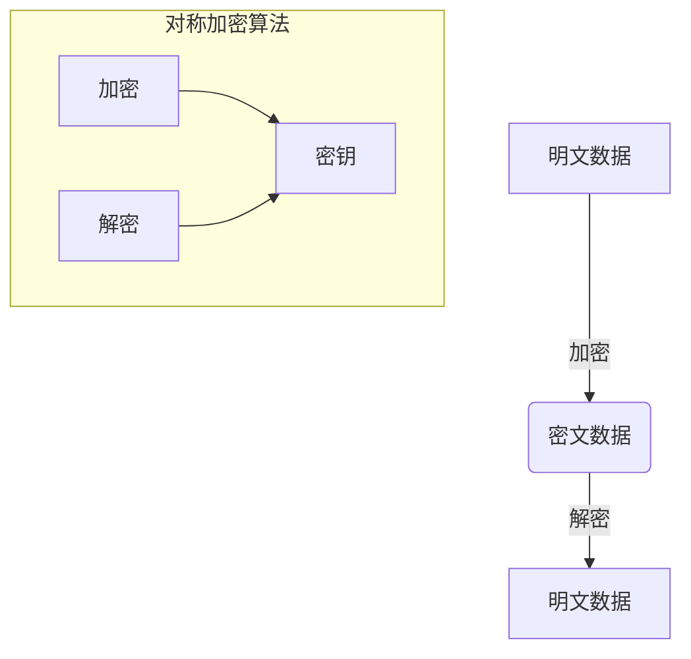
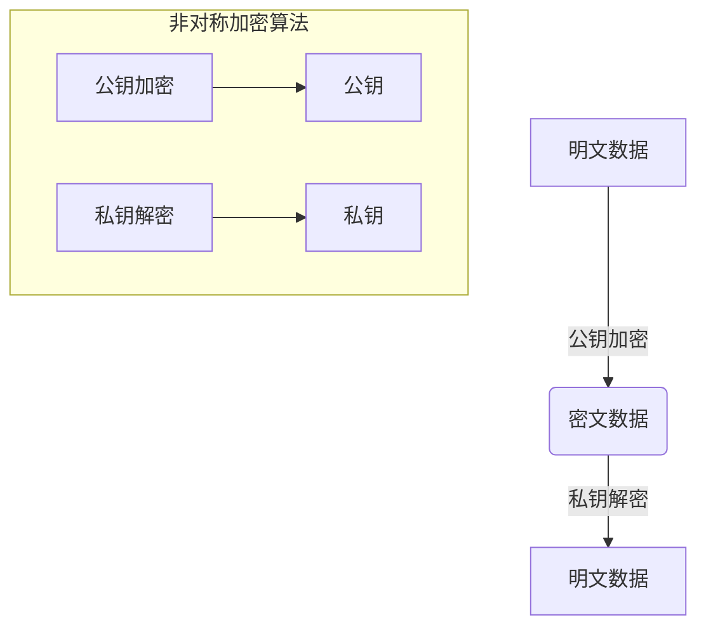
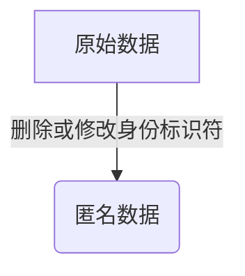
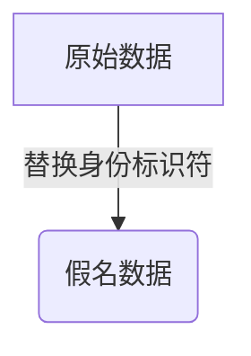
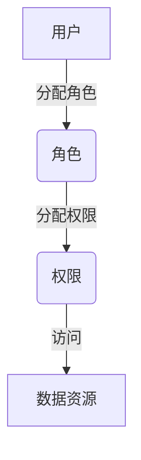
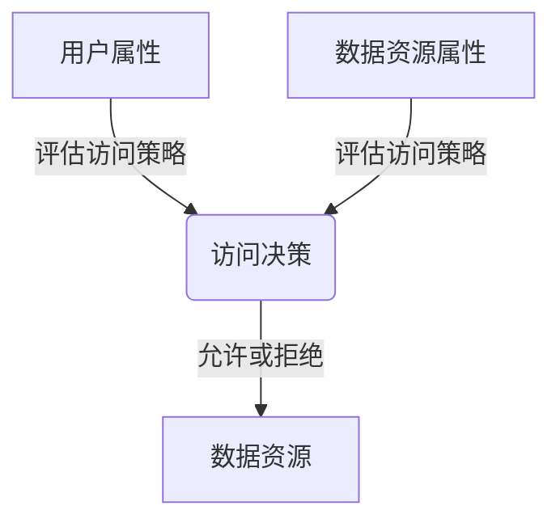
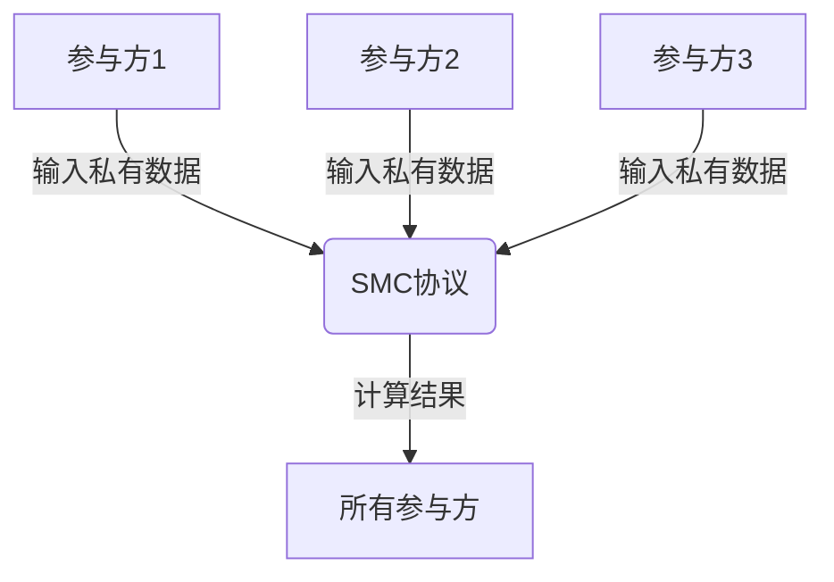
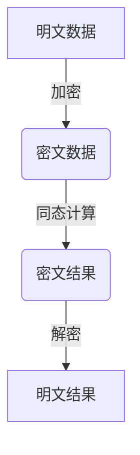

# 隐私保护：保障数据安全和用户隐私

## 1. 背景介绍

### 1.1 数据安全和隐私保护的重要性

在当今数字化时代，个人数据和隐私信息的安全性和保护已成为一个至关重要的问题。随着技术的不断发展和数据收集的日益广泛,我们的个人信息正面临着前所未有的风险。无论是在线购物、社交媒体、移动应用程序还是其他数字服务,我们都在不知不觉中留下了大量的个人数据足迹。如果这些数据落入不法分子之手,将会给我们的隐私和财产安全带来严重威胁。

### 1.2 隐私泄露的危害

个人隐私一旦被泄露,可能会导致身份盗窃、金融损失、骚扰和其他严重后果。例如,如果你的银行账户信息或社会保险号码被盗,犯罪分子可能会盗用你的身份进行非法活动,给你带来经济和法律上的麻烦。此外,隐私泄露还可能导致精神压力和名誉损失。

### 1.3 法律法规和隐私保护

为了保护个人隐私,世界各国都制定了相关的法律法规,如《通用数据保护条例》(GDPR)、《加州消费者隐私法案》(CCPA)等。这些法规要求企业和组织采取适当的技术和组织措施来保护个人数据,并赋予个人对其数据的控制权。

## 2. 核心概念与联系

### 2.1 数据安全与隐私保护的关系

数据安全和隐私保护是密切相关的概念。数据安全旨在保护数据免受未经授权的访问、修改、破坏或丢失,而隐私保护则侧重于保护个人信息不被滥用或泄露。两者相辅相成,缺一不可。只有确保数据的安全性,才能真正实现隐私保护。

### 2.2 隐私保护的核心原则

隐私保护的核心原则包括:

1. **最小化原则**: 只收集必要的个人数据,避免过度收集。
2. **透明度原则**: 向用户明确说明收集和使用个人数据的目的和方式。
3. **选择权原则**: 允许用户选择是否提供个人数据,并可随时撤回授权。
4. **数据保护原则**: 采取适当的技术和组织措施来保护个人数据的安全性和完整性。
5. **责任原则**: 数据控制者对个人数据的处理负有责任,必须遵守相关法律法规。

### 2.3 隐私保护技术

为了实现隐私保护,需要采用多种技术手段,包括:

- **加密技术**: 使用强大的加密算法来保护数据的机密性和完整性。
- **匿名化和假名化**: 通过去标识化或替换标识符来隐藏个人身份信息。
- **访问控制**: 限制对个人数据的访问,只有经过授权的人员或系统才能访问。
- **隐私保护计算**: 利用安全多方计算、同态加密等技术在不泄露原始数据的情况下进行计算和分析。

## 3. 核心算法原理具体操作步骤

### 3.1 加密技术

加密是保护数据安全和隐私的关键技术之一。常用的加密算法包括对称加密算法(如AES)和非对称加密算法(如RSA)。

1. **对称加密算法**:

对称加密算法使用相同的密钥进行加密和解密。其操作步骤如下:



2. **非对称加密算法**:

非对称加密算法使用一对公钥和私钥,公钥用于加密,私钥用于解密。其操作步骤如下:



### 3.2 匿名化和假名化

匿名化和假名化是隐藏个人身份信息的常用技术。

1. **匿名化**:

匿名化是通过删除或修改个人身份标识符(如姓名、电子邮件地址等)来隐藏个人身份信息。其操作步骤如下:



2. **假名化**:

假名化是将个人身份标识符替换为其他值(如伪随机值或哈希值)。其操作步骤如下:



### 3.3 访问控制

访问控制是限制对个人数据的访问,只有经过授权的人员或系统才能访问。常用的访问控制模型包括基于角色的访问控制(RBAC)和基于属性的访问控制(ABAC)。

1. **基于角色的访问控制(RBAC)**:

RBAC根据用户的角色分配权限,相同角色的用户拥有相同的访问权限。其操作步骤如下:



2. **基于属性的访问控制(ABAC)**:

ABAC根据用户的属性(如部门、职位等)和数据资源的属性(如敏感级别、所有者等)来决定访问权限。其操作步骤如下:



### 3.4 隐私保护计算

隐私保护计算是一种在不泄露原始数据的情况下进行计算和分析的技术。常用的隐私保护计算技术包括安全多方计算(SMC)和同态加密。

1. **安全多方计算(SMC)**:

SMC允许多方在不泄露各自的私有输入数据的情况下共同计算一个函数。其操作步骤如下:



2. **同态加密**:

同态加密允许在加密数据上直接进行计算,而无需先解密。其操作步骤如下:



## 4. 数学模型和公式详细讲解举例说明

### 4.1 加密算法数学模型

加密算法通常基于数学理论和复杂的数学函数,以确保其安全性和可靠性。

1. **对称加密算法**:

对称加密算法通常基于代换和置换操作,其中代换是用另一个字符替换原始字符,而置换是重新排列字符的顺序。常用的对称加密算法包括AES、DES等。

AES算法使用以下数学模型:

$$
C = E_k(P)
$$

其中,$ C $表示密文,$ P $表示明文,$ E_k $表示使用密钥$ k $的加密函数。

2. **非对称加密算法**:

非对称加密算法通常基于数论难题,如大素数的因数分解问题。常用的非对称加密算法包括RSA、ECC等。

RSA算法使用以下数学模型:

$$
C = P^e \bmod N
$$
$$
P = C^d \bmod N
$$

其中,$ C $表示密文,$ P $表示明文,$ e $表示公钥指数,$ d $表示私钥指数,$ N $是两个大素数的乘积。

### 4.2 匿名化和假名化数学模型

匿名化和假名化技术通常使用哈希函数或其他一次性函数来隐藏个人身份信息。

1. **哈希函数**:

哈希函数是一种将任意长度的输入映射到固定长度输出的函数,具有单向性和抗冲突性。常用的哈希函数包括SHA-256、MD5等。

$$
H(x) = y
$$

其中,$ H $表示哈希函数,$ x $表示输入数据,$ y $表示哈希值。

2. **一次性函数**:

一次性函数是一种只能使用一次的函数,每次使用时都会生成不同的输出。这种函数可用于生成伪随机值或假名。

$$
f_k(x) = y
$$

其中,$ f_k $表示使用密钥$ k $的一次性函数,$ x $表示输入数据,$ y $表示输出值。

### 4.3 隐私保护计算数学模型

隐私保护计算技术通常基于密码学原理和复杂的数学模型。

1. **安全多方计算(SMC)**:

SMC通常基于加密共享和秘密共享等密码学技术。其中,加密共享允许多方共享加密数据,而秘密共享则允许多方共享秘密信息。

$$
f(x_1, x_2, \ldots, x_n) = y
$$

其中,$ f $表示要计算的函数,$ x_1, x_2, \ldots, x_n $表示各方的私有输入数据,$ y $表示计算结果。

2. **同态加密**:

同态加密允许在加密数据上直接进行计算,通常基于环同构加密或其他同态加密方案。

$$
E(x_1 \oplus x_2) = E(x_1) \otimes E(x_2)
$$

其中,$ E $表示加密函数,$ \oplus $表示明文上的运算,$ \otimes $表示密文上的同态运算。

## 5. 项目实践:代码实例和详细解释说明

为了更好地理解隐私保护技术的实现,我们将通过一个示例项目来演示如何使用Python编程语言实现一些基本的隐私保护功能。

### 5.1 加密示例

以下代码示例展示了如何使用Python的`cryptography`库实现AES对称加密和RSA非对称加密。

```python
from cryptography.hazmat.primitives.ciphers import Cipher, algorithms, modes
from cryptography.hazmat.primitives.asymmetric import rsa
from cryptography.hazmat.primitives import hashes
from cryptography.hazmat.backends import default_backend

# AES对称加密示例
def aes_encrypt(plaintext, key):
    cipher = Cipher(algorithms.AES(key), modes.ECB())
    encryptor = cipher.encryptor()
    ciphertext = encryptor.update(plaintext) + encryptor.finalize()
    return ciphertext

# AES对称解密示例
def aes_decrypt(ciphertext, key):
    cipher = Cipher(algorithms.AES(key), modes.ECB())
    decryptor = cipher.decryptor()
    plaintext = decryptor.update(ciphertext) + decryptor.finalize()
    return plaintext

# RSA非对称加密示例
def rsa_encrypt(plaintext, public_key):
    ciphertext = public_key.encrypt(
        plaintext,
        padding.OAEP(
            mgf=padding.MGF1(algorithm=hashes.SHA256()),
            algorithm=hashes.SHA256(),
            label=None
        )
    )
    return ciphertext

# RSA非对称解密示例
def rsa_decrypt(ciphertext, private_key):
    plaintext = private_key.decrypt(
        ciphertext,
        padding.OAEP(
            mgf=padding.MGF1(algorithm=hashes.SHA256()),
            algorithm=hashes.SHA256(),
            label=None
        )
    )
    return plaintext
```

在上面的示例中,我们使用`cryptography`库提供的`Cipher`模块实现AES对称加密和解密,使用`rsa`模块实现RSA非对称加密和解密。

### 5.2 匿名化和假名化示例

以下代码示例展示了如何使用Python的`hashlib`库实现哈希函数,并应用于匿名化和假名化。

```python
import hashlib

# 哈希函数示例
def hash_function(data):
    sha256 = hashlib.sha256()
    sha256.update(data.encode('utf-8'))
    return sha256.hexdigest()

# 匿名化示例
def anonymize(data):
    anonymized_data = []
    for record in data:
        anonymized_record = {}
        