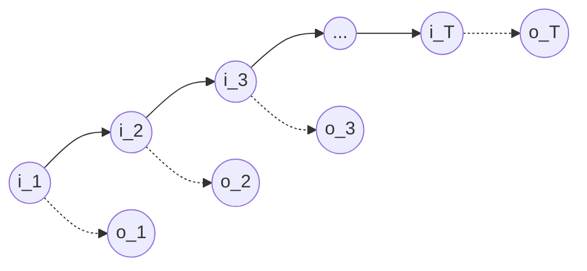

# 隐马尔可夫模型(HMM)原理与代码实战案例讲解

## 1.背景介绍
### 1.1 隐马尔可夫模型的起源与发展
隐马尔可夫模型(Hidden Markov Model, HMM)是一种统计模型,用于描述一个含有隐含未知参数的马尔可夫过程。它是20世纪60年代由Baum等人提出的,最初主要应用于语音识别领域。随着研究的深入,HMM逐渐被应用到自然语言处理、生物信息学、金融工程等众多领域。

### 1.2 HMM在人工智能领域的重要性
HMM是人工智能、模式识别领域的重要模型之一。它能够有效地处理时序数据,捕捉事件的时序特性,是许多复杂系统的基础。特别是在语音识别、自然语言处理等领域,HMM一直是主流模型。近年来,随着深度学习的兴起,一些深度模型如LSTM等也借鉴了HMM的思想。可以说,理解HMM对于学习人工智能技术具有重要意义。

### 1.3 本文的主要内容
本文将从以下几个方面深入讲解HMM:

1. HMM的核心概念与数学定义 
2. HMM三个基本问题及其解决算法
3. HMM的数学推导与代码实现
4. HMM在语音识别、自然语言处理等领域的应用实例
5. HMM的局限性与未来发展方向

通过本文的学习,读者将全面掌握HMM的原理,并能够将其应用到实际项目中去。

## 2.核心概念与联系
### 2.1 马尔可夫过程
马尔可夫过程是隐马尔可夫模型的基础。它是一种随机过程,其特点是下一状态只与当前状态有关,与过去状态无关。用数学语言描述就是:

$$
P(i_t | i_{t-1}, i_{t-2}, ..., i_1) = P(i_t | i_{t-1})
$$

其中,$i_t$表示$t$时刻的状态。

### 2.2 观测序列与状态序列
在HMM中,我们用观测序列$O=(o_1,o_2,...,o_T)$表示一个事件过程中观测到的值,用状态序列$I=(i_1,i_2,...,i_T)$表示该事件过程的隐含状态。观测值与隐含状态之间存在一定的概率关系。

### 2.3 HMM的三要素
HMM可以用三元组$\lambda=(A,B,\pi)$来表示,其中:

- $A$为状态转移概率矩阵,$a_{ij}$表示从状态$i$转移到状态$j$的概率。 
- $B$为观测概率矩阵,$b_j(k)$表示在状态$j$下观测到$k$的概率。
- $\pi$为初始状态概率向量,$\pi_i$表示初始时刻处于状态$i$的概率。

下图展示了HMM的图模型结构:

### 2.4 HMM的三个基本问题
HMM主要用于解决以下三个问题:

1. 概率计算问题:给定模型$\lambda=(A,B,\pi)$和观测序列$O=(o_1,o_2,...,o_T)$,计算在该模型下观测序列出现的概率$P(O|\lambda)$。
2. 学习问题:已知观测序列$O=(o_1,o_2,...,o_T)$,估计模型$\lambda=(A,B,\pi)$的参数,使得$P(O|\lambda)$最大。
3. 预测问题:已知模型$\lambda=(A,B,\pi)$和观测序列$O=(o_1,o_2,...,o_T)$,求最有可能的隐含状态序列$I=(i_1,i_2,...,i_T)$。

## 3.核心算法原理具体操作步骤
### 3.1 前向算法解概率计算问题
前向算法是通过递推计算前向概率$\alpha_t(i)$来求解观测序列概率$P(O|\lambda)$的算法。其中,$\alpha_t(i)$表示在时刻$t$的状态为$i$且观测到$(o_1,o_2,...,o_t)$的概率。

#### 3.1.1 初始化
$$
\alpha_1(i)=\pi_ib_i(o_1), \quad i=1,2,...,N
$$

#### 3.1.2 递推
对$t=1,2,...,T-1$:
$$
\alpha_{t+1}(i) = \left[\sum_{j=1}^N \alpha_t(j)a_{ji}\right]b_i(o_{t+1}), \quad i=1,2,...,N
$$

#### 3.1.3 终止
$$
P(O|\lambda) = \sum_{i=1}^N \alpha_T(i)
$$

其计算复杂度为$O(N^2T)$。

### 3.2 后向算法解概率计算问题
后向算法与前向算法类似,只是反向进行递推计算。其中后向概率$\beta_t(i)$表示在时刻$t$的状态为$i$的条件下,从$t+1$到$T$观测到$(o_{t+1},o_{t+2},...,o_T)$的概率。

#### 3.2.1 初始化
$$
\beta_T(i)=1, \quad i=1,2,...,N
$$

#### 3.2.2 递推 
对$t=T-1,T-2,...,1$:
$$
\beta_t(i) = \sum_{j=1}^N a_{ij}b_j(o_{t+1})\beta_{t+1}(j), \quad i=1,2,...,N
$$

#### 3.2.3 终止
$$
P(O|\lambda) = \sum_{i=1}^N \pi_i b_i(o_1)\beta_1(i) 
$$

其计算复杂度也为$O(N^2T)$。

### 3.3 Baum-Welch算法解学习问题
Baum-Welch算法是一种EM算法,用于学习HMM的参数。记$\gamma_t(i)$为给定观测序列和模型参数时在时刻$t$处于状态$i$的概率,$\xi_t(i,j)$为给定观测序列和模型参数时在时刻$t$处于状态$i$且在时刻$t+1$转移到状态$j$的概率。

Baum-Welch算法的具体步骤如下:

1. 初始化模型参数$\lambda=(A,B,\pi)$
2. 递推计算$\alpha_t(i),\beta_t(i),\gamma_t(i),\xi_t(i,j)$:
$$
\gamma_t(i) = \frac{\alpha_t(i)\beta_t(i)}{\sum_{j=1}^N \alpha_t(j)\beta_t(j)}
$$
$$
\xi_t(i,j) = \frac{\alpha_t(i)a_{ij}b_j(o_{t+1})\beta_{t+1}(j)}{\sum_{i=1}^N\sum_{j=1}^N \alpha_t(i)a_{ij}b_j(o_{t+1})\beta_{t+1}(j)}
$$
3. 更新模型参数:
$$
\overline{\pi}_i = \gamma_1(i)
$$
$$
\overline{a}_{ij} = \frac{\sum_{t=1}^{T-1}\xi_t(i,j)}{\sum_{t=1}^{T-1}\gamma_t(i)}
$$
$$
\overline{b}_j(k) = \frac{\sum_{t=1,o_t=v_k}^T \gamma_t(j)}{\sum_{t=1}^T \gamma_t(j)}
$$
4. 重复步骤2和3直到收敛。

Baum-Welch算法可以证明每次迭代都会提高$P(O|\lambda)$,最终收敛于局部最优解。

### 3.4 Viterbi算法解预测问题
Viterbi算法是一种动态规划算法,用于求解HMM中最优的隐含状态序列。定义$\delta_t(i)$为时刻$t$状态为$i$的所有单个状态序列中概率最大值,$\psi_t(i)$为最优路径在$t$时刻的状态。

Viterbi算法的具体步骤如下:

1. 初始化
$$
\delta_1(i)=\pi_ib_i(o_1), \quad i=1,2,...,N
$$
$$
\psi_1(i)=0, \quad i=1,2,...,N
$$
2. 递推
对$t=2,3,...,T$:
$$
\delta_t(i)=\max_{1\leq j \leq N}\left[\delta_{t-1}(j)a_{ji}\right]b_i(o_t), \quad i=1,2,...,N
$$
$$
\psi_t(i) = \arg\max_{1\leq j \leq N}\left[\delta_{t-1}(j)a_{ji}\right], \quad i=1,2,...,N
$$
3. 终止
$$
P^* = \max_{1\leq i \leq N} \delta_T(i)
$$
$$
i_T^* = \arg\max_{1\leq i \leq N} \delta_T(i)
$$
4. 最优路径回溯
对$t=T-1,T-2,...,1$:
$$
i_t^* = \psi_{t+1}(i_{t+1}^*)
$$

最终求得最优状态序列$I^*=(i_1^*,i_2^*,...,i_T^*)$。

## 4.数学模型和公式详细讲解举例说明
### 4.1 HMM的生成过程
HMM描述了这样一个生成观测序列的过程:

1. 根据初始状态概率分布$\pi$选择初始状态$i_1$
2. 令$t=1$
3. 根据状态$i_t$和观测概率矩阵$B$生成观测$o_t$
4. 根据状态$i_t$和状态转移矩阵$A$转移到新状态$i_{t+1}$
5. 令$t=t+1$,如果$t<T$则转步骤3,否则终止

用数学语言描述就是在给定模型$\lambda=(A,B,\pi)$的情况下,生成观测序列$O=(o_1,o_2,...,o_T)$和状态序列$I=(i_1,i_2,...,i_T)$的联合概率为:

$$
P(O,I|\lambda)=\pi_{i_1}b_{i_1}(o_1)a_{i_1i_2}b_{i_2}(o_2)...a_{i_{T-1}i_T}b_{i_T}(o_T)
$$

而观测序列的概率则为所有可能的状态序列产生该观测序列概率的和:

$$
P(O|\lambda)=\sum_I P(O,I|\lambda)
$$

### 4.2 一个语音识别的例子

下面我们以一个简单的语音识别问题为例来说明HMM的应用。

假设我们要识别两个词"hi"和"bye",每个词都由两个音素组成:"hi"由音素h和i组成,"bye"由音素b和ye组成。我们用HMM来建模每个词的发音过程,状态可以是每个音素,观测可以是提取的语音特征。

假设状态集合为{h,i,b,ye},观测集合为{o1,o2,o3},那么HMM的参数可以是:

$$
\pi = \begin{bmatrix} 0.5 & 0.5 & 0 & 0 \end{bmatrix}
$$

$$
A = \begin{bmatrix}
    0.4 & 0.6 & 0 & 0\\\\
    0 & 0.4 & 0.6 & 0\\\\
    0 & 0 & 0.4 & 0.6\\\\
    0.6 & 0 & 0 & 0.4
\end{bmatrix}
$$

$$
B = \begin{bmatrix}
    0.5 & 0.4 & 0.1\\\\
    0.3 & 0.5 & 0.2\\\\
    0.2 & 0.3 & 0.5\\\\
    0.1 & 0.4 & 0.5
\end{bmatrix}
$$

现在给定一个观测序列$O=(o1,o2,o3,o1)$,我们要判断说的是"hi"还是"bye"。

利用前向算法计算$P(O|\lambda_{hi})$和$P(O|\lambda_{bye})$,比较两个概率的大小,取较大者为识别结果即可。

进一步,如果我们要判断说话人每个时刻最可能处于哪个状态,就可以用Viterbi算法求最优状态序列。

可见,HMM提供了一套完整的理论和算法来解决时