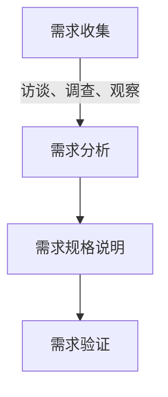
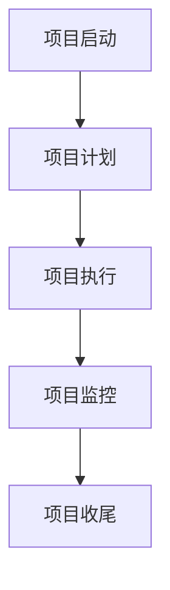
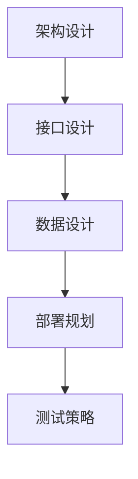

# 需求分析、项目管理、系统规划能力核心培养

## 1.背景介绍

### 1.1 项目管理的重要性

在当今快节奏的商业环境中，有效的项目管理对于确保项目的成功至关重要。无论是开发新产品、实施新系统还是推出新服务,项目管理都是将想法转化为现实的关键。良好的项目管理实践可以帮助组织优化资源利用、控制成本、缩短上市时间并提高客户满意度。

### 1.2 需求分析的作用

需求分析是项目管理过程中的一个关键步骤,旨在全面理解和记录客户和利益相关方的需求。通过需求分析,项目团队可以确保开发出符合预期的产品或系统,从而避免昂贵的返工和延期。准确的需求分析还有助于减少项目范围蔓延,控制项目风险。

### 1.3 系统规划的重要性

系统规划是将需求转化为可行的技术解决方案的过程。它涉及对系统架构、技术选型、集成策略和部署计划等方面进行全面考虑。有效的系统规划可以确保系统设计符合业务需求,并具有可扩展性、可维护性和性能等关键质量属性。

## 2.核心概念与联系

### 2.1 需求分析

需求分析是从利益相关方那里收集、理解和记录需求的过程。它包括以下关键概念:

- **需求收集**: 通过访谈、调查、观察等方式从客户和利益相关方处收集需求。
- **需求分析**: 对收集到的需求进行审查、整理和优先级排序,确保需求的完整性、一致性和可行性。
- **需求规格说明**: 将分析后的需求以标准格式记录下来,形成需求规格说明书。
- **需求验证**: 与利益相关方确认需求规格说明是否准确反映了他们的期望。

### 2.2 项目管理

项目管理是按照既定的目标、时间表、成本和质量要求,有计划地利用资源来实施项目的过程。它包括以下关键概念:

- **项目启动**: 确定项目目标、范围、里程碑和资源需求。
- **项目计划**: 制定项目计划,包括工作分解结构、进度计划、资源分配等。
- **项目执行**: 按照项目计划执行项目工作,包括任务分配、进度跟踪、风险管理等。
- **项目监控**: 持续监控项目进展,识别并解决问题和风险。
- **项目收尾**: 完成项目工作,进行项目验收并总结经验教训。

### 2.3 系统规划

系统规划是根据需求和项目约束,设计出满足预期目标的系统解决方案。它包括以下关键概念:

- **架构设计**: 确定系统的整体架构,包括模块划分、技术选型等。
- **接口设计**: 定义系统内部模块之间以及与外部系统的接口。
- **数据设计**: 设计系统所需的数据结构和数据库模式。
- **部署规划**: 制定系统的部署策略和运维计划。
- **测试策略**: 确定系统测试的方法和工具。

需求分析、项目管理和系统规划相互关联、相辅相成。需求分析为项目管理和系统规划提供了基础输入,项目管理确保项目按计划有序推进,而系统规划则将需求转化为可行的技术解决方案。

## 3.核心算法原理具体操作步骤

在需求分析、项目管理和系统规划领域,虽然没有典型的算法,但是有一些广泛采用的方法和最佳实践。以下是一些核心原理和具体操作步骤:

### 3.1 需求分析

#### 3.1.1 需求收集

1. **确定利益相关方**: 识别所有与项目相关的利益相关方,包括客户、用户、开发团队、管理层等。
2. **选择收集方法**: 根据项目情况选择合适的需求收集方法,如访谈、问卷调查、观察等。
3. **制定收集计划**: 制定详细的收集计划,包括时间安排、参与人员、收集范围等。
4. **执行收集活动**: 按照计划执行需求收集活动,记录所有收集到的需求。

#### 3.1.2 需求分析

1. **需求整理**: 对收集到的需求进行分类和整理,消除重复和矛盾的需求。
2. **需求优先级排序**: 根据业务价值、实现难度等因素,为需求设置优先级。
3. **需求可行性分析**: 评估需求的技术可行性、成本可行性和时间可行性。
4. **需求规格说明编写**: 根据标准模板,编写需求规格说明书。

#### 3.1.3 需求验证

1. **需求回顾会议**: 组织需求回顾会议,与利益相关方共同审阅需求规格说明。
2. **需求确认**: 获取利益相关方对需求规格说明的正式确认。
3. **需求变更管理**: 建立需求变更管理流程,以便于后续需求的追踪和控制。

### 3.2 项目管理

#### 3.2.1 项目启动

1. **确定项目目标**: 明确项目的商业目标和技术目标。
2. **确定项目范围**: 根据需求规格说明,界定项目的范围边界。
3. **制定里程碑计划**: 确定项目的关键里程碑和交付物。
4. **组建项目团队**: 根据项目需求,组建跨职能的项目团队。

#### 3.2.2 项目计划

1. **工作分解结构(WBS)**: 将项目工作按照可交付成果进行层次分解。
2. **任务估算**: 估算每个工作包的工作量和所需资源。
3. **进度计划**: 根据工作量估算和资源约束,制定项目进度计划。
4. **资源分配**: 根据进度计划,为每个工作包分配合适的资源。
5. **风险管理计划**: 识别项目风险,并制定风险应对策略。
6. **质量管理计划**: 确定质量标准和质量保证措施。

#### 3.2.3 项目执行

1. **任务分配**: 将工作包分配给相应的团队成员。
2. **进度跟踪**: 定期跟踪项目进度,识别偏差并采取纠正措施。
3. **风险监控**: 持续监控已识别的风险,并根据需要执行应对策略。
4. **变更控制**: 审批和实施经过批准的变更请求。
5. **沟通管理**: 确保项目信息在利益相关方之间有效流动。

#### 3.2.4 项目监控

1. **进度审查会议**: 定期召开进度审查会议,评估项目进展情况。
2. **绩效测量**: 跟踪和测量关键绩效指标,如进度、成本、质量等。
3. **纠正措施**: 根据绩效测量结果,采取适当的纠正措施。

#### 3.2.5 项目收尾

1. **验收测试**: 执行系统验收测试,确保交付物满足需求。
2. **项目交付**: 向客户正式交付项目成果。
3. **项目回顾**: 召开项目回顾会议,总结经验教训。
4. **项目档案**: 归档项目相关文档,为未来项目提供参考。

### 3.3 系统规划

#### 3.3.1 架构设计

1. **确定架构原则**: 根据项目需求和约束,确定系统架构设计的原则,如可扩展性、安全性等。
2. **模块划分**: 将系统功能划分为不同的模块,并确定模块之间的依赖关系。
3. **技术选型**: 选择合适的技术框架和工具,以支持系统架构。
4. **架构评审**: 与利益相关方和专家评审系统架构设计。

#### 3.3.2 接口设计

1. **模块接口定义**: 为每个模块定义与其他模块的接口,包括接口协议、数据格式等。
2. **外部系统集成**: 设计与外部系统集成的接口和数据交换机制。
3. **接口文档编写**: 编写详细的接口设计文档,供开发和测试团队参考。

#### 3.3.3 数据设计

1. **数据需求分析**: 分析系统的数据需求,包括数据类型、数据量、数据流等。
2. **数据模型设计**: 设计概念数据模型和逻辑数据模型。
3. **数据库设计**: 根据数据模型,设计物理数据库模式。
4. **数据安全策略**: 制定数据安全和访问控制策略。

#### 3.3.4 部署规划

1. **环境需求分析**: 分析系统的硬件、软件和网络环境需求。
2. **部署架构设计**: 设计系统的部署架构,包括负载均衡、高可用性等。
3. **部署流程设计**: 设计系统的部署流程,包括自动化脚本和回滚策略。
4. **运维计划制定**: 制定系统的运维计划,包括监控、备份、升级等。

#### 3.3.5 测试策略

1. **测试类型确定**: 确定需要执行的测试类型,如单元测试、集成测试、系统测试等。
2. **测试工具选择**: 选择合适的测试工具和框架。
3. **测试用例设计**: 根据需求和设计文档,设计测试用例。
4. **测试环境准备**: 准备测试所需的环境和数据。
5. **测试计划制定**: 制定详细的测试计划,包括测试范围、进度安排等。

通过遵循这些核心原理和具体操作步骤,项目团队可以有效地执行需求分析、项目管理和系统规划活动,从而提高项目的成功率和交付质量。

## 4.数学模型和公式详细讲解举例说明

虽然需求分析、项目管理和系统规划主要是实践性很强的活动,但也有一些数学模型和公式可以用于量化分析和优化决策。以下是一些常见的数学模型和公式:

### 4.1 工作量估算

在项目计划阶段,准确估算工作量是一项关键任务。常用的工作量估算模型包括:

1. **专家判断法**:通过咨询经验丰富的专家,根据他们的经验和直觉进行估算。

2. **类比估算法**:基于与当前项目类似的历史项目数据,进行工作量估算。

3. **参数模型**:使用统计模型,根据影响工作量的各种参数(如代码行数、功能点数等)进行估算。常用的参数模型有:

   - **构造成本模型(COCOMO)**:

     $$
     E = a_{b} \times \text{Size}^{b_{b}} \times \prod_{i=1}^{n} \text{EM}_{i}
     $$

     其中 $E$ 是工作量估计值,  $\text{Size}$ 是项目规模(如代码行数),  $a_{b}$ 和 $b_{b}$ 是基于项目类型的常量,  $\text{EM}_{i}$ 是影响因素(如团队经验、工具支持等)。

   - **功能点分析法**:根据系统的逻辑功能点数及复杂度进行估算。

4. **层次分解法**:将工作分解为更小的任务,分别估算每个任务的工作量,然后汇总得到总工作量。

### 4.2 进度计划

在制定项目进度计划时,常用的数学模型包括:

1. **关键路径法(CPM)**:用于识别项目关键路径,确保按时完成。

   - 每个活动的最早开始时间 $\text{ES}_{i}$ 和最晚开始时间 $\text{LS}_{i}$ 可以通过以下公式计算:

     $$
     \begin{aligned}
     \text{ES}_{i} &=