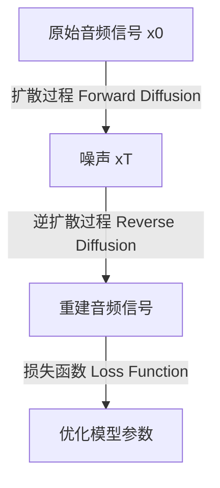

# 音频扩散Audio Diffusion原理与代码实例讲解

## 1.背景介绍

### 1.1 什么是音频扩散？

音频扩散(Audio Diffusion)是一种新兴的基于深度学习的生成模型,可以从噪声中生成高质量的音频数据。它借鉴了视觉领域中广受欢迎的扩散模型(Diffusion Models)的思想,将其应用于音频领域,实现了对音乐、人声、环境声音等多种音频信号的生成和处理。

### 1.2 传统音频生成方法的局限性

在音频扩散模型出现之前,音频生成一直是一个具有挑战性的任务。传统的方法包括小波变换(Wavelet Transform)、自回归模型(Autoregressive Models)和生成对抗网络(Generative Adversarial Networks, GANs)等。然而,这些方法存在一些局限性:

- 小波变换等传统信号处理方法缺乏对复杂音频结构的建模能力。
- 自回归模型在生成长序列时容易出现累积误差,导致音质下降。
- GANs训练不稳定,并且难以生成高保真度的音频。

### 1.3 音频扩散的优势

相比之下,音频扩散模型具有以下优势:

- 能够生成高质量、逼真的音频数据。
- 可以捕捉音频数据的复杂结构和细节。
- 训练过程稳定,不易出现模式崩溃(Mode Collapse)等问题。
- 具有较强的可解释性,可以理解生成过程中的每一步。

基于这些优势,音频扩散模型在音乐生成、语音合成、音频增强等领域展现出巨大的应用潜力。

## 2.核心概念与联系

### 2.1 扩散过程(Forward Diffusion Process)

音频扩散模型的核心思想是将一个干净的音频信号通过逐步添加高斯噪声,最终将其"扩散"为纯噪声。这个过程被称为扩散过程(Forward Diffusion Process)。

扩散过程可以用如下公式表示:

$$
x_t = \sqrt{\overline{\alpha_t}}x_0 + \sqrt{1 - \overline{\alpha_t}}\epsilon_\theta, \quad \text{where} \quad \epsilon_\theta \sim \mathcal{N}(0, I)
$$

其中:

- $x_t$是扩散过程的第$t$步输出
- $x_0$是原始干净的音频信号
- $\epsilon_\theta$是从标准高斯分布采样的噪声
- $\alpha_t$是一个预定义的扩散时间表,控制每一步添加的噪声量

在扩散过程的最后一步,原始音频信号$x_0$被完全"扩散"为纯噪声$x_T$。

### 2.2 逆扩散过程(Reverse Diffusion Process)

逆扩散过程(Reverse Diffusion Process)是音频扩散模型的核心部分,旨在从纯噪声$x_T$中重建出原始的音频信号$x_0$。这个过程可以用下式表示:

$$
x_{t-1} = \frac{1}{\sqrt{\alpha_t}}\left(x_t - \frac{1 - \alpha_t}{\sqrt{1 - \overline{\alpha_t}}}\epsilon_\theta(x_t, t)\right) + \sigma_t\epsilon_\theta
$$

其中:

- $\epsilon_\theta(x_t, t)$是一个神经网络,用于预测当前时间步$t$的噪声分量
- $\sigma_t$是一个预定义的方差参数,控制每一步添加的新噪声量

通过从$x_T$开始,逐步去除噪声并添加一些新的噪声,最终可以得到重建的音频信号$x_0$。

### 2.3 扩散模型与生成模型的联系

音频扩散模型实际上是一种特殊的生成模型,其生成过程可以看作是对原始数据分布的采样。具体来说:

- 扩散过程定义了从原始数据分布$p(x_0)$到噪声先验分布$p(x_T)$的映射$q(x_T|x_0)$。
- 逆扩散过程则定义了从噪声先验分布$p(x_T)$到原始数据分布$p(x_0)$的映射$p_\theta(x_0|x_T)$。

因此,通过学习逆扩散过程,音频扩散模型实现了对原始音频数据分布$p(x_0)$的建模和采样。

### 2.4 Mermaid流程图

上图展示了音频扩散模型的基本工作流程:

1. 扩散过程将原始音频信号$x_0$逐步"扩散"为噪声$x_T$。
2. 逆扩散过程则从噪声$x_T$出发,尝试重建原始音频信号。
3. 通过最小化重建音频与原始音频之间的损失函数,优化模型参数。

## 3.核心算法原理具体操作步骤

### 3.1 扩散过程

扩散过程的具体操作步骤如下:

1. 初始化时间步长$T$和扩散时间表$\{\alpha_t\}_{t=1}^T$。
2. 从原始音频数据集$\{x_0^{(i)}\}$中采样一个音频样本$x_0$。
3. 对于时间步$t=1,2,...,T$:
    a. 从标准高斯分布$\mathcal{N}(0, I)$中采样噪声$\epsilon_\theta$。
    b. 根据公式$x_t = \sqrt{\overline{\alpha_t}}x_{t-1} + \sqrt{1 - \overline{\alpha_t}}\epsilon_\theta$计算$x_t$。
4. 最终得到纯噪声$x_T$。

通过上述步骤,我们将原始音频信号$x_0$逐步"扩散"为噪声$x_T$。

### 3.2 逆扩散过程

逆扩散过程的具体操作步骤如下:

1. 初始化时间步长$T$和扩散时间表$\{\alpha_t\}_{t=1}^T$。
2. 从纯噪声$x_T$开始。
3. 对于时间步$t=T, T-1, ..., 1$:
    a. 使用神经网络$\epsilon_\theta(x_t, t)$预测当前时间步的噪声分量。
    b. 根据公式$x_{t-1} = \frac{1}{\sqrt{\alpha_t}}\left(x_t - \frac{1 - \alpha_t}{\sqrt{1 - \overline{\alpha_t}}}\epsilon_\theta(x_t, t)\right) + \sigma_t\epsilon_\theta$计算$x_{t-1}$,其中$\epsilon_\theta$是从标准高斯分布$\mathcal{N}(0, I)$采样的新噪声。
4. 最终得到重建的音频信号$x_0$。

通过上述步骤,我们从纯噪声$x_T$出发,逐步去除噪声并添加一些新的噪声,最终得到重建的音频信号$x_0$。

### 3.3 训练过程

训练音频扩散模型的目标是最小化重建音频信号$x_0$与原始音频信号$x_0$之间的损失函数。常用的损失函数包括均方误差(Mean Squared Error, MSE)和负对数似然(Negative Log-Likelihood, NLL)等。

具体的训练过程如下:

1. 初始化神经网络$\epsilon_\theta$的参数。
2. 对于每个训练批次:
    a. 从原始音频数据集$\{x_0^{(i)}\}$中采样一批音频样本$\{x_0^{(i)}\}$。
    b. 对每个样本$x_0^{(i)}$执行扩散过程,得到对应的噪声$x_T^{(i)}$。
    c. 对每个噪声$x_T^{(i)}$执行逆扩散过程,得到重建的音频信号$\hat{x}_0^{(i)}$。
    d. 计算重建音频信号与原始音频信号之间的损失函数$\mathcal{L}(\hat{x}_0^{(i)}, x_0^{(i)})$。
    e. 计算批次损失函数$\mathcal{L}_\text{batch} = \frac{1}{N}\sum_{i=1}^N \mathcal{L}(\hat{x}_0^{(i)}, x_0^{(i)})$,其中$N$是批次大小。
    f. 通过反向传播更新神经网络$\epsilon_\theta$的参数,最小化批次损失函数$\mathcal{L}_\text{batch}$。
3. 重复步骤2,直到模型收敛或达到预定的训练轮数。

通过上述训练过程,我们可以学习到一个能够从噪声中重建出高质量音频信号的音频扩散模型。

## 4.数学模型和公式详细讲解举例说明

在本节中,我们将详细讲解音频扩散模型中涉及的数学模型和公式,并给出具体的例子加深理解。

### 4.1 扩散过程公式

扩散过程的公式如下:

$$
x_t = \sqrt{\overline{\alpha_t}}x_0 + \sqrt{1 - \overline{\alpha_t}}\epsilon_\theta, \quad \text{where} \quad \epsilon_\theta \sim \mathcal{N}(0, I)
$$

让我们拆解并解释这个公式:

- $x_t$是扩散过程的第$t$步输出,是一个与原始音频信号$x_0$相同维度的向量。
- $\alpha_t$是一个预定义的扩散时间表,控制每一步添加的噪声量。$\overline{\alpha_t} = \prod_{i=1}^t \alpha_i$表示从时间步1到$t$的噪声保留率。
- $\sqrt{\overline{\alpha_t}}x_0$表示保留了原始音频信号$x_0$的一部分。
- $\epsilon_\theta$是从标准高斯分布$\mathcal{N}(0, I)$采样的噪声向量,其维度与$x_0$相同。
- $\sqrt{1 - \overline{\alpha_t}}\epsilon_\theta$表示添加了一定量的高斯噪声。

举个例子,假设我们有一个单声道音频信号$x_0 = [0.2, -0.1, 0.3, ...]$,扩散时间表为$\alpha_1 = 0.9, \alpha_2 = 0.8, \alpha_3 = 0.7$,那么在第3步扩散过程中:

- $\overline{\alpha_3} = 0.9 \times 0.8 \times 0.7 = 0.504$
- $\sqrt{\overline{\alpha_3}} \approx 0.71$
- $\sqrt{1 - \overline{\alpha_3}} \approx 0.71$
- 假设采样的噪声向量为$\epsilon_\theta = [0.1, -0.2, 0.05, ...]$
- 则第3步的输出为$x_3 \approx 0.71 \times [0.2, -0.1, 0.3, ...] + 0.71 \times [0.1, -0.2, 0.05, ...] = [0.21, -0.24, 0.335, ...]$

通过上述步骤,原始音频信号$x_0$被逐步"扩散"为噪声$x_T$。

### 4.2 逆扩散过程公式

逆扩散过程的公式如下:

$$
x_{t-1} = \frac{1}{\sqrt{\alpha_t}}\left(x_t - \frac{1 - \alpha_t}{\sqrt{1 - \overline{\alpha_t}}}\epsilon_\theta(x_t, t)\right) + \sigma_t\epsilon_\theta
$$

让我们拆解并解释这个公式:

- $x_{t-1}$是逆扩散过程的第$t-1$步输出,也是我们要重建的音频信号。
- $\alpha_t$和$\overline{\alpha_t}$与扩散过程中的定义相同。
- $\epsilon_\theta(x_t, t)$是一个神经网络,输入为当前时间步的噪声$x_t$和时间步$t$,输出预测的噪声分量。
- $\frac{1}{\sqrt{\alpha_t}}\left(x_t - \frac{1 - \alpha_t}{\sqrt{1 - \overline{\alpha_t}}}\epsilon_\theta(x_t, t)\right)$表示从$x_t$中去除预测的噪声分量。
- $\sigma_t$是一个预定义的方差参数,控制每一步添加的新噪声量。
- $