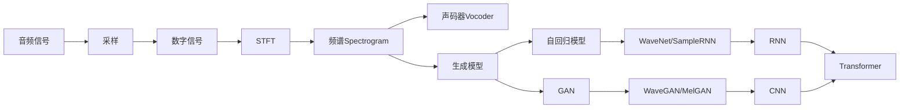

# 音频生成(Audio Generation) - 原理与代码实例讲解

## 1.背景介绍

近年来,人工智能技术的飞速发展为音频生成领域带来了革命性的变革。传统的音频生成方法主要依赖于对录制的音频样本进行拼接、变调等操作,难以生成高质量、富有表现力的音频。而基于深度学习的音频生成技术,通过从海量音频数据中学习音频的内在规律和表征,可以生成逼真度极高、富有韵律感的各类音频,为音乐创作、语音合成、游戏音效等领域提供了强大的技术支持。

本文将重点介绍音频生成的核心原理、主流算法、数学模型,并通过代码实例讲解如何使用深度学习框架实现音频生成模型。同时,也会探讨音频生成技术在实际场景中的应用,推荐相关工具与学习资源,展望其未来的发展趋势与挑战。

## 2.核心概念与联系

要理解音频生成的原理,首先需要了解以下几个核心概念:

### 2.1 音频的数字化表示

音频信号本质上是连续的模拟信号,要对其进行数字化处理,需要将其转换为离散的数字信号。这个过程称为采样(Sampling),采样频率(Sample Rate)决定了音频的质量和保真度。常见的采样频率有44.1kHz(CD音质)、16kHz(语音)等。

### 2.2 频谱与STFT

频谱(Spectrogram)是表示音频信号频率成分随时间变化的二维图像。利用短时傅里叶变换(STFT)可以将音频信号转换到时频域,得到频谱图。频谱揭示了音频的内在结构特征,是音频分析与处理的重要工具。

### 2.3 声码器(Vocoder)

声码器用于分析和合成语音信号,可以从语音中提取特征参数(如基频、频谱包络等),然后利用这些参数重建出语音。传统的声码器如WORLD、STRAIGHT,而深度学习声码器如WaveNet、WaveRNN能生成更自然流畅的语音。

### 2.4 生成模型

音频生成任务的本质是学习音频数据的概率分布,并从中随机采样生成新的音频。目前主要有两大类生成模型:

- 自回归模型:通过对音频序列的概率分布进行建模,根据前一时刻的输出预测下一时刻的输出,代表工作如WaveNet、SampleRNN等。
- GAN(生成对抗网络):通过生成器和判别器的博弈学习,生成器试图生成以假乱真的样本欺骗判别器,代表工作如WaveGAN、MelGAN等。

### 2.5 神经网络结构

常用于音频生成任务的神经网络结构包括:

- CNN:利用卷积提取局部特征,WaveGAN等基于其构建。  
- RNN:适合对序列数据建模,WaveRNN、SampleRNN等使用其变体GRU、LSTM等。
- 自注意力机制:通过Attention学习输入序列不同位置之间的关联,Transformer TTS采用其进行并行化生成。

下图展示了这些核心概念之间的联系:



## 3.核心算法原理具体操作步骤

### 3.1 WaveNet

WaveNet是DeepMind在2016年提出的一种基于自回归卷积神经网络的原始音频生成模型。其主要特点是:

1. 采用因果卷积(Causal Convolution)和扩张卷积(Dilated Convolution),可以建模长程依赖。
2. 使用门控激活单元(Gated Activation Units),增强网络容量。
3. 输出层使用softmax对下一时刻的音频采样点概率进行建模。
4. 损失函数为交叉熵。

WaveNet的生成步骤如下:

1. 输入音频序列 $x = {x_1, ..., x_T}$,目标是最大化其概率分布 $p(x)$。
2. 因果卷积将 $p(x)$ 分解为一系列条件概率的乘积: $p(x) = \prod_{t=1}^{T} p(x_t | x_1, ..., x_{t-1})$
3. 扩张卷积的感受野随层数指数级增长,可以捕捉长程依赖。
4. 门控激活单元引入了sigmoid门,对卷积输出进行调制。
5. 训练时最小化交叉熵损失。
6. 推理时,根据前一时刻的输出采样生成下一时刻的音频。

### 3.2 WaveGAN

WaveGAN是2018年提出的一种基于GAN的原始音频生成方法。其主要思路是:

1. 生成器G将随机噪声向量 $z$ 映射为音频序列 $G(z)$。
2. 判别器D判断输入音频是真实样本还是生成样本。
3. 生成器和判别器通过对抗训练不断博弈优化,最终生成器可生成逼真的音频样本。

WaveGAN的训练过程如下:

1. 初始化生成器G和判别器D的参数。
2. 从先验分布(高斯分布)中采样随机噪声 $z$。
3. 生成器G将噪声 $z$ 映射为生成音频 $\tilde{x} = G(z)$。 
4. 判别器D对真实音频 $x$ 和生成音频 $\tilde{x}$ 进行二分类。
5. 更新生成器G和判别器D的参数,其中G的目标是最大化 $D(G(z))$,D的目标是最大化 $logD(x) + log(1-D(G(z)))$。
6. 重复步骤2-5,直到模型收敛。

### 3.3 Tacotron

Tacotron是Google在2017年提出的一种端到端语音合成系统。其将文本序列直接映射为频谱图,再通过声码器转换为波形,实现从文本到语音的直接生成。

Tacotron的主要组成模块包括:

1. 编码器:将输入的字符序列编码为隐向量序列。
2. 注意力机制:在解码时,通过注意力对齐机制,将编码器输出的隐向量与解码器状态动态对齐。
3. 解码器:根据编码器输出和注意力权重,自回归地生成频谱图帧。
4. Post-Net:对解码器输出的频谱图进行细化,提高质量。

Tacotron的推理过程如下:

1. 输入文本序列 $y = {y_1, ..., y_N}$,编码器将其编码为隐向量序列 $h = {h_1, ..., h_N}$。
2. 解码器根据 $h$ 和注意力机制,预测下一帧频谱 $\hat{s}_t = Decoder(s_{t-1}, c_t)$,其中 $c_t$ 是基于注意力权重对 $h$ 的加权求和。
3. Post-Net对 $\hat{s}_t$ 进行矫正,得到最终的预测频谱 $s_t$。
4. 不断重复步骤2-3,直到解码完整个频谱序列。
5. 将预测的频谱送入声码器,合成出语音波形。

## 4.数学模型和公式详细讲解举例说明

### 4.1 WaveNet的因果卷积与扩张卷积

WaveNet的核心是因果卷积和扩张卷积。因果卷积保证了模型在预测第 $t$ 个音频采样点时,只能看到前 $t-1$ 个采样点,即:

$$
y_t = f(x_1, ..., x_{t-1}) = f(x_{<t})
$$

其中 $f$ 表示卷积操作。

扩张卷积在因果卷积的基础上引入了扩张因子 $d$,对卷积的输入序列进行跳跃采样,公式为:

$$
y_t = \sum_{i=0}^{k-1} f(i) \cdot x_{t-d \cdot i}
$$

其中 $k$ 为卷积核大小。扩张因子 $d$ 指数级增长($1,2,4,8...$),使感受野呈指数级扩张,能够建模长程依赖。

### 4.2 WaveNet的门控激活单元

WaveNet的每一层卷积之后,使用如下门控激活单元对特征进行处理:

$$
z = tanh(W_{f,k} \ast x) \odot \sigma(W_{g,k} \ast x) 
$$

其中 $\ast$ 表示卷积操作,$\odot$ 表示逐元素相乘,  $W_{f,k}$ 和 $W_{g,k}$ 分别为filter和gate的卷积核参数。门控单元通过sigmoid门对卷积输出进行调制,增强了网络的表达能力。

### 4.3 GAN的损失函数

GAN的生成器和判别器通过最小最大博弈进行优化,判别器D的目标是最大化如下损失函数:

$$
\mathcal{L}_D = \mathbb{E}_{x \sim p_{data}(x)} [logD(x)] + \mathbb{E}_{z \sim p_z(z)} [log(1-D(G(z)))]
$$

其中 $p_{data}$ 为真实数据分布, $p_z$ 为先验噪声分布。

生成器G的目标是最小化如下损失函数:

$$
\mathcal{L}_G = \mathbb{E}_{z \sim p_z(z)} [log(1-D(G(z)))]
$$

实际应用中,常用如下损失函数替代G的损失,以避免梯度消失:

$$
\mathcal{L}_G = \mathbb{E}_{z \sim p_z(z)} [-logD(G(z))]
$$

### 4.4 Tacotron的注意力机制

Tacotron在解码时,利用注意力机制将解码器状态 $s_t$ 与编码器输出序列 $h$ 对齐。其注意力权重 $\alpha_t$ 的计算公式为:

$$
e_{t,i} = w^T tanh(W_s s_t + W_h h_i + b) \\
\alpha_{t,i} = \frac{exp(e_{t,i})}{\sum_{j=1}^{N} exp(e_{t,j})}
$$

其中 $w, W_s, W_h, b$ 为注意力机制的可学习参数。

基于注意力权重 $\alpha_t$,可以计算 $t$ 时刻的上下文向量 $c_t$:

$$
c_t = \sum_{i=1}^{N} \alpha_{t,i} h_i
$$

解码器根据 $c_t$ 和 $s_{t-1}$ 预测 $t$ 时刻的输出频谱帧。

## 5.项目实践：代码实例和详细解释说明

下面以PyTorch为例,给出WaveNet、WaveGAN和Tacotron的核心代码实现。

### 5.1 WaveNet

WaveNet的因果卷积与扩张卷积实现:

```python
class CausalConv1d(nn.Module):
    def __init__(self, in_channels, out_channels, kernel_size, dilation=1):
        super(CausalConv1d, self).__init__()
        self.padding = (kernel_size - 1) * dilation
        self.conv = nn.Conv1d(in_channels, out_channels, kernel_size, 
                              padding=self.padding, dilation=dilation)
        
    def forward(self, x):
        x = self.conv(x)
        return x[:, :, :-self.padding]
        
class ResidualBlock(nn.Module):
    def __init__(self, res_channels, skip_channels, kernel_size, dilation):
        super(ResidualBlock, self).__init__()
        self.filter_conv = CausalConv1d(res_channels, res_channels, kernel_size, dilation)
        self.gate_conv = CausalConv1d(res_channels, res_channels, kernel_size, dilation)
        self.skip_conv = nn.Conv1d(res_channels, skip_channels, 1)
        self.res_conv = nn.Conv1d(res_channels, res_channels, 1)
        
    def forward(self, x):
        filter = torch.tanh(self.filter_conv(x))
        gate = torch.sigmoid(self.gate_conv(x))
        x = filter * gate
        s = self.skip_conv(x)
        x = self.res_conv(x)
        x = x + s
        return x, s
```

上述代码实现了因果卷积(`