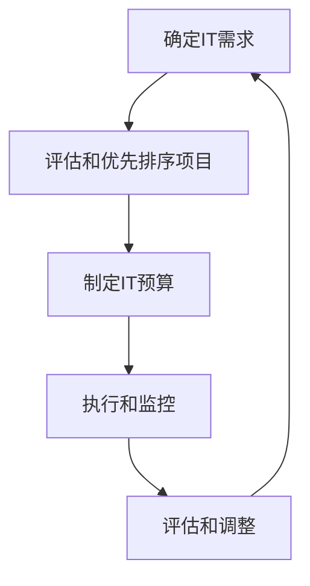
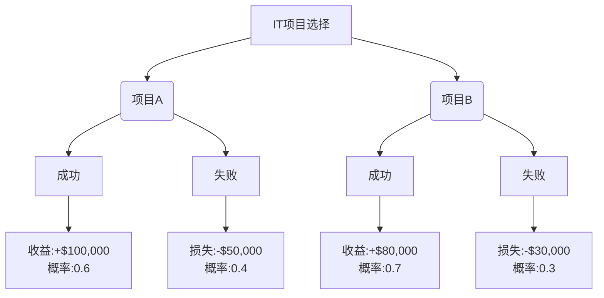

# 预算管理：制定并管理IT预算，确保资源得到高效分配，使IT投资为公司带来价值

## 1.背景介绍

### 1.1 IT预算的重要性

在当今快节奏的商业环境中，信息技术(IT)已经成为推动企业发展和保持竞争优势的关键力量。有效的IT预算管理对于确保公司的IT投资获得最大回报至关重要。适当的IT预算不仅可以支持企业的日常运营,还能推动创新,提高效率,并为公司带来长期的竞争优势。

### 1.2 IT预算管理的挑战

然而,制定和管理IT预算并非一蹴而就。IT领域的快速发展和不断变化的技术趋势,使得预测未来需求和成本变得更加困难。此外,IT项目通常涉及多个部门和利益相关方,需要协调各方的需求和期望。同时,有限的资源和日益增长的IT支出,也给预算管理带来了压力。

### 1.3 本文概述

本文将探讨IT预算管理的重要性,阐述其核心概念和最佳实践。我们将介绍制定IT预算的步骤,如何对IT投资进行优先级排序,以及如何跟踪和控制IT支出。此外,本文还将分享实用的技巧和工具,帮助读者更好地管理IT预算,从而最大限度地发挥IT投资的价值。

## 2.核心概念与联系

### 2.1 IT投资组合管理

IT投资组合管理是一种战略方法,旨在优化公司的IT投资,确保这些投资与公司的整体目标保持一致。它包括识别、评估、优先排序和监控IT项目和资源,以实现最大的商业价值。

在制定IT预算时,投资组合管理原则可以帮助公司确定哪些项目和资源应该获得资金支持。通过将IT投资与公司的战略目标相关联,公司可以确保资金被分配到最重要和最有价值的领域。

### 2.2 IT治理

IT治理是一种框架,用于确保IT投资和决策与公司的整体战略保持一致。它包括制定政策、程序和责任,以确保IT资源得到有效管理和监控。

在IT预算管理中,IT治理可以提供一个结构化的过程,用于评估和批准IT支出。它还可以确保IT决策考虑到了所有相关利益相关方的需求,并符合公司的风险管理和合规性要求。

### 2.3 IT财务管理

IT财务管理是一种管理实践,旨在优化IT成本和投资回报。它包括成本核算、预测、分析和报告,以及确保IT支出符合预算限制。

在IT预算管理中,IT财务管理原则可以帮助公司更好地了解IT成本的来源,并识别节省成本的机会。通过准确跟踪和报告IT支出,公司可以确保资金得到有效利用,并评估投资回报情况。

## 3.核心算法原理具体操作步骤

制定和管理IT预算是一个循环过程,包括以下关键步骤:



### 3.1 确定IT需求

第一步是确定公司的IT需求。这可能来自于以下几个方面:

1. **业务需求**: 新的业务计划、产品或服务可能需要相应的IT支持。
2. **技术需求**: 现有系统或基础设施的升级、维护或替换。
3. **合规性和安全性需求**: 遵守法规或加强安全措施所需的IT投资。
4. **创新需求**: 探索新技术以提高效率或获得竞争优势。

收集和分析这些需求,可以帮助公司确定IT投资的优先级。

### 3.2 评估和优先排序项目

在确定IT需求后,下一步是评估和优先排序潜在的IT项目。这通常涉及以下步骤:

1. **成本估算**: 评估每个项目的预期成本,包括一次性和持续成本。
2. **风险评估**: 识别和评估每个项目的潜在风险,如技术风险、供应商风险和执行风险。
3. **价值评估**: 评估每个项目对公司的潜在价值和回报,包括有形和无形的好处。
4. **优先排序**: 根据成本、风险、价值和战略重要性,对项目进行优先排序。

这个过程可以确保有限的资源被分配到最重要和最有价值的项目上。

### 3.3 制定IT预算

根据优先排序的项目列表,下一步是制定IT预算。这通常包括以下步骤:

1. **预测支出**: 根据项目成本估算和历史数据,预测未来一段时间内的IT支出。
2. **分配资金**: 根据公司的整体财务状况和战略目标,为优先项目分配适当的资金。
3. **建立预算控制**: 制定政策和程序,以确保IT支出符合预算限制。
4. **获取批准**: 将拟议的IT预算提交给相关利益相关方和决策者进行审查和批准。

制定IT预算需要平衡各种需求和限制,以确保资金得到有效分配。

### 3.4 执行和监控

一旦IT预算获得批准,下一步是执行和监控。这包括以下步骤:

1. **项目执行**: 根据计划和预算执行已批准的IT项目。
2. **成本跟踪**: 密切监控实际支出,并与预算进行比较。
3. **绩效监控**: 跟踪项目进度和交付情况,以确保它们按计划进行。
4. **风险缓解**: 识别和缓解任何潜在的风险或问题。

定期监控和报告有助于及时发现任何偏差,并采取纠正措施。

### 3.5 评估和调整

最后一步是评估IT预算的执行情况,并根据需要进行调整。这包括以下步骤:

1. **回顾绩效**: 评估每个项目的实际成本、交付情况和价值。
2. **识别改进领域**: 根据评估结果,确定需要改进的领域。
3. **调整预算**: 根据新的需求或优先事项,调整未来的IT预算。
4. **实施改进措施**: 采取行动来解决任何问题或缺陷,并提高未来的预算管理效率。

这个循环过程有助于确保IT预算持续符合公司的需求,并为公司带来最大的价值。

## 4.数学模型和公式详细讲解举例说明

在IT预算管理中,有几种常用的数学模型和公式可以帮助进行成本估算、优先排序和决策。

### 4.1 总拥有成本 (TCO)

总拥有成本(TCO)是一种计算IT资产在整个生命周期内的总体成本的方法。它包括了购买成本、实施成本、运营成本、维护成本和最终退役成本。TCO公式如下:

$$TCO = C_p + C_i + \sum_{t=1}^{n} \frac{C_o(t) + C_m(t)}{(1+r)^t} + C_d$$

其中:
- $C_p$ 是购买成本
- $C_i$ 是实施成本
- $C_o(t)$ 是第 $t$ 年的运营成本
- $C_m(t)$ 是第 $t$ 年的维护成本
- $r$ 是折现率
- $n$ 是资产的使用年限
- $C_d$ 是退役成本

通过计算TCO,公司可以更准确地估算IT投资的真实成本,并将其与预期收益进行比较。这有助于做出更明智的决策,并优化资源分配。

### 4.2 投资回报率 (IRR)

投资回报率(IRR)是一种评估项目或投资的财务可行性的方法。它计算了使净现值等于零的折现率,代表了项目的内部收益率。IRR公式如下:

$$0 = -C_0 + \sum_{t=1}^{n} \frac{CF_t}{(1+IRR)^t}$$

其中:
- $C_0$ 是初始投资成本
- $CF_t$ 是第 $t$ 年的现金流
- $n$ 是项目的持续年限

通常,如果IRR高于公司的资金成本或要求的最低回报率,则该项目被视为可接受的投资。IRR可以帮助公司比较不同IT项目的潜在回报,并优先考虑具有更高回报的项目。

### 4.3 决策树分析

决策树分析是一种用于评估决策替代方案的图形工具。它可视化了每个决策的潜在结果和相关概率,有助于识别最佳选择。

在IT预算管理中,决策树分析可用于评估不同IT投资选择的成本、风险和收益。通过建立决策树模型,公司可以比较每个选择的预期值,并选择具有最高预期价值的选择。

以下是一个简单的决策树示例,用于评估两个IT项目的选择:



在这个示例中,项目A的预期值为:
$0.6 \times 100,000 + 0.4 \times (-50,000) = 30,000$

而项目B的预期值为:
$0.7 \times 80,000 + 0.3 \times (-30,000) = 41,000$

因此,根据预期值,项目B可能是更好的选择。但是,决策也需要考虑其他因素,如风险偏好和战略重要性。

通过使用这些数学模型和公式,公司可以更好地估算成本、评估回报,并做出明智的IT投资决策。

## 5.项目实践:代码实例和详细解释说明

为了更好地理解IT预算管理的实践,我们将探讨一个Python项目的示例。该项目旨在帮助公司估算IT项目的总拥有成本(TCO)并进行比较。

### 5.1 项目概述

该项目包含以下主要组件:

1. **项目数据**: 一个CSV文件,包含多个IT项目的详细信息,如购买成本、实施成本、运营成本、维护成本、使用年限和折现率。
2. **TCO计算器**: 一个Python函数,根据项目数据计算每个项目的TCO。
3. **项目比较器**: 一个Python函数,比较多个项目的TCO并输出排名结果。
4. **主程序**: 一个Python脚本,加载项目数据、计算TCO并进行比较。

### 5.2 代码实现

#### 5.2.1 加载项目数据

首先,我们需要从CSV文件中加载项目数据。以下是一个示例函数:

```python
import csv

def load_project_data(file_path):
    projects = []
    with open(file_path, 'r') as file:
        reader = csv.DictReader(file)
        for row in reader:
            project = {
                'name': row['Name'],
                'purchase_cost': float(row['Purchase Cost']),
                'implementation_cost': float(row['Implementation Cost']),
                'operating_cost': float(row['Operating Cost']),
                'maintenance_cost': float(row['Maintenance Cost']),
                'lifetime': int(row['Lifetime (years)']),
                'discount_rate': float(row['Discount Rate'])
            }
            projects.append(project)
    return projects
```

这个函数使用Python的`csv`模块从CSV文件中读取数据,并将每个项目的详细信息存储在一个字典中。所有项目字典被添加到一个列表中,并返回给调用者。

#### 5.2.2 计算TCO

接下来,我们实现一个函数来计算每个项目的TCO。这个函数将使用前面介绍的TCO公式:

```python
def calculate_tco(project):
    purchase_cost = project['purchase_cost']
    implementation_cost = project['implementation_cost']
    operating_cost = project['operating_cost']
    maintenance_cost = project['maintenance_cost']
    lifetime = project['lifetime']
    discount_rate = project['discount_rate']

    tco = purchase_cost + implementation_cost
    for year in range(1, lifetime + 1):
        discount_factor = 1 / (1 + discount_rate) ** year
        tco += (operating_cost + maintenance_cost) * discount