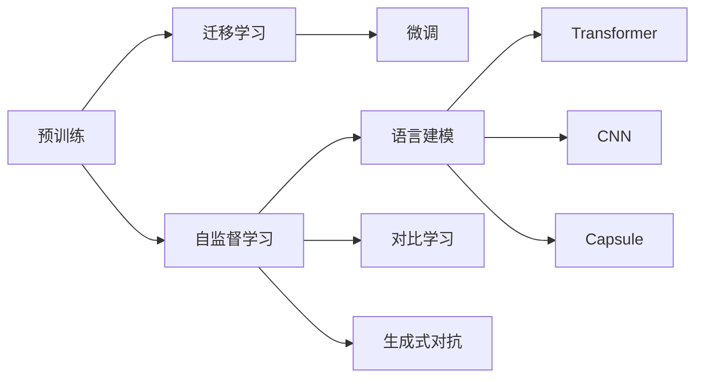

# 预训练 (Pre-training)

## 1. 背景介绍
### 1.1 预训练的定义与起源
预训练(Pre-training)是指在特定领域的大规模未标注数据上，预先训练一个通用的模型，然后将这个模型应用到下游的具体任务中，通过微调(Fine-tuning)来提升模型性能的一种迁移学习范式。预训练最早起源于计算机视觉和自然语言处理领域，如word2vec、ELMo等经典的预训练语言模型。

### 1.2 预训练的意义
预训练的意义在于，通过在大规模数据上学习通用的特征表示，模型能够获得强大的先验知识，从而能够更好地适应下游任务。这种"先学通用知识，再学具体任务"的思路，与人类的学习方式非常相似，体现了从"数据"到"知识"，再到"智能"的认知过程。

### 1.3 预训练的发展历程
预训练技术的发展大致经历了以下几个阶段：

1. 早期的浅层语言模型，如word2vec、GloVe等。
2. 基于RNN的深层语言模型，如ELMo。 
3. 基于Transformer的预训练模型，如GPT、BERT等。
4. 更大规模、更多模态的预训练模型，如GPT-3、CLIP等。

随着模型架构和训练技术的发展，预训练模型的性能不断提升，应用领域也越来越广泛。

## 2. 核心概念与联系
### 2.1 迁移学习
预训练是迁移学习的一种重要范式。迁移学习的目标是将从源任务或源域学到的知识，迁移到不同但相关的目标任务或目标域中，从而提升目标任务的性能，特别是在目标任务的训练数据不足的情况下。

### 2.2 自监督学习
预训练通常采用自监督学习的方式进行。自监督学习是一种不需要人工标注数据的学习方式，它通过对数据本身设计一些预测任务，让模型在完成这些任务的过程中学习到有用的特征表示。常见的自监督学习任务包括：

- 语言模型：预测下一个词或下一个句子
- 掩码语言模型：随机掩盖部分词，预测被掩盖的词
- 对比学习：将同一个样本的不同视角编码为相似的向量
- 生成式对抗网络：生成与真实样本无法区分的合成样本

### 2.3 微调
微调是指在预训练模型的基础上，针对具体的下游任务，用少量的标注数据对模型进行二次训练，使其适应任务的需求。通常只需要训练模型的最后一层或几层，而保持其他层的参数不变。微调可以显著提升模型在下游任务上的性能，同时也大大减少了所需的训练数据和训练时间。

### 2.4 模型架构
预训练模型的架构设计是其性能的关键。目前主流的预训练模型主要采用了以下架构：

- Transformer：基于自注意力机制的序列到序列模型，能够建模长距离依赖，在NLP任务上取得了显著的性能提升。代表模型有GPT、BERT、XLNet等。
  
- CNN：卷积神经网络在计算机视觉任务上表现出色，一些工作尝试将CNN用于语言模型的预训练，如ConvBERT。

- Capsule Network：胶囊网络通过动态路由算法对不同层次的特征进行编码，能够建模整体与部分的关系。一些研究将其用于语言模型的预训练，如CapsuleNet。

### 联系与区别



预训练与迁移学习、自监督学习密切相关，通过自监督的方式在大规模数据上学习通用的特征表示，然后通过微调将知识迁移到下游任务中。Transformer、CNN、Capsule等模型架构常用于预训练模型的设计。

## 3. 核心算法原理具体操作步骤
### 3.1 基于语言模型的预训练
以BERT为例，其预训练过程主要包括以下步骤：

1. 构建大规模的无标注文本语料库，如Wikipedia、BookCorpus等。
2. 对文本进行预处理，如分词、转小写、添加特殊标记等。
3. 随机掩盖一定比例(如15%)的词，用`[MASK]`标记替换。
4. 将文本切分为固定长度(如512)的序列，以`[CLS]`和`[SEP]`标记开头和结尾。
5. 将序列输入BERT模型，通过Transformer编码器建模上下文信息。
6. 在`[MASK]`位置上预测被掩盖的词，以交叉熵损失函数优化模型参数。
7. 同时进行下一句预测任务，即判断两个句子是否前后相邻，以二元交叉熵损失函数优化。
8. 在大规模语料库上训练模型，直到收敛。

训练得到的BERT模型可以用于各种下游的NLP任务，如文本分类、命名实体识别、问答等，通过微调来适应具体任务。

### 3.2 基于对比学习的预训练
以SimCLR为例，其预训练过程主要包括以下步骤：

1. 对每个样本进行两次随机数据增强，得到同一样本的两个不同视角。
2. 将两个视角的样本分别输入编码器，得到它们的特征表示。
3. 通过一个小的投影头(如MLP)将特征映射到对比学习的空间。
4. 对同一样本的两个视角，最大化它们的相似度；对不同样本的视角，最小化它们的相似度。
5. 使用InfoNCE损失函数优化模型参数，使得同一样本的不同视角编码尽可能相似，不同样本的编码尽可能不同。
6. 在大规模无标注数据上训练模型，直到收敛。

训练得到的编码器可以用于提取样本的特征表示，应用到下游的分类、检索等任务中。

## 4. 数学模型和公式详细讲解举例说明
### 4.1 BERT的掩码语言模型
BERT的掩码语言模型可以用以下数学公式表示：

$$
\mathcal{L}_{MLM} = -\sum_{i=1}^{N} m_i \log p(w_i | \boldsymbol{h}_i)
$$

其中，$N$为序列长度，$m_i$为掩码指示变量(被掩盖为1，未被掩盖为0)，$w_i$为词表中的第$i$个词，$\boldsymbol{h}_i$为BERT编码器在位置$i$处的隐状态，$p(w_i | \boldsymbol{h}_i)$为给定上下文$\boldsymbol{h}_i$时，词$w_i$的条件概率，通常用softmax函数计算：

$$
p(w_i | \boldsymbol{h}_i) = \frac{\exp(\boldsymbol{h}_i^\top \boldsymbol{e}_{w_i})}{\sum_{w' \in \mathcal{V}} \exp(\boldsymbol{h}_i^\top \boldsymbol{e}_{w'})}
$$

其中，$\boldsymbol{e}_{w_i}$为词$w_i$的嵌入向量，$\mathcal{V}$为词表。

直观地说，掩码语言模型的目标是最大化被掩盖位置上正确词的概率，从而使模型学会根据上下文预测词。

### 4.2 SimCLR的对比损失函数
SimCLR采用InfoNCE损失函数进行对比学习，其数学形式为：

$$
\mathcal{L}_{NCE} = -\log \frac{\exp(\text{sim}(\boldsymbol{z}_i, \boldsymbol{z}_j) / \tau)}{\sum_{k=1}^{2N} \mathbf{1}_{[k \neq i]} \exp(\text{sim}(\boldsymbol{z}_i, \boldsymbol{z}_k) / \tau)}
$$

其中，$\boldsymbol{z}_i$和$\boldsymbol{z}_j$为同一样本的两个视角的编码，$\tau$为温度超参数，$\text{sim}(\boldsymbol{u}, \boldsymbol{v})$为余弦相似度，定义为：

$$
\text{sim}(\boldsymbol{u}, \boldsymbol{v}) = \frac{\boldsymbol{u}^\top \boldsymbol{v}}{\|\boldsymbol{u}\| \|\boldsymbol{v}\|}
$$

InfoNCE损失函数的目标是最大化同一样本不同视角间的相似度，同时最小化不同样本间的相似度，从而使编码器学会提取样本的语义特征。

举例来说，给定一批$N$个样本，SimCLR对每个样本$x_i$进行两次随机数据增强，得到$\tilde{x}_i$和$\tilde{x}_j$，然后用编码器$f$提取它们的特征$\boldsymbol{h}_i=f(\tilde{x}_i)$和$\boldsymbol{h}_j=f(\tilde{x}_j)$，再通过投影头$g$将特征映射到对比学习空间，得到$\boldsymbol{z}_i=g(\boldsymbol{h}_i)$和$\boldsymbol{z}_j=g(\boldsymbol{h}_j)$。最后，计算$\boldsymbol{z}_i$与其他$2N-1$个样本的相似度，并通过softmax归一化得到概率分布，目标是最大化$\boldsymbol{z}_i$与$\boldsymbol{z}_j$的相似度在该分布中的概率。直观地说，就是要让同一样本的不同视角"走得近"，不同样本"走得远"。

## 5. 项目实践：代码实例和详细解释说明
下面以PyTorch为例，给出BERT和SimCLR的简要实现。

### 5.1 BERT的预训练
```python
import torch
import torch.nn as nn

class BertModel(nn.Module):
    def __init__(self, vocab_size, hidden_size, num_hidden_layers, num_attention_heads, intermediate_size, max_position_embeddings, type_vocab_size, hidden_dropout_prob, attention_probs_dropout_prob):
        super().__init__()
        self.embeddings = BertEmbeddings(vocab_size, hidden_size, max_position_embeddings, type_vocab_size, hidden_dropout_prob)
        self.encoder = BertEncoder(hidden_size, num_hidden_layers, num_attention_heads, intermediate_size, hidden_dropout_prob, attention_probs_dropout_prob)
        self.pooler = BertPooler(hidden_size)
        
    def forward(self, input_ids, token_type_ids, attention_mask):
        embeddings = self.embeddings(input_ids, token_type_ids)
        sequence_output = self.encoder(embeddings, attention_mask)
        pooled_output = self.pooler(sequence_output)
        return sequence_output, pooled_output
        
class BertForMaskedLM(nn.Module):
    def __init__(self, config):
        super().__init__()
        self.bert = BertModel(config)
        self.cls = BertOnlyMLMHead(config)
        
    def forward(self, input_ids, token_type_ids, attention_mask, masked_lm_labels):
        sequence_output, _ = self.bert(input_ids, token_type_ids, attention_mask)
        prediction_scores = self.cls(sequence_output)
        
        masked_lm_loss = None
        if masked_lm_labels is not None:
            loss_fct = nn.CrossEntropyLoss()
            masked_lm_loss = loss_fct(prediction_scores.view(-1, self.config.vocab_size), masked_lm_labels.view(-1))
            
        return masked_lm_loss, prediction_scores
```

以上代码定义了BERT的基本架构，包括嵌入层、Transformer编码器和池化层。`BertForMaskedLM`在此基础上添加了掩码语言模型的输出头，并计算MLM损失。

在预训练时，我们需要构建数据加载器，将文本数据转换为BERT的输入格式，如下所示：

```python
from torch.utils.data import DataLoader, RandomSampler

train_data = ...  # 加载预训练语料库
train_sampler = RandomSampler(train_data)
train_dataloader = DataLoader(train_data, sampler=train_sampler, batch_size=batch_size)

model = BertForMaskedLM(config)
optimizer = AdamW(model.parameters(), lr=learning_rate)

for epoch in range(num_train_epochs):
    for batch in train_dataloader:
        input_ids, token_type_ids, attention_mask, masked_lm_labels = batch
        loss, _ = model(input_ids, token_type_ids, attention_mask, masked_lm_labels)
        loss.backward()