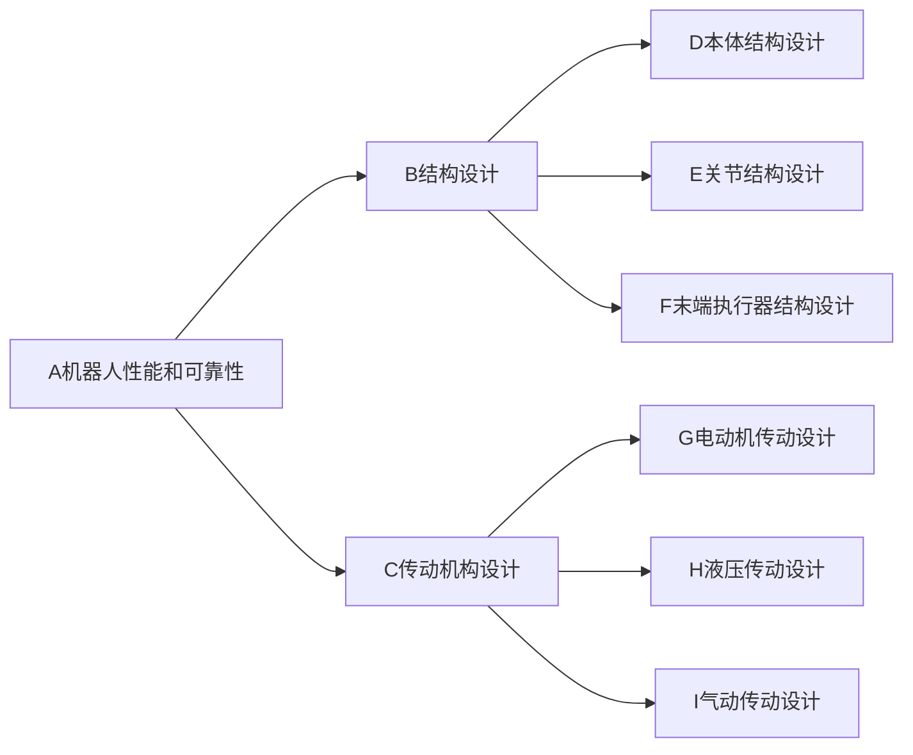

# 高性能和高可靠性的机器人的结构设计和传动机构设计

## 1.背景介绍
随着人工智能和机器人技术的快速发展,机器人在工业生产、医疗服务、家庭服务等领域得到了广泛应用。机器人的性能和可靠性直接影响其应用效果和使用寿命。高性能和高可靠性是现代机器人设计的两大目标。其中,机器人的结构设计和传动机构设计是实现高性能和高可靠性的关键。

### 1.1 机器人的发展现状
#### 1.1.1 工业机器人的应用现状
#### 1.1.2 服务机器人的应用现状 
#### 1.1.3 特种机器人的应用现状

### 1.2 机器人性能与可靠性面临的挑战
#### 1.2.1 机器人工作环境的复杂性
#### 1.2.2 机器人任务的多样性
#### 1.2.3 机器人使用寿命的要求

### 1.3 机器人结构设计和传动机构设计的重要性
#### 1.3.1 结构设计对机器人性能的影响
#### 1.3.2 传动机构设计对机器人性能的影响
#### 1.3.3 结构与传动机构设计的协同优化

## 2.核心概念与联系
### 2.1 机器人结构设计的核心概念
#### 2.1.1 机器人本体结构
#### 2.1.2 机器人关节结构
#### 2.1.3 机器人末端执行器结构

### 2.2 机器人传动机构设计的核心概念  
#### 2.2.1 电动机传动
#### 2.2.2 液压传动
#### 2.2.3 气动传动

### 2.3 结构设计与传动机构设计的联系


## 3.核心算法原理具体操作步骤
### 3.1 机器人结构优化设计算法
#### 3.1.1 拓扑优化算法
#### 3.1.2 尺寸优化算法
#### 3.1.3 形状优化算法

### 3.2 机器人传动机构优化设计算法
#### 3.2.1 电动机参数优化算法
#### 3.2.2 液压系统参数优化算法
#### 3.2.3 气动系统参数优化算法

### 3.3 机器人结构与传动机构协同优化算法
#### 3.3.1 多学科优化设计算法
#### 3.3.2 多目标优化设计算法
#### 3.3.3 鲁棒性优化设计算法

## 4.数学模型和公式详细讲解举例说明
### 4.1 机器人运动学模型
机器人运动学模型描述了机器人关节运动与末端位姿之间的关系。对于一个n自由度的机器人,其正运动学方程为:

$$
\begin{bmatrix}
p_x \\ p_y \\ p_z
\end{bmatrix} 
= f(\theta_1, \theta_2, \cdots, \theta_n)
$$

其中,$p_x,p_y,p_z$为机器人末端在基坐标系下的位置坐标,$\theta_1,\theta_2,\cdots,\theta_n$为机器人各关节的转角。

逆运动学方程为:

$$
\begin{bmatrix}
\theta_1 \\ \theta_2 \\ \vdots \\ \theta_n
\end{bmatrix}
= f^{-1}(p_x, p_y, p_z) 
$$

通过求解逆运动学方程,可以根据机器人末端的目标位姿,计算出各关节的转角。

### 4.2 机器人动力学模型
机器人动力学模型描述了机器人关节力矩与关节运动之间的关系。对于一个n自由度的机器人,其动力学方程为:

$$
M(q)\ddot{q} + C(q,\dot{q})\dot{q} + G(q) = \tau
$$

其中,$q,\dot{q},\ddot{q} \in R^n$分别为关节位置、速度、加速度向量,$M(q) \in R^{n\times n}$为惯性矩阵,$C(q,\dot{q}) \in R^{n\times n}$为向心力和科氏力矩阵,$G(q) \in R^n$为重力矩阵,$\tau \in R^n$为关节力矩向量。

通过求解动力学方程,可以分析机器人的动态性能,优化机器人的运动控制策略。

### 4.3 机器人结构优化模型
机器人结构优化的目标是在满足强度、刚度等约束条件下,寻找最优的结构参数,使机器人的质量最小,或者刚度最大。以质量最小化为例,结构优化模型可以表示为:

$$
\begin{aligned}
\min \quad & m(x) \\
\text{s.t.} \quad & g_i(x) \leq 0, \quad i=1,2,\cdots,p \\
& h_j(x) = 0, \quad j=1,2,\cdots,q \\
& x^L \leq x \leq x^U
\end{aligned}
$$

其中,$m(x)$为结构质量,$x$为结构参数向量,$g_i(x)$为强度、刚度等不等式约束,$h_j(x)$为几何尺寸等等式约束,$x^L$和$x^U$为参数的上下界。

通过求解结构优化模型,可以得到满足性能要求的最优结构参数。

## 5.项目实践：代码实例和详细解释说明
下面以一个二自由度平面机器人为例,演示机器人结构设计和传动机构设计的代码实现。

### 5.1 机器人正逆运动学求解
```python
import numpy as np
import matplotlib.pyplot as plt

# 机器人连杆长度
l1, l2 = 1.0, 1.0

# 机器人关节角度
theta1, theta2 = np.pi/4, np.pi/3

# 正运动学
def forward_kinematics(theta1, theta2):
    x = l1*np.cos(theta1) + l2*np.cos(theta1+theta2)
    y = l1*np.sin(theta1) + l2*np.sin(theta1+theta2)
    return x, y

# 逆运动学
def inverse_kinematics(x, y):
    c2 = (x**2 + y**2 - l1**2 - l2**2) / (2*l1*l2)
    s2 = np.sqrt(1 - c2**2)
    theta2 = np.arctan2(s2, c2)
    
    k1 = l1 + l2*c2
    k2 = l2*s2
    theta1 = np.arctan2(y, x) - np.arctan2(k2, k1)
    
    return theta1, theta2

# 测试正运动学
print(forward_kinematics(theta1, theta2))

# 测试逆运动学
print(inverse_kinematics(1.0, 1.0))

# 绘制机器人
def plot_robot(theta1, theta2):
    x1 = l1*np.cos(theta1)
    y1 = l1*np.sin(theta1) 
    x2 = x1 + l2*np.cos(theta1+theta2)
    y2 = y1 + l2*np.sin(theta1+theta2)
    
    plt.plot([0,x1], [0,y1], 'r-')
    plt.plot([x1,x2], [y1,y2], 'r-')
    plt.plot(x1, y1, 'bo')
    plt.plot(x2, y2, 'bo')
    plt.axis('equal')
    plt.show()

plot_robot(theta1, theta2)
```

代码解释:
- 定义了机器人的连杆长度`l1`和`l2`,以及关节角度`theta1`和`theta2`
- `forward_kinematics`函数实现了机器人正运动学求解,根据关节角度计算末端位置
- `inverse_kinematics`函数实现了机器人逆运动学求解,根据末端位置计算关节角度
- `plot_robot`函数实现了机器人运动的可视化

### 5.2 机器人动力学仿真
```python
import numpy as np
from scipy.integrate import odeint
import matplotlib.pyplot as plt

# 机器人参数
m1, m2 = 1.0, 1.0
l1, l2 = 1.0, 1.0
lc1, lc2 = 0.5, 0.5
I1, I2 = 0.1, 0.1

# 机器人动力学方程
def dynamics(y, t, T1, T2):
    theta1, theta2, dtheta1, dtheta2 = y
    
    c1 = np.cos(theta1)
    c2 = np.cos(theta2)
    s2 = np.sin(theta2)
    
    M11 = m1*lc1**2 + m2*(l1**2 + lc2**2 + 2*l1*lc2*c2) + I1 + I2
    M12 = m2*(lc2**2 + l1*lc2*c2) + I2
    M21 = M12
    M22 = m2*lc2**2 + I2
    
    C1 = -m2*l1*lc2*s2*dtheta2*(2*dtheta1 + dtheta2)
    C2 = m2*l1*lc2*s2*dtheta1**2
    
    G1 = (m1*lc1 + m2*l1)*9.81*np.cos(theta1) + m2*lc2*9.81*np.cos(theta1 + theta2)
    G2 = m2*lc2*9.81*np.cos(theta1 + theta2)
    
    ddtheta1 = (T1 - C1 - G1 - M12/M22*(T2 - C2 - G2)) / (M11 - M12**2/M22)
    ddtheta2 = (T2 - C2 - G2 - M21*ddtheta1) / M22
    
    return [dtheta1, dtheta2, ddtheta1, ddtheta2]

# 初始条件
y0 = [0.0, 0.0, 0.0, 0.0]
t = np.linspace(0, 5, 1000)

# 关节力矩
T1 = 1.0
T2 = 0.5

# 求解动力学方程
sol = odeint(dynamics, y0, t, args=(T1, T2))

# 绘制关节角度曲线
plt.figure()
plt.plot(t, sol[:, 0], 'r', label='theta1')
plt.plot(t, sol[:, 1], 'b', label='theta2')
plt.legend()
plt.xlabel('t')
plt.ylabel('theta')
plt.grid()
plt.show()
```

代码解释:
- 定义了机器人的物理参数,包括连杆质量`m1`和`m2`,连杆长度`l1`和`l2`,质心位置`lc1`和`lc2`,转动惯量`I1`和`I2`
- `dynamics`函数定义了机器人的动力学微分方程,输入为状态变量`y`(包含关节角度和角速度)和时间`t`,以及关节力矩`T1`和`T2`,输出为状态变量的一阶导数
- 定义初始条件`y0`,时间序列`t`,以及关节力矩`T1`和`T2`
- 调用`odeint`函数求解动力学微分方程,得到关节角度和角速度随时间变化的曲线
- 绘制关节角度曲线

### 5.3 机器人结构优化
```python
import numpy as np
from scipy.optimize import minimize

# 机器人参数
l1, l2 = 1.0, 1.0
rho = 7800.0
sigma_max = 200e6

# 目标函数
def objective(x):
    r1, r2 = x
    m = rho*np.pi*(r1**2*l1 + r2**2*l2)
    return m

# 约束条件
def constraint1(x):
    r1, r2 = x
    I1 = np.pi*r1**4/4
    I2 = np.pi*r2**4/4
    sigma1 = 1e3*l1/I1
    sigma2 = 1e3*l2/I2
    return sigma_max - np.max([sigma1, sigma2])

def constraint2(x):
    r1, r2 = x
    delta1 = 1e3*l1**3/(3*200e9*np.pi*r1**4/4)
    delta2 = 1e3*l2**3/(3*200e9*np.pi*r2**4/4)  
    return 1e-3 - np.max([delta1, delta2])

# 优化问题
x0 = [0.01, 0.01]
bounds = [(0.005, 0.1), (0.005, 0.1)]