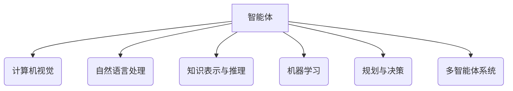
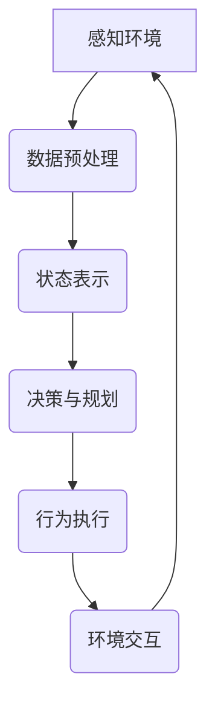

# AI Agent: AI的下一个风口 从ChatGPT到智能体

## 1.背景介绍

### 1.1 人工智能的发展历程

人工智能(Artificial Intelligence, AI)是当代科技发展的核心驱动力之一,它的发展历程可以追溯到20世纪50年代。在过去的几十年里,AI技术不断突破,催生了诸如机器学习、深度学习、自然语言处理等重要分支,极大地推动了计算机科学和信息技术的进步。

### 1.2 ChatGPT的崛起

2022年11月,OpenAI推出了ChatGPT,这款基于GPT-3.5语言模型的对话式AI系统,凭借其出色的自然语言交互能力和广博的知识面,在全球引发了热烈讨论和关注。ChatGPT可以回答各种问题、撰写文章、编写代码等,展现出强大的语言理解和生成能力,被视为AI发展的一个重要里程碑。

### 1.3 智能体:AI的下一个风口

尽管ChatGPT取得了巨大成功,但它仍然是一种被动式的问答系统,缺乏主动性和持续交互能力。为了实现真正的人机协作,AI需要具备更高级的认知能力、决策能力和行为能力,这就需要智能体(Intelligent Agent)的概念和技术。智能体被认为是AI发展的下一个风口,它将推动AI从被动式问答系统向主动式智能助手的飞跃,为人类提供更加智能化和个性化的服务。

## 2.核心概念与联系

### 2.1 智能体的定义

智能体是指能够感知环境,并根据感知做出决策和行动的自主系统。它具有以下三个核心特征:

1. 感知(Perception):通过传感器获取环境信息。
2. 决策(Decision Making):基于感知信息和内部知识做出决策。
3. 行动(Action):根据决策执行相应的行为。

### 2.2 智能体与传统AI系统的区别

传统的AI系统,如ChatGPT,主要关注特定任务的语言理解和生成,缺乏对环境的感知和主动行为能力。相比之下,智能体不仅具备语言交互能力,还能够感知环境、做出决策并采取行动,从而实现更加智能化和自主化的人机交互。

### 2.3 智能体的核心技术

智能体涉及多个AI技术领域,包括:

- 计算机视觉(Computer Vision)
- 自然语言处理(Natural Language Processing)
- 知识表示与推理(Knowledge Representation and Reasoning)
- 机器学习(Machine Learning)
- 规划与决策(Planning and Decision Making)
- 多智能体系统(Multi-Agent Systems)

这些技术相互依赖、相辅相成,共同构建了智能体的感知、决策和行为能力。



## 3.核心算法原理具体操作步骤

智能体的核心算法原理可以概括为感知-决策-行为循环(Perception-Decision-Action Loop),其具体操作步骤如下:

1. **感知环境**:通过各种传感器(如摄像头、麦克风等)获取环境信息,包括视觉、语音、文本等多模态数据。

2. **数据预处理**:对获取的原始数据进行预处理,如降噪、特征提取、数据标准化等,为后续的决策和行为提供高质量的输入。

3. **状态表示**:将预处理后的数据转换为内部状态表示,作为决策和规划的基础。常用的状态表示方法包括符号表示、向量表示等。

4. **决策与规划**:基于当前状态和目标,通过搜索、推理或学习等方法,生成行为序列或策略。常用的决策算法包括启发式搜索、马尔可夫决策过程(MDP)、强化学习等。

5. **行为执行**:根据决策结果,通过执行器(如机械臂、显示器等)执行相应的行为,如物理动作、语音输出、图像显示等。

6. **环境交互**:智能体的行为将影响环境状态,环境的反馈将作为新的感知输入,重新进入感知-决策-行为循环。

$$
\begin{aligned}
s_t &= f(o_t) \\
a_t &= \pi(s_t) \\
s_{t+1} &= g(s_t, a_t)
\end{aligned}
$$

其中,$s_t$表示时刻$t$的状态,$o_t$表示时刻$t$的观测,$a_t$表示时刻$t$的行为,$\pi$表示策略函数,$g$表示状态转移函数。



## 4.数学模型和公式详细讲解举例说明

### 4.1 马尔可夫决策过程(MDP)

马尔可夫决策过程(Markov Decision Process, MDP)是智能体决策的一种重要数学模型。MDP由一个五元组$(S, A, P, R, \gamma)$定义,其中:

- $S$是状态集合
- $A$是行为集合
- $P(s'|s,a)$是状态转移概率,表示在状态$s$执行行为$a$后,转移到状态$s'$的概率
- $R(s,a)$是即时奖励函数,表示在状态$s$执行行为$a$所获得的即时奖励
- $\gamma \in [0,1)$是折现因子,用于权衡即时奖励和长期累积奖励

在MDP中,智能体的目标是找到一个策略$\pi: S \rightarrow A$,使得期望的累积折现奖励最大化:

$$
\max_\pi \mathbb{E}\left[ \sum_{t=0}^\infty \gamma^t R(s_t, a_t) \right]
$$

其中,$s_t$和$a_t$分别表示时刻$t$的状态和行为,它们遵循状态转移概率$P$和策略$\pi$。

常用的求解MDP的算法包括价值迭代(Value Iteration)、策略迭代(Policy Iteration)和Q-Learning等。

### 4.2 强化学习(Reinforcement Learning)

强化学习是一种基于MDP的机器学习范式,它通过与环境的交互,学习一个最优策略,以最大化长期累积奖励。强化学习算法通常包括以下几个核心组件:

- 策略$\pi$:智能体的行为策略
- 价值函数$V^\pi(s)$或$Q^\pi(s,a)$:评估状态或状态-行为对的长期价值
- 模型$P(s'|s,a)$和$R(s,a)$:环境的动态模型
- 样本$(s_t,a_t,r_t,s_{t+1})$:与环境交互获得的经验样本

强化学习算法通过不断更新策略、价值函数和模型,逐步优化智能体的决策和行为。

以Deep Q-Network(DQN)为例,它使用深度神经网络来近似Q函数$Q(s,a;\theta) \approx Q^\pi(s,a)$,并通过经验回放和目标网络等技术提高训练稳定性。在每个时刻$t$,DQN根据当前状态$s_t$选择行为$a_t = \arg\max_a Q(s_t,a;\theta)$,并观察到即时奖励$r_t$和新状态$s_{t+1}$。然后,DQN使用贝尔曼方程更新Q网络的参数$\theta$:

$$
\theta \leftarrow \theta + \alpha \left( r_t + \gamma \max_{a'} Q(s_{t+1}, a';\theta^-) - Q(s_t, a_t;\theta) \right) \nabla_\theta Q(s_t, a_t;\theta)
$$

其中,$\alpha$是学习率,$\theta^-$是目标网络的参数。通过不断优化Q网络,DQN可以逐步学习到最优策略。

## 5.项目实践:代码实例和详细解释说明

以下是一个简单的强化学习示例,使用Q-Learning算法训练一个智能体在格子世界(GridWorld)环境中找到最短路径。

### 5.1 环境设置

```python
import numpy as np

class GridWorld:
    def __init__(self, size=5):
        self.size = size
        self.start = (0, 0)
        self.goal = (size-1, size-1)
        self.state = self.start
        self.actions = ['up', 'down', 'left', 'right']
        self.rewards = np.full((size, size), -1.0)
        self.rewards[self.goal] = 100.0

    def reset(self):
        self.state = self.start
        return self.state

    def step(self, action):
        row, col = self.state
        if action == 'up':
            new_row = max(0, row - 1)
        elif action == 'down':
            new_row = min(self.size - 1, row + 1)
        elif action == 'left':
            new_col = max(0, col - 1)
        elif action == 'right':
            new_col = min(self.size - 1, col + 1)
        else:
            raise ValueError(f'Invalid action: {action}')

        new_state = (new_row, new_col)
        reward = self.rewards[new_state]
        self.state = new_state
        done = (new_state == self.goal)
        return new_state, reward, done
```

这个`GridWorld`类定义了一个$n \times n$的格子世界环境,其中起点位于$(0,0)$,终点位于$(n-1,n-1)$。智能体可以执行四种行为(上下左右移动),目标是找到从起点到终点的最短路径。每移动一步会获得-1的即时奖励,到达终点会获得100的终止奖励。

### 5.2 Q-Learning算法实现

```python
import random

class QLearning:
    def __init__(self, env, alpha=0.1, gamma=0.9, epsilon=0.1):
        self.env = env
        self.alpha = alpha  # 学习率
        self.gamma = gamma  # 折现因子
        self.epsilon = epsilon  # 探索率
        self.Q = {}  # Q表

    def get_Q(self, state, action):
        key = (state, action)
        return self.Q.get(key, 0.0)

    def update_Q(self, state, action, reward, next_state):
        key = (state, action)
        next_max_Q = max([self.get_Q(next_state, a) for a in self.env.actions])
        current_Q = self.get_Q(state, action)
        new_Q = current_Q + self.alpha * (reward + self.gamma * next_max_Q - current_Q)
        self.Q[key] = new_Q

    def get_action(self, state):
        if random.random() < self.epsilon:
            return random.choice(self.env.actions)
        else:
            return max((self.get_Q(state, a), a) for a in self.env.actions)[1]

    def train(self, num_episodes=1000):
        for episode in range(num_episodes):
            state = self.env.reset()
            done = False
            while not done:
                action = self.get_action(state)
                next_state, reward, done = self.env.step(action)
                self.update_Q(state, action, reward, next_state)
                state = next_state

    def get_policy(self):
        policy = {}
        for state in self.Q.keys():
            policy[state] = max((self.get_Q(state, a), a) for a in self.env.actions)[1]
        return policy
```

这个`QLearning`类实现了Q-Learning算法,包括以下几个主要函数:

- `get_Q(state, action)`: 获取状态-行为对$(s,a)$的Q值
- `update_Q(state, action, reward, next_state)`: 根据贝尔曼方程更新Q值
- `get_action(state)`: 根据$\epsilon$-贪婪策略选择行为
- `train(num_episodes)`: 进行多轮训练,更新Q表
- `get_policy()`: 根据训练后的Q表获取最优策略

### 5.3 训练和测试

```python
env = GridWorld(size=5)
agent = QLearning(env, alpha=0.1, gamma=0.9, epsilon=0.1)
agent.train(num_episodes=1000)
policy = agent.get_policy()

# 打印最优策略
for row in range(env.size):
    for col in range(env.size):
        state = (row, col)
        action = policy[state]
        print(f'{action[0]:<5}', end='')
    print()
```

运行上述代码,我们可以得到智能体在格子世界环境中学习到的最优策略:

```
right right right right right
up    up    up    up    up
up    up    up    up    up