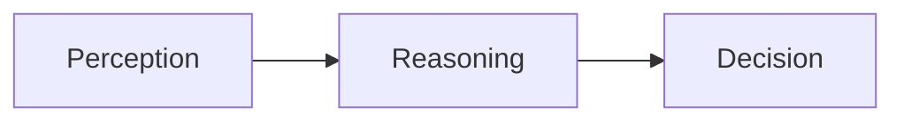
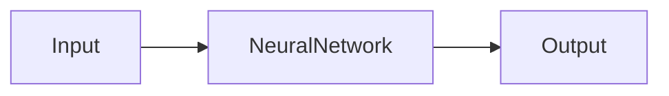

# AI Agent: AI的下一个风口 从早期萌芽到深度学习

## 1. 背景介绍
### 1.1 人工智能发展历程回顾
#### 1.1.1 人工智能的起源与定义
人工智能(Artificial Intelligence, AI)作为一个研究领域,最早可以追溯到1956年的达特茅斯会议。当时,计算机科学家们提出了创造能够模仿人类智能的机器的设想。从那时起,人工智能经历了几次起起伏伏的发展历程。粗略来说,人工智能是对智能实体(intelligent agents)的研究,它试图通过计算机程序来模拟、延伸和扩展人的智能。

#### 1.1.2 人工智能的三次浪潮
人工智能的发展大致经历了三次浪潮:

1. 20世纪50-70年代的符号主义浪潮:以逻辑推理和知识表示为主,典型代表是专家系统。
2. 20世纪80年代的连接主义浪潮:以神经网络和机器学习为主,但受限于计算能力,没有取得突破性进展。 
3. 2010年前后开始的深度学习浪潮:得益于大数据和高性能计算,多层神经网络的训练成为可能,深度学习开始在多个领域取得突破性进展。

#### 1.1.3 当前人工智能的发展现状
当前,以深度学习为代表的人工智能技术正在多个领域取得广泛应用,如计算机视觉、语音识别、自然语言处理等。同时,强化学习、迁移学习、元学习等新的学习范式也在不断涌现。人工智能正在从感知智能走向认知智能,从专用人工智能走向通用人工智能。

### 1.2 AI Agent的概念出现
#### 1.2.1 Agent的定义
Agent是人工智能领域的一个重要概念。广义地说,Agent指能感知环境并作出行动的任何事物。在人工智能语境下,Agent特指根据感知作出决策和行动、从而实现特定目标的计算机程序或机器人。

#### 1.2.2 AI Agent的兴起
近年来,随着人工智能技术的快速发展,AI Agent开始受到越来越多的关注。一方面,AI技术的进步,尤其是深度学习的突破,为构建更加智能的Agent提供了可能;另一方面,AI Agent为人工智能的落地应用提供了一个很好的抓手,使得人工智能能够在更多场景发挥作用。

### 1.3 AI Agent成为新的风口
#### 1.3.1 AI Agent的广阔应用前景
AI Agent具有广阔的应用前景。从个人助理、客服机器人,到自动驾驶、智能制造,再到金融投资、医疗诊断,AI Agent几乎能够渗透到社会生活的方方面面。它有望在提升效率、降低成本、优化决策等方面发挥重要作用。

#### 1.3.2 AI Agent吸引巨额投资
看好AI Agent前景的不仅有学术界,业界对AI Agent的兴趣也在与日俱增。谷歌、亚马逊、微软、苹果等科技巨头纷纷加大对AI Agent的投入。创业公司方面,一大批AI Agent公司如雨后春笋般涌现,并吸引了大量风险投资。

#### 1.3.3 AI Agent成为研究热点
学术界对AI Agent的研究也在不断升温。从顶级会议的论文主题,到各高校实验室的研究方向,AI Agent已成为当前人工智能领域最热门的研究话题之一。研究的内容涵盖了Agent的建模、学习算法、应用场景等诸多方面。

## 2. 核心概念与联系
### 2.1 Agent的形式化定义
一个Agent可以形式化地定义为一个函数:

$$f: P^* \rightarrow A$$

其中,$P$是感知的集合,$A$是行动的集合。该函数根据之前所有的感知序列$(p_1,p_2,...,p_n)$,输出当前时刻要采取的行动$a$。

### 2.2 Markov Decision Process
在实践中,Agent通常是在一个环境中连续地感知和行动。这可以用Markov Decision Process (MDP)来建模:

$$M=<S,A,T,R,\gamma>$$

其中,$S$是状态集,$A$是行动集,$T$是状态转移概率函数,$R$是奖励函数,$\gamma$是折扣因子。

Agent的目标是找到一个策略$\pi: S \rightarrow A$,使得期望累积奖励最大化:

$$\pi^* = \arg \max_{\pi} E[\sum_{t=0}^{\infty} \gamma^t r_t | \pi]$$

### 2.3 感知、推理与决策
Agent的核心能力可以概括为感知(perception)、推理(reasoning)和决策(decision making)三个方面:

- 感知:通过传感器获取环境信息,并将其抽象为Agent可以理解的状态表示。
- 推理:在当前状态表示的基础上,结合先验知识和目标,对当前形势进行分析判断。  
- 决策:根据推理的结果,选择最优的行动方案。

### 2.4 从Sense-Think-Act到End-to-End
传统的Agent系统通常采用Sense-Think-Act架构,即:



但随着深度学习的发展,End-to-End的架构开始崭露头角。在这种架构下,感知、推理、决策三个过程被统一到一个深度神经网络中:



相比Sense-Think-Act架构,End-to-End架构具有更强的表达能力和更高的效率,代表了AI Agent的发展方向。

## 3. 核心算法原理具体操作步骤
### 3.1 强化学习
强化学习是AI Agent的核心算法之一。它通过Agent与环境的交互,不断尝试、学习和优化策略。主要步骤如下:

1. 初始化一个随机策略$\pi_0$
2. 重复:
   1. 用$\pi_i$与环境交互,收集数据$(s,a,r,s')$
   2. 用收集到的数据更新价值函数$V_i$或$Q_i$
   3. 基于新的价值函数得到新的策略$\pi_{i+1}$
3. 直到策略收敛或达到预设的迭代次数

常见的强化学习算法包括Q-Learning、SARSA、Policy Gradient等。

### 3.2 深度强化学习
深度强化学习将深度学习引入强化学习,用深度神经网络来逼近价值函数或策略函数。主要步骤如下:

1. 初始化一个随机的价值网络$V_{\theta_0}$或策略网络$\pi_{\theta_0}$
2. 重复:
   1. 用$\pi_{\theta_i}$与环境交互,收集数据$(s,a,r,s')$
   2. 用收集到的数据,通过梯度下降更新网络参数$\theta_i$
3. 直到网络收敛或达到预设的迭代次数

常见的深度强化学习算法包括DQN、DDPG、A3C等。

### 3.3 多智能体学习
在许多现实场景中,往往存在多个Agent同时与环境交互。这需要多智能体学习算法来协调不同Agent的行为。主要步骤如下:

1. 初始化每个Agent的策略$\pi_1,\pi_2,...,\pi_n$
2. 重复:
   1. 所有Agent同时与环境交互,每个Agent收集自己的数据
   2. 每个Agent根据收集到的数据更新自己的策略
   3. 所有Agent广播自己的新策略
3. 直到所有Agent的策略收敛或达到预设的迭代次数

常见的多智能体学习算法包括Independent Q-Learning、Joint Action Learning等。

## 4. 数学模型和公式详细讲解举例说明
### 4.1 Bellman Equation
在强化学习中,价值函数满足Bellman方程:

$$V^{\pi}(s) = \sum_{a} \pi(a|s) \sum_{s',r} p(s',r|s,a) [r + \gamma V^{\pi}(s')]$$

其中,$p(s',r|s,a)$是在状态$s$下采取行动$a$,转移到状态$s'$并获得奖励$r$的概率。

这个方程表明,一个状态的价值等于在该状态下采取所有可能行动的期望回报,而每个行动的期望回报又等于立即奖励加上下一状态价值的折现。

例如,考虑一个简单的网格世界环境:

```
+---+---+---+
| A |   | B |
+---+---+---+
|   |   |   |
+---+---+---+
| C |   | D |
+---+---+---+
```

其中,A,B,C,D四个格子分别有-1,1,-1,1的即时奖励。假设Agent的策略是均匀随机策略,即在每个状态下有0.25的概率选择上下左右四个行动。同时假设折扣因子$\gamma=0.9$。

那么,根据Bellman方程,各个状态的价值函数为:

$$
\begin{aligned}
V(A) &= -1 + 0.25 \times 0.9 \times [V(A)+V(C)] \\
V(B) &= 1 + 0.25 \times 0.9 \times [V(A)+V(B)+V(D)] \\
V(C) &= -1 + 0.25 \times 0.9 \times [V(A)+V(C)+V(D)] \\
V(D) &= 1 + 0.25 \times 0.9 \times [V(B)+V(C)+V(D)]
\end{aligned}
$$

求解这个方程组,可以得到:

$$
V(A)=0, V(B)=\frac{20}{19}, V(C)=\frac{-1}{19}, V(D)=\frac{20}{19}
$$

这表明,在该策略下,状态B和D的长期价值较高,而状态A和C的长期价值较低,与它们的即时奖励是一致的。

### 4.2 Policy Gradient Theorem
在策略梯度方法中,我们直接对策略函数的参数进行梯度上升。策略梯度定理给出了目标函数(期望回报)对策略参数的梯度:

$$\nabla_{\theta} J(\theta) = E_{\tau \sim p_{\theta}(\tau)} [\sum_{t=0}^{T} \nabla_{\theta} \log \pi_{\theta}(a_t|s_t) Q^{\pi_{\theta}}(s_t,a_t)]$$

其中,$\tau$是一条轨迹$(s_0,a_0,r_0,s_1,a_1,r_1,...)$,$p_{\theta}(\tau)$是在策略$\pi_{\theta}$下出现轨迹$\tau$的概率。

这个定理告诉我们,策略梯度等于在所有可能的轨迹上,每个时刻的对数策略梯度乘以该时刻的动作价值函数,再取期望。

直观地理解,这个定理鼓励我们增大导致高回报的动作的概率,减小导致低回报的动作的概率。

例如,考虑一个简单的二元动作环境,状态空间为{1,2,3},动作空间为{0,1}。假设环境动力学为:

$$
p(s'=1|s=1,a=0)=0.9, p(s'=2|s=1,a=0)=0.1 \\
p(s'=1|s=1,a=1)=0.1, p(s'=2|s=1,a=1)=0.9 \\
p(s'=2|s=2,a=0)=0.9, p(s'=3|s=2,a=0)=0.1 \\
p(s'=2|s=2,a=1)=0.1, p(s'=3|s=2,a=1)=0.9 \\
p(s'=3|s=3,a=0)=1, p(s'=3|s=3,a=1)=1
$$

同时假设每个状态-动作对的即时奖励为:

$$
r(s=1,a=0)=1, r(s=1,a=1)=0 \\
r(s=2,a=0)=0, r(s=2,a=1)=2 \\
r(s=3,a=0)=0, r(s=3,a=1)=0
$$

假设折扣因子$\gamma=1$,策略为softmax形式:

$$\pi_{\theta}(a|s) = \frac{e^{\theta_{s,a}}}{\sum_{a'} e^{\theta_{s,a'}}}$$

那么根据策略梯度定理,参数$\theta_{1,1}$的梯度为:

$$
\begin{aligned}
\nabla_{\theta_{1,1}} J(\theta) &= E