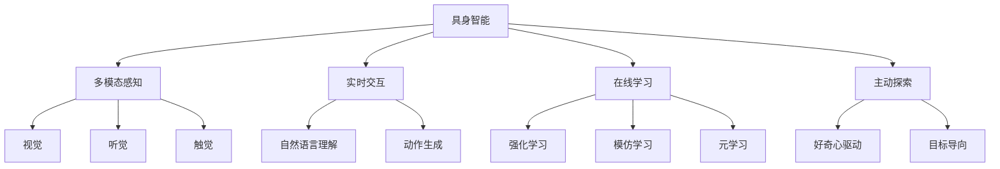

# AI Agent: AI的下一个风口 具身智能的定义与特点

## 1. 背景介绍
### 1.1 人工智能的发展历程
#### 1.1.1 早期人工智能
#### 1.1.2 机器学习时代  
#### 1.1.3 深度学习的崛起
### 1.2 当前人工智能的局限性
#### 1.2.1 缺乏常识推理能力
#### 1.2.2 无法适应动态环境
#### 1.2.3 缺乏自主学习能力
### 1.3 具身智能的提出
#### 1.3.1 具身智能的概念
#### 1.3.2 具身智能的研究意义

## 2. 核心概念与联系
### 2.1 具身智能的定义
#### 2.1.1 具身性
#### 2.1.2 自主性
#### 2.1.3 适应性
### 2.2 具身智能与传统人工智能的区别
#### 2.2.1 感知与交互方式
#### 2.2.2 学习与推理机制
#### 2.2.3 环境适应能力
### 2.3 具身智能的关键特点
#### 2.3.1 多模态感知
#### 2.3.2 实时交互
#### 2.3.3 在线学习
#### 2.3.4 主动探索

## 3. 核心算法原理具体操作步骤
### 3.1 强化学习
#### 3.1.1 马尔可夫决策过程
#### 3.1.2 值函数近似
#### 3.1.3 策略梯度方法
### 3.2 模仿学习
#### 3.2.1 行为克隆
#### 3.2.2 逆强化学习
#### 3.2.3 生成式对抗模仿学习
### 3.3 元学习
#### 3.3.1 基于度量的元学习
#### 3.3.2 基于优化的元学习
#### 3.3.3 基于模型的元学习

## 4. 数学模型和公式详细讲解举例说明
### 4.1 强化学习数学模型
#### 4.1.1 马尔可夫决策过程定义
#### 4.1.2 贝尔曼方程
#### 4.1.3 策略梯度定理
### 4.2 模仿学习数学模型 
#### 4.2.1 最大熵逆强化学习
#### 4.2.2 生成式对抗模仿学习目标函数
### 4.3 元学习数学模型
#### 4.3.1 基于度量的元学习目标函数
#### 4.3.2 基于模型的元学习目标函数

## 5. 项目实践：代码实例和详细解释说明
### 5.1 强化学习项目实践
#### 5.1.1 DQN算法实现
#### 5.1.2 PPO算法实现
### 5.2 模仿学习项目实践
#### 5.2.1 行为克隆算法实现
#### 5.2.2 GAIL算法实现
### 5.3 元学习项目实践
#### 5.3.1 MAML算法实现
#### 5.3.2 Reptile算法实现

## 6. 实际应用场景
### 6.1 自动驾驶
#### 6.1.1 感知与决策
#### 6.1.2 车辆控制
### 6.2 智能机器人
#### 6.2.1 机器人导航
#### 6.2.2 机器人操纵
### 6.3 智能家居
#### 6.3.1 语音交互
#### 6.3.2 设备控制

## 7. 工具和资源推荐
### 7.1 开源框架
#### 7.1.1 OpenAI Gym
#### 7.1.2 TensorFlow
#### 7.1.3 PyTorch
### 7.2 学习资源
#### 7.2.1 在线课程
#### 7.2.2 书籍推荐
#### 7.2.3 研究论文

## 8. 总结：未来发展趋势与挑战
### 8.1 具身智能的发展趋势
#### 8.1.1 多模态融合
#### 8.1.2 持续学习
#### 8.1.3 人机协作
### 8.2 面临的挑战
#### 8.2.1 算法效率
#### 8.2.2 数据质量
#### 8.2.3 安全与伦理

## 9. 附录：常见问题与解答
### 9.1 如何选择合适的算法？
### 9.2 如何处理高维状态空间？
### 9.3 如何平衡探索与利用？

具身智能（Embodied Intelligence）是人工智能领域的一个新兴研究方向，旨在创建能够像人类一样感知、交互、学习和适应环境的智能体。与传统的人工智能不同，具身智能强调智能体与环境的紧密耦合，通过身体与环境的交互来获取信息、学习知识和完成任务。

具身智能的一个关键特点是多模态感知。智能体需要通过多种感知通道，如视觉、听觉和触觉，来全面地理解周围的环境。这种多模态感知使智能体能够获取丰富的信息，从而做出更加准确和可靠的决策。

除了感知之外，具身智能还强调实时交互的重要性。智能体需要能够与环境进行实时的交互，根据环境的变化动态地调整自己的行为。这种实时交互使智能体能够及时应对环境的变化，提高任务完成的效率和成功率。

为了适应不断变化的环境，具身智能需要具备在线学习的能力。智能体需要能够在与环境交互的过程中不断学习和更新自己的知识和策略。常用的在线学习算法包括强化学习、模仿学习和元学习等。强化学习使智能体能够通过试错的方式学习最优策略；模仿学习使智能体能够通过观察专家的示范来学习复杂的行为；元学习则使智能体能够快速适应新的任务和环境。

具身智能的另一个重要特点是主动探索。与被动地接受环境信息不同，具身智能需要主动地探索环境，收集信息并学习知识。这种主动探索可以由好奇心驱动，也可以由特定的目标导向。主动探索使智能体能够更加全面地了解环境，发现新的可能性，从而提高任务完成的效率和质量。

在实际应用中，具身智能已经在自动驾驶、智能机器人和智能家居等领域取得了显著的进展。以自动驾驶为例，具身智能使自动驾驶系统能够通过多模态感知（如摄像头、雷达和激光雷达）来全面感知道路环境，通过实时交互来动态控制车辆，通过在线学习来不断提高驾驶性能，通过主动探索来应对各种复杂的驾驶场景。

尽管具身智能取得了令人瞩目的成果，但它仍然面临着许多挑战。其中一个主要挑战是算法效率。由于具身智能需要处理大量的高维数据并进行实时决策，因此对算法的效率提出了很高的要求。另一个挑战是数据质量。具身智能heavily依赖于高质量的数据来进行学习和决策，但现实世界中的数据往往是不完整、嘈杂和有偏的。如何从这些不完美的数据中学习是一个亟待解决的问题。此外，具身智能还面临着安全与伦理的挑战。如何确保具身智能系统的安全性和可靠性，如何避免具身智能被滥用或产生负面影响，都是需要认真考虑和解决的问题。

总的来说，具身智能代表了人工智能的一个新的发展方向。它通过强调感知、交互、学习和探索，使智能体能够更加全面地理解和适应环境，从而完成更加复杂和多样的任务。尽管具身智能还面临着许多挑战，但它有望在未来取得更大的突破，为人类社会带来更多的便利和福祉。

作者：禅与计算机程序设计艺术 / Zen and the Art of Computer Programming