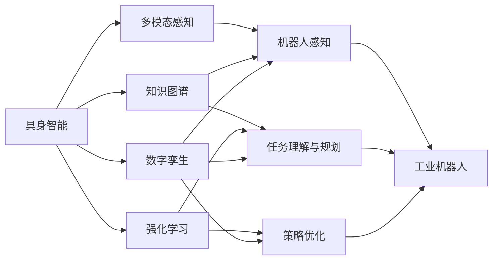

# AI Agent: AI的下一个风口 具身机器人在工业领域的应用

## 1.背景介绍

人工智能(Artificial Intelligence,AI)技术的快速发展,正在深刻影响和改变着我们的生活和工作方式。从智能语音助手、自动驾驶汽车,到智能制造和智慧城市,AI无处不在。而AI Agent,作为AI技术的重要分支和载体,正成为AI领域的研究热点和产业风口。

### 1.1 什么是AI Agent?

AI Agent,也称智能Agent或自主Agent,是一种能够感知环境,并根据环境做出自主决策和行动的智能系统。它集成了感知、推理、学习、规划等多种AI技术,具有自主性、社会性、反应性、主动性等特点。AI Agent可以是软件系统,如聊天机器人、智能助手等;也可以是硬件系统,如自主移动机器人、无人机等。

### 1.2 AI Agent的发展历程

AI Agent的研究可以追溯到上世纪50年代图灵提出的"图灵测试"。之后,AI Agent经历了反应式Agent、认知Agent、社会性Agent等多个发展阶段。近年来,随着深度学习等AI技术的突破,以及云计算、大数据、物联网等新一代信息技术的发展,AI Agent迎来了新的发展机遇。

### 1.3 AI Agent在工业领域的应用前景

工业领域是AI Agent应用的重要场景之一。传统工业生产中存在效率低、成本高、安全隐患大等问题,亟需引入AI技术来实现智能化转型升级。AI Agent可以应用于工业设计、生产制造、质量检测、设备维护、供应链管理等各个环节,提高生产效率,优化资源配置,降低运营成本,提升产品质量,增强安全保障。

## 2.核心概念与联系

要理解AI Agent在工业领域的应用,需要了解一些核心概念,以及它们之间的联系。

### 2.1 具身智能

具身智能(Embodied Intelligence)是指赋予机器人以物理实体,使其能够与现实世界进行交互,从环境中学习和进化。与传统的"封闭式"AI系统不同,具身智能强调感知-决策-行动的实时闭环,以及与物理环境的动态适应。工业机器人若要胜任复杂多变的生产任务,必须具备具身智能的能力。

### 2.2 多模态感知

多模态感知是指融合视觉、听觉、触觉等多种感知信息,以全面理解环境。单一模态往往存在局限性,难以应对工业场景的复杂性。例如,视觉容易受光照、遮挡的影响,而触觉能够弥补视觉的不足。多模态感知可以提高机器人的感知鲁棒性和准确性。

### 2.3 知识图谱

知识图谱以结构化、语义化的方式表示领域知识,支持机器进行知识推理和决策。工业知识图谱可以将设备、工艺、材料、缺陷等要素及其关联进行建模,帮助机器人理解生产任务和环境。知识图谱也是机器人学习和进化的基础。

### 2.4 强化学习

强化学习是一种重要的机器学习范式,通过智能体与环境的交互,不断尝试、评估和优化策略,以获得最大化的长期回报。强化学习非常适合动态、复杂的工业控制问题,如设备参数优化、生产调度、智能检测等。多智能体强化学习进一步支持机器人之间的协同学习。

### 2.5 数字孪生

数字孪生是物理实体在数字世界的映射,可以实时反映实体的状态和行为。通过构建生产系统的数字孪生体,可以对物理世界进行建模、仿真、预测和优化。数字孪生与物理机器人结合,能够实现闭环的感知、决策、控制和优化。

下图展示了这些核心概念之间的联系:

## 3.核心算法原理与操作步骤

### 3.1 多模态感知融合

多模态感知融合的目标是将不同模态的感知数据进行对齐和融合,形成统一的环境表征。其主要步骤包括:

1. 数据预处理:对原始感知数据进行去噪、校准、同步等预处理操作。
2. 特征提取:从每个模态数据中提取有判别力的特征表示。
3. 特征对齐:通过特征变换、映射等方法,将不同模态的特征映射到一个共同的特征空间。 
4. 特征融合:综合利用多模态特征,生成统一的环境表征。常见的融合策略有早期融合、晚期融合和混合融合。
5. 语义理解:在融合特征的基础上,进行物体识别、场景理解、行为分析等高层语义理解。

### 3.2 基于知识图谱的任务规划

利用工业知识图谱进行任务理解和规划,可以显著提升机器人的自主性和适应性。其关键步骤如下:

1. 知识建模:构建涵盖设备、工艺、产品、质量等要素的工业知识图谱。
2. 任务理解:根据工业知识图谱,对输入的任务指令进行语义理解和形式化表示。
3. 约束求解:综合考虑任务目标、设备能力、工艺约束等,将任务规划转化为约束满足问题求解。
4. 规划搜索:采用启发式搜索、演化优化等方法,在任务约束下搜索最优的规划路径。
5. 计划执行:将生成的任务计划解析为机器人可执行的原子动作序列,并进行实时调度和执行。

### 3.3 端到端强化学习优化

传统的机器人控制往往依赖人工设计的控制器和策略,难以应对工业场景的动态变化。端到端强化学习可以让机器人通过与环境的交互,自主学习和优化控制策略。其主要步骤包括:

1. 状态表示:选择合适的特征来表示机器人的状态,如关节角度、速度、视觉特征等。
2. 动作定义:定义机器人的动作空间,可以是连续的控制量,也可以是离散的动作集合。
3. 奖励设计:根据任务目标,设计即时奖励函数,引导机器人学习优质策略。
4. 价值评估:通过价值网络或策略网络,评估状态-动作的长期价值。
5. 策略优化:采用策略梯度、Q学习等算法,基于奖励反馈不断更新和优化策略网络。
6. 探索利用:平衡探索新策略和利用已有策略,以发现更优的策略。

### 3.4 数字孪生驱动的闭环优化

数字孪生为机器人提供了一个虚实交互的平台,可以实现闭环的感知、决策、控制和优化。其关键步骤如下:

1. 物理建模:对机器人本体、传感器、执行器等进行几何、运动、动力学建模。
2. 环境建模:对机器人所处的工作环境,包括工件、夹具、障碍物等进行三维重建。
3. 行为建模:对机器人的感知、规划、控制等行为逻辑进行建模,形成数字孪生体。
4. 实时映射:通过数据采集和同步,实时更新物理机器人的状态到数字孪生体。
5. 仿真优化:在数字孪生平台上,通过物理仿真、强化学习等方法优化机器人的策略和参数。
6. 策略迁移:将优化后的策略部署到物理机器人,指导其进行实际的决策和控制。
7. 迭代闭环:持续进行虚实交互和优化,不断提升机器人的性能和智能水平。

## 4.数学模型和公式详解

### 4.1 多模态感知融合

设机器人共有 $n$ 个感知模态,每个模态提取的特征向量分别为 $x_1, x_2, ..., x_n$。多模态融合的目标是学习一个融合函数 $f$,将多个模态特征映射为统一的特征表示 $z$:

$$z = f(x_1, x_2, ..., x_n)$$

常见的融合函数包括:

- 拼接融合:$z = [x_1, x_2, ..., x_n]$
- 加权融合:$z = \sum_{i=1}^{n} w_i x_i$
- 注意力融合:$z = \sum_{i=1}^{n} a_i x_i$,其中注意力权重 $a_i$ 通过学习得到。

在深度学习框架下,融合函数可以用多层感知机(MLP)、卷积神经网络(CNN)等网络结构来实现。

### 4.2 强化学习

强化学习可以表示为一个马尔可夫决策过程(MDP),其中包含以下要素:

- 状态空间 $\mathcal{S}$:表示机器人和环境所处的状态集合。
- 动作空间 $\mathcal{A}$:表示机器人可执行的动作集合。
- 状态转移概率 $\mathcal{P}(s'|s,a)$:表示在状态 $s$ 下执行动作 $a$ 后,转移到状态 $s'$ 的概率。 
- 奖励函数 $\mathcal{R}(s,a)$:表示在状态 $s$ 下执行动作 $a$ 获得的即时奖励值。
- 折扣因子 $\gamma$:表示未来奖励的折扣比例,$\gamma \in [0,1]$。

强化学习的目标是学习一个最优策略 $\pi^*$,使得长期累积奖励最大化:

$$\pi^* = \arg\max_{\pi} \mathbb{E}\left[\sum_{t=0}^{\infty} \gamma^t \mathcal{R}(s_t,a_t)\right]$$

其中,$s_t$ 和 $a_t$ 分别表示 $t$ 时刻的状态和动作。

常用的强化学习算法包括:

- 值函数法:通过学习状态值函数 $V(s)$ 或动作值函数 $Q(s,a)$,利用贪心策略选择动作。代表算法有Q学习、SARSA等。
- 策略梯度法:直接学习参数化的策略函数 $\pi_{\theta}(a|s)$,通过梯度上升优化策略参数 $\theta$。代表算法有REINFORCE、Actor-Critic等。
- 无模型法:无需学习显式的环境模型,通过试错与探索来优化策略。代表算法有DQN、DDPG、PPO等。

### 4.3 知识图谱嵌入

工业知识图谱通常包含大量的实体(如设备、工件、工艺等)和关系(如连接、加工、测试等)。为了便于机器学习和推理,需要将符号化的知识图谱嵌入到连续向量空间。

设知识图谱中共有 $n_e$ 个实体和 $n_r$ 个关系,嵌入学习的目标是:

- 对每个实体 $e_i$ 学习一个 $d$ 维实值向量 $\mathbf{e}_i \in \mathbb{R}^d$
- 对每个关系 $r_k$ 学习一个 $d$ 维实值向量 $\mathbf{r}_k \in \mathbb{R}^d$

使得在嵌入空间中,语义相似的实体和关系在几何上更接近。

基于翻译的嵌入模型(如TransE)假设,对于一个三元组 $(h,r,t)$,在嵌入空间中应满足 $\mathbf{h} + \mathbf{r} \approx \mathbf{t}$。其优化目标是最小化:

$$\mathcal{L} = \sum_{(h,r,t)\in \mathcal{S}} \sum_{(h',r,t')\in \mathcal{S}'} \max(0, \gamma + d(\mathbf{h}+\mathbf{r},\mathbf{t}) - d(\mathbf{h}'+\mathbf{r},\mathbf{t}'))$$

其中,$\mathcal{S}$ 为正例