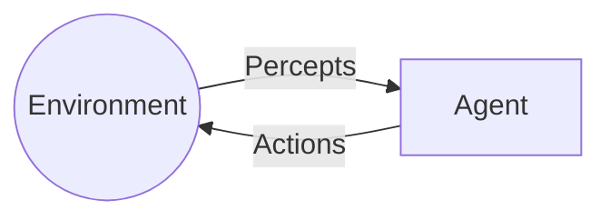
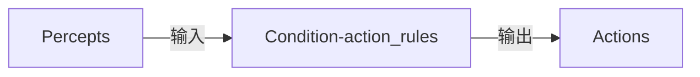
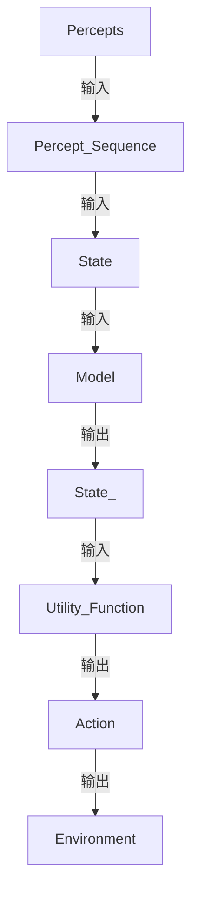
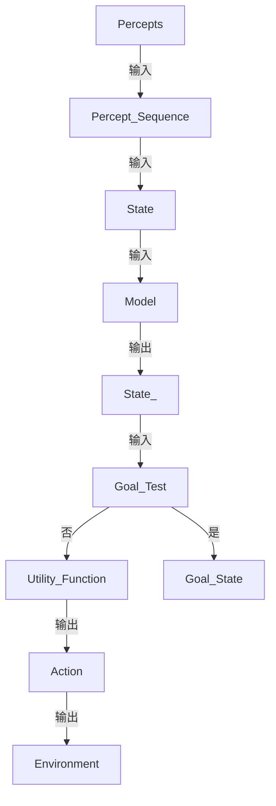
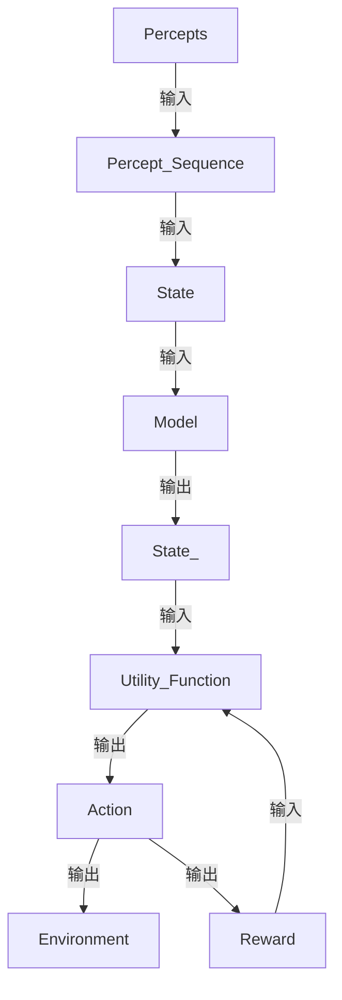
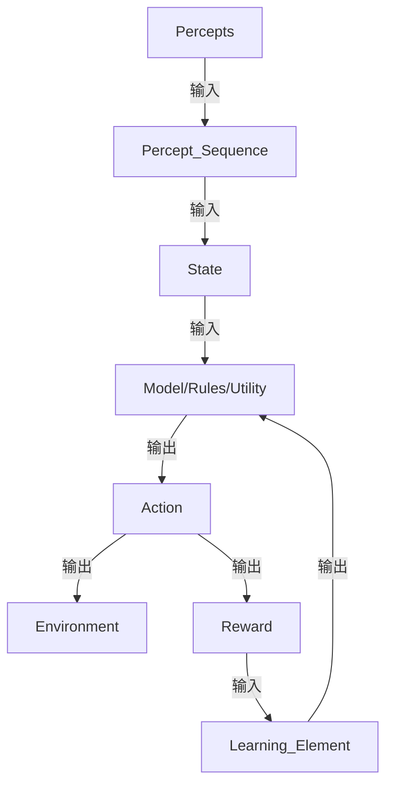

# AI Agent: AI的下一个风口 典型案例和商业应用

## 1.背景介绍

### 1.1 人工智能的发展历程

人工智能(Artificial Intelligence,AI)是当代最具革命性和颠覆性的技术之一。自20世纪50年代AI概念被正式提出以来,经历了起起伏伏的发展历程。

在早期阶段,AI主要集中在游戏领域,如国际象棋、围棋等,旨在模拟人类智能。随着算力和数据的快速增长,AI开始在语音识别、图像识别、自然语言处理等领域取得突破。

近年来,深度学习、强化学习等技术的兴起,使得AI系统在许多领域展现出超人类的能力,如阿尔法狗(AlphaGo)战胜人类顶尖围棋手、GPT-3展现出惊人的自然语言生成能力等,标志着AI已经进入一个全新的发展阶段。

### 1.2 AI Agent的兴起

在AI的发展过程中,Agent技术作为一种新兴的人工智能范式逐渐引起了广泛关注。AI Agent是指具备一定自主性、可以感知环境、做出决策并执行行为的智能体系统。

AI Agent的核心思想是将智能分解为感知(Perception)、决策(Decision Making)和行为(Action)三个环节,通过不断与环境交互来获取经验,进而优化决策,最终实现智能化目标。

相较于传统的AI系统,AI Agent具有更强的自主性和交互性,能够根据环境变化做出智能反应,更加贴近真实世界的应用场景。因此,AI Agent被视为AI发展的重要方向之一,在众多领域展现出巨大的应用潜力。

## 2.核心概念与联系

### 2.1 AI Agent的定义

AI Agent可以定义为:在特定环境中感知并持续地执行动作以实现既定目标的任何事物。一个AI Agent通过感知器(Sensors)获取环境状态,通过执行器(Actuators)对环境施加行为。

AI Agent的核心组成部分包括:

- 感知器(Sensors):用于获取环境状态信息
- 执行器(Actuators):用于对环境执行动作
- 程序(Program):根据感知信息做出决策并指导执行器的行为

### 2.2 AI Agent与环境的交互

AI Agent与环境之间存在持续的交互过程,可以用下图表示:

1. 环境向Agent提供当前状态的感知信息(Percepts)
2. Agent根据感知信息做出决策,并通过执行器执行相应动作(Actions)
3. Agent的动作影响并改变环境的状态
4. 重复上述过程

这种持续的交互过程使得Agent能够不断获取经验,优化决策,最终实现智能化目标。

### 2.3 AI Agent的分类

根据Agent与环境的交互方式,可将AI Agent分为以下几类:

- 简单反射Agent(Simple Reflex Agent)
- 基于模型的Agent(Model-based Agent)
- 基于目标的Agent(Goal-based Agent)
- 基于效用的Agent(Utility-based Agent)
- 学习Agent(Learning Agent)

不同类型的Agent在感知、决策和行为方面存在差异,适用于不同的应用场景。

## 3.核心算法原理具体操作步骤  

### 3.1 简单反射Agent

简单反射Agent是最基本的Agent类型,它只根据当前的感知信息做出反射性的决策和行为,不考虑历史信息和未来结果。其工作原理如下:

1. 获取当前环境状态的感知信息(Percepts)
2. 将感知信息与条件-动作规则(Condition-action rules)进行匹配
3. 执行与匹配条件相对应的动作(Actions)

简单反射Agent的优点是结构简单,反应迅速;缺点是无法利用历史经验,也无法预测未来结果,只能应对一些简单的静态环境。

### 3.2 基于模型的Agent

基于模型的Agent在简单反射Agent的基础上,增加了维护环境模型(Model)的功能,可以根据模型预测未来状态,从而做出更明智的决策。其工作流程如下:

1. 获取当前环境状态的感知信息(Percepts)
2. 根据感知信息更新状态序列(Percept Sequence)
3. 根据状态序列推断出Agent当前的状态(State)
4. 利用环境模型(Model)预测在执行不同动作后的未来状态(State')
5. 基于效用函数(Utility Function)评估不同状态的效用值
6. 选择效用值最大的动作(Action)执行
7. 动作影响环境,进入下一个环境状态

基于模型的Agent通过建模和预测,可以做出更明智的决策,适用于一些可预测的确定性环境。但对于复杂动态环境,建模和预测的难度会大大增加。

### 3.3 基于目标的Agent

基于目标的Agent在基于模型的Agent的基础上,增加了目标信息,旨在通过一系列动作达成特定目标状态。其工作原理如下:

1. 获取当前环境状态的感知信息(Percepts)  
2. 根据感知信息更新状态序列(Percept Sequence)
3. 根据状态序列推断出Agent当前的状态(State)
4. 利用环境模型(Model)预测在执行不同动作后的未来状态(State')
5. 检查未来状态是否达到目标状态(Goal Test)
6. 若未达到目标状态,基于效用函数(Utility Function)评估不同状态的效用值,选择效用值最大的动作执行
7. 若达到目标状态,则停止并返回目标状态(Goal State)
8. 动作影响环境,进入下一个环境状态

基于目标的Agent适用于有明确目标的决策过程,如机器人导航、游戏AI等,可以通过一系列动作有目标地达成特定任务。

### 3.4 基于效用的Agent

基于效用的Agent在基于目标的Agent的基础上,进一步考虑了不同状态和动作的效用值,旨在最大化长期的累积效用。其工作原理如下:

1. 获取当前环境状态的感知信息(Percepts)
2. 根据感知信息更新状态序列(Percept Sequence) 
3. 根据状态序列推断出Agent当前的状态(State)
4. 利用环境模型(Model)预测在执行不同动作后的未来状态(State')
5. 基于效用函数(Utility Function)评估不同状态序列的累积效用值
6. 选择累积效用值最大的动作序列的第一个动作(Action)执行
7. 动作影响环境,Agent获得相应的即时奖励(Reward)
8. 将奖励反馈给效用函数,用于更新累积效用值

基于效用的Agent旨在最大化长期的累积效用,可以处理一些无明确目标、需要权衡即时和长期收益的复杂决策问题,如机器人控制、资源调度等。

### 3.5 学习Agent

前面介绍的Agent都是基于已有的模型、规则或效用函数进行决策。而学习Agent则是通过与环境的交互,自主获取经验知识,从而优化其决策机制。学习Agent的工作原理如下:

1. 获取当前环境状态的感知信息(Percepts)
2. 根据感知信息更新状态序列(Percept Sequence)
3. 根据状态序列推断出Agent当前的状态(State)
4. 利用当前的模型/规则/效用函数做出动作决策(Action)
5. 动作影响环境,Agent获得相应的即时奖励(Reward)  
6. 学习元件(Learning Element)根据奖励信号,优化和更新模型/规则/效用函数
7. 重复上述过程

学习Agent通过不断与环境交互获取经验,持续优化其决策机制,从而逐步提高决策的准确性和效率。这种学习能力使得Agent可以应对未知复杂环境,具有很强的通用性和适应性。

常见的学习算法包括监督学习、非监督学习、强化学习等,可以应用于不同的学习Agent。

## 4.数学模型和公式详细讲解举例说明

在AI Agent的决策过程中,通常需要使用数学模型对环境状态、动作效用等进行量化和建模,以指导Agent的行为。下面将详细介绍一些常用的数学模型和公式。

### 4.1 马尔可夫决策过程(MDP)

马尔可夫决策过程(Markov Decision Process,MDP)是描述Agent与环境交互的基本数学框架,广泛应用于强化学习等领域。一个MDP可以用元组 $\langle S, A, P, R \rangle$ 来表示:

- $S$: 有限的状态集合
- $A$: 有限的动作集合  
- $P(s'|s,a)$: 状态转移概率,表示在状态$s$执行动作$a$后,转移到状态$s'$的概率
- $R(s,a)$: 奖励函数,表示在状态$s$执行动作$a$后获得的即时奖励

Agent的目标是找到一个策略$\pi: S \rightarrow A$,使得期望的累积奖励最大化:

$$
\max_\pi \mathbb{E}\left[\sum_{t=0}^\infty \gamma^t R(s_t, a_t) \right]
$$

其中$\gamma \in [0,1]$是折现因子,用于权衡即时奖励和长期奖励的重要性。

MDP为Agent的决策过程提供了统一的数学描述,并且具有很强的通用性,可以应用于各种不同的决策场景。

### 4.2 值函数和贝尔曼方程

在MDP框架下,我们可以定义状态值函数$V(s)$和动作值函数$Q(s,a)$,分别表示遵循某策略时,从状态$s$开始和从状态$s$执行动作$a$开始的期望累积奖励:

$$
\begin{aligned}
V^\pi(s) &= \mathbb{E}_\pi\left[\sum_{t=0}^\infty \gamma^t R(s_t, a_t) \big| s_0 = s \right] \\
Q^\pi(s, a) &= \mathbb{E}_\pi\left[\sum_{t=0}^\infty \gamma^t R(s_t, a_t) \big| s_0 = s, a_0 = a \right]
\end{aligned}
$$

状态值函数和动作值函数满足以下贝尔曼方程:

$$
\begin{aligned}
V^\pi(s) &= \sum_{a \in A} \pi(a|s) \sum_{s' \in S} P(s'|s,a) \left[ R(s,a) + \gamma V^\pi(s') \right] \\
Q^\pi(s, a) &= \sum_{s' \in S} P(s'|s,a) \left[ R(s,a) + \gamma \sum_{a' \in A} \pi(a'|s') Q^\pi(s', a') \right]
\end{aligned}
$$

贝尔曼方程为求解最优策略$\pi^*$提供了理论基础。