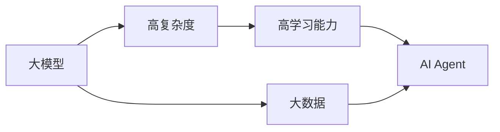

## 1.背景介绍

AI（人工智能）的发展历程中，每一个风口的出现，都伴随着技术的飞跃和应用的爆发。如今，我们正处于一个新的风口——大模型的时代。在这个时代，AI Agent（AI代理）的概念和应用逐渐成为了研究和应用的焦点。

## 2.核心概念与联系

AI Agent是一种能够感知环境，基于其目标进行决策，并采取行动以影响其环境的系统。它的核心在于能够自我学习和自我改进，以在复杂环境中达成目标。

AI Agent的出现，是由于大模型的发展。大模型，是指模型的参数量达到了亿级甚至更高的模型。这些模型的复杂度和学习能力都远超过之前的模型，使得AI Agent能够处理更为复杂的任务。

大模型和AI Agent之间的关系，可以用以下的Mermaid流程图来表示：



## 3.核心算法原理具体操作步骤

AI Agent的实现，离不开大模型的训练。而大模型的训练，主要包括以下步骤：

1. 数据准备：收集大量的数据，用于训练模型。这些数据应该覆盖到AI Agent需要处理的各种情况。

2. 模型设计：设计出能够处理复杂任务的大模型。这通常需要深度学习和强化学习的知识。

3. 模型训练：使用数据来训练模型。这个过程通常需要大量的计算资源。

4. 模型评估：评估模型的性能，包括其在训练集和测试集上的表现。

5. 模型优化：根据评估结果，优化模型的结构或者参数。

## 4.数学模型和公式详细讲解举例说明

在AI Agent的训练中，我们通常会使用到深度学习和强化学习的知识。其中，深度学习主要用于学习数据的表示，而强化学习则用于决策。

深度学习的核心是神经网络。一个神经网络可以表示为：

$$
f(x) = W_3\sigma(W_2\sigma(W_1x))
$$

其中，$W_1,W_2,W_3$是网络的参数，$\sigma$是激活函数，$x$是输入。

强化学习的核心是马尔可夫决策过程（MDP）。一个MDP可以表示为一个四元组$(S, A, P, R)$，其中$S$是状态空间，$A$是动作空间，$P$是状态转移概率，$R$是奖励函数。

## 5.项目实践：代码实例和详细解释说明

下面是一个简单的AI Agent的代码实例。这个AI Agent使用了深度强化学习的方法，用于玩简单的游戏。

```python
import gym
import numpy as np
from keras.models import Sequential
from keras.layers import Dense
from keras.optimizers import Adam

env = gym.make('CartPole-v1')
state_size = env.observation_space.shape[0]
action_size = env.action_space.n

model = Sequential()
model.add(Dense(24, input_dim=state_size, activation='relu'))
model.add(Dense(24, activation='relu'))
model.add(Dense(action_size, activation='linear'))
model.compile(loss='mse', optimizer=Adam())

for i_episode in range(1000):
    state = env.reset()
    for t in range(500):
        env.render()
        action = np.argmax(model.predict(state.reshape(1, state_size)))
        next_state, reward, done, _ = env.step(action)
        if done:
            reward = -reward
        model.fit(state.reshape(1, state_size), np.array([action]), epochs=1, verbose=0)
        state = next_state
        if done:
            print("Episode finished after {} timesteps".format(t+1))
            break
```

这个代码首先定义了一个神经网络模型，用于学习状态到动作的映射。然后，它在每个回合中，都会根据当前的状态选择动作，然后执行动作并接收奖励，最后用这个奖励来更新模型。

## 6.实际应用场景

AI Agent已经被广泛应用到各个领域中。比如，自动驾驶中的车辆控制，就是一个AI Agent。它需要根据当前的环境，做出驾驶的决策。又比如，推荐系统中的推荐策略，也可以看作是一个AI Agent。它需要根据用户的行为，做出推荐的决策。

## 7.工具和资源推荐

如果你想要实践AI Agent，以下是一些推荐的工具和资源：

- OpenAI Gym：一个用于开发和比较强化学习算法的工具包。
- TensorFlow：一个用于机器学习和深度学习的开源库。
- Keras：一个在TensorFlow之上的高级神经网络API。
- DeepMind's papers：DeepMind发布的关于深度学习和强化学习的论文。

## 8.总结：未来发展趋势与挑战

AI Agent是AI的下一个风口，大模型的发展使得AI Agent能够处理更为复杂的任务。然而，大模型也带来了新的挑战，比如计算资源的需求，模型的解释性等。未来，我们需要在解决这些挑战的同时，进一步发掘AI Agent的潜力。

## 9.附录：常见问题与解答

Q: AI Agent和传统的机器学习有什么区别？

A: AI Agent强调的是在环境中的决策，而传统的机器学习更多的是在给定的数据上进行预测。因此，AI Agent需要处理的问题更为复杂，也需要更强的学习能力。

Q: 大模型的训练需要什么样的计算资源？

A: 大模型的训练通常需要大量的计算资源，比如高性能的GPU和大量的存储空间。此外，训练大模型也需要大量的时间。

Q: 如何评估AI Agent的性能？

A: 评估AI Agent的性能，通常需要在一些标准的任务上进行测试。比如，OpenAI Gym提供了很多标准的任务，可以用于评估AI Agent的性能。

作者：禅与计算机程序设计艺术 / Zen and the Art of Computer Programming