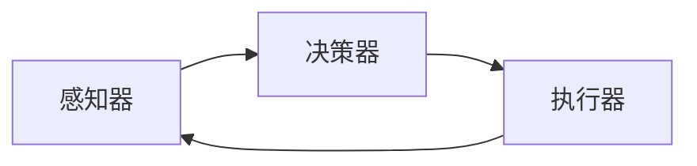

## 1.背景介绍

在人工智能(AI)的发展历程中，AI Agent已经成为了一个新的研究热点。它是一种能够感知环境并根据自身目标进行决策的实体，能够自我学习、自我改进，从而在复杂的环境中实现自我适应。

AI Agent的出现，是因为随着大数据、云计算、物联网等技术的发展，人工智能已经从实验室走向了实际的应用场景，而在这些复杂的场景中，传统的人工智能方法已经无法满足需求。AI Agent可以通过自我学习和决策，使得人工智能能够更好地适应这些环境，从而实现更高效的决策。

## 2.核心概念与联系

AI Agent主要由三个核心概念构成：感知器(Perceptor)、决策器(Decider)和执行器(Executor)。

感知器负责感知环境，获取环境的状态信息。决策器根据感知到的环境状态和自身的目标，进行决策。执行器根据决策结果，进行相应的行动。

AI Agent的工作流程如下：



## 3.核心算法原理具体操作步骤

AI Agent的核心算法主要包括感知算法、决策算法和执行算法。

感知算法主要包括图像识别、语音识别、数据采集等技术，用于获取环境的状态信息。

决策算法主要包括强化学习、遗传算法、神经网络等技术，用于根据环境状态和自身目标进行决策。

执行算法主要包括控制算法、优化算法等技术，用于根据决策结果进行行动。

## 4.数学模型和公式详细讲解举例说明

在AI Agent中，常用的数学模型包括马尔可夫决策过程(Markov Decision Process, MDP)和Q-learning。

马尔可夫决策过程是一种序列决策问题的数学模型，它包括一组状态、一组动作、一组奖励函数和一个转移概率矩阵。在每个时间步，Agent会选择一个动作，然后根据转移概率矩阵进入下一个状态，并获得相应的奖励。

Q-learning是一种基于值迭代的强化学习算法，它通过学习一个动作值函数(Q函数)，来决定在每个状态下应该执行哪个动作。Q函数的更新公式如下：

$$
Q(s, a) \leftarrow Q(s, a) + \alpha [r + \gamma \max_{a'} Q(s', a') - Q(s, a)]
$$

其中，$s$表示当前状态，$a$表示当前动作，$r$表示奖励，$s'$表示下一个状态，$a'$表示下一个动作，$\alpha$表示学习率，$\gamma$表示折扣因子。

## 5.项目实践：代码实例和详细解释说明

在Python中，我们可以使用OpenAI Gym库来实现一个简单的AI Agent。以下是一个使用Q-learning算法的例子：

```python
import gym
import numpy as np

# 创建环境
env = gym.make('FrozenLake-v0')

# 初始化Q表
Q = np.zeros([env.observation_space.n, env.action_space.n])

# 设置参数
alpha = 0.5
gamma = 0.95
num_episodes = 5000

# Q-learning算法
for i_episode in range(num_episodes):
    # 初始化状态
    state = env.reset()
    for t in range(100):
        # 选择动作
        action = np.argmax(Q[state, :] + np.random.randn(1, env.action_space.n) * (1. / (i_episode + 1)))
        # 执行动作
        next_state, reward, done, _ = env.step(action)
        # 更新Q表
        Q[state, action] = (1 - alpha) * Q[state, action] + alpha * (reward + gamma * np.max(Q[next_state, :]))
        # 更新状态
        state = next_state
        if done:
            break
```

## 6.实际应用场景

AI Agent在许多实际应用场景中都有广泛的应用，例如：

- 在自动驾驶中，AI Agent可以根据环境信息（如路况、交通信号等）和自身目标（如到达目的地），进行决策（如加速、减速、转向等），并执行相应的行动（如操作汽车）。

- 在智能家居中，AI Agent可以根据环境信息（如温度、湿度、光照等）和用户需求（如舒适、节能等），进行决策（如调节空调、开关灯等），并执行相应的行动（如控制家电）。

## 7.工具和资源推荐

- OpenAI Gym：一个用于开发和比较强化学习算法的工具库。

- TensorFlow：一个开源的机器学习框架，支持多种类型的机器学习和深度学习算法。

- PyTorch：一个开源的机器学习框架，支持动态神经网络。

## 8.总结：未来发展趋势与挑战

AI Agent作为人工智能的一个新的研究方向，有着广阔的应用前景。随着技术的发展，AI Agent将会更加智能，能够处理更复杂的任务，适应更复杂的环境。

但是，AI Agent也面临着一些挑战，例如如何处理不确定性、如何实现长期规划、如何保证安全性等。这些都是未来需要进一步研究和解决的问题。

## 9.附录：常见问题与解答

1. 问题：AI Agent和传统的AI有什么区别？

   答：AI Agent是一种能够感知环境并根据自身目标进行决策的实体，能够自我学习、自我改进，从而在复杂的环境中实现自我适应。而传统的AI通常是被动的，需要人为地设定规则和参数。

2. 问题：AI Agent如何进行决策？

   答：AI Agent通过学习一个策略（Policy），来决定在每个状态下应该执行哪个动作。这个策略可以通过各种强化学习算法来学习。

3. 问题：AI Agent在实际应用中有哪些挑战？

   答：AI Agent在实际应用中，可能会面临环境的不确定性、任务的复杂性、安全性等挑战。

---

作者：禅与计算机程序设计艺术 / Zen and the Art of Computer Programming