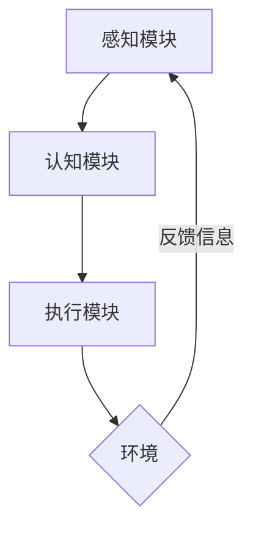

# AI Agent: AI的下一个风口 对研究者和实践者的建议

## 1. 背景介绍
### 1.1 人工智能的发展历程
#### 1.1.1 早期人工智能
#### 1.1.2 第一次人工智能寒冬
#### 1.1.3 第二次人工智能热潮
### 1.2 当前人工智能的现状
#### 1.2.1 深度学习的崛起 
#### 1.2.2 人工智能在各行业的应用
#### 1.2.3 人工智能面临的挑战
### 1.3 AI Agent的定义和特点
#### 1.3.1 AI Agent的定义
#### 1.3.2 AI Agent的特点
#### 1.3.3 AI Agent与传统AI的区别

人工智能(Artificial Intelligence, AI)自1956年达特茅斯会议提出以来，经历了早期的符号主义和专家系统热潮，两次人工智能寒冬，以及近年来以深度学习为代表的新一轮热潮。当前，人工智能技术已经在图像识别、语音识别、自然语言处理等领域取得了突破性进展，并在金融、医疗、教育、交通等众多行业得到广泛应用。

然而，当前的人工智能系统大多是专用于特定任务的狭义AI，缺乏通用性和自主性。为了实现更加智能和自主的AI系统，AI Agent作为一种新的范式和方向受到越来越多的关注。

AI Agent是一种能够感知环境、自主决策和执行动作，从而实现特定目标的智能体。与传统的AI系统相比，AI Agent具有更强的自主性、适应性和社会交互能力。AI Agent不仅能够处理结构化数据，还能够理解和生成自然语言、图像等非结构化数据，拥有多模态感知和认知能力。同时，AI Agent能够根据环境的反馈不断学习和优化策略，具备一定的自我完善能力。

## 2. 核心概念与联系
### 2.1 Agent的定义与分类
#### 2.1.1 Agent的定义
#### 2.1.2 反应型Agent
#### 2.1.3 认知型Agent
### 2.2 AI Agent的关键能力
#### 2.2.1 感知与建模能力
#### 2.2.2 推理与决策能力
#### 2.2.3 学习与适应能力  
### 2.3 AI Agent的系统架构
#### 2.3.1 感知模块
#### 2.3.2 认知模块
#### 2.3.3 执行模块

在AI Agent的研究中，Agent的概念是核心。Agent是一个能够感知环境并作出行动的实体，其目标是最大化一个长期的奖励信号。根据Agent的智能程度和结构，可以分为反应型Agent和认知型Agent。反应型Agent根据当前的感知直接做出反应，而认知型Agent则拥有内部状态表示，能够进行推理、规划和学习。 

AI Agent需要具备多方面的关键能力，包括：

1. 感知与建模能力：通过传感器获取环境信息，并构建环境的内部表示模型。
2. 推理与决策能力：根据当前的环境状态、目标和知识，进行逻辑推理和决策。
3. 学习与适应能力：根据新的观察数据不断更新知识，并调整策略以适应环境的变化。

为了实现上述能力，一个典型的AI Agent系统架构如下图所示：



感知模块负责接收来自环境的原始信息，并进行预处理和特征提取。认知模块包括了知识表示、推理引擎和学习算法等组件，负责对环境建模、生成决策和优化策略。执行模块则将决策转化为具体的动作指令，影响环境并获得反馈。

## 3. 核心算法原理具体操作步骤
### 3.1 强化学习算法
#### 3.1.1 马尔可夫决策过程
#### 3.1.2 值函数与策略函数
#### 3.1.3 时序差分学习
### 3.2 深度强化学习算法
#### 3.2.1 Deep Q-Network
#### 3.2.2 Policy Gradient
#### 3.2.3 Actor-Critic
### 3.3 多智能体强化学习算法
#### 3.3.1 纳什均衡与最优响应
#### 3.3.2 多智能体Actor-Critic
#### 3.3.3 Mean Field MARL

强化学习是AI Agent的核心算法之一。在强化学习框架下，Agent通过与环境的交互来学习最优策略。这个过程可以用马尔可夫决策过程(MDP)来建模，一个MDP由状态空间、动作空间、转移概率和奖励函数组成。Agent的目标是学习一个策略函数 $\pi(a|s)$，使得期望的累积奖励最大化。 

Q-Learning是一种经典的值函数型强化学习算法，它通过不断更新状态-动作值函数 $Q(s,a)$ 来逼近最优策略。Q-Learning的更新公式为：

$$Q(s,a) \leftarrow Q(s,a) + \alpha [r + \gamma \max_{a'} Q(s',a') - Q(s,a)]$$

其中，$\alpha$ 是学习率，$\gamma$ 是折扣因子。

近年来，深度强化学习算法通过引入深度神经网络来拟合值函数或策略函数，极大地提升了强化学习的表示能力和泛化能力。其中，Deep Q-Network (DQN)使用深度神经网络来拟合Q函数，并引入了经验回放和目标网络等技巧来提高稳定性。而Policy Gradient和Actor-Critic则直接学习参数化的策略函数，可以更好地处理连续动作空间。

在多智能体场景下，每个Agent既要考虑自身的最优策略，又要顾及其他Agent的策略，使得整个系统达到一个纳什均衡。多智能体强化学习算法如Multi-Agent Actor-Critic (MADDPG)通过集中式训练和分布式执行，让每个Agent学习一个基于本地观察的策略函数，同时考虑其他Agent的策略。Mean Field MARL则利用平均场理论来简化多智能体系统的建模和求解，假设每个Agent与一个平均效应场互动，从而将复杂的多智能体问题转化为单智能体问题。

## 4. 数学模型和公式详细讲解举例说明
### 4.1 马尔可夫决策过程
#### 4.1.1 MDP的定义与组成
#### 4.1.2 MDP的贝尔曼方程
#### 4.1.3 MDP的求解方法
### 4.2 动态规划与值迭代
#### 4.2.1 动态规划的原理
#### 4.2.2 值迭代算法
#### 4.2.3 值迭代算法的收敛性
### 4.3 蒙特卡洛方法与策略梯度
#### 4.3.1 蒙特卡洛估计的原理
#### 4.3.2 策略梯度定理
#### 4.3.3 REINFORCE算法

马尔可夫决策过程(MDP)是强化学习的基础。一个MDP可以表示为一个五元组 $\langle \mathcal{S}, \mathcal{A}, \mathcal{P}, \mathcal{R}, \gamma \rangle$，其中:

- $\mathcal{S}$ 是状态空间，$\mathcal{A}$ 是动作空间。
- $\mathcal{P}$ 是状态转移概率，$\mathcal{P}(s'|s,a)$ 表示在状态 $s$ 下执行动作 $a$ 后转移到状态 $s'$ 的概率。
- $\mathcal{R}$ 是奖励函数，$\mathcal{R}(s,a)$ 表示在状态 $s$ 下执行动作 $a$ 后获得的即时奖励。
- $\gamma \in [0,1]$ 是折扣因子，表示未来奖励的重要程度。

在MDP中，我们关心的是策略函数 $\pi(a|s)$ 和状态值函数 $V^{\pi}(s)$。它们满足贝尔曼方程：

$$V^{\pi}(s) = \sum_{a} \pi(a|s) \sum_{s', r} \mathcal{P}(s',r|s,a) [r + \gamma V^{\pi}(s')]$$

求解MDP的最优策略可以通过动态规划的值迭代算法。值迭代的更新公式为：

$$V_{k+1}(s) = \max_a \sum_{s', r} \mathcal{P}(s',r|s,a) [r + \gamma V_k(s')]$$

当 $V$ 收敛时，我们就得到了最优值函数 $V^*(s)$，进而可以得到最优策略：

$$\pi^*(a|s) = \arg\max_a \sum_{s', r} \mathcal{P}(s',r|s,a) [r + \gamma V^*(s')]$$

另一种求解MDP的方法是策略梯度。策略梯度定理指出，策略函数 $\pi_{\theta}(a|s)$ 关于参数 $\theta$ 的梯度为：

$$\nabla_{\theta} J(\theta) = \mathbb{E}_{\pi_{\theta}} [\nabla_{\theta} \log \pi_{\theta}(a|s) Q^{\pi_{\theta}}(s,a)]$$

其中，$Q^{\pi_{\theta}}(s,a)$ 是状态-动作值函数。REINFORCE算法通过蒙特卡洛方法来估计梯度，伪代码如下：

```
for each episode do
    Generate trajectory $(s_0, a_0, r_1, s_1, a_1, ..., s_{T-1}, a_{T-1}, r_T)$ following $\pi_{\theta}$
    for t = 0 to T-1 do
        G ← return from step t
        $\theta \leftarrow \theta + \alpha \gamma^t G \nabla_{\theta} \log \pi_{\theta}(a_t|s_t)$
    end for
end for
```

## 5. 项目实践：代码实例和详细解释说明
### 5.1 基于OpenAI Gym的强化学习代码实例
#### 5.1.1 环境介绍
#### 5.1.2 DQN算法实现
#### 5.1.3 训练过程与结果分析
### 5.2 基于Unity ML-Agents的AI Agent项目
#### 5.2.1 Unity ML-Agents简介
#### 5.2.2 创建自定义环境
#### 5.2.3 训练智能体
### 5.3 多智能体合作竞争项目
#### 5.3.1 多智能体任务设计
#### 5.3.2 MADDPG算法实现
#### 5.3.3 实验结果与分析

下面我们通过一个简单的基于OpenAI Gym的DQN代码实例来说明如何训练一个AI Agent。首先，我们导入必要的库并创建环境：

```python
import gym
import numpy as np
import tensorflow as tf

env = gym.make('CartPole-v0')
```

然后，我们定义DQN的网络结构和超参数：

```python
class DQN(tf.keras.Model):
    def __init__(self, state_dim, action_dim):
        super(DQN, self).__init__()
        self.dense1 = tf.keras.layers.Dense(64, activation='relu')
        self.dense2 = tf.keras.layers.Dense(64, activation='relu')
        self.out = tf.keras.layers.Dense(action_dim)

    def call(self, x):
        x = self.dense1(x)
        x = self.dense2(x)
        q_values = self.out(x)
        return q_values

state_dim = env.observation_space.shape[0]
action_dim = env.action_space.n
model = DQN(state_dim, action_dim)
optimizer = tf.keras.optimizers.Adam(learning_rate=0.001)
```

接下来，我们定义经验回放缓冲区和 $\epsilon$-贪心策略：

```python
class ReplayBuffer:
    def __init__(self, capacity):
        self.buffer = []
        self.capacity = capacity
        self.index = 0

    def store(self, state, action, reward, next_state, done):
        if len(self.buffer) < self.capacity:
            self.buffer.append(None)
        self.buffer[self.index] = (state, action, reward, next_state, done)
        self.index = (self.index + 1) % self.capacity

    def sample(self, batch_size):
        indices = np.random.choice(len(self.buffer), batch_size)
        states, actions, rewards, next_states, dones = zip(*[self.buffer[idx] for idx in indices])
        return np.array(states), np.array(actions), np.array(rewards), np.array(next_states), np.array(dones)

def epsilon_greedy(state, epsilon):
    if np.random.rand() < epsilon:
        return env.action_space.sample()
    else:
        q_values = model(state[np.newaxis])
        return np.argmax(q_values[0])
```

最