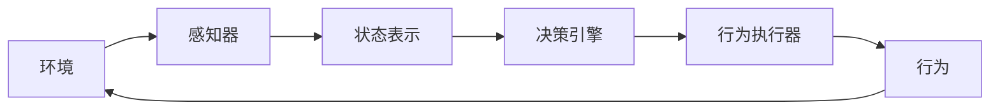

# AI Agent: AI的下一个风口 当前技术的局限性

## 1.背景介绍

### 1.1 人工智能的发展历程

人工智能(Artificial Intelligence, AI)是一门富有挑战性的科学,旨在探索赋予机器智能的根源,发展智能机器以辅助和扩展人类的能力。自20世纪50年代AI概念被正式提出以来,这一领域经历了几个重要的发展阶段。

#### 1.1.1 AI的起步阶段

在1956年,约翰·麦卡锡在达特矛斯学院主持召开了著名的"达特矛斯会议",首次正式使用了"人工智能"一词,标志着AI作为一个独立学科的诞生。当时,研究人员对AI的发展充满了乐观和热情,认为用规则和逻辑推理就能模拟人类智能。

#### 1.1.2 AI的低谷时期 

然而,在60年代末和70年代初,AI遇到了挫折,研究进展远远落后于预期。主要原因是当时的硬件计算能力有限,且缺乏足够的数据和算法支持。这一时期被称为"AI的第一次低谷"。

#### 1.1.3 AI的复兴与发展

20世纪80年代,随着专家系统的出现,AI重新焕发生机。90年代后,机器学习、神经网络等技术的兴起,为AI注入了新的活力。特别是近年来,大数据、强大的计算能力和深度学习算法的突破,推动了AI在语音识别、图像识别、自然语言处理等领域取得了长足进展。

### 1.2 AI Agent的兴起

在AI快速发展的浪潮中,AI Agent(智能代理)作为一种新兴的AI系统,备受关注。AI Agent是能够感知环境、处理信息、做出决策并采取行动的智能体,旨在代表人类执行特定任务。

AI Agent的概念源于经典的"理性代理"模型,将智能视为一个映射过程:根据感知到的环境状态,选择最佳行为序列以实现既定目标。随着技术的进步,AI Agent逐渐从简单的规则系统,发展到基于机器学习的智能决策系统。

如今,AI Agent已广泛应用于多个领域,如游戏AI、智能助理、自动驾驶汽车、机器人控制等。它们能够自主学习、决策和行动,显示出越来越高的智能水平,被视为AI的下一个风口。

## 2.核心概念与联系  

### 2.1 AI Agent的定义

AI Agent是一种能够感知环境、处理信息、做出决策并采取行动的智能体系统,旨在代表人类或其他实体执行特定任务。它通过与环境交互来实现既定目标。

形式上,AI Agent可以表示为一个函数映射:

$$f: P^* \rightarrow A$$

其中,P是Agent可感知的环境状态的集合,A是Agent可执行的行为集合。函数f将Agent过去的所有感知序列(P*)映射为下一个要采取的行为。

### 2.2 AI Agent的核心组成部分

一个典型的AI Agent系统由以下几个核心组件组成:

1. **感知器(Sensors)**: 用于获取环境状态信息的模块。
2. **状态表示(State Representation)**: 对感知到的环境信息进行编码和表示的模块。
3. **决策引擎(Decision Engine)**: 根据当前状态和目标,决策下一步要采取的行为。
4. **行为执行器(Actuators)**: 将决策的行为转化为具体动作,并在环境中执行。



### 2.3 AI Agent的分类

根据决策引擎的不同,AI Agent可分为以下几种类型:

1. **基于规则的Agent**: 依赖预定义的规则和知识库进行决策。
2. **基于案例的Agent**: 通过检索相似案例的解决方案来决策。
3. **基于模型的Agent**: 构建环境模型,并基于模型预测来决策。
4. **基于目标的Agent**: 根据目标效用函数,选择最优行为序列。
5. **基于学习的Agent**: 通过机器学习算法从经验中学习决策策略。

其中,基于学习的Agent是当前研究的热点,如深度强化学习等。

### 2.4 AI Agent的评估标准

评估一个AI Agent系统的好坏,通常考虑以下几个标准:

1. **理性性(Rationality)**: 做出理性决策以最大化期望效用。
2. **自主性(Autonomy)**: 能够自主感知、决策和行动。 
3. **反应性(Reactivity)**: 能够及时感知环境变化并作出反应。
4. **主动性(Pro-activeness)**: 不仅被动反应,还能主动达成目标。
5. **持续性(Continuity)**: 在动态环境中持续稳定运行。

## 3.核心算法原理具体操作步骤

AI Agent的核心是决策引擎模块,即如何根据当前状态做出最优决策。主流的决策算法有:

### 3.1 基于搜索的决策

#### 3.1.1 盲目搜索算法

盲目搜索算法不利用环境的任何知识,只关注问题本身的性质,通过系统地构造和检查路径节点来寻找解决方案。常见的有:

1. **广度优先搜索(Breadth-First Search, BFS)**
2. **深度优先搜索(Depth-First Search, DFS)** 
3. **迭代加深搜索(Iterative Deepening Search, IDS)**

这些算法易于实现,但在复杂问题上效率低下。

#### 3.1.2 启发式搜索算法

启发式搜索算法利用问题特定的启发信息来引导搜索,提高效率。常见的有:

1. **贪婪最佳优先搜索(Greedy Best-First Search)**
2. **A*搜索算法**
3. **IDA*搜索算法**

其中,A*算法是最著名和最广泛使用的启发式搜索算法。

### 3.2 基于规划的决策

规划是一种自动构造行为序列以实现目标的过程。常见的规划算法有:

1. **情景规划(Situational Planning)**
2. **经典规划(Classical Planning)**
3. **层次任务网络规划(Hierarchical Task Network Planning)**

规划算法通过构造行为序列来解决复杂目标,但需要对环境和目标进行精确建模,且计算复杂度较高。

### 3.3 基于学习的决策

基于学习的决策算法通过从经验中学习,自动获取决策策略,无需人工指定规则或模型。主要算法有:

#### 3.3.1 监督学习算法

监督学习算法通过学习输入-输出示例对,获取映射函数。在AI Agent中,可用于学习状态到行为的映射策略。常见算法有:

- 决策树
- 支持向量机
- 深度神经网络等

#### 3.3.2 无监督学习算法

无监督学习算法在没有标注数据的情况下,从数据中发现内在结构和模式。在AI Agent中,可用于发现环境的隐含状态和规律。常见算法有:

- 聚类算法
- 关联规则挖掘
- 潜在语义分析等

#### 3.3.3 强化学习算法

强化学习是一种基于奖赏机制的学习方式,Agent通过与环境交互并获得奖赏信号,不断调整决策策略以最大化长期累积奖赏。这种方式无需事先标注数据,能够直接从环境中学习最优策略。

常见的强化学习算法有:

- Q-Learning
- Sarsa
- 策略梯度算法
- 深度Q网络(DQN)
- 深度确定性策略梯度等

其中,结合深度神经网络的算法(如DQN)在复杂环境中表现出色,是当前研究的热点。

### 3.4 多智能体系统

在复杂环境中,单一Agent的能力往往是有限的。多智能体系统(Multi-Agent System, MAS)通过让多个Agent相互协作,以实现无法由单个Agent完成的复杂任务。

MAS中的关键问题是如何实现Agent之间的协调与合作。常见的方法有:

- 基于协议的协调
- 基于组织的协调
- 基于市场的协调
- 基于学习的协调(如多智能体强化学习)

## 4.数学模型和公式详细讲解举例说明

### 4.1 马尔可夫决策过程

马尔可夫决策过程(Markov Decision Process, MDP)是形式化描述Agent与环境交互的重要数学模型。一个MDP可以用一个四元组来表示:

$$\langle S, A, P, R\rangle$$

其中:
- $S$是环境的有限状态集合
- $A$是Agent可执行的有限行为集合  
- $P(s'|s,a)$是状态转移概率,表示在状态$s$执行行为$a$后,转移到状态$s'$的概率
- $R(s,a)$是在状态$s$执行行为$a$后获得的奖赏

MDP的目标是找到一个策略$\pi: S \rightarrow A$,使Agent在该策略下的长期累积奖赏最大化:

$$\max_\pi \mathbb{E}\left[\sum_{t=0}^\infty \gamma^t R(s_t, a_t)\right]$$

其中$\gamma \in [0,1]$是折现因子,用于权衡当前和未来奖赏的重要性。

### 4.2 值函数和Q函数

在MDP中,值函数$V^\pi(s)$定义为在状态$s$执行策略$\pi$后的期望累积奖赏:

$$V^\pi(s) = \mathbb{E}_\pi\left[\sum_{t=0}^\infty \gamma^t R(s_t, a_t) | s_0 = s\right]$$

Q函数$Q^\pi(s,a)$则定义为在状态$s$执行行为$a$,之后再执行策略$\pi$的期望累积奖赏:

$$Q^\pi(s,a) = \mathbb{E}_\pi\left[\sum_{t=0}^\infty \gamma^t R(s_t, a_t) | s_0 = s, a_0 = a\right]$$

值函数和Q函数满足以下贝尔曼方程:

$$\begin{aligned}
V^\pi(s) &= \sum_{a \in A} \pi(a|s)Q^\pi(s,a) \\
Q^\pi(s,a) &= R(s,a) + \gamma \sum_{s' \in S} P(s'|s,a)V^\pi(s')
\end{aligned}$$

贝尔曼方程为求解最优策略$\pi^*$提供了理论基础。

### 4.3 策略迭代算法

策略迭代是一种经典的求解MDP最优策略的算法,包含两个阶段交替进行:

1. **策略评估**:对于给定的策略$\pi$,计算其值函数$V^\pi$
2. **策略改进**:基于$V^\pi$,构造一个更优的策略$\pi'$

具体算法如下:

```
初始化任意策略 $\pi_0$
repeat:
    $V \gets V^{\pi_i}$ (策略评估)
    $\pi_{i+1} \gets \text{greedy}(V)$ (策略改进)
until $\pi_{i+1} = \pi_i$ (策略收敛)
return $\pi_*$ (最优策略)
```

策略评估阶段可以通过求解贝尔曼方程组来实现。策略改进阶段则是针对每个状态$s$,选择能够最大化$Q(s,a)$的行为$a$作为新策略。

### 4.4 时序差分学习

时序差分(Temporal Difference, TD)学习是一种无模型的强化学习算法,它通过估计值函数的时序差分来更新值函数,而不需要建模环境的转移概率和奖赏模型。

TD学习的核心思想是:

$$V(s_t) \leftarrow V(s_t) + \alpha \left(r_{t+1} + \gamma V(s_{t+1}) - V(s_t)\right)$$

即使用时序差分$r_{t+1} + \gamma V(s_{t+1}) - V(s_t)$作为更新的目标,以逐步改进状态值估计$V(s_t)$。

TD学习的一个著名算法是Q-Learning,它直接估计Q函数:

$$Q(s_t, a_t) \leftarrow Q(s_t, a_t) + \alpha \left(r_{t+1} + \gamma \max_{a'}Q(s_{t+1