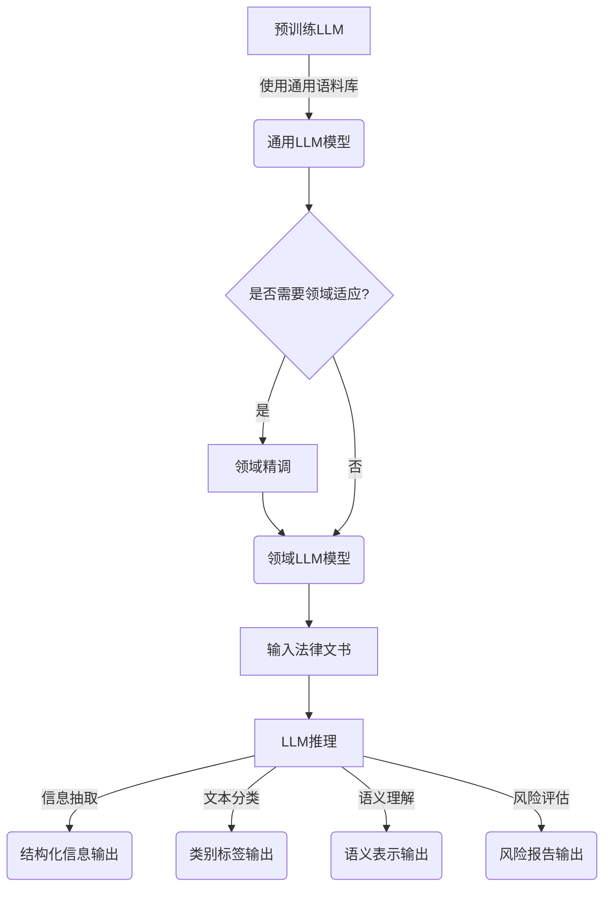

# AI LLM在法律文书分析中的应用

## 1.背景介绍

随着人工智能技术的不断发展,大型语言模型(Large Language Model,LLM)在自然语言处理领域展现出了令人惊叹的能力。LLM通过从海量文本数据中学习,能够掌握人类语言的丰富语义和语法知识,从而具备出色的文本生成、理解和分析能力。

在法律领域,文书分析是一项极为重要且具有挑战性的任务。法律文书通常使用专业术语和复杂句式,需要专业的法律知识和语言理解能力才能准确解读。传统的基于规则的方法往往效率低下,且难以处理语义歧义和细微差异。而LLM恰恰能够在这一领域大显身手,为法律文书分析提供了新的解决方案。

## 2.核心概念与联系

### 2.1 大型语言模型(LLM)

LLM是一种基于深度学习的自然语言处理模型,通过在大规模文本语料库上进行预训练,学习语言的统计规律和语义知识。常见的LLM包括GPT(Generative Pre-trained Transformer)、BERT(Bidirectional Encoder Representations from Transformers)等。

LLM具有以下关键特点:

- 大规模参数:LLM通常包含数十亿甚至上百亿个参数,使其能够捕捉复杂的语言模式。
- 通用性:LLM在预训练过程中学习了通用的语言知识,可应用于多种自然语言处理任务。
- 上下文理解:LLM能够理解文本的上下文语义,而不仅仅是关键词匹配。
- 生成能力:LLM不仅能够理解文本,还能够生成连贯、流畅的文本输出。

### 2.2 法律文书分析

法律文书分析是指对法律文件(如合同、判决书、法律意见书等)进行自动化处理和分析,以提取关键信息、识别法律要素、发现潜在风险等。主要任务包括:

- 信息抽取:从法律文书中提取实体(如人名、地名、日期等)、事件、关系等结构化信息。
- 文本分类:将法律文书归类到预定义的类别(如合同类型、诉讼类型等)。
- 语义理解:深入理解法律文书的语义含义,捕捉隐含的法律概念和逻辑关系。
- 风险评估:识别法律文书中存在的潜在风险和争议点。

传统的法律文书分析方法主要依赖于基于规则的方法和统计机器学习模型,存在一定局限性。而LLM凭借其强大的语言理解和生成能力,为法律文书分析提供了新的解决方案。

## 3.核心算法原理具体操作步骤

将LLM应用于法律文书分析的核心算理步骤如下:



1. **预训练LLM**:使用海量通用语料库(如网页、书籍、新闻等)对LLM进行预训练,获得通用的语言模型。常用的预训练方法包括掩码语言模型(Masked Language Modeling)和下一句预测(Next Sentence Prediction)等。

2. **领域适应(可选)**:根据具体应用场景,可以使用领域语料库(如法律文书、法律案例等)对通用LLM进行进一步的精调(Fine-tuning),以获得更加专注于法律领域的LLM模型。

3. **输入法律文书**:将待分析的法律文书文本输入到LLM模型中。

4. **LLM推理**:LLM模型对输入的法律文书进行推理,生成相应的输出。根据具体任务,输出可以是结构化信息、文本分类标签、语义表示或风险评估报告等。

5. **输出结果**:根据任务需求,对LLM模型的输出进行后处理和呈现,生成最终的分析结果。

需要注意的是,LLM模型的性能在很大程度上取决于预训练语料库的质量和规模,以及模型架构和训练策略的选择。此外,对于一些高风险的法律应用场景,LLM模型的输出还需要经过人工审查和校验,以确保结果的准确性和合规性。

## 4.数学模型和公式详细讲解举例说明

LLM通常采用基于Transformer的序列到序列(Seq2Seq)模型架构。Transformer是一种全注意力(Self-Attention)机制,能够有效捕捉输入序列中任意两个位置之间的依赖关系,从而更好地建模长距离依赖。

Transformer的核心是多头注意力(Multi-Head Attention)机制,其数学表达式如下:

$$\mathrm{MultiHead}(Q, K, V) = \mathrm{Concat}(head_1, \ldots, head_h)W^O$$
$$\text{where} \quad head_i = \mathrm{Attention}(QW_i^Q, KW_i^K, VW_i^V)$$

其中:
- $Q$、$K$、$V$分别表示查询(Query)、键(Key)和值(Value)矩阵
- $W_i^Q$、$W_i^K$、$W_i^V$和$W^O$是可学习的权重矩阵
- $\mathrm{Attention}$函数计算注意力权重,定义如下:

$$\mathrm{Attention}(Q, K, V) = \mathrm{softmax}(\frac{QK^T}{\sqrt{d_k}})V$$

- $d_k$是缩放因子,用于防止内积过大导致的梯度饱和

多头注意力机制通过线性投影将$Q$、$K$、$V$分别映射到不同的子空间,然后在每个子空间内计算注意力,最后将所有注意力头的结果拼接在一起,从而捕捉不同的依赖关系。

除了注意力机制外,Transformer还采用了位置编码(Positional Encoding)来注入序列的位置信息,以及层归一化(Layer Normalization)和残差连接(Residual Connection)等技术来加速训练和提高模型性能。

在法律文书分析任务中,LLM模型通常采用BERT等双向Transformer编码器作为基础,并在此基础上进行进一步的微调。以命名实体识别(Named Entity Recognition)为例,常见的方法是将BERT的输出传递给一个线性层和CRF(条件随机场)层,对每个词标注其实体类型。具体的损失函数可以定义为:

$$\mathcal{L}(\theta) = -\sum_{i=1}^N \log P(y_i|X, \theta)$$

其中$X$是输入序列,$y_i$是第$i$个词的实体标签,$\theta$是模型参数,目标是最大化条件概率$P(y_i|X, \theta)$。

通过上述数学模型和算法,LLM能够有效地捕捉法律文书的语义信息,为各种下游任务提供强大的语言理解和生成能力。

## 5.项目实践:代码实例和详细解释说明

以下是一个使用Hugging Face的Transformers库对法律文书进行命名实体识别的Python代码示例:

```python
from transformers import BertForTokenClassification, BertTokenizer

# 加载预训练的BERT模型和分词器
model = BertForTokenClassification.from_pretrained('bert-base-uncased')
tokenizer = BertTokenizer.from_pretrained('bert-base-uncased')

# 示例法律文书
text = "John Doe filed a lawsuit against Acme Corp. on January 1, 2022 in New York City."

# 对输入文本进行分词和编码
inputs = tokenizer.encode_plus(text, return_tensors='pt', padding=True)

# 使用BERT模型进行推理
outputs = model(**inputs)[0]

# 对输出进行解码和处理
predictions = torch.argmax(outputs, dim=2)
tokens = tokenizer.convert_ids_to_tokens(inputs['input_ids'][0])

# 打印结果
print("Text:", text)
print("Tokens:", tokens)
print("Predictions:", [model.config.id2label[pred.item()] for pred in predictions[0]])
```

代码解释:

1. 首先导入必要的模块和类,包括`BertForTokenClassification`(用于标记分类任务)和`BertTokenizer`(用于分词和编码)。

2. 加载预训练的BERT模型和分词器。这里使用了`bert-base-uncased`模型,但也可以根据需要加载其他预训练模型。

3. 定义一个示例的法律文书文本。

4. 使用分词器对输入文本进行分词和编码,生成模型所需的输入张量。

5. 将编码后的输入传递给BERT模型,获取输出张量。

6. 对输出张量进行解码和后处理,获取每个词的预测标签。

7. 打印原始文本、分词结果和预测的标签序列。

上述代码展示了如何使用Hugging Face的Transformers库将BERT应用于法律文书的命名实体识别任务。在实际应用中,您可能还需要对模型进行微调,以提高在特定领域的性能。此外,您还可以使用其他NLP任务的BERT变体模型(如BertForSequenceClassification用于文本分类)来满足不同的需求。

## 6.实际应用场景

LLM在法律文书分析领域具有广泛的应用前景,可以为法律从业人员提供高效、准确的辅助工具,提高工作效率和决策质量。以下是一些典型的应用场景:

1. **合同审查**:使用LLM自动分析合同文本,提取关键条款、识别风险点、检查合同一致性等,大幅减少人工审查的工作量。

2. **法律研究**:LLM能够快速检索和理解大量的法律文献、案例和判决书,为律师提供有价值的法律依据和参考。

3. **电子数据开示(eDiscovery)**:在诉讼过程中,LLM可以高效地从海量文档中识别出相关证据,加快证据开示流程。

4. **法律咨询**:基于LLM构建智能问答系统,为普通用户提供个性化的法律咨询服务。

5. **法律风险评估**:LLM能够分析公司内部文件、合同等,识别潜在的法律风险,为企业决策提供参考。

6. **法律文书自动生成**:利用LLM的文本生成能力,根据输入的关键信息自动生成标准化的法律文书,如合同、申请书等。

7. **法律知识图谱构建**:从大量法律文献中自动抽取实体、关系和事件,构建知识图谱,为法律领域的知识管理和推理提供支持。

需要注意的是,虽然LLM展现出了巨大的潜力,但在实际应用中仍需要与人工专家密切配合,确保输出结果的准确性和合规性。同时,也需要注意LLM模型潜在的偏差和隐私风险,采取必要的策略来规避这些问题。

## 7.工具和资源推荐

在将LLM应用于法律文书分析时,以下工具和资源可能会非常有用:

1. **预训练语言模型**:
   - Hugging Face Transformers库:提供了多种预训练的LLM模型,如BERT、GPT等,以及用于微调和推理的工具。
   - AllenNLP:一个强大的NLP开源库,包含多种预训练模型和任务构建工具。
   - fairseq:Meta AI研发的序列建模工具包,支持多种LLM模型的训练和推理。

2. **标注数据**:
   - CUAD (Case Law Auxiliary Dataset):一个包含约6万份法律案例文书的开源数据集。
   - LexGLUE:一个针对法律NLP任务的基准测试集,包括合同审查、电子数据开示等任务。
   - 行业内部数据:企业或机构自有的法律文书数据,经过适当的标注和处理后可用于模型训练。

3. **开发框架**:
   - spaCy:一个用于构建NLP应用程序的开源库,提供了命名实体识别、关系提取等功能。
   - NLTK:经典的NLP工具包,包含