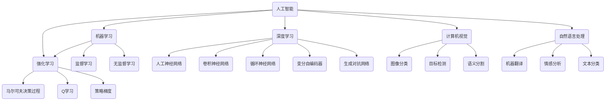

# AI 原理与代码实例讲解

## 1. 背景介绍

人工智能(AI)是当代科技领域最具革命性和影响力的技术之一。它旨在模拟人类的认知功能,如学习、推理、感知和决策,并将这些功能应用于各种领域,包括计算机视觉、自然语言处理、机器人技术、游戏等。随着算力的不断提升和数据的快速积累,AI技术正在经历爆炸式的发展,给我们的生活、工作和社会带来了深远的影响。

### 1.1 人工智能的发展历程

人工智能的概念可以追溯到20世纪40年代,当时一些科学家和数学家提出了"智能机器"的设想。1956年,约翰·麦卡锡在达特茅斯学院召开的一次会议上正式提出了"人工智能"这一术语。此后,AI经历了几个重要的发展阶段:

1. 初期阶段(1956-1974):专家系统、博弈程序等取得了一些进展,但受限于计算能力和数据量。
2. 停滞时期(1974-1980):由于过度乐观的预期和资金短缺,AI发展陷入停滞。
3. 知识驱动时期(1980-1987):专家系统、知识表示等技术得到发展,但仍然局限于特定领域。
4. 统计学习时期(1987-现在):机器学习、深度学习等技术的兴起,推动了AI的快速发展。

### 1.2 人工智能的重要分支

人工智能包括多个重要分支,每个分支都有自己的研究重点和应用场景:

- **机器学习(Machine Learning)**: 赋予系统从数据中自主学习和改进的能力,是AI的核心驱动力。
- **深度学习(Deep Learning)**: 一种基于人工神经网络的机器学习技术,可以从大量数据中自动学习特征表示。
- **计算机视觉(Computer Vision)**: 赋予机器识别、理解和处理图像或视频数据的能力。
- **自然语言处理(Natural Language Processing)**: 使计算机能够理解、处理和生成人类语言。
- **机器人技术(Robotics)**: 设计和构建具有感知、决策和行动能力的智能机器人系统。
- **专家系统(Expert Systems)**: 将人类专家的知识和经验编码到计算机系统中,用于解决特定领域的复杂问题。

这些分支相互交叉和影响,共同推动着人工智能技术的发展和应用。

## 2. 核心概念与联系

人工智能涉及多个核心概念,这些概念相互关联,构成了AI技术的理论基础和实践框架。

### 2.1 机器学习

机器学习是人工智能的核心驱动力,它赋予系统从数据中自主学习和改进的能力。机器学习可以分为三大类:

1. **监督学习(Supervised Learning)**: 使用带有标签的训练数据,学习将输入映射到输出的函数。常见算法包括线性回归、逻辑回归、决策树、支持向量机等。
2. **无监督学习(Unsupervised Learning)**: 从未标记的数据中发现隐藏的模式或内在结构。常见算法包括聚类、降维、关联规则挖掘等。
3. **强化学习(Reinforcement Learning)**: 通过与环境的交互,学习如何采取行动以最大化累积奖励。常见算法包括Q-Learning、策略梯度等。

### 2.2 深度学习

深度学习是一种基于人工神经网络的机器学习技术,它可以从大量数据中自动学习特征表示,并在许多任务上取得了卓越的性能。常见的深度学习模型包括:

- **人工神经网络(Artificial Neural Networks, ANN)**: 模拟生物神经元的工作原理,通过层次结构学习数据特征。
- **卷积神经网络(Convolutional Neural Networks, CNN)**: 专门用于处理网格数据(如图像)的神经网络,具有局部连接、权值共享和池化等特性。
- **循环神经网络(Recurrent Neural Networks, RNN)**: 适用于序列数据(如文本、语音)的神经网络,能够捕捉序列中的长期依赖关系。
- **变分自编码器(Variational Autoencoders, VAE)**: 一种生成模型,可以学习数据的潜在表示并生成新的样本。
- **生成对抗网络(Generative Adversarial Networks, GAN)**: 由生成器和判别器组成的对抗模型,可以生成逼真的数据样本。

### 2.3 计算机视觉

计算机视觉赋予机器识别、理解和处理图像或视频数据的能力。它涉及多个核心任务:

- **图像分类(Image Classification)**: 将图像归类到预定义的类别中。
- **目标检测(Object Detection)**: 定位图像中的目标对象,并将其归类。
- **语义分割(Semantic Segmentation)**: 对图像中的每个像素进行分类,将图像分割成多个语义区域。

### 2.4 自然语言处理

自然语言处理使计算机能够理解、处理和生成人类语言。它包括多个核心任务:

- **机器翻译(Machine Translation)**: 将一种自然语言转换为另一种语言。
- **情感分析(Sentiment Analysis)**: 确定文本中表达的情感极性(正面、负面或中性)。
- **文本分类(Text Classification)**: 将文本归类到预定义的类别中。

### 2.5 强化学习

强化学习是一种基于奖惩机制的学习范式,通过与环境的交互,学习如何采取行动以最大化累积奖励。它涉及以下核心概念:

- **马尔可夫决策过程(Markov Decision Process, MDP)**: 描述了智能体与环境之间的交互过程。
- **Q-Learning**: 一种基于价值函数的强化学习算法,用于估计每个状态-行动对的价值。
- **策略梯度(Policy Gradient)**: 一种基于策略的强化学习算法,直接优化策略函数以最大化期望回报。

## 3. 核心算法原理具体操作步骤

在本节中,我们将深入探讨一些核心算法的原理和具体操作步骤,以加深对人工智能技术的理解。

### 3.1 线性回归

线性回归是一种常见的监督学习算法,用于预测连续值的目标变量。它假设目标变量和特征变量之间存在线性关系,并通过最小化误差平方和来估计模型参数。

算法步骤:

1. 收集数据,包括特征变量 $X$ 和目标变量 $y$。
2. 初始化模型参数 $\theta = (\theta_0, \theta_1, \ldots, \theta_n)$,其中 $\theta_0$ 是偏置项。
3. 定义代价函数 $J(\theta) = \frac{1}{2m} \sum_{i=1}^m (h_\theta(x^{(i)}) - y^{(i)})^2$,其中 $h_\theta(x) = \theta^T x$ 是线性假设函数。
4. 使用梯度下降法优化代价函数:
   $$\theta_j := \theta_j - \alpha \frac{\partial}{\partial \theta_j} J(\theta)$$
   其中 $\alpha$ 是学习率,梯度为:
   $$\frac{\partial}{\partial \theta_j} J(\theta) = \frac{1}{m} \sum_{i=1}^m (h_\theta(x^{(i)}) - y^{(i)}) x_j^{(i)}$$
5. 重复步骤4,直到收敛或达到最大迭代次数。

线性回归虽然简单,但在许多实际问题中仍然有效,并且为理解更复杂的算法奠定了基础。

### 3.2 逻辑回归

逻辑回归是一种常用的分类算法,用于预测离散值的目标变量。它通过sigmoid函数将线性回归的输出映射到0到1之间的概率值,从而实现二分类。

算法步骤:

1. 收集数据,包括特征变量 $X$ 和二元目标变量 $y \in \{0, 1\}$。
2. 初始化模型参数 $\theta = (\theta_0, \theta_1, \ldots, \theta_n)$。
3. 定义sigmoid函数 $g(z) = \frac{1}{1 + e^{-z}}$,以及假设函数 $h_\theta(x) = g(\theta^T x)$。
4. 定义代价函数:
   $$J(\theta) = -\frac{1}{m} \sum_{i=1}^m [y^{(i)} \log h_\theta(x^{(i)}) + (1 - y^{(i)}) \log (1 - h_\theta(x^{(i)}))]$$
5. 使用梯度下降法优化代价函数:
   $$\theta_j := \theta_j - \alpha \frac{\partial}{\partial \theta_j} J(\theta)$$
   其中梯度为:
   $$\frac{\partial}{\partial \theta_j} J(\theta) = \frac{1}{m} \sum_{i=1}^m (h_\theta(x^{(i)}) - y^{(i)}) x_j^{(i)}$$
6. 重复步骤5,直到收敛或达到最大迭代次数。
7. 对于新的输入 $x$,如果 $h_\theta(x) \geq 0.5$,则预测为正类,否则为负类。

逻辑回归广泛应用于二分类问题,如垃圾邮件检测、疾病诊断等。通过改变假设函数和代价函数,它也可以扩展到多分类问题。

### 3.3 决策树

决策树是一种常用的监督学习算法,可以用于分类和回归任务。它通过递归地构建决策树,将特征空间划分为多个区域,每个区域对应一个预测值。

**决策树构建算法**:

1. 从根节点开始,对于每个节点:
   a. 计算每个特征的信息增益或基尼指数,选择最优特征进行分裂。
   b. 根据最优特征的取值创建子节点。
2. 重复步骤1,直到满足停止条件(如最大深度、最小样本数等)。
3. 对于叶节点,分配该节点的预测值(对于分类,可以是类别概率或多数类;对于回归,可以是平均值)。

**决策树预测**:

1. 从根节点开始,根据输入样本的特征值遍历决策树。
2. 当到达叶节点时,返回该节点的预测值。

决策树具有可解释性强、处理数值和类别特征的能力等优点,但也容易过拟合。通常需要使用集成方法(如随机森林)来提高性能和鲁棒性。

### 3.4 支持向量机

支持向量机(SVM)是一种有监督的机器学习算法,主要用于分类和回归任务。它的基本思想是在高维空间中构建一个超平面,将不同类别的样本分开,并最大化边界的间隔。

**SVM分类算法**:

1. 将训练数据映射到高维特征空间。
2. 在特征空间中,找到能够最大化边界间隔的超平面,即:
   $$\begin{align*}
   \max_{w, b} & \quad \frac{1}{\|w\|} \\
   \text{s.t.} & \quad y^{(i)}(w^T x^{(i)} + b) \geq 1, \quad i = 1, \ldots, m
   \end{align*}$$
   其中 $w$ 是超平面的法向量, $b$ 是偏置项。
3. 引入松弛变量 $\xi_i$ 来处理不可分情况:
   $$\begin{align*