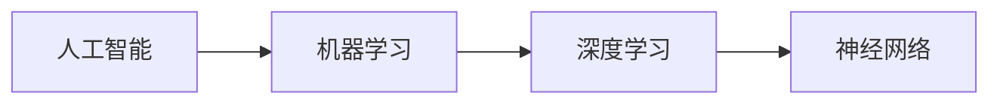

## 1.背景介绍

AI，也就是人工智能，已经成为现代科技领域中最热门的话题之一。从自动驾驶汽车到智能家居，从医疗诊断到金融交易，人工智能的应用已经深入到生活的各个领域。本文将通过详细的案例和代码实战，详细介绍AI在不同行业中的应用和解决方案。

## 2.核心概念与联系

在深入探讨AI的行业应用之前，我们首先需要理解一些核心概念。

- **人工智能（AI）**：人工智能是指由人制造出来的系统显示出的智能，包括理解、学习、适应新情况等能力。

- **机器学习（ML）**：机器学习是实现AI的一种方式，它使用统计方法让计算机系统从数据中“学习”，而无需明确编程。

- **深度学习（DL）**：深度学习是机器学习的一个子领域，它试图模仿人脑的工作原理，通过训练大量的数据，自动提取有意义的特征。

- **神经网络（NN）**：神经网络是深度学习的基础，它模仿人脑的神经元连接，通过多层的神经元进行计算，实现复杂的模式识别。

这些核心概念之间的关系可以用下面的Mermaid流程图来表示：



## 3.核心算法原理具体操作步骤

在AI的应用中，有几种常见的核心算法，包括线性回归、逻辑回归、决策树、随机森林、支持向量机、K近邻、K均值、神经网络等。这些算法的具体操作步骤如下：

1. **数据预处理**：这是所有AI项目的第一步。数据预处理包括数据清洗、数据转换和数据规范化。数据清洗是去除数据中的错误和重复值；数据转换是将数据转换为算法可以处理的格式；数据规范化是将数据的范围调整到一个标准的范围，如0到1。

2. **特征选择**：特征选择是从原始数据中选择对预测结果有影响的特征。这可以通过统计方法、基于模型的方法或者启发式方法来实现。

3. **模型训练**：模型训练是使用选择的特征和对应的标签，通过算法来训练模型。训练的过程就是优化模型的参数，使得模型的预测结果尽可能接近真实的标签。

4. **模型评估**：模型评估是使用测试数据来评估模型的性能。常见的评估指标包括准确率、精确率、召回率、F1分数等。

5. **模型优化**：模型优化是通过调整模型的参数，改变模型的结构，或者使用更复杂的模型来提高模型的性能。

6. **模型部署**：模型部署是将训练好的模型应用到实际的环境中，进行预测。

## 4.数学模型和公式详细讲解举例说明

在AI的应用中，数学模型和公式起着核心的作用。例如，在线性回归中，我们使用下面的数学模型来描述特征和标签之间的关系：

$$
y = \beta_0 + \beta_1 x_1 + \beta_2 x_2 + ... + \beta_n x_n + \epsilon
$$

其中，$y$是标签，$x_1, x_2, ..., x_n$是特征，$\beta_0, \beta_1, ..., \beta_n$是模型的参数，$\epsilon$是误差项。

在模型训练中，我们的目标是找到一组参数$\beta_0, \beta_1, ..., \beta_n$，使得误差项$\epsilon$的平方和最小，这就是最小二乘法。这可以通过下面的公式来计算：

$$
\beta = (X^T X)^{-1} X^T y
$$

其中，$X$是特征矩阵，$y$是标签向量，$\beta$是参数向量。

在模型评估中，我们常常使用均方误差（MSE）来评估模型的性能，它的计算公式为：

$$
MSE = \frac{1}{n} \sum_{i=1}^{n} (y_i - \hat{y}_i)^2
$$

其中，$y_i$是真实的标签，$\hat{y}_i$是模型的预测结果，$n$是样本的数量。

## 5.项目实践：代码实例和详细解释说明

下面我们来看一个使用Python和Scikit-learn库进行线性回归的例子。首先，我们需要导入必要的库：

```python
import numpy as np
from sklearn.linear_model import LinearRegression
```

然后，我们生成一些模拟数据进行训练：

```python
X = np.random.rand(100, 1)
y = 4 + 3 * X + np.random.randn(100, 1)
```

接着，我们创建一个线性回归模型，并使用模拟数据进行训练：

```python
model = LinearRegression()
model.fit(X, y)
```

最后，我们可以查看模型的参数，并使用模型进行预测：

```python
print(model.intercept_, model.coef_)
y_pred = model.predict(X)
```

这就是一个简单的线性回归的例子。在实际的项目中，我们需要处理的数据更复杂，模型也可能更复杂，但是基本的步骤是相同的。

## 6.实际应用场景

AI的应用场景非常广泛，下面我们举几个例子。

- **医疗诊断**：AI可以用于医疗图像的识别和分析，例如，识别X光图像中的肺炎病灶，识别MRI图像中的肿瘤等。

- **自动驾驶**：AI可以用于自动驾驶汽车的感知、决策和控制。例如，识别路面上的行人和车辆，预测其他车辆的行为，控制汽车的转向和速度等。

- **金融交易**：AI可以用于金融市场的预测和交易。例如，预测股票的价格走势，自动执行买卖订单等。

- **智能家居**：AI可以用于智能家居的控制和管理。例如，通过语音识别控制家电的开关，通过人脸识别实现门禁的自动开启等。

## 7.工具和资源推荐

在AI的学习和应用中，有一些工具和资源是非常有用的。

- **Python**：Python是AI领域最常用的编程语言，它有丰富的库和框架，如NumPy、Pandas、Scikit-learn、TensorFlow、PyTorch等。

- **Jupyter Notebook**：Jupyter Notebook是一个交互式的编程环境，它可以让你在一个文档中编写代码、运行代码、查看结果、撰写文档。

- **Google Colab**：Google Colab是一个基于云的Jupyter Notebook环境，它提供免费的GPU资源，非常适合进行深度学习的训练。

- **Kaggle**：Kaggle是一个数据科学和机器学习的竞赛平台，它提供大量的数据集和竞赛，是学习和实践AI的好地方。

## 8.总结：未来发展趋势与挑战

AI的发展前景非常广阔，但是也面临一些挑战。

发展趋势方面，AI将更深入地融入到生活的各个领域，智能化将成为一种趋势。另外，AI的技术也将更加成熟，例如，深度学习的模型将更深更大，算法将更加高效，硬件将更加强大。

挑战方面，AI的应用需要大量的数据，如何在保护隐私的前提下使用这些数据是一个大问题。另外，AI的决策过程往往是黑箱的，如何提高AI的可解释性也是一个重要的问题。最后，AI的发展可能会带来一些社会问题，如就业问题，如何处理这些问题也是一个挑战。

## 9.附录：常见问题与解答

1. **问题：我需要学习哪些知识才能入门AI？**

答：AI是一个跨学科的领域，它涉及到计算机科学、数学、统计学、心理学、生物学等多个领域。如果你想入门AI，你需要学习编程（如Python），数学（如线性代数、概率论、统计学、微积分），机器学习和深度学习的基础知识。

2. **问题：我如何才能找到AI的项目实践？**

答：你可以在Kaggle上找到很多数据科学和机器学习的项目，你可以参加他们的竞赛，或者使用他们的数据集进行自己的项目。另外，你也可以在GitHub上找到很多开源的AI项目，你可以参考他们的代码，或者为他们贡献代码。

3. **问题：AI的发展会不会导致大规模的失业？**

答：这是一个很复杂的问题，AI的发展确实可能导致一些工作被自动化，但是它也会创造出一些新的工作机会。我们需要做的是，通过教育和培训，帮助人们适应这个变化，提高他们的技能，使他们能在AI的时代找到新的工作。

作者：禅与计算机程序设计艺术 / Zen and the Art of Computer Programming