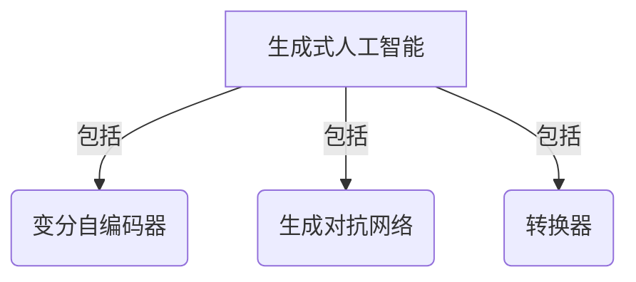
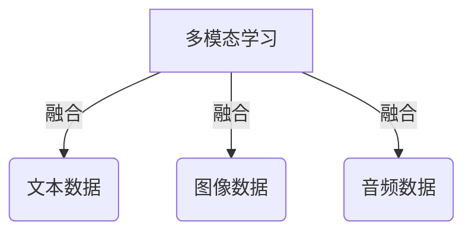
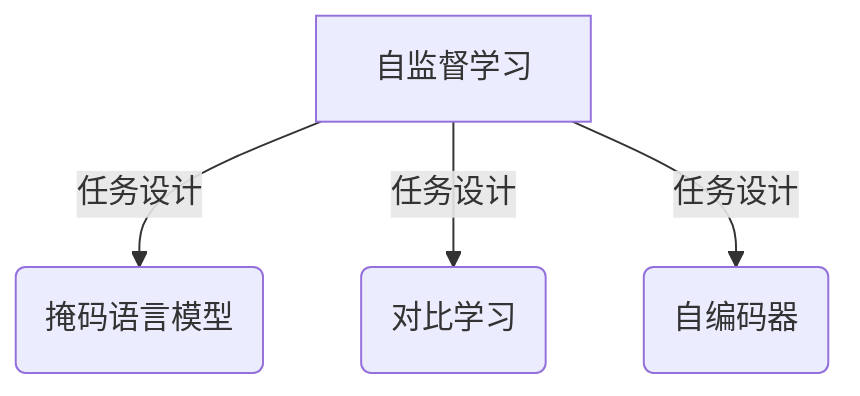
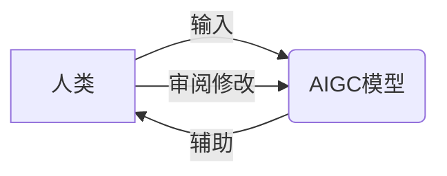

# AIGC从入门到实战：AIGC的产业图谱带来新的创变纪元

## 1. 背景介绍

### 1.1 AIGC的兴起

人工智能生成内容(AIGC)是近年来兴起的一种新兴技术,它利用人工智能算法自动生成文本、图像、音频、视频等多种形式的内容。随着深度学习、自然语言处理、计算机视觉等技术的不断进步,AIGC的能力也在不断提升,逐渐渗透到各个领域,引发了广泛关注。

### 1.2 AIGC的影响力

AIGC技术的兴起正在重塑内容创作和消费的方式,为企业和个人带来了新的机遇和挑战。它可以极大提高内容生产效率,降低成本,同时也为创作者提供了新的工具和辅助手段。但与此同时,AIGC也带来了版权、伦理等新的问题和挑战。

### 1.3 AIGC产业图谱

AIGC技术的发展已经形成了一个庞大的产业图谱,涉及多个领域和环节,包括基础模型研发、算法优化、数据采集、应用开发、内容分发等。各大科技公司、初创企业和研究机构都在这个领域展开了激烈竞争和创新。

## 2. 核心概念与联系

### 2.1 生成式人工智能

生成式人工智能(Generative AI)是AIGC技术的核心,它通过训练神经网络模型,使其能够根据输入生成新的、前所未见的内容。常见的生成式AI模型包括变分自编码器(VAE)、生成对抗网络(GAN)、转换器(Transformer)等。



### 2.2 多模态学习

多模态学习(Multimodal Learning)是AIGC技术的另一个关键概念,它指的是将多种形式的数据(如文本、图像、音频等)融合到同一个模型中进行学习和推理。这种方式可以充分利用不同模态之间的相关性,提高模型的泛化能力和鲁棒性。



### 2.3 自监督学习

自监督学习(Self-Supervised Learning)是训练AIGC模型的一种重要方法。它不需要人工标注的数据,而是通过设计特殊的任务和目标函数,让模型自己从原始数据中学习有用的表示。这种方法可以充分利用大规模的未标注数据,降低了数据标注的成本。



### 2.4 人机协作

人机协作(Human-AI Collaboration)是AIGC技术的重要应用场景之一。AIGC模型可以辅助人类完成创作任务,提高效率和质量,同时人类也可以对模型输出进行审阅和修改,形成良性互动。这种协作模式有望推动人工智能和人类智能的融合发展。



## 3. 核心算法原理具体操作步骤

### 3.1 生成式对抗网络(GAN)

生成式对抗网络(Generative Adversarial Networks, GAN)是一种常用的生成式AI模型,它由一个生成器(Generator)和一个判别器(Discriminator)组成,二者相互对抗训练。生成器的目标是生成逼真的样本,而判别器的目标是区分真实样本和生成样本。通过这种对抗训练,生成器可以不断提高生成样本的质量。

GAN的训练过程如下:

1. 初始化生成器G和判别器D的参数
2. 从真实数据分布采样一批真实样本
3. 从噪声分布采样一批噪声,输入生成器G生成一批假样本
4. 将真实样本和假样本输入判别器D,计算真实样本的判别损失和假样本的判别损失
5. 更新判别器D的参数,使其能够更好地区分真实样本和假样本
6. 固定判别器D的参数,更新生成器G的参数,使其生成的假样本更容易欺骗判别器
7. 重复步骤2-6,直到模型收敛

### 3.2 变分自编码器(VAE)

变分自编码器(Variational Autoencoder, VAE)是另一种常用的生成式AI模型,它由一个编码器(Encoder)和一个解码器(Decoder)组成。编码器将输入数据映射到潜在空间的分布,而解码器则从该分布中采样,重构原始数据。

VAE的训练过程如下:

1. 初始化编码器E和解码器D的参数
2. 从真实数据分布采样一批样本
3. 将样本输入编码器E,得到潜在空间的均值和方差
4. 从潜在空间的分布中采样一个潜在变量
5. 将潜在变量输入解码器D,得到重构样本
6. 计算重构损失和KL散度损失
7. 更新编码器E和解码器D的参数,使重构损失和KL散度损失最小化
8. 重复步骤2-7,直到模型收敛

### 3.3 转换器(Transformer)

转换器(Transformer)是一种广泛应用于自然语言处理任务的序列到序列模型,它采用了自注意力机制,能够有效捕捉长距离依赖关系。转换器已经成为许多AIGC模型(如GPT、DALL-E等)的核心组件。

转换器的编码器部分的工作流程如下:

1. 将输入序列嵌入到向量空间
2. 添加位置编码,保留序列的位置信息
3. 通过多头自注意力层捕捉序列内部的依赖关系
4. 通过前馈神经网络层进一步提取特征
5. 对上述步骤进行多次重复,形成深层编码表示
6. 将最终的编码表示输出,作为下游任务的输入

## 4. 数学模型和公式详细讲解举例说明

### 4.1 生成对抗网络(GAN)的数学模型

生成对抗网络(GAN)的目标是训练一个生成器$G$,使其生成的样本$G(z)$与真实样本$x$的分布$p_{data}(x)$尽可能相近。同时训练一个判别器$D$,使其能够区分真实样本和生成样本。生成器和判别器的目标函数可以表示为:

$$\min_G \max_D V(D,G) = \mathbb{E}_{x\sim p_{data}(x)}[\log D(x)] + \mathbb{E}_{z\sim p_z(z)}[\log(1-D(G(z)))]$$

其中,$p_z(z)$是噪声分布。在训练过程中,生成器$G$和判别器$D$相互对抗,最终达到一个纳什均衡,使得$p_g=p_{data}$。

### 4.2 变分自编码器(VAE)的数学模型

变分自编码器(VAE)的目标是最大化边缘对数似然$\log p(x)$,其中$x$是观测数据。由于直接优化$\log p(x)$很困难,VAE引入了一个潜在变量$z$,并使用变分推断(Variational Inference)的方法近似求解$\log p(x)$。具体来说,VAE最大化下式中的证据下界(Evidence Lower Bound, ELBO):

$$\mathcal{L}(\theta,\phi;x) = \mathbb{E}_{q_\phi(z|x)}[\log p_\theta(x|z)] - D_{KL}(q_\phi(z|x)||p(z))$$

其中,$q_\phi(z|x)$是编码器的近似后验分布,$p_\theta(x|z)$是解码器的条件概率分布,$p(z)$是先验分布。第一项是重构项,第二项是KL散度项,用于约束潜在空间的分布接近先验分布。

### 4.3 自注意力机制

自注意力机制是转换器模型的核心,它能够有效捕捉序列内部的长距离依赖关系。给定一个序列$X=(x_1, x_2, ..., x_n)$,自注意力机制首先计算每个位置$i$与其他所有位置$j$的注意力权重$\alpha_{ij}$:

$$\alpha_{ij} = \frac{\exp(e_{ij})}{\sum_{k=1}^n \exp(e_{ik})}, \quad e_{ij} = f(x_i, x_j)$$

其中,$f$是一个评分函数,用于衡量$x_i$和$x_j$的关系程度。然后,将注意力权重$\alpha_{ij}$与对应的值$x_j$相乘并求和,得到位置$i$的注意力表示$y_i$:

$$y_i = \sum_{j=1}^n \alpha_{ij}x_j$$

通过这种方式,每个位置$i$的表示$y_i$都融合了序列中其他位置的信息,从而捕捉了长距离依赖关系。

## 5. 项目实践:代码实例和详细解释说明

### 5.1 生成对抗网络(GAN)实现

下面是使用PyTorch实现一个基本的生成对抗网络(GAN)的代码示例,用于生成手写数字图像:

```python
import torch
import torch.nn as nn
import torchvision.datasets as datasets
import torchvision.transforms as transforms

# 定义生成器
class Generator(nn.Module):
    def __init__(self, latent_dim, img_shape):
        super(Generator, self).__init__()
        self.latent_dim = latent_dim
        self.img_shape = img_shape

        def block(in_feat, out_feat, normalize=True):
            layers = [nn.Linear(in_feat, out_feat)]
            if normalize:
                layers.append(nn.BatchNorm1d(out_feat, 0.8))
            layers.append(nn.LeakyReLU(0.2, inplace=True))
            return layers

        self.model = nn.Sequential(
            *block(latent_dim, 128, normalize=False),
            *block(128, 256),
            *block(256, 512),
            *block(512, 1024),
            nn.Linear(1024, int(np.prod(img_shape))),
            nn.Tanh()
        )

    def forward(self, z):
        img = self.model(z)
        img = img.view(img.size(0), *self.img_shape)
        return img

# 定义判别器
class Discriminator(nn.Module):
    def __init__(self, img_shape):
        super(Discriminator, self).__init__()

        self.model = nn.Sequential(
            nn.Linear(int(np.prod(img_shape)), 512),
            nn.LeakyReLU(0.2, inplace=True),
            nn.Linear(512, 256),
            nn.LeakyReLU(0.2, inplace=True),
            nn.Linear(256, 1),
            nn.Sigmoid(),
        )

    def forward(self, img):
        img_flat = img.view(img.size(0), -1)
        validity = self.model(img_flat)
        return validity

# 加载数据集
dataset = datasets.MNIST(root='data/', train=True, download=True,
                         transform=transforms.Compose([
                             transforms.ToTensor(),
                             transforms.Normalize((0.5,), (0.5,))
                         ]))
dataloader = torch.utils.data.DataLoader(dataset, batch_size=64, shuffle=True)

# 初始化模型
latent_dim = 100
img_shape = (1, 28, 28)
generator = Generator(latent_dim, img_shape)
discriminator = Discriminator(img_shape)

# 训练模型
# ...
```

在这个示例中,我们首先定义了生成器`Generator`和判别器`Discriminator`的网络结构。生成器接受一个噪声向量`z`作为输入,并生成一个手写数字图像。判别器则接受一个图像作为输入,并输出一个0到1之间的分数,表示该图像是真实样本的概率。

在训练过程中,我们从MNIST数据集中加载真实的手写数字图像,并从标准正态分布中采样噪声向量`z`。然后,我们使用生成器生成假样本,并将真实样本和假样本输入判别器进行训练。生成器和判别器的目标是最小化上面提到的对抗损失函数。

通过这种对抗训练,生成器可以不断提高生成样本的质量,使其