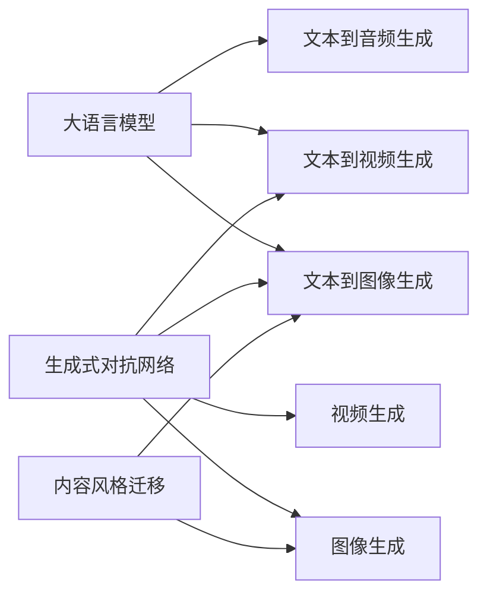

# AIGC从入门到实战：AIGC 的发展历程

## 1.背景介绍
### 1.1 人工智能的发展历程
#### 1.1.1 人工智能的起源与定义
人工智能(Artificial Intelligence, AI)作为一门新兴技术学科，其发展历程可以追溯到1956年达特茅斯会议。当时，约翰·麦卡锡等科学家提出了"人工智能"的概念，并定义其为"制造智能机器的科学与工程"。自此之后，人工智能领域经历了从起步探索到快速发展的过程。

#### 1.1.2 人工智能的三次浪潮 
纵观AI发展史，大致经历了三次浪潮：

- 第一次浪潮(1956-1974)：以"推理期"为主要特征，探索用计算机模拟人类智能。代表性成果有"通用问题求解器"等。
- 第二次浪潮(1980-1987)：以"知识期"为主要特征，利用专家系统等知识工程方法来解决特定领域问题。
- 第三次浪潮(2006至今)：以"学习期"为主要特征，通过机器学习，尤其是深度学习技术，让计算机系统从海量数据中自主学习和提升性能。

### 1.2 AIGC的提出与内涵
#### 1.2.1 AIGC的提出
AIGC(AI Generated Content)作为人工智能的一个新兴分支，是伴随着AI技术的日益成熟而兴起的。2022年，OpenAI推出了ChatGPT等一系列基于大语言模型的内容生成工具，让AIGC成为业界热议的焦点，并迅速成为新的技术浪潮。

#### 1.2.2 AIGC的内涵
AIGC是指利用人工智能技术，尤其是自然语言处理、计算机视觉等技术自动生成文本、图像、音频、视频等数字内容的方法。其核心是通过机器学习算法，让AI系统从海量数据中学习内容生成的规律和模式，进而创作出新颖、多样化的内容，代替人工创作。

### 1.3 AIGC的发展意义
#### 1.3.1 提升内容生产效率
传统内容创作依赖人力，耗时耗力。AIGC可以快速生成海量内容，大幅提升生产力，节约人力和时间成本。这对于需要持续产出内容的行业，如新媒体、广告营销等有重要意义。

#### 1.3.2 拓展内容创意空间
AIGC能够突破人类思维定式，生成出新颖独特的内容创意。AI可以分析海量数据，发掘内容生成的新思路和模式，为内容创作提供更多灵感。

#### 1.3.3 助力个性化内容定制
个性化是内容领域的重要趋势。AIGC可以根据用户画像和偏好，定制生成个性化内容。例如个性化推荐、个性化新闻等，提升用户体验。

## 2.核心概念与联系
### 2.1 AIGC的核心概念
#### 2.1.1 大语言模型
大语言模型是AIGC的核心基础。它是一种基于海量文本数据训练的AI模型，能够学习语言的统计规律和语义表示。GPT系列模型是代表性的大语言模型，为AIGC的文本生成奠定了基础。

#### 2.1.2 生成式对抗网络
生成式对抗网络(GAN)是AIGC的另一项关键技术。GAN由生成器和判别器两部分组成，通过二者的博弈学习，可以生成逼真的图像、视频等内容。StyleGAN、BigGAN等是图像生成领域的代表模型。

#### 2.1.3 文本到图像生成
文本到图像生成(Text-to-Image)技术可以根据文本描述生成相应的图像。它融合了自然语言处理和计算机视觉技术，代表模型如DALL-E、Stable Diffusion等。

#### 2.1.4 内容风格迁移
内容风格迁移指将一种内容的风格特征迁移到另一内容上。例如将梵高风格应用到自拍照中。风格迁移基于深度学习中的特征表示学习，代表工作如AdaIN、CycleGAN等。

### 2.2 AIGC技术之间的联系
AIGC所涉及的技术之间存在紧密联系：

- 大语言模型为其他AIGC任务如文本到图像生成提供语义理解基础
- GAN网络常被用于图像、视频等内容的生成任务
- 风格迁移可以作为图像生成的后处理，赋予生成内容特定风格

下图展示了AIGC核心技术之间的关系：



## 3.核心算法原理具体操作步骤
### 3.1 大语言模型的训练步骤
大语言模型如GPT系列的训练主要包括以下步骤：

1. 语料准备：收集海量高质量文本数据，进行清洗、标注等预处理。
2. 分词和编码：对文本进行分词，并将词映射为数值向量。常用的分词方法有BPE、WordPiece等。
3. 搭建模型：搭建transformer等深度神经网络模型，设置模型参数如层数、注意力头数等。
4. 模型预训练：通过自回归、自编码等任务对模型进行预训练，让模型学习语言的统计规律和语义表示。
5. 模型微调：根据具体任务如问答、摘要等，在预训练模型基础上进行微调，提升特定任务性能。
6. 生成应用：利用训练好的模型进行文本生成应用，如对话、写作等。

### 3.2 GAN的训练步骤  
GAN的训练主要包括以下步骤：

1. 准备数据：收集大量真实数据如图像，进行必要的数据增强、归一化等预处理。
2. 搭建生成器和判别器：生成器用于生成假样本，判别器用于区分真假样本。它们通常都是深度神经网络。
3. 训练判别器：固定生成器，用真实样本和生成样本训练判别器，让其能够尽可能准确地区分真假样本。
4. 训练生成器：固定判别器，用判别器的反馈信号训练生成器，让其生成的假样本能够尽可能逼真，以欺骗判别器。
5. 交替训练：交替进行步骤3和4，通过生成器和判别器的博弈学习，不断提升生成样本的质量。
6. 生成应用：用训练好的生成器进行图像、视频等内容的生成任务。

### 3.3 文本到图像生成的步骤
文本到图像生成的主要步骤如下：

1. 文本编码：将输入的文本描述进行分词、编码，生成文本特征向量。
2. 图像生成：文本特征向量输入到图像生成模型中，通过GAN等方法生成与文本描述相符的图像。
3. 图像优化：对生成图像进行优化，如提升分辨率、细节等，生成高质量图像。
4. 交互反馈：用户对生成图像进行评价反馈，引导模型调整和优化。

### 3.4 内容风格迁移的步骤
内容风格迁移的主要步骤包括：

1. 风格特征提取：从风格图像中提取风格特征，通常利用预训练的卷积网络提取高层特征。
2. 内容特征提取：从内容图像中提取内容特征，通常利用预训练的卷积网络提取低层特征。
3. 特征融合：将风格特征和内容特征进行融合，生成目标图像。常见方法有AdaIN、WCT等。
4. 图像优化：对生成图像进行优化，提升其视觉质量和细节。

## 4.数学模型和公式详细讲解举例说明
### 4.1 Transformer模型
Transformer是大语言模型的核心网络结构，其数学原理如下：

Transformer由编码器和解码器组成，核心是自注意力机制(Self-Attention)。对于输入序列 $X=(x_1,…,x_n)$，自注意力的计算过程为：

1. 计算查询矩阵 $Q$、键矩阵 $K$、值矩阵 $V$：

$$
Q=XW^Q, K=XW^K, V=XW^V
$$

其中 $W^Q, W^K, W^V$ 是可学习的参数矩阵。

2. 计算注意力分数 $Score$：

$$
Score = \frac{QK^T}{\sqrt{d_k}}
$$

其中 $d_k$ 是 $K$ 的维度，用于缩放点积结果。

3. 计算注意力权重 $A$：

$$
A = softmax(Score)
$$

4. 计算注意力输出 $O$：

$$
O = AV
$$

通过自注意力机制，Transformer能够捕捉序列中的长距离依赖，学习语义表示。

### 4.2 GAN的损失函数
GAN的核心是生成器 $G$ 和判别器 $D$ 之间的博弈，其损失函数定义如下：

判别器损失：
$$
L_D = -E_{x \sim p_{data}}[logD(x)] - E_{z \sim p_z}[log(1-D(G(z)))]
$$

生成器损失：
$$
L_G = -E_{z \sim p_z}[logD(G(z))]
$$

其中 $x$ 是真实样本，$z$ 是随机噪声，$p_{data}$ 是真实数据分布，$p_z$ 是噪声分布。

判别器 $D$ 的目标是最大化 $L_D$，即分辨真实样本和生成样本；生成器 $G$ 的目标是最小化 $L_G$，即让生成样本尽可能逼真，欺骗判别器。

通过不断迭代优化 $L_D$ 和 $L_G$，$G$ 和 $D$ 的性能不断提升，最终 $G$ 可以生成高质量的样本。

### 4.3 AdaIN风格迁移
AdaIN是一种基于自适应实例归一化的风格迁移方法，其数学原理为：

对于内容特征 $f_c$ 和风格特征 $f_s$，AdaIN的计算过程为：

1. 计算 $f_s$ 的均值 $\mu(f_s)$ 和标准差 $\sigma(f_s)$：

$$
\mu(f_s) = \frac{1}{HW}\sum_{h=1}^H \sum_{w=1}^W f_s
$$

$$
\sigma(f_s) = \sqrt{\frac{1}{HW}\sum_{h=1}^H \sum_{w=1}^W (f_s-\mu(f_s))^2+\epsilon}
$$

其中 $H,W$ 是特征图的高和宽。

2. 对 $f_c$ 进行自适应归一化：

$$
AdaIN(f_c,f_s) = \sigma(f_s)(\frac{f_c-\mu(f_c)}{\sigma(f_c)})+\mu(f_s)
$$

通过自适应地对齐内容特征和风格特征的均值和方差，AdaIN可以将风格特征迁移到内容特征上，生成风格迁移后的图像。

## 5.项目实践：代码实例和详细解释说明
下面以PyTorch为例，给出AIGC相关任务的代码实践。

### 5.1 基于GPT的文本生成

```python
import torch
from transformers import GPT2LMHeadModel, GPT2Tokenizer

# 加载预训练的GPT-2模型和分词器
model = GPT2LMHeadModel.from_pretrained('gpt2')
tokenizer = GPT2Tokenizer.from_pretrained('gpt2')

# 设置生成参数
max_length = 100  # 生成文本的最大长度
num_return_sequences = 3  # 生成文本的数量
prompt = "Once upon a time"  # 生成文本的开头提示

# 对提示进行编码
input_ids = tokenizer.encode(prompt, return_tensors='pt')

# 生成文本
output = model.generate(input_ids, 
                        max_length=max_length,
                        num_return_sequences=num_return_sequences)

# 解码生成的文本
generated_texts = []
for i in range(num_return_sequences):
    generated_text = tokenizer.decode(output[i], skip_special_tokens=True)
    generated_texts