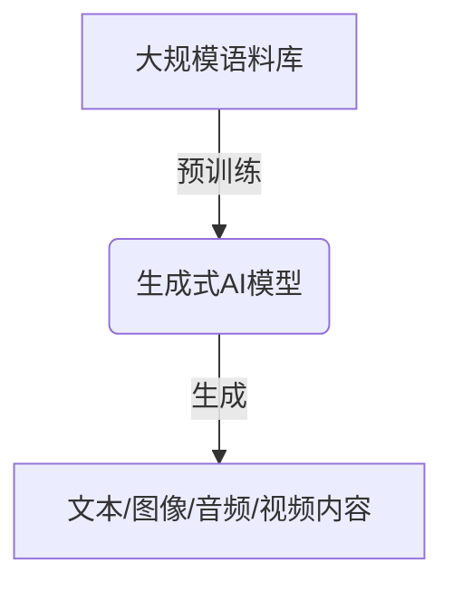
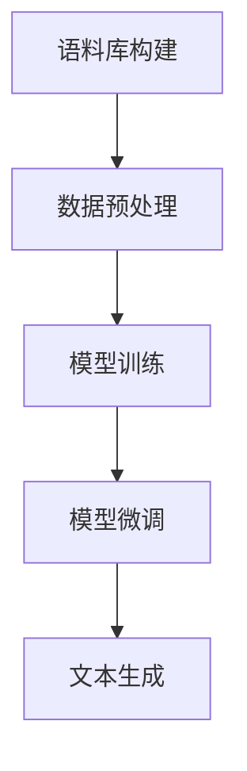
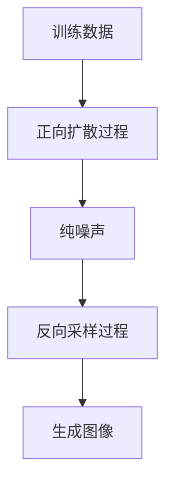

# AIGC从入门到实战：众里寻他千百度：ChatGPT 及其他 AIGC 赋能个人

## 1.背景介绍

### 1.1 人工智能的崛起

人工智能(AI)技术在过去几年中取得了长足的进步,尤其是在自然语言处理(NLP)、计算机视觉(CV)和机器学习(ML)等领域。这些进步主要归功于深度学习算法、海量训练数据以及强大的计算能力。AI技术已经渗透到我们生活的方方面面,为我们带来了诸多便利,同时也引发了一些争议和担忧。

### 1.2 AIGC(AI Generated Content)的兴起 

AIGC(AI Generated Content)是指利用AI技术自动生成文本、图像、音频、视频等内容。近年来,AIGC技术取得了突破性进展,出现了一系列令人瞩目的AIGC工具,如ChatGPT、Midjourney、DALL-E、Stable Diffusion等。这些工具能够根据用户提供的文本描述或指令,生成高质量、多样化的内容,大大提高了内容生产的效率。

### 1.3 AIGC的影响

AIGC技术的兴起正在重塑内容创作和消费的方式,对个人、企业乃至整个社会产生深远影响。它有望解决内容创作的瓶颈,释放人类的创造力,为内容创作者提供强大的辅助工具。同时,AIGC也可能带来一些潜在风险和挑战,如知识产权、内容真实性、就业影响等问题。

## 2.核心概念与联系

### 2.1 生成式人工智能模型

AIGC技术主要依赖生成式人工智能模型,如GPT(Generative Pre-trained Transformer)、Diffusion模型等。这些模型通过在大规模语料库上进行预训练,学习到丰富的语义和上下文知识,从而具备生成高质量内容的能力。



### 2.2 AIGC工具

基于生成式AI模型,诞生了一系列AIGC工具,为用户提供了友好的交互界面和强大的内容生成功能。以下是一些典型的AIGC工具:

#### 2.2.1 ChatGPT

ChatGPT是一款由OpenAI开发的对话式AI助手,基于GPT-3.5模型。它能够进行自然语言对话,回答各种问题,撰写文章、代码等,被誉为"通用人工智能"的里程碑。

#### 2.2.2 Midjourney

Midjourney是一款基于Diffusion模型的AI图像生成工具。用户只需输入文本描述,就能生成逼真的图像。它支持各种风格和主题,可用于插画、概念设计等领域。

#### 2.2.3 DALL-E

DALL-E是OpenAI开发的另一款AI图像生成工具,基于GPT-3模型。它不仅能生成图像,还能根据文本描述对图像进行编辑和操作。

#### 2.2.4 Stable Diffusion

Stable Diffusion是一个开源的文本到图像生成模型,由Stability AI和LAION开发。它在速度和质量上都有不错的表现,并且支持各种定制化操作。

### 2.3 AIGC应用场景

AIGC技术可以应用于多个领域,为个人和企业带来诸多便利:

- 内容创作:撰写文章、故事、脚本、代码等
- 设计和视觉艺术:生成图像、插画、UI设计等
- 营销和广告:生成营销文案、视频等
- 教育和学习:生成教学资料、练习题等
- 客户服务:构建智能客服系统
- 科研和分析:辅助数据分析、论文写作等

## 3.核心算法原理具体操作步骤  

### 3.1 生成式预训练转换器(GPT)

GPT是一种基于Transformer架构的语言模型,能够通过自回归(auto-regressive)的方式生成连贯的文本序列。它的核心思想是利用大规模语料库对模型进行预训练,使其学习到丰富的语言知识和上下文信息。在生成文本时,GPT会根据给定的提示(prompt),预测下一个最可能出现的词元(token),并逐步构建出完整的文本序列。

GPT的具体操作步骤如下:

1. **语料库构建**: 收集大量高质量的文本数据,如网页、书籍、新闻等,构建语料库。

2. **数据预处理**: 对语料库进行标记化(tokenization)、编码等预处理,将文本转换为模型可识别的数字序列。

3. **模型训练**: 使用掩码语言模型(Masked Language Model)和下一句预测(Next Sentence Prediction)等任务,在语料库上对GPT模型进行预训练,使其学习到语言的语义和上下文知识。

4. **模型微调**: 针对特定的下游任务(如文本生成、问答等),对预训练模型进行进一步的微调(fine-tuning),提高模型在该任务上的性能。

5. **文本生成**: 在生成文本时,给定一个起始提示(prompt),GPT会根据已学习的知识,预测下一个最可能出现的词元,并逐步构建出完整的文本序列。这个过程可以通过搜索(beam search)或采样(sampling)等策略来实现。



### 3.2 扩散模型(Diffusion Models)

扩散模型是一种用于生成图像的新型深度生成模型,它通过学习数据的潜在分布,从噪声中生成高质量图像。与GAN(生成对抗网络)不同,扩散模型采用了更加稳定的训练过程,能够生成更加多样化和高保真的图像。

扩散模型的工作原理可以概括为两个过程:正向扩散过程(forward diffusion process)和反向采样过程(reverse sampling process)。

1. **正向扩散过程**:
   - 从训练数据(如图像)开始,通过添加高斯噪声,逐步"破坏"原始数据,直到最终得到纯噪声。
   - 这个过程被划分为多个时间步,每个时间步都会添加一定量的噪声。
   - 模型需要学习每个时间步上的噪声分布,以及如何从前一个时间步的数据生成当前时间步的数据。

2. **反向采样过程**:
   - 从纯噪声开始,模型根据学习到的噪声分布,逐步"去噪"(denoising),最终生成出清晰的图像。
   - 在每个时间步,模型需要预测前一个时间步的数据,并根据这个预测值进行采样,生成当前时间步的数据。
   - 通过反复迭代,模型最终可以从纯噪声生成出高质量的图像。

扩散模型的优点在于训练过程更加稳定,能够生成多样化和高保真的图像。但它也存在一些缺陷,如计算成本较高、生成速度较慢等。



## 4.数学模型和公式详细讲解举例说明

### 4.1 GPT中的Self-Attention机制

Self-Attention是Transformer架构中的核心组件,它能够捕捉输入序列中任意两个位置之间的依赖关系。在GPT中,Self-Attention被用于编码输入文本的上下文信息。

给定一个长度为n的输入序列 $X = (x_1, x_2, \dots, x_n)$,Self-Attention的计算过程如下:

1. 将输入序列 $X$ 线性映射到查询(Query)、键(Key)和值(Value)向量:

$$
\begin{aligned}
Q &= XW^Q \\
K &= XW^K \\
V &= XW^V
\end{aligned}
$$

其中 $W^Q, W^K, W^V$ 分别表示可学习的查询、键和值的权重矩阵。

2. 计算查询 $Q$ 与所有键 $K$ 的点积,得到注意力分数矩阵 $A$:

$$
A = \text{softmax}\left(\frac{QK^T}{\sqrt{d_k}}\right)
$$

其中 $d_k$ 是缩放因子,用于防止点积值过大导致梯度消失或爆炸。

3. 将注意力分数矩阵 $A$ 与值向量 $V$ 相乘,得到加权和表示 $Z$:

$$
Z = AV
$$

$Z$ 即为输入序列 $X$ 经过Self-Attention后的新表示,它捕捉了序列中任意两个位置之间的依赖关系。

在GPT中,Self-Attention被应用于编码器和解码器的多头注意力层(Multi-Head Attention),以提高模型的表示能力和性能。

### 4.2 扩散模型中的反向过程

扩散模型的核心是学习从噪声中恢复原始数据的过程,这个过程被称为反向过程(reverse process)。假设我们有一个从纯噪声 $x_T$ 到原始数据 $x_0$ 的马尔可夫链,其中 $T$ 表示总的时间步数。我们需要学习一个由参数 $\theta$ 表示的模型 $p_\theta(x_{t-1}|x_t)$,它能够预测前一个时间步的数据 $x_{t-1}$,给定当前时间步的数据 $x_t$。

在训练过程中,我们最小化以下损失函数:

$$
\mathcal{L}(\theta) = \mathbb{E}_{x_0, \epsilon} \left[ \left\lVert \epsilon - \epsilon_\theta(x_0, x_1, \dots, x_T) \right\rVert_2^2 \right]
$$

其中 $\epsilon$ 是从标准高斯分布 $\mathcal{N}(0, I)$ 中采样得到的噪声,而 $\epsilon_\theta(x_0, x_1, \dots, x_T)$ 是模型根据观测到的数据序列 $(x_0, x_1, \dots, x_T)$ 预测的噪声。通过最小化这个损失函数,我们可以训练模型准确地预测每个时间步的噪声,从而学习到从噪声中恢复原始数据的能力。

在生成图像的过程中,我们从纯噪声 $x_T \sim \mathcal{N}(0, I)$ 开始,然后使用训练好的模型 $p_\theta(x_{t-1}|x_t)$ 逐步预测前一个时间步的数据,直到生成出最终的图像 $x_0$。这个过程可以表示为:

$$
x_{t-1} \sim p_\theta(x_{t-1}|x_t), \quad t = T, T-1, \dots, 1
$$

通过这种方式,扩散模型能够从纯噪声中生成出高质量的图像。

## 5.项目实践：代码实例和详细解释说明

在这一部分,我们将提供一些基于GPT和扩散模型的AIGC项目实践,并给出代码示例和详细解释。

### 5.1 基于GPT的文本生成

以下是一个使用Hugging Face的Transformers库,基于GPT-2模型进行文本生成的Python代码示例:

```python
from transformers import GPT2LMHeadModel, GPT2Tokenizer

# 加载预训练模型和分词器
model = GPT2LMHeadModel.from_pretrained('gpt2')
tokenizer = GPT2Tokenizer.from_pretrained('gpt2')

# 定义起始提示
prompt = "Once upon a time, there was a"

# 对提示进行编码
input_ids = tokenizer.encode(prompt, return_tensors='pt')

# 生成文本
output = model.generate(input_ids, max_length=200, do_sample=True, top_k=50, top_p=0.95, num_return_sequences=1)

# 解码生成的文本
generated_text = tokenizer.decode(output[0], skip_special_tokens=True)

print(generated_text)
```

在这个示例中,我们首先加载预训练的GPT-2模型和分词器。然后,我们定义一个起始提示`"Once upon a time, there was a"`。接下来,我们使用分词器将提示编码为模型可识别的输入张量`input_ids`。

使用`model.generate()`方法,我们可以根据输入的提示生成文本