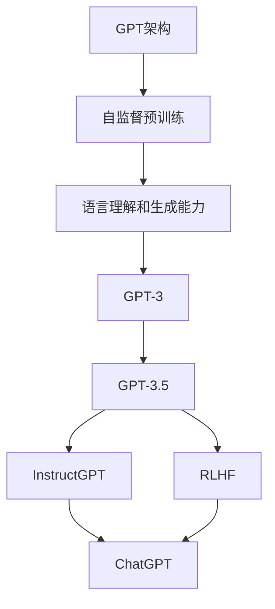

# AIGC从入门到实战：探究ChatGPT的原理和成本

## 1. 背景介绍

### 1.1 人工智能的发展历程

人工智能(Artificial Intelligence, AI)是当代科技领域最具革命性和颠覆性的技术之一。自20世纪50年代AI概念被正式提出以来,经历了几个重要的发展阶段。

- 1950年代:AI概念的提出和早期研究
- 1960-1970年代:专家系统和知识表示的发展
- 1980-1990年代:神经网络和机器学习的兴起
- 2000年后:大数据和深度学习的突破

### 1.2 AIGC(AI生成内容)的崛起

近年来,随着算力、数据和模型的不断突破,AI生成内容(AIGC)技术取得了长足进展。AIGC可以生成文本、图像、视频、音频等多种形式的内容,极大地释放了人类的创造力。其中,ChatGPT就是一款具有里程碑意义的AIGC产品。

### 1.3 ChatGPT的重要意义

ChatGPT是一款基于GPT-3.5架构的对话式AI助手,由OpenAI公司于2022年11月推出。它能够通过自然语言交互,理解和回答各种复杂问题,撰写文章、编写代码等,展现出惊人的语言理解和生成能力。ChatGPT的出现,标志着AIGC技术进入了一个新的里程碑,引发了广泛的社会关注和讨论。

## 2. 核心概念与联系

### 2.1 生成式预训练转移Transformer(GPT)

GPT是一种基于Transformer架构的大型语言模型,它通过自监督学习方式在海量文本数据上进行预训练,获得强大的语言理解和生成能力。GPT的核心思想是利用注意力机制捕捉文本中的长程依赖关系,从而更好地建模语义信息。

GPT家族包括GPT、GPT-2、GPT-3等多个版本,每个新版本都在模型规模、训练数据量和性能上有所提升。其中,GPT-3拥有1750亿个参数,是目前最大的语言模型之一。

### 2.2 GPT-3.5与InstructGPT

ChatGPT是基于GPT-3.5架构构建的,GPT-3.5是对GPT-3的改进版本。除了规模更大外,GPT-3.5还融合了InstructGPT技术,使其能够更好地理解和执行人类的指令。

InstructGPT是一种特殊的训练方式,通过在训练数据中加入人类指令和期望输出,让模型学习如何根据指令生成相应的内容。这使得GPT-3.5不仅能够进行开放域对话,还能够执行特定任务,如问答、写作、编程等。

### 2.3 RLHF(Reinforcement Learning from Human Feedback)

RLHF是ChatGPT采用的另一项关键技术。它通过人类反馈进行强化学习,使模型输出更加符合人类期望。具体来说,RLHF会让人类评价模型的输出,并根据评价结果对模型进行奖惩,从而不断优化模型的行为策略。

RLHF技术有效提高了ChatGPT的输出质量,使其更加准确、相关、有益且符合伦理道德。同时,RLHF也是一种"将人类价值观植入AI"的尝试,有望使AI系统的行为更加可控和可解释。

### 2.4 核心概念关系图

## 3. 核心算法原理具体操作步骤

### 3.1 Transformer架构

Transformer是GPT等大型语言模型的核心架构,它完全基于注意力机制,摒弃了传统序列模型中的循环神经网络和卷积神经网络结构。Transformer的主要组成部分包括编码器(Encoder)和解码器(Decoder),以及多头注意力机制(Multi-Head Attention)和位置编码(Positional Encoding)等。

1. **编码器(Encoder)**
   - 将输入序列(如文本)映射为一系列连续的向量表示
   - 每个向量对应输入序列中的一个位置
   - 通过自注意力层(Self-Attention Layer)捕捉输入序列中元素之间的依赖关系

2. **解码器(Decoder)**
   - 将编码器的输出向量序列解码为目标序列(如翻译后的文本)
   - 除了编码器输入的自注意力层外,还有一个对编码器输出的注意力层,用于关注输入序列中的不同位置

3. **多头注意力机制(Multi-Head Attention)**
   - 将注意力机制分成多个并行的"头"
   - 每个"头"对输入序列进行不同的注意力表示
   - 最终将多个"头"的表示进行拼接,捕捉更丰富的依赖关系

4. **位置编码(Positional Encoding)**
   - 由于Transformer没有循环或卷积结构,无法直接获取序列的位置信息
   - 因此需要为每个位置添加一个位置编码向量,将位置信息编码到输入中

Transformer架构的关键在于自注意力机制,它能够有效地捕捉输入序列中任意两个元素之间的依赖关系,从而更好地建模序列数据。这也是GPT等大型语言模型取得巨大成功的关键所在。

### 3.2 GPT-3的训练过程

GPT-3的训练过程主要包括以下几个步骤:

1. **数据收集与预处理**
   - 从互联网上收集大量的文本数据,包括书籍、网页、论文等
   - 对文本数据进行清洗、标记和格式化处理

2. **模型初始化**
   - 初始化一个大型的Transformer模型,包括编码器和解码器
   - 设置模型的参数,如层数、注意力头数、嵌入维度等

3. **自监督预训练**
   - 采用自监督学习的方式,在海量文本数据上对模型进行预训练
   - 常用的预训练目标包括蒙版语言模型(Masked Language Modeling)和下一句预测(Next Sentence Prediction)

4. **微调(Fine-tuning)**
   - 在特定任务的数据集上,对预训练模型进行进一步的微调
   - 根据任务的不同,可以采用不同的微调策略和目标函数

5. **模型评估与迭代**
   - 在验证集上评估模型的性能表现
   - 根据评估结果,调整模型的超参数或训练策略,进行多轮迭代优化

GPT-3的训练过程非常耗时且计算资源密集,需要大量的GPU资源和巨大的计算能力。OpenAI公司投入了数十亿美元的资金,并动用了数以万计的GPU进行训练。

### 3.3 InstructGPT的训练方式

InstructGPT是在GPT-3的基础上,采用一种特殊的训练方式得到的。它的主要思路是:

1. **构建指令数据集**
   - 收集大量的指令-输出对,如(翻译这段文字,译文)、(解释XX原理,解释)等
   - 指令可以是自然语言形式,也可以是程序性的指令

2. **标记输入数据**
   - 在输入数据中添加特殊的标记,如`<Instruction>翻译这段文字</Instruction>`
   - 这样可以让模型明确区分指令和输入内容

3. **监督式微调**
   - 在标记后的指令数据集上,对GPT-3进行监督式微调
   - 将指令和输入内容作为模型输入,期望输出为对应的目标输出

4. **RLHF强化学习**
   - 进一步采用RLHF技术,让人类对模型输出进行评分
   - 根据人类反馈,对模型进行强化学习,优化其行为策略

通过这种训练方式,InstructGPT能够更好地理解和执行各种指令,生成高质量的输出内容。同时,RLHF技术也使其输出更加符合人类期望和价值观。

## 4. 数学模型和公式详细讲解举例说明

### 4.1 Transformer中的注意力机制

注意力机制(Attention Mechanism)是Transformer架构的核心,它能够有效地捕捉输入序列中任意两个元素之间的依赖关系。具体来说,对于一个长度为 $n$ 的输入序列 $X = (x_1, x_2, \dots, x_n)$,注意力机制计算每个位置 $i$ 对其他所有位置 $j$ 的注意力权重 $\alpha_{ij}$,然后根据这些权重对所有位置的表示进行加权求和,得到位置 $i$ 的注意力表示 $z_i$:

$$z_i = \sum_{j=1}^n \alpha_{ij}(x_j)$$

其中,注意力权重 $\alpha_{ij}$ 通过以下公式计算:

$$\alpha_{ij} = \frac{e^{f(x_i, x_j)}}{\sum_{k=1}^n e^{f(x_i, x_k)}}$$

$f(x_i, x_j)$ 是一个评分函数,用于衡量输入序列中位置 $i$ 和位置 $j$ 之间的关联程度。常用的评分函数有点积评分函数和缩放点积评分函数等。

对于多头注意力机制(Multi-Head Attention),它将注意力机制分成多个并行的"头",每个"头"对输入序列进行不同的注意力表示,然后将这些表示拼接起来,捕捉更丰富的依赖关系。具体来说,对于 $h$ 个注意力"头",每个"头"的注意力表示为 $z_i^k$,则最终的多头注意力表示为:

$$\text{MultiHead}(X) = \text{Concat}(z_1^1, z_2^1, \dots, z_n^1, z_1^2, \dots, z_n^h)W^O$$

其中 $W^O$ 是一个可训练的线性变换矩阵,用于将拼接后的向量映射到期望的维度空间。

注意力机制的优势在于,它能够自适应地为每个位置分配注意力权重,关注与当前位置最相关的其他位置,从而更好地捕捉长程依赖关系。这也是Transformer在序列建模任务上取得巨大成功的关键所在。

### 4.2 GPT中的自监督预训练目标

GPT等大型语言模型在预训练阶段,通常采用自监督学习的方式,在海量文本数据上进行预训练。常用的预训练目标包括蒙版语言模型(Masked Language Modeling, MLM)和下一句预测(Next Sentence Prediction, NSP)等。

**1. 蒙版语言模型(MLM)**

蒙版语言模型的目标是预测被蒙版(masked)的词。具体来说,对于一个长度为 $n$ 的输入序列 $X = (x_1, x_2, \dots, x_n)$,我们随机选择其中的 $k$ 个位置,将对应的词替换为一个特殊的蒙版标记 `[MASK]`。模型的目标是根据上下文,预测这 $k$ 个被蒙版位置的原始词。

设被蒙版的位置为 $\{i_1, i_2, \dots, i_k\}$,则蒙版语言模型的目标函数为:

$$\mathcal{L}_\text{MLM} = -\frac{1}{k}\sum_{j=1}^k \log P(x_{i_j} | X_{\backslash i_j})$$

其中 $X_{\backslash i_j}$ 表示将位置 $i_j$ 的词替换为 `[MASK]` 后的输入序列,目标是最大化被蒙版词的条件概率。

**2. 下一句预测(NSP)**

下一句预测的目标是判断两个句子是否为连续的句子对。具体来说,对于一个句子对 $(S_1, S_2)$,模型需要预测它们是否为连续的句子对,即是否来自同一个文档。

设 $y=1$ 表示 $(S_1, S_2)$ 为连续句子对, $y=0$ 表示不是连续句子对,则下一句预测的目标函数为:

$$\mathcal{L}_\text{NSP} = -\log P(y | S_1, S_2)$$

目标