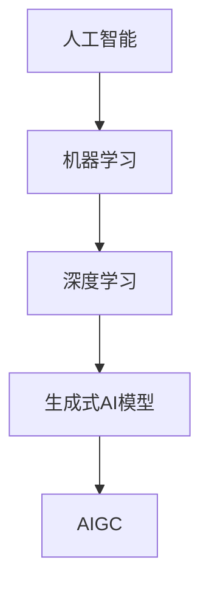
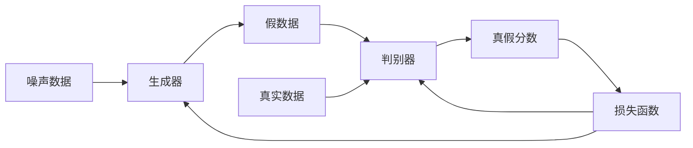
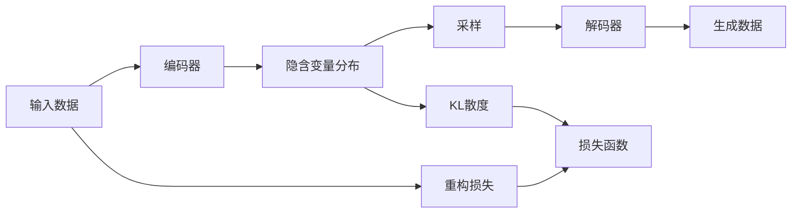
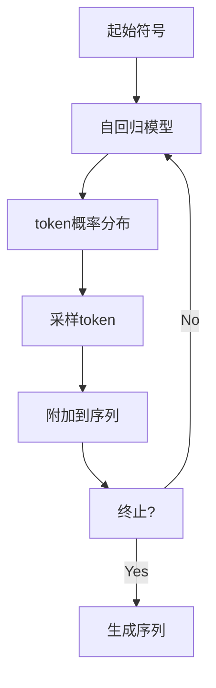

# AIGC从入门到实战：根据容错率来确定职业路径

## 1.背景介绍

### 1.1 人工智能的崛起

人工智能(Artificial Intelligence,AI)是当代科技发展的重要驱动力,近年来AI技术取得了长足进步,尤其是在自然语言处理、计算机视觉、决策控制等领域实现了突破性发展。AI技术已广泛应用于金融、医疗、制造、交通等诸多行业,大大提高了生产效率和服务质量。

### 1.2 AIGC的兴起

AIGC(AI Generated Content)即人工智能生成内容,是指利用AI技术自动生成文本、图像、音频、视频等多种形式的内容。AIGC技术的核心是大型语言模型和生成式AI模型,通过对海量数据的学习,模型可以生成高质量、多样化的内容。

### 1.3 AIGC的应用前景

AIGC技术可广泛应用于内容创作、营销广告、客户服务、教育培训等领域,有望极大提升内容生产效率,降低人力成本。未来,AIGC将成为重要的生产力工具,对多个行业产生深远影响。

## 2.核心概念与联系

### 2.1 人工智能

人工智能是研究、开发用于模拟、延伸和扩展人类智能的理论、方法、技术及应用系统的一门新的技术科学。

### 2.2 机器学习

机器学习是人工智能的一个重要分支,它赋予了计算机在没有明确程序的情况下,通过经验自动分析获取数据的能力。

### 2.3 深度学习

深度学习是机器学习中一种基于对数据进行表征学习的方法,通过对数据的特征自动提取,可以被用于解决机器学习的许多问题。



### 2.4 生成式AI模型

生成式AI模型是一种基于深度学习的模型,能够生成新的、符合特定模式的数据,如文本、图像、音频等。生成对抗网络(GAN)、变分自编码器(VAE)、自回归模型等都属于生成式AI模型。

### 2.5 AIGC

AIGC(AI Generated Content)是利用生成式AI模型自动生成文本、图像、音频、视频等多种形式内容的技术。大型语言模型如GPT就是AIGC的核心技术之一。

## 3.核心算法原理具体操作步骤

### 3.1 生成式对抗网络GAN

生成式对抗网络(Generative Adversarial Network,GAN)是一种生成式AI模型,包含生成器和判别器两个神经网络模型。

#### 3.1.1 生成器

生成器从噪声数据中生成假的样本数据,目标是使生成的假数据尽可能接近真实数据分布。

#### 3.1.2 判别器 

判别器的任务是区分生成器生成的假数据和真实数据,并对真实数据打高分,对假数据打低分。

#### 3.1.3 对抗训练

生成器和判别器相互对抗地训练,生成器尽量生成逼真的假数据来欺骗判别器,判别器则努力区分真假数据。两个模型在这个minimax博弈过程中相互促进,最终收敛达到平衡。



### 3.2 变分自编码器VAE

变分自编码器(Variational Autoencoder,VAE)也是一种常用的生成式AI模型,由编码器和解码器组成。

#### 3.2.1 编码器

编码器将输入数据编码为隐含变量的概率分布,即潜在空间的隐含表征。

#### 3.2.2 解码器

解码器从隐含变量的概率分布中采样,生成与输入数据相似的新数据。

#### 3.2.3 损失函数

VAE的损失函数包括重构损失和KL散度两部分,前者使生成数据与输入数据相似,后者使隐含变量的分布接近于高斯分布。



### 3.3 自回归模型

自回归模型是一种常用于生成序列数据(如文本)的生成式AI模型。

#### 3.3.1 语言模型

自回归模型本质上是一个语言模型,学习文本序列的联合概率分布 $P(x_1,x_2,...,x_n)$。

#### 3.3.2 自回归

利用链式法则将联合概率分解为条件概率的乘积:

$$P(x_1,x_2,...,x_n) = \prod_{t=1}^{n}P(x_t|x_1,...,x_{t-1})$$

每一步预测都条件依赖于之前的序列。

#### 3.3.3 生成过程

给定起始符号,模型逐步预测下一个token的概率分布,从中采样获得token,将其附加到序列末尾,重复该过程直至生成终止符号。



## 4.数学模型和公式详细讲解举例说明

### 4.1 生成式对抗网络GAN

GAN的目标是训练生成器G生成逼真的假数据,使其分布 $p_g$ 尽可能逼近真实数据分布 $p_{data}$。同时训练判别器D,使其能够很好地区分生成数据和真实数据。

GAN的损失函数为:

$$\min\limits_G \max\limits_D V(D,G) = \mathbb{E}_{x\sim p_{data}(x)}[\log D(x)] + \mathbb{E}_{z\sim p_z(z)}[\log(1-D(G(z)))]$$

其中:
- $x$为真实数据,服从分布$p_{data}$
- $z$为噪声数据,服从分布$p_z$
- $G(z)$为生成器生成的假数据
- $D(x)$为判别器对真实数据$x$的判别分数
- $D(G(z))$为判别器对生成数据$G(z)$的判别分数

判别器D的目标是最大化上式,即最大化对真实数据的判别分数,最小化对生成数据的判别分数。
生成器G的目标是最小化上式,即使生成数据G(z)尽可能"欺骗"判别器D,使其判别分数D(G(z))最大化。

两个网络相互对抗训练,最终收敛时生成数据分布$p_g$接近真实数据分布$p_{data}$。

### 4.2 变分自编码器VAE

VAE将输入数据$x$编码为隐含变量$z$的概率分布$q_\phi(z|x)$,再由$z$解码生成新数据$\hat{x}$,目标是使$\hat{x}$尽可能接近$x$。

VAE的损失函数包括两部分:

$$\mathcal{L}(\theta,\phi;x) = \mathbb{E}_{q_\phi(z|x)}[\log p_\theta(x|z)] - \beta D_{KL}(q_\phi(z|x)||p(z))$$

第一项是重构损失,衡量生成数据$\hat{x}$与输入数据$x$的差异。
第二项是KL散度,衡量编码分布$q_\phi(z|x)$与先验分布$p(z)$(通常为标准正态分布)的差异,用于约束隐含变量$z$的分布。
$\beta$是一个超参数,控制两项损失的权重。

在训练过程中,编码器和解码器网络通过最小化损失函数,学习到输入数据$x$的隐含表征$z$,并能够从$z$重构出与$x$相似的新数据$\hat{x}$。

### 4.3 自回归语言模型

自回归语言模型的目标是最大化文本序列$X=(x_1,x_2,...,x_n)$的条件概率:

$$\begin{aligned}
\log P(X) &= \log \prod_{t=1}^n P(x_t|x_1,...,x_{t-1})\\
          &= \sum_{t=1}^n \log P(x_t|x_1,...,x_{t-1})
\end{aligned}$$

其中每一项$P(x_t|x_1,...,x_{t-1})$表示基于之前序列预测当前token $x_t$的条件概率。

通过最大化上式,模型可以学习到文本序列的联合概率分布,进而生成新的序列。

对于给定前缀$X_1^{t-1}=(x_1,...,x_{t-1})$,模型预测下一个token $x_t$的概率分布为:

$$P(x_t|X_1^{t-1}) = \text{softmax}(W_o h_t + b_o)$$

其中$h_t$是基于$X_1^{t-1}$计算出的隐藏状态,通过线性变换和softmax获得词典上token的概率分布。

在生成过程中,给定起始符号,模型重复上述过程预测下一个token的概率分布,从中采样获得token,附加到序列末尾,直至生成终止符号。

## 5.项目实践:代码实例和详细解释说明

这里我们使用PyTorch实现一个基于GAN的手写数字生成器,用于生成类似MNIST数据集的手写数字图像。

### 5.1 导入库

```python
import torch
import torch.nn as nn
import torchvision
import torchvision.transforms as transforms
import matplotlib.pyplot as plt
```

### 5.2 加载MNIST数据集

```python
# 下载MNIST数据集
dataset = torchvision.datasets.MNIST(root='./data', download=True,
                                     transform=transforms.ToTensor())

# 构建数据加载器
dataloader = torch.utils.data.DataLoader(dataset, batch_size=128, shuffle=True)
```

### 5.3 定义生成器

```python
class Generator(nn.Module):
    def __init__(self, z_dim=100, image_dim=784):
        super().__init__()
        self.z_dim = z_dim
        
        self.gen = nn.Sequential(
            nn.Linear(z_dim, 256),
            nn.LeakyReLU(0.2),
            nn.Linear(256, image_dim),
            nn.Tanh() # 输出像素值在(-1,1)
        )
        
    def forward(self, z):
        return self.gen(z)
```

### 5.4 定义判别器

```python
class Discriminator(nn.Module):
    def __init__(self, image_dim=784):
        super().__init__()
        
        self.disc = nn.Sequential(
            nn.Linear(image_dim, 256),
            nn.LeakyReLU(0.2),
            nn.Linear(256, 1),
            nn.Sigmoid() # 输出为真实图像的概率
        )
        
    def forward(self, x):
        return self.disc(x)
```

### 5.5 定义损失函数和优化器

```python
# 损失函数
criterion = nn.BCELoss()

# 生成器
z_dim = 100
G = Generator(z_dim)
# 判别器
D = Discriminator()

# 优化器
lr = 0.0002
G_optimizer = torch.optim.Adam(G.parameters(), lr=lr)
D_optimizer = torch.optim.Adam(D.parameters(), lr=lr)
```

### 5.6 训练模型

```python
epochs = 200
sample_period = 1000 # 每1000批次保存一次生成图像

for epoch in range(epochs):
    for i, (images, _) in enumerate(dataloader):
        
        # 将图像展平为向量
        images = images.view(-1, 784)
        
        # 生成噪声数据
        z = torch.randn(images.size(0), z_dim)
        
        # 生成器生成假图像
        gen_images = G(z)
        
        # ============= 训练判别器 ===============
        # 最大化判别器能够正确识别真实图像和生成图像的概率
        D_optimizer.zero_grad()
        
        # 判别真实图像
        d_real = D(images)
        d_real_loss = criterion(d_real, torch.ones_like(d_real))
        
        