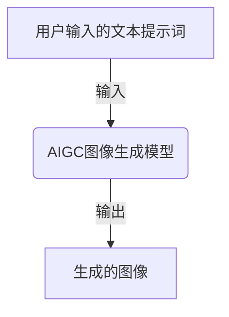
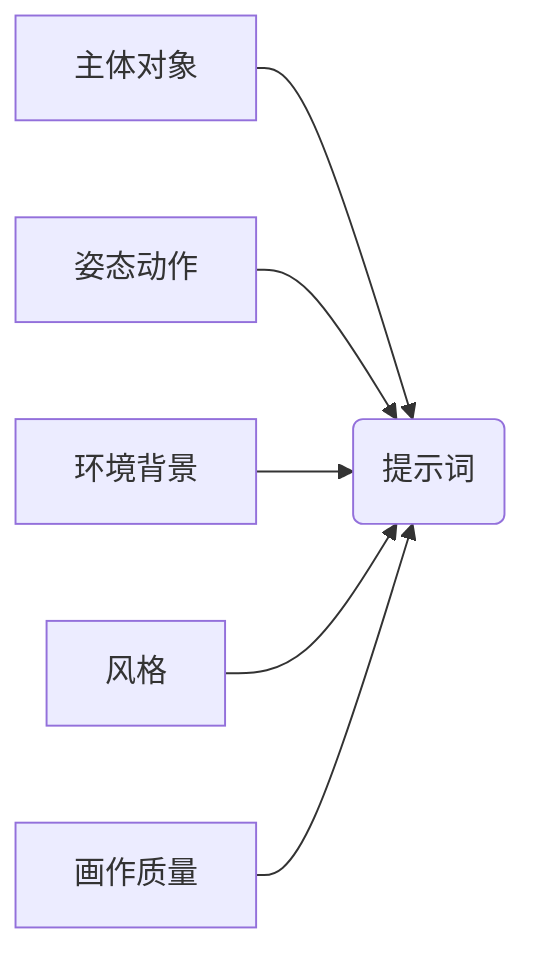
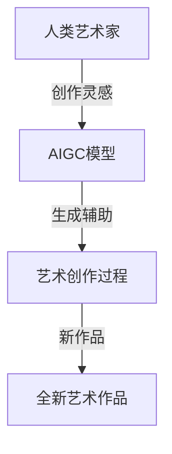
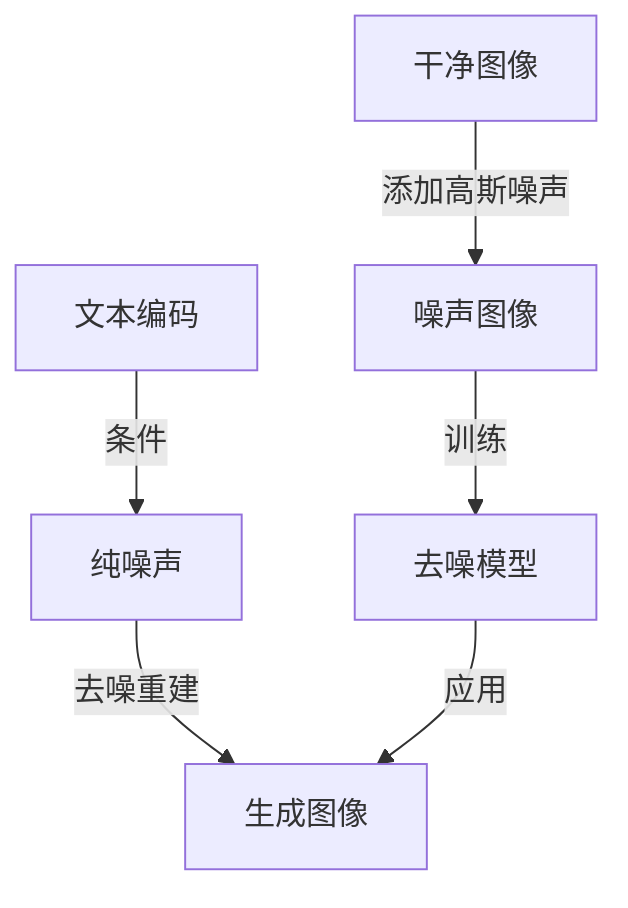
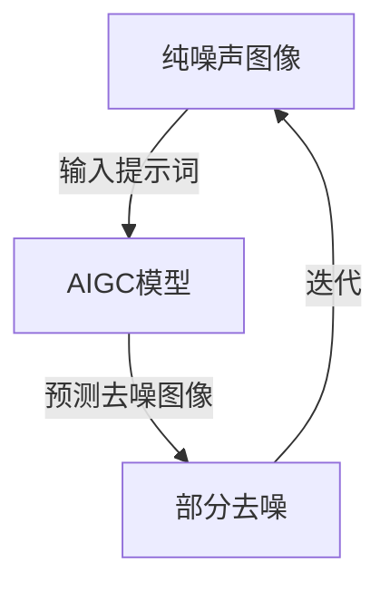

# AIGC从入门到实战：绘制美丽小姐姐的提示词写作技巧

## 1. 背景介绍

### 1.1 AIGC的崛起

近年来,人工智能生成内容(AIGC)技术飞速发展,成为了科技界的一股重要力量。AIGC可以根据用户输入的文本提示词,生成逼真的图像、视频、音频等多种形式的内容。其中,生成高质量的人物图像一直是AIGC技术的重点应用领域之一。

随着AIGC模型的不断迭代,生成逼真人物图像的质量和效果越来越好。特别是近期,一些主流的AIGC模型已经可以根据用户的文字描述,生成栩栩如生、美貌出众的"小姐姐"人物图像,在互联网上掀起了一股"AI小姐姐"的热潮。

### 1.2 提示词的重要性

要生成优质的AI绘画作品,提供高质量的提示词是关键所在。提示词的好坏直接决定了生成图像的质量、细节和风格特征。一个优秀的提示词不仅需要准确描述出想要生成的图像内容,还需要巧妙运用一些技巧来指导模型生成期望的视觉效果。

本文将重点探讨如何编写高质量的提示词,以指导AIGC模型生成美丽动人的"小姐姐"人物图像。我们将介绍提示词写作的一般原则、常用技巧,并通过实例分析说明如何将这些技巧付诸实践。

## 2. 核心概念与联系

在深入探讨提示词写作技巧之前,我们有必要先了解一些AIGC绘画相关的核心概念。

### 2.1 AIGC模型

AIGC(AI Generated Content)模型是指通过机器学习算法训练而成的人工智能模型,能够根据用户输入的文本描述生成相应的图像、视频、音频等内容。

常见的AIGC图像生成模型包括:

- Stable Diffusion
- DALL-E 2
- Midjourney
- Imagen
- ...

这些模型通过对大量图像数据集进行训练,学习图像与文本描述之间的映射关系,从而获得生成图像的能力。



### 2.2 提示词

提示词(Prompt)是指用户输入给AIGC模型的文本描述,用于指导模型生成所需的图像内容。一个好的提示词对于获得理想的生成结果至关重要。

提示词通常由以下几个部分组成:

- 主体对象(Subject)
- 姿态、动作(Pose/Action)
- 环境、背景(Environment/Background)
- 风格(Style)
- 画作质量(Quality)
- ...



### 2.3 人工智能与艺术创作

传统上,艺术创作被视为人类的专属领域。但近年来,AIGC技术的兴起正在改变这一格局。AIGC模型能够模仿和学习人类艺术家的创作风格,并基于此生成全新的艺术作品。

艺术家和AIGC模型的结合,开辟了一种全新的艺术创作方式。艺术家可以利用AIGC工具激发灵感,快速实现构思,节省大量绘画时间;而AIGC模型则为艺术创作注入了新的活力,拓展了艺术表现的可能性。



## 3. 核心算法原理具体操作步骤

### 3.1 AIGC图像生成原理

主流的AIGC图像生成模型通常采用扩散模型(Diffusion Model)和潜在扩散模型(Latent Diffusion Model)等算法原理。这些算法的核心思想是:

1. 将一张干净的图像添加高斯噪声,使其逐渐变得模糊不清
2. 训练一个去噪模型(Denoising Model),学习如何从噪声图像中重建原始干净图像
3. 在生成新图像时,将文本编码为条件,从纯噪声开始,逐步去噪重建出条件图像

这个过程可以用下面的流程图来描述:



### 3.2 提示词编码

为了将用户输入的文本提示词输入给AIGC模型,需要先将提示词编码为模型可识别的数值向量表示。常用的编码方式有:

1. **Token编码**: 将提示词按字符或词元(Token)分割,查找对应的数值ID
2. **Word Embedding**: 将每个词映射为一个固定长度的向量
3. **Transformer Encoder**: 使用Transformer编码器对整个提示词进行编码

编码后的提示词向量就可以输入到AIGC模型中,作为生成图像的条件。

### 3.3 迭代采样过程

AIGC模型通常采用迭代采样的方式生成图像。具体步骤如下:

1. 从纯噪声图像开始
2. 将编码后的提示词向量输入模型
3. 模型预测当前图像去噪后的结果
4. 根据预测结果,对当前图像进行部分去噪
5. 重复3-4步骤,直至生成满意的图像

该过程可视为在语义空间(提示词)和视觉空间(图像)之间进行迭代投影。每一步都会使图像更贴近提示词的语义描述。



## 4. 数学模型和公式详细讲解举例说明

### 4.1 潜在扩散模型

潜在扩散模型(Latent Diffusion Model)是目前AIGC图像生成任务中常用的一种模型。它的数学原理可以用下面的公式来表示:

在训练过程中,模型的目标是学习从噪声图像$x_t$重建原始图像$x_0$的过程,即学习从$q(x_t|x_0)$到$p(x_0)$的映射$p_\theta(x_0|x_t)$。其损失函数为:

$$\mathcal{L}_{vld}(\theta) = \mathbb{E}_{x_0, \epsilon, t}\Big[||\epsilon - \epsilon_\theta(x_t, t)||_2^2\Big]$$

其中$\epsilon_\theta$是去噪模型,用于从噪声图像$x_t$预测原始噪声$\epsilon$。

在生成图像时,我们从纯噪声$x_T \sim \mathcal{N}(0, I)$开始,利用训练好的去噪模型$\epsilon_\theta$逐步去噪,生成图像$\hat{x}_0$:

$$\begin{aligned}
x_{T} &\sim \mathcal{N}(0, I) \\
x_{t-1} &= x_t - \frac{1}{\sqrt{\alpha_t}}(\epsilon_\theta(x_t, t) + \sigma_t\epsilon_t), \quad \epsilon_t \sim \mathcal{N}(0, I)\\
\hat{x}_0 &= x_0
\end{aligned}$$

其中$\alpha_t$和$\sigma_t$是预定义的扩散过程参数。通过不断迭代去噪,最终可以生成高质量的图像$\hat{x}_0$。

### 4.2 CLIP模型

除了上述的扩散模型,AIGC图像生成还常与CLIP(Contrastive Language-Image Pretraining)模型相结合,用于提高图文语义一致性。

CLIP是一种视觉语义模型,能够学习图像和文本之间的语义关联。它的核心思想是最大化相关图文对的相似度得分,最小化无关对的得分:

$$\mathcal{L}_{CLIP} = \mathbb{E}_{(I, T) \sim p_{pos}}\Big[-\log\frac{e^{S(I,T)}}{e^{S(I,T)} + \sum_{(I', T') \sim p_{neg}}e^{S(I',T')}}\Big]$$

其中$S(I, T)$是图像$I$和文本$T$的相似度得分,由CLIP模型计算得到。通过最小化该损失函数,CLIP可以学习到很强的图文对应能力。

在AIGC图像生成任务中,我们可以将CLIP模型与扩散模型相结合,引导生成的图像语义更贴近提示词描述。具体做法是,在扩散模型的损失函数中加入CLIP损失项:

$$\mathcal{L}_{total} = \mathcal{L}_{vld} + \lambda \mathcal{L}_{CLIP}$$

其中$\lambda$是调节系数。通过联合训练,模型可以生成质量更高、语义更准确的图像。

## 5. 项目实践:代码实例和详细解释说明

为了更好地理解AIGC图像生成的实现细节,我们将基于开源的Stable Diffusion模型,使用Python代码演示如何生成"小姐姐"人物图像。

### 5.1 安装依赖库

首先,我们需要安装必要的Python库,包括:

- diffusers: Hugging Face的Stable Diffusion库
- transformers: 用于文本编码
- PIL: 用于图像处理

```python
!pip install diffusers transformers pillow
```

### 5.2 加载Stable Diffusion模型

接下来,加载预训练的Stable Diffusion模型和CLIP模型:

```python
from diffusers import StableDiffusionPipeline
import torch

model_id = "runwayml/stable-diffusion-v1-5"
pipe = StableDiffusionPipeline.from_pretrained(model_id, torch_dtype=torch.float16)
pipe = pipe.to("cuda")
```

### 5.3 生成图像

现在我们可以输入提示词,生成"小姐姐"人物图像了:

```python
prompt = "a beautiful young lady with long hair, in a floral dress, standing in a sunny garden, looking at the camera and smiling, realistic, highly detailed, sharp focus, 8k resolution"

image = pipe(prompt, num_inference_steps=50, guidance_scale=7.5)["sample"][0]  
image.save("ai_girl.png")
```

这里我们设置了一些参数:

- `num_inference_steps=50`: 迭代采样的步数,步数越大图像质量越高
- `guidance_scale=7.5`: 语义指导强度,值越大生成图像越贴近提示词描述

生成的图像将保存到`ai_girl.png`文件中。你可以根据需要多次运行上述代码,生成不同风格的"小姐姐"图像。

### 5.4 可视化注意力图

为了更好地理解模型的工作原理,我们可以可视化注意力图(Attention Map),观察模型在生成图像时关注的区域。

```python
import cv2
from PIL import Image

# 重新运行生成
images = pipe(prompt, num_inference_steps=50, guidance_scale=7.5)

# 提取注意力图
attentions = images.msed

# 将注意力图可视化
attn_img = attentions[0].sum(0)
cv_img = Image.fromarray(attn_img)
cv_img.save("attention_map.jpg")
```

生成的`attention_map.jpg`文件即为注意力图,它反映了模型在生成图像时对不同区域的关注程度。你可以将注意力图与生成图像对比分析,了解模型的工作机理。

## 6. 实际应用场景

AIGC技术在生成人物图像方面有着广泛的应用前景,包括但不限于:

### 6.1 艺术创作辅助

艺术家可以利用AIGC模型快速生成人物草图,激发创作灵感,节省绘画时间。生成的图像还可以作为参考,帮助艺术家掌握人物比例、动态、细节等绘画技巧。

### 6.2 虚拟人物设计

在影视动画、游戏等领域,AIGC技术可以用于设计和创造各种虚拟人物形象。相比传统的人工绘制,AIGC模型能够更快更便捷地生成逼真