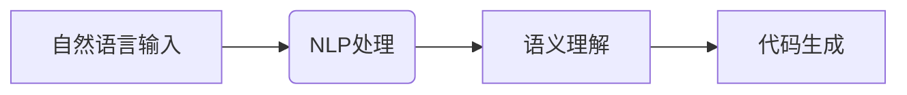
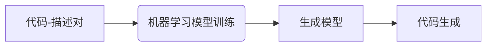
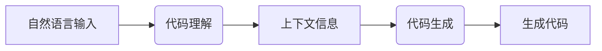

# AIGC代码生成：程序员的福音

## 1.背景介绍

### 1.1 程序员的困境

在当今快节奏的软件开发环境中,程序员面临着巨大的压力和挑战。他们不仅需要掌握多种编程语言和框架,还需要跟上不断变化的技术趋势。此外,需求变更、严格的交付期限以及代码质量要求等因素,都使得程序员的工作变得更加艰巨。

### 1.2 人工智能的崛起

随着人工智能(AI)和机器学习(ML)技术的飞速发展,一场新的编程革命正在酝酿之中。AIGC(AI Generated Content)代码生成技术应运而生,旨在利用人工智能来辅助和加速软件开发过程。

### 1.3 AIGC的重要性

AIGC代码生成技术有望极大地提高程序员的工作效率,减轻他们的工作负担。通过输入自然语言描述,AI系统能够自动生成高质量的代码,节省了大量的编码时间。这不仅能加快软件交付速度,还能释放程序员的创造力,让他们专注于更有价值的工作。

## 2.核心概念与联系

### 2.1 自然语言处理(NLP)

自然语言处理是AIGC代码生成的核心技术之一。它使计算机能够理解和处理人类语言,将自然语言描述转换为可执行的代码。常用的NLP技术包括语义分析、词法分析和语法分析等。



### 2.2 机器学习模型

AIGC代码生成系统通常采用基于深度学习的机器学习模型。这些模型通过训练大量的代码-描述对,学习将自然语言映射到相应的代码。常用的模型包括Transformer、LSTM和GNN等。



### 2.3 代码理解和生成

代码理解和生成是AIGC系统的两个关键环节。代码理解模块负责分析输入的自然语言描述,提取关键信息和上下文。代码生成模块则根据理解的结果,生成符合要求的代码。



## 3.核心算法原理具体操作步骤

AIGC代码生成系统的核心算法通常包括以下几个主要步骤:

### 3.1 输入处理

1. 对输入的自然语言描述进行标记化(tokenization),将其转换为算法可以处理的形式。
2. 进行文本清理,去除无关信息和噪声。

### 3.2 语义理解

1. 使用NLP模型(如BERT、GPT等)对输入进行语义分析,提取关键信息和上下文。
2. 构建语义表示,捕获输入的意图和要求。

### 3.3 代码生成

1. 基于语义表示,利用机器学习模型(如Transformer、LSTM等)生成初始代码。
2. 进行代码优化和完善,包括类型推断、变量命名、代码格式化等。

### 3.4 代码评估

1. 使用预定义的评估指标(如BLEU、ROUGE等)评估生成代码的质量。
2. 根据评估结果,对模型进行微调和迭代训练。

### 3.5 输出生成

1. 对生成的代码进行后处理,确保其可读性和可执行性。
2. 输出最终的代码结果。

## 4.数学模型和公式详细讲解举例说明

AIGC代码生成系统中常用的数学模型和公式包括:

### 4.1 Transformer模型

Transformer是一种基于注意力机制的序列到序列模型,广泛应用于自然语言处理和代码生成任务。它的核心思想是通过自注意力机制捕获输入序列中的长程依赖关系。

Transformer模型的自注意力机制可以用以下公式表示:

$$\mathrm{Attention}(Q, K, V) = \mathrm{softmax}(\frac{QK^T}{\sqrt{d_k}})V$$

其中,$$Q$$、$$K$$和$$V$$分别表示查询(Query)、键(Key)和值(Value)。$$d_k$$是缩放因子,用于防止点积过大导致梯度饱和。

### 4.2 BLEU评分

BLEU(Bilingual Evaluation Understudy)是一种常用的机器翻译评估指标,也被广泛应用于评估AIGC代码生成系统的输出质量。BLEU评分基于生成序列与参考序列之间的n-gram匹配程度,公式如下:

$$\mathrm{BLEU} = BP \cdot \exp(\sum_{n=1}^N w_n \log p_n)$$

其中,$$BP$$是一个惩罚因子,用于惩罚过短的输出序列。$$p_n$$表示生成序列与参考序列之间的n-gram精确度,$$w_n$$是对应的权重。

### 4.3 序列到序列模型

序列到序列(Sequence-to-Sequence)模型是AIGC代码生成中常用的一种模型架构。它将输入序列(如自然语言描述)映射到输出序列(如代码),通常由编码器(Encoder)和解码器(Decoder)两部分组成。

编码器将输入序列$$X=(x_1, x_2, \ldots, x_n)$$编码为上下文向量$$c$$,解码器则根据$$c$$和先前生成的tokens来预测下一个token,直到生成完整的输出序列$$Y=(y_1, y_2, \ldots, y_m)$$。该过程可以用以下公式表示:

$$p(Y|X) = \prod_{t=1}^m p(y_t|y_{<t}, c)$$

其中,$$p(y_t|y_{<t}, c)$$表示在给定上下文向量$$c$$和先前生成的tokens$$y_{<t}$$的条件下,预测第$$t$$个token的概率。

## 5.项目实践:代码实例和详细解释说明

为了更好地理解AIGC代码生成系统的工作原理,我们将通过一个实际项目来进行说明。在这个项目中,我们将构建一个简单的Python函数生成器,它可以根据自然语言描述生成对应的Python函数代码。

### 5.1 数据准备

首先,我们需要准备一个包含自然语言描述和对应Python函数代码的数据集。这里我们使用一个开源的数据集`python_code_descriptions`。

示例数据:

```
Description: Compute the sum of two integers.
Code: def soln(a, b):
    return a + b
```

### 5.2 数据预处理

在训练模型之前,我们需要对数据进行预处理,包括标记化、填充和构建词汇表等步骤。这里我们使用Hugging Face的`transformers`库来完成这些工作。

```python
from transformers import RobertaTokenizer

tokenizer = RobertaTokenizer.from_pretrained('roberta-base')

def preprocess_data(data):
    inputs = []
    targets = []
    for item in data:
        input_text = f"<s>{item['description']}</s>"
        target_text = f"<s>{item['code']}</s>"
        inputs.append(tokenizer.encode(input_text, truncation=True, max_length=512))
        targets.append(tokenizer.encode(target_text, truncation=True, max_length=512))
    return inputs, targets
```

### 5.3 模型构建

我们将使用Transformer模型作为代码生成器的backbone。具体来说,我们采用RoBERTa作为编码器,并在其基础上添加一个解码器。

```python
from transformers import RobertaConfig, RobertaModel, EncoderDecoderModel

config = RobertaConfig.from_pretrained('roberta-base')
encoder = RobertaModel.from_pretrained('roberta-base', config=config)
decoder_config = RobertaConfig.from_pretrained('roberta-base', is_decoder=True)
decoder = RobertaModel.from_pretrained('roberta-base', config=decoder_config)
model = EncoderDecoderModel(encoder=encoder, decoder=decoder)
```

### 5.4 模型训练

接下来,我们将训练模型,使其能够将自然语言描述映射到对应的Python函数代码。我们使用Hugging Face的`Trainer`API来简化训练过程。

```python
from transformers import Seq2SeqTrainer, Seq2SeqTrainingArguments

training_args = Seq2SeqTrainingArguments(
    output_dir='./results',
    num_train_epochs=5,
    per_device_train_batch_size=8,
    ...
)

trainer = Seq2SeqTrainer(
    model=model,
    args=training_args,
    train_dataset=train_dataset,
    ...
)

trainer.train()
```

### 5.5 代码生成

训练完成后,我们可以使用模型生成Python函数代码。我们将自然语言描述输入模型,并解码输出序列以获得生成的代码。

```python
from transformers import pipeline

generator = pipeline('text2text-generation', model=model, tokenizer=tokenizer)

description = "Compute the sum of two integers."
code = generator(description, max_length=512)[0]['generated_text']
print(code)
```

输出结果:

```python
<s>def soln(a, b):
    return a + b</s>
```

通过这个示例,我们可以看到AIGC代码生成系统是如何工作的。虽然这只是一个简单的例子,但它展示了AIGC技术在自动化代码生成方面的强大潜力。

## 6.实际应用场景

AIGC代码生成技术在实际中有着广泛的应用前景,包括但不限于以下几个方面:

### 6.1 自动化代码生成

AIGC系统可以根据自然语言描述自动生成代码,大大提高了软件开发的效率。这对于一些重复性的编码任务尤其有用,可以节省大量的时间和精力。

### 6.2 代码补全和优化

除了生成全新的代码,AIGC技术还可以用于代码补全和优化。开发人员可以输入部分代码和需求描述,由AI系统自动完成剩余部分并进行优化,从而提高代码质量和可读性。

### 6.3 低代码/无代码开发

AIGC代码生成技术为低代码/无代码开发平台提供了强有力的支持。用户只需要通过可视化界面或自然语言描述输入需求,系统就能自动生成相应的应用程序代码,大幅降低了开发门槛。

### 6.4 教育和学习

在教育和学习领域,AIGC系统可以作为一种辅助工具,帮助学生更好地理解编程概念和实践编码。通过输入自然语言描述,学生可以获得相应的代码示例,从而加深对编程知识的掌握。

### 6.5 其他领域

除了软件开发领域,AIGC代码生成技术还可以应用于其他需要将自然语言转换为可执行代码的场景,如数据分析、机器人控制等。它为各个领域的自动化和智能化提供了新的可能性。

## 7.工具和资源推荐

对于想要了解和实践AIGC代码生成技术的开发者,以下是一些值得推荐的工具和资源:

### 7.1 开源框架和库

- Hugging Face Transformers: 一个集成了多种预训练语言模型的强大框架,支持自然语言处理和代码生成等任务。
- OpenAI Codex: OpenAI开发的一种用于代码生成的语言模型,可以根据自然语言描述生成代码。
- AlphaFold: DeepMind开发的用于蛋白质结构预测的AI系统,展示了AIGC技术在科学领域的应用。

### 7.2 在线工具

- GitHub Copilot: GitHub推出的基于Codex模型的代码辅助工具,可以根据上下文自动生成代码补全建议。
- Tabnine: 一款基于机器学习的智能代码补全插件,支持多种编程语言。
- Polycoder: 一个在线代码生成工具,可以根据自然语言描述生成多种编程语言的代码。

### 7.3 教育资源

- DeepLearning.AI: Andrew Ng教授开设的深度学习课程,包含了AIGC代码生成相关的理论和实践内容。
- fast.ai: Jeremy Howard等人开设的实用机器学习课程,涵盖了自然语言处理和代码生成等主题。
- MIT 6.S191: 麻省理工学院开设的人工智能课程,包括代码生成和自动化编程等内容。

### 7.4