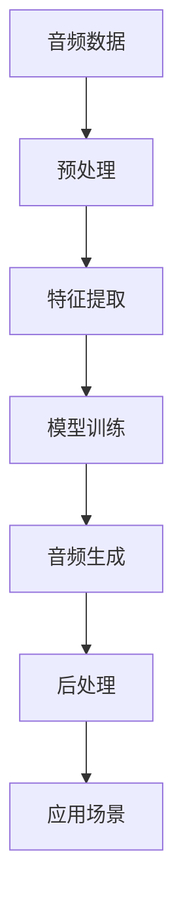
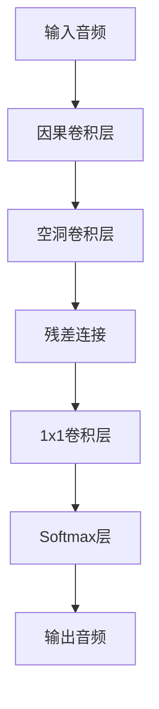

# AIGC实战：音频生成案例

## 1. 背景介绍
### 1.1 AIGC的兴起与发展
### 1.2 音频生成技术的重要性
### 1.3 本文的目的与结构

## 2. 核心概念与联系
### 2.1 AIGC的定义与特点
### 2.2 音频生成的基本原理
#### 2.2.1 声音的物理特性
#### 2.2.2 音频信号的数字化表示
#### 2.2.3 音频生成的主要方法
### 2.3 AIGC与音频生成的结合
#### 2.3.1 基于深度学习的音频生成模型
#### 2.3.2 GAN在音频生成中的应用
#### 2.3.3 Transformer在音频生成中的应用

## 3. 核心算法原理具体操作步骤
### 3.1 WaveNet模型
#### 3.1.1 WaveNet的网络结构
#### 3.1.2 WaveNet的训练过程
#### 3.1.3 WaveNet的生成过程
### 3.2 SampleRNN模型 
#### 3.2.1 SampleRNN的网络结构
#### 3.2.2 SampleRNN的训练过程
#### 3.2.3 SampleRNN的生成过程
### 3.3 WaveGAN模型
#### 3.3.1 WaveGAN的网络结构
#### 3.3.2 WaveGAN的训练过程 
#### 3.3.3 WaveGAN的生成过程

## 4. 数学模型和公式详细讲解举例说明
### 4.1 音频信号的数学表示
#### 4.1.1 时域表示
#### 4.1.2 频域表示
#### 4.1.3 时频域表示
### 4.2 卷积神经网络在音频处理中的应用
#### 4.2.1 一维卷积的数学原理
#### 4.2.2 因果卷积的数学原理
#### 4.2.3 空洞卷积的数学原理
### 4.3 循环神经网络在音频处理中的应用
#### 4.3.1 LSTM的数学原理
#### 4.3.2 GRU的数学原理
#### 4.3.3 双向RNN的数学原理

## 5. 项目实践：代码实例和详细解释说明
### 5.1 数据预处理
#### 5.1.1 音频数据的读取与写入
#### 5.1.2 音频数据的归一化
#### 5.1.3 音频数据的分割与拼接
### 5.2 模型构建与训练
#### 5.2.1 WaveNet模型的PyTorch实现
#### 5.2.2 SampleRNN模型的TensorFlow实现  
#### 5.2.3 WaveGAN模型的Keras实现
### 5.3 音频生成与后处理
#### 5.3.1 利用训练好的模型生成音频
#### 5.3.2 生成音频的去噪与增强
#### 5.3.3 生成音频的格式转换与保存

## 6. 实际应用场景
### 6.1 语音合成
#### 6.1.1 个性化语音助手
#### 6.1.2 有声读物与广播剧
#### 6.1.3 游戏与动画配音
### 6.2 音乐生成
#### 6.2.1 AI作曲家
#### 6.2.2 智能音乐推荐
#### 6.2.3 音乐风格迁移
### 6.3 声音特效生成
#### 6.3.1 电影与游戏音效
#### 6.3.2 ASMR音频生成
#### 6.3.3 声音景观设计

## 7. 工具和资源推荐 
### 7.1 开源工具包
#### 7.1.1 TensorFlow
#### 7.1.2 PyTorch
#### 7.1.3 Keras
### 7.2 数据集资源
#### 7.2.1 LJ Speech数据集
#### 7.2.2 VCTK数据集
#### 7.2.3 NSynth数据集
### 7.3 学习资料
#### 7.3.1 深度学习与音频处理教程
#### 7.3.2 GAN与音频生成论文集
#### 7.3.3 音频处理与AIGC社区

## 8. 总结：未来发展趋势与挑战
### 8.1 AIGC音频生成的发展趋势
#### 8.1.1 多模态融合
#### 8.1.2 个性化定制
#### 8.1.3 实时交互
### 8.2 面临的挑战
#### 8.2.1 计算资源消耗
#### 8.2.2 版权与伦理问题
#### 8.2.3 音质与真实性
### 8.3 总结与展望

## 9. 附录：常见问题与解答
### 9.1 如何选择合适的音频生成模型？
### 9.2 如何提高生成音频的质量？
### 9.3 如何解决生成音频的版权问题？
### 9.4 AIGC音频生成与传统音频处理的区别？
### 9.5 AIGC音频生成的应用前景如何？



AIGC（AI Generated Content，AI生成内容）技术的快速发展为音频生成领域带来了革命性的变化。传统的音频生成方法需要大量的人工操作和专业知识，而基于深度学习的AIGC音频生成模型能够自动学习音频数据的特征，并生成高质量、个性化的音频内容。

音频信号可以看作是一个时间序列，每个时刻的采样值表示声音的振幅。将连续的模拟信号转换为离散的数字信号的过程称为采样，采样频率决定了音频的质量。常见的音频采样频率有8kHz、16kHz、44.1kHz等，采样位深一般为16bit或24bit。

基于深度学习的音频生成模型主要有以下几类：

1. 基于自回归模型的WaveNet和SampleRNN。它们通过建模音频信号的概率分布来生成音频，每一时刻的采样值由前面的采样值决定。WaveNet使用因果卷积和空洞卷积来扩大感受野，提高生成音频的长期依赖性。SampleRNN使用多层RNN来建模不同尺度的音频片段，更加高效。

2. 基于GAN的WaveGAN和GANSynth。它们通过生成器和判别器的对抗学习来生成音频。生成器负责生成逼真的音频数据，判别器负责判断生成的音频是否真实。通过不断的博弈，生成器可以生成越来越真实的音频数据。

3. 基于Transformer的VITS和AudioLM。它们使用自注意力机制来建模音频信号的全局依赖关系，并引入了位置编码和多头注意力等技术，大大提高了生成音频的质量和效率。

下面以WaveNet为例，详细介绍其核心原理和实现步骤。

WaveNet的网络结构如下图所示：



WaveNet使用因果卷积来保证生成音频的因果性，即当前时刻的输出只能依赖于之前的输入。因果卷积可以表示为：

$$y[n]=\sum_{i=1}^{k} w[i]x[n-i]$$

其中$w$为卷积核，$k$为卷积核大小。

为了提高感受野，WaveNet使用了空洞卷积。空洞卷积在因果卷积的基础上引入了扩张因子$d$，可以表示为：

$$y[n]=\sum_{i=1}^{k} w[i]x[n-d\cdot i]$$

通过叠加多层不同扩张因子的空洞卷积，WaveNet可以建模音频信号的长期依赖关系。

WaveNet的训练过程如下：

1. 将原始音频数据进行预处理，转换为μ-law编码或one-hot编码。
2. 构建WaveNet模型，设置超参数如卷积层数、扩张因子、残差通道数等。
3. 定义损失函数，一般使用交叉熵损失函数。
4. 使用Adam优化器进行训练，调整学习率、批大小等参数。
5. 在验证集上评估模型性能，进行早停或模型选择。

WaveNet的生成过程如下：

1. 给定一个初始音频片段作为输入，通过WaveNet模型预测下一时刻的采样值。
2. 将预测的采样值作为下一时刻的输入，重复步骤1，直到生成指定长度的音频。
3. 对生成的音频进行后处理，如去噪、增强等。

下面是一个简单的WaveNet模型的PyTorch实现：

```python
import torch
import torch.nn as nn
import torch.nn.functional as F

class WaveNet(nn.Module):
    def __init__(self, num_layers, num_blocks, in_channels, out_channels, residual_channels, skip_channels, kernel_size, dilation_base):
        super(WaveNet, self).__init__()
        
        self.num_layers = num_layers
        self.num_blocks = num_blocks
        self.in_channels = in_channels
        self.out_channels = out_channels
        self.residual_channels = residual_channels
        self.skip_channels = skip_channels
        self.kernel_size = kernel_size
        self.dilation_base = dilation_base
        
        self.causal_conv = nn.Conv1d(in_channels, residual_channels, kernel_size=1)
        
        self.dilated_convs = nn.ModuleList()
        self.residual_convs = nn.ModuleList()
        self.skip_convs = nn.ModuleList()
        
        for i in range(num_layers):
            dilation = dilation_base ** i
            self.dilated_convs.append(nn.Conv1d(residual_channels, residual_channels, kernel_size=kernel_size, dilation=dilation, padding=dilation))
            self.residual_convs.append(nn.Conv1d(residual_channels, residual_channels, kernel_size=1))
            self.skip_convs.append(nn.Conv1d(residual_channels, skip_channels, kernel_size=1))
        
        self.out_conv = nn.Conv1d(skip_channels, out_channels, kernel_size=1)
    
    def forward(self, x):
        x = self.causal_conv(x)
        skip_connections = []
        
        for i in range(self.num_layers):
            dilated_x = self.dilated_convs[i](x)
            tanh_x = torch.tanh(dilated_x)
            sigmoid_x = torch.sigmoid(dilated_x)
            residual_x = self.residual_convs[i](tanh_x * sigmoid_x)
            x = x + residual_x
            
            skip_x = self.skip_convs[i](tanh_x * sigmoid_x)
            skip_connections.append(skip_x)
        
        out = torch.sum(torch.stack(skip_connections), dim=0)
        out = self.out_conv(out)
        out = F.softmax(out, dim=1)
        
        return out
```

这个WaveNet模型包含了因果卷积、空洞卷积、残差连接和跳跃连接等核心组件。通过叠加多个空洞卷积层，WaveNet可以建模音频信号的长期依赖关系，生成高质量的音频。

AIGC音频生成技术在语音合成、音乐生成、声音特效等领域有广泛的应用前景。例如，在个性化语音助手中，可以使用AIGC技术生成更加自然、情感丰富的语音响应；在游戏和电影中，可以使用AIGC技术自动生成逼真的音效和配乐；在音乐创作中，可以使用AIGC技术辅助作曲家进行灵感生成和风格迁移。

然而，AIGC音频生成技术也面临着一些挑战，如计算资源消耗大、生成音频的真实性有待提高、版权和伦理问题等。未来，AIGC音频生成技术将向着多模态融合、个性化定制、实时交互等方向发展，为人们带来更加智能、高效、有趣的音频体验。

作者：禅与计算机程序设计艺术 / Zen and the Art of Computer Programming