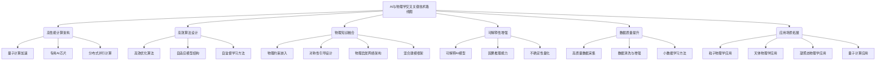

# AI与物理学交叉原理与代码实战案例讲解

## 1. 背景介绍

### 1.1 人工智能与物理学的交叉

人工智能(AI)和物理学这两个看似截然不同的领域,近年来却产生了令人兴奋的交集。随着计算能力的不断提高和算法的快速发展,AI已经开始在物理学研究中发挥越来越重要的作用。从理论建模到数据分析,从实验设计到结果解释,AI正在改变着物理学的研究方式。

物理学家们一直在寻求描述宇宙运行规律的基本定律和理论框架。然而,随着研究对象的复杂性不断增加,传统的解析方法往往会遇到计算上的瓶颈。这就为AI技术在物理学领域的应用创造了机遇。通过机器学习算法,我们可以从海量数据中发现隐藏的模式,构建精确的数值模型,甚至预测新的物理现象。

### 1.2 AI助力物理学研究的优势

将AI引入物理学研究具有以下几个主要优势:

1. **数据处理能力强大**: 现代物理实验会产生大量的高维度数据,传统的数据处理方法往往效率低下。AI算法能够高效地从复杂的数据中提取有价值的信息,加速研究进程。

2. **建模能力卓越**: 许多物理系统由于复杂性过高,无法用解析方程精确描述。AI可以通过学习数据,构建出精确的数值模型,为理论研究提供有力支持。

3. **发现隐藏规律**: AI算法擅长从海量数据中发现隐藏的模式和规律,这有助于物理学家提出新的理论假说,开辟新的研究方向。

4. **优化实验设计**: AI可以通过模拟和优化,帮助设计出更高效、更精确的物理实验,从而提高研究效率。

### 1.3 应用前景广阔

AI与物理学的交叉正在开辟一个全新的研究领域,其应用前景十分广阔。从粒子物理学到宇宙学,从凝聚态物理到量子计算,AI技术都有望为这些领域带来革命性的突破。随着AI算法的不断完善和计算能力的持续提升,我们有理由期待AI在物理学研究中发挥越来越重要的作用。

## 2. 核心概念与联系

### 2.1 机器学习在物理学中的应用

机器学习是AI的一个核心分支,它赋予计算机从数据中自主学习和建模的能力。在物理学研究中,机器学习可以发挥重要作用:

1. **监督学习**: 利用已知的物理定律和模型,训练机器学习算法从数据中学习隐含的规律,从而构建出精确的数值模型。这种方法在量子力学、相变理论等领域有广泛应用。

2. **非监督学习**: 当缺乏已知的理论模型时,非监督学习算法可以直接从数据中发现隐藏的模式和规律,为物理学家提出新的理论假说。这在探索新的物理现象时尤为有用。

3. **强化学习**: 通过不断尝试和调整,强化学习算法可以优化物理实验的设计,提高实验效率和精确度。这在实验控制和量子计算等领域有重要应用。

4. **深度学习**: 深度神经网络在处理高维度数据方面表现出色,可以高效地从复杂的物理数据(如天文观测数据、粒子对撞数据等)中提取有价值的信息。

### 2.2 物理知识与AI算法的融合

虽然AI算法在数据处理和模式识别方面有着独特的优势,但是将物理学的先验知识融入到算法中,往往可以进一步提升其性能和可解释性。这种融合的核心思路是:

1. **物理约束**: 将已知的物理定律和原理作为约束条件,嵌入到机器学习模型中。这样可以确保学习出的模型符合基本物理规律,从而提高模型的可靠性和解释性。

2. **对称性利用**: 利用物理系统固有的对称性,设计出具有相应不变性的神经网络结构。这种对称性引导的网络结构往往更加高效和精确。

3. **物理启发**: 从物理学中汲取启发,设计出新颖的神经网络架构和损失函数。例如,借鉴量子力学中的相干性和叠加性,设计出更加高效的深度学习模型。

4. **混合建模**: 将解析物理模型和数据驱动的机器学习模型相结合,发挥各自的优势,构建出更加准确和可解释的混合模型。

通过将物理知识与AI算法相融合,我们可以获得性能卓越、符合物理规律、且具有较强可解释性的智能模型,为物理学研究提供有力支持。

### 2.3 关键技术路线图

为了充分发挥AI在物理学研究中的作用,需要在以下几个关键技术路线上取得突破:

通过在这些关键技术路线上的创新和突破,AI与物理学的交叉必将催生更多令人兴奋的发现和成果。

## 3. 核心算法原理具体操作步骤

在AI与物理学交叉领域,有几种核心算法发挥着重要作用,下面将详细介绍它们的原理和具体操作步骤。

### 3.1 监督学习算法

监督学习算法是机器学习的一个主要分支,它利用已知的物理定律和模型,从数据中学习隐含的规律,从而构建出精确的数值模型。以下是一种常见的监督学习算法——人工神经网络的工作原理和操作步骤:

1. **数据准备**: 收集足够的物理数据作为训练集,包括输入特征和对应的标签(已知的物理量)。

2. **网络架构设计**: 根据问题的复杂性,选择合适的神经网络架构,如全连接网络、卷积神经网络等。

3. **初始化网络参数**: 使用随机值或特定的初始化策略(如Xavier初始化)对网络的权重和偏置进行初始化。

4. **前向传播**: 将输入数据传递through网络,计算出对应的输出预测值。

5. **损失函数计算**: 将预测值与标签值进行比较,计算损失函数(如均方误差)。

6. **反向传播**: 利用链式法则,计算损失函数相对于网络参数的梯度。

7. **参数更新**: 使用优化算法(如梯度下降)根据梯度更新网络参数。

8. **迭代训练**: 重复执行步骤4-7,直到网络收敛或达到预设的迭代次数。

9. **模型评估**: 在测试集上评估训练好的模型,计算相关指标(如均方根误差)。

10. **模型部署**: 将训练好的模型应用于实际的物理预测任务中。

通过监督学习算法,我们可以从已知的物理数据中学习出精确的数值模型,为理论研究提供有力支持。

### 3.2 非监督学习算法

当缺乏已知的理论模型时,非监督学习算法可以直接从数据中发现隐藏的模式和规律,为物理学家提出新的理论假说。以下是一种常见的非监督学习算法——自编码器(Autoencoder)的工作原理和操作步骤:

1. **数据准备**: 收集足够的物理数据作为训练集,无需标签。

2. **网络架构设计**: 自编码器通常由编码器(Encoder)和解码器(Decoder)两部分组成,编码器将输入数据映射到隐含空间,解码器则将隐含表示重构回原始数据。

3. **初始化网络参数**: 使用随机值或特定的初始化策略对网络的权重和偏置进行初始化。

4. **前向传播**: 将输入数据传递through编码器,获得隐含表示,再通过解码器重构出输出。

5. **损失函数计算**: 将重构输出与原始输入进行比较,计算重构损失(如均方误差)。

6. **反向传播**: 利用链式法则,计算重构损失相对于网络参数的梯度。

7. **参数更新**: 使用优化算法(如梯度下降)根据梯度更新网络参数。

8. **迭代训练**: 重复执行步骤4-7,直到网络收敛或达到预设的迭代次数。

9. **模式发现**: 分析训练好的自编码器的隐含表示,发现其中蕴含的数据模式和规律。

10. **理论构建**: 基于发现的数据模式,物理学家可以提出新的理论假说并进行进一步的研究。

通过非监督学习算法,我们可以直接从原始数据中发现隐藏的规律,为探索新的物理现象提供有力支持。

### 3.3 强化学习算法

强化学习算法通过不断尝试和调整,可以优化物理实验的设计,提高实验效率和精确度。以下是一种常见的强化学习算法——深度Q网络(Deep Q-Network, DQN)的工作原理和操作步骤:

1. **环境构建**: 将物理实验过程建模为一个马尔可夫决策过程(MDP),定义状态空间、动作空间和奖励函数。

2. **网络架构设计**: DQN使用深度神经网络来近似状态-动作值函数Q(s,a),网络输入为当前状态s,输出为所有可能动作a的Q值。

3. **初始化网络参数**: 使用随机值或特定的初始化策略对网络的权重和偏置进行初始化。

4. **经验回放池初始化**: 创建一个经验回放池,用于存储探索过程中的状态-动作-奖励-下一状态转换样本。

5. **探索与采样**: 在每一个时间步,根据当前状态s,选择一个动作a(通常使用$\epsilon$-贪婪策略)。执行动作a,观察到下一状态s'和奖励r,将(s,a,r,s')样本存入经验回放池。

6. **经验回放与网络训练**: 从经验回放池中随机采样一个小批量样本,计算目标Q值,将其与网络输出的Q值进行比较,计算损失函数。利用反向传播算法更新网络参数,最小化损失函数。

7. **目标网络更新**: 为了增加训练稳定性,DQN使用了一个目标网络,其参数会定期复制自主网络的参数。

8. **策略改进**: 在探索过程中,不断更新Q网络,逐步优化实验设计策略。

9. **模型评估**: 在测试集上评估训练好的Q网络,计算相关指标(如累计奖励)。

10. **策略部署**: 将优化后的实验设计策略应用于实际的物理实验中。

通过强化学习算法,我们可以自动优化物理实验的设计,提高实验效率和精确度,为物理学研究提供有力支持。

## 4. 数学模型和公式详细讲解举例说明

在AI与物理学交叉领域,数学模型和公式扮演着至关重要的角色。下