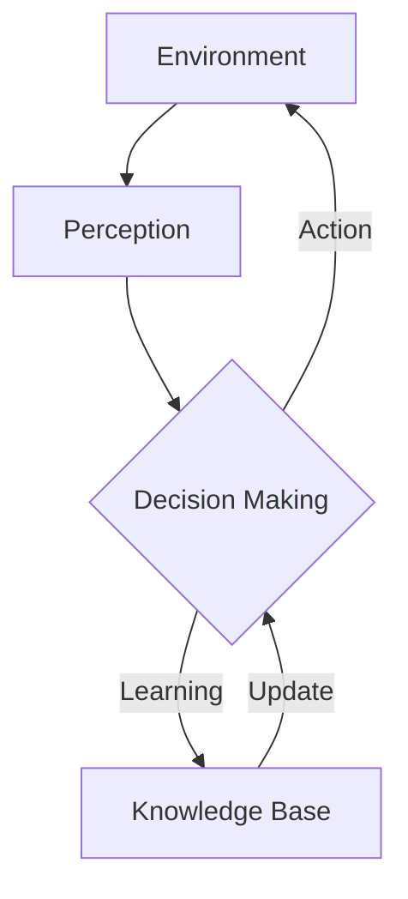

# AI人工智能 Agent：基础理论解析

## 1. 背景介绍
### 1.1 人工智能的发展历程
#### 1.1.1 早期人工智能的探索
#### 1.1.2 专家系统的兴起
#### 1.1.3 机器学习的崛起
### 1.2 智能Agent的概念提出
#### 1.2.1 Agent的定义
#### 1.2.2 智能Agent的特点
#### 1.2.3 智能Agent的研究意义
### 1.3 智能Agent在人工智能领域的地位
#### 1.3.1 智能Agent与传统人工智能的区别
#### 1.3.2 智能Agent在人工智能领域的应用前景
#### 1.3.3 智能Agent的研究现状与挑战

## 2. 核心概念与联系
### 2.1 Agent的定义与分类
#### 2.1.1 Agent的形式化定义
#### 2.1.2 反应型Agent与认知型Agent
#### 2.1.3 单Agent系统与多Agent系统
### 2.2 智能Agent的关键特征
#### 2.2.1 自主性
#### 2.2.2 社会能力
#### 2.2.3 反应能力
#### 2.2.4 主动性
### 2.3 智能Agent的架构
#### 2.3.1 感知-决策-执行循环
#### 2.3.2 BDI架构
#### 2.3.3 层次化架构
### 2.4 智能Agent之间的交互与协作
#### 2.4.1 Agent通信语言
#### 2.4.2 协作机制
#### 2.4.3 协商与博弈



## 3. 核心算法原理具体操作步骤
### 3.1 搜索算法
#### 3.1.1 无信息搜索
#### 3.1.2 启发式搜索
#### 3.1.3 局部搜索
### 3.2 规划算法
#### 3.2.1 经典规划
#### 3.2.2 概率规划
#### 3.2.3 层次化规划
### 3.3 学习算法
#### 3.3.1 监督学习
#### 3.3.2 无监督学习  
#### 3.3.3 强化学习
### 3.4 推理算法
#### 3.4.1 演绎推理
#### 3.4.2 归纳推理
#### 3.4.3 模糊推理

## 4. 数学模型和公式详细讲解举例说明
### 4.1 马尔可夫决策过程(MDP)
#### 4.1.1 MDP的定义
MDP是一个五元组$(S,A,P,R,\gamma)$，其中：
- $S$是状态集合
- $A$是动作集合 
- $P$是状态转移概率矩阵，$P(s'|s,a)$表示在状态$s$下执行动作$a$后转移到状态$s'$的概率
- $R$是奖励函数，$R(s,a)$表示在状态$s$下执行动作$a$获得的即时奖励
- $\gamma \in [0,1]$是折扣因子，表示未来奖励的重要程度

#### 4.1.2 最优价值函数与最优策略
- 状态价值函数：
$$V^{\pi}(s)=\mathbb{E}[\sum_{t=0}^{\infty}\gamma^t R(s_t,\pi(s_t))|s_0=s]$$
- 动作价值函数：  
$$Q^{\pi}(s,a)=\mathbb{E}[\sum_{t=0}^{\infty}\gamma^t R(s_t,a_t)|s_0=s,a_0=a]$$
- 最优价值函数：
$$V^*(s)=\max_{\pi}V^{\pi}(s), \forall s\in S$$
$$Q^*(s,a)=\max_{\pi}Q^{\pi}(s,a), \forall s\in S, a\in A$$
- 最优策略：
$$\pi^*(s)=\arg\max_{a\in A}Q^*(s,a), \forall s\in S$$

#### 4.1.3 值迭代与策略迭代算法
- 值迭代：
$$V_{k+1}(s)=\max_{a\in A}[R(s,a)+\gamma \sum_{s'\in S}P(s'|s,a)V_k(s')]$$
- 策略迭代：
    - 策略评估：给定策略$\pi$，计算$V^{\pi}$
    - 策略改进：$\pi'(s)=\arg\max_{a\in A}[R(s,a)+\gamma \sum_{s'\in S}P(s'|s,a)V^{\pi}(s')]$

### 4.2 部分可观测马尔可夫决策过程(POMDP) 
#### 4.2.1 POMDP的定义
POMDP是一个六元组$(S,A,P,R,\Omega,O)$，其中：
- $S,A,P,R$与MDP中的定义相同
- $\Omega$是观测集合
- $O$是观测概率矩阵，$O(o|s',a)$表示在状态$s'$下执行动作$a$后得到观测$o$的概率

#### 4.2.2 信念状态与最优策略
- 信念状态：$b(s)=P(s_t=s|o_1,a_1,...,o_{t-1},a_{t-1},o_t)$
- 最优价值函数：
$$V^*(b)=\max_{a\in A}[R(b,a)+\gamma \sum_{o\in \Omega}P(o|b,a)V^*(b')]$$
其中，$b'(s')=\frac{O(o|s',a)\sum_{s\in S}P(s'|s,a)b(s)}{P(o|b,a)}$
- 最优策略：$\pi^*(b)=\arg\max_{a\in A}[R(b,a)+\gamma \sum_{o\in \Omega}P(o|b,a)V^*(b')]$

#### 4.2.3 POMDP求解算法
- 精确算法：价值迭代、策略迭代等
- 近似算法：点基价值迭代(PBVI)、Perseus等

## 5. 项目实践：代码实例和详细解释说明
### 5.1 基于Python的简单反应型Agent实现
```python
class SimpleReflexAgent:
    def __init__(self, rules):
        self.rules = rules
        
    def act(self, perception):
        for rule in self.rules:
            if rule.matches(perception):
                return rule.action
        return None

class Rule:
    def __init__(self, condition, action):
        self.condition = condition
        self.action = action
        
    def matches(self, perception):
        return self.condition(perception)

def main():
    rules = [
        Rule(lambda p: 'dirty' in p, 'clean'),
        Rule(lambda p: 'clean' in p, 'do_nothing')
    ]
    agent = SimpleReflexAgent(rules)
    
    perceptions = ['dirty', 'clean', 'dirty', 'clean']
    for p in perceptions:
        action = agent.act(p)
        print(f"Perception: {p}, Action: {action}")

if __name__ == "__main__":
    main()
```
输出结果：
```
Perception: dirty, Action: clean
Perception: clean, Action: do_nothing 
Perception: dirty, Action: clean
Perception: clean, Action: do_nothing
```
这个简单的反应型Agent根据感知到的环境状态（脏或干净），选择相应的行为（清扫或什么都不做）。Agent的决策完全基于当前的感知信息，没有任何内部状态。

### 5.2 基于Python的Q-Learning智能体实现
```python
import numpy as np

class QLearningAgent:
    def __init__(self, num_states, num_actions, alpha, gamma, epsilon):
        self.num_states = num_states
        self.num_actions = num_actions
        self.alpha = alpha
        self.gamma = gamma
        self.epsilon = epsilon
        self.Q = np.zeros((num_states, num_actions))
        
    def act(self, state):
        if np.random.rand() < self.epsilon:
            return np.random.choice(self.num_actions)
        else:
            return np.argmax(self.Q[state])
    
    def learn(self, state, action, reward, next_state):
        td_target = reward + self.gamma * np.max(self.Q[next_state])
        td_error = td_target - self.Q[state, action]
        self.Q[state, action] += self.alpha * td_error

def main():
    num_states = 6
    num_actions = 2
    alpha = 0.1
    gamma = 0.9
    epsilon = 0.1
    
    agent = QLearningAgent(num_states, num_actions, alpha, gamma, epsilon)
    
    # 训练
    for episode in range(1000):
        state = 0
        while state != num_states - 1:
            action = agent.act(state)
            next_state = state + action
            reward = 1 if next_state == num_states - 1 else 0
            agent.learn(state, action, reward, next_state)
            state = next_state
            
    # 测试
    state = 0
    while state != num_states - 1:
        action = agent.act(state)
        next_state = state + action
        print(f"State: {state}, Action: {action}, Next State: {next_state}")
        state = next_state

if __name__ == "__main__":
    main()  
```
这个Q-Learning智能体在一个简单的一维环境中学习。环境有6个状态，编号从0到5。智能体可以选择两个动作：向右走一步（动作0）或向右走两步（动作1）。当智能体到达最后一个状态（状态5）时，一个回合结束，智能体获得奖励1。在训练阶段，智能体通过不断与环境交互，更新Q值，学习最优策略。在测试阶段，智能体根据学到的Q值选择动作，展示其学到的策略。

## 6. 实际应用场景
### 6.1 智能客服
智能客服是一种典型的问答型智能Agent应用。它能够理解用户的自然语言问题，通过知识库检索、语义理解等技术，给出相应的答复，为用户提供24小时不间断的客服服务。

### 6.2 自动驾驶
自动驾驶汽车可以看作一种自主型智能Agent。它通过各种传感器感知周围环境，如摄像头、雷达、激光雷达等，通过决策系统分析路况，规划行驶路径，控制车辆的速度和方向，最终安全、高效地到达目的地。

### 6.3 智能推荐
智能推荐系统是一种个性化的信息过滤Agent。它通过收集和分析用户的历史行为数据，如浏览、点击、购买等，构建用户画像，预测用户的兴趣偏好，为用户推荐他们可能感兴趣的内容，提高用户的满意度和粘性。

### 6.4 智能家居
智能家居中的各种设备，如智能音箱、智能灯具、智能家电等，都可以看作一种智能Agent。它们通过语音交互、手势识别、场景感知等方式，理解用户的指令和意图，自动控制家居设备，提供个性化的服务，让用户享受更加智能、便捷的家居生活。

## 7. 工具和资源推荐
### 7.1 开发工具
- Python: 一种广泛使用的人工智能编程语言，拥有丰富的机器学习和自然语言处理库，如TensorFlow, PyTorch, scikit-learn, NLTK等。
- MATLAB: 一种科学计算编程语言，在工程和学术领域广泛使用，拥有强大的数值计算和可视化功能，以及丰富的工具箱。
- ROS（机器人操作系统）: 一种开源的机器人软件开发平台，提供了一系列用于机器人开发的工具和库，广泛应用于机器人研究和工业领域。

### 7.2 学习资源
- 《人工智能：一种现代的方法》：一本全面系统地介绍人工智能的经典教材，涵盖了人工智能的各个分支领域。
- 《强化学习》：由强化学习领域的先驱Richard Sutton和Andrew Barto所著，系统深入地讲解了强化学习的理论基础和算法。
- CS188 UC Berkeley的人工智能课程：由加州大学伯克利分校开设的一门优质的人工智能公开课，涵盖了搜索、博弈、机器学习、强化学习等多个人工智能领域。
- 吴恩达的机器学习课程：由斯坦福大学Andrew Ng教授主讲的一门广受欢迎的机器学习在线课程，通过案例和编程作业，系统讲解了机器学习的基本概念和算法。

### 7.3 开放数据集
- ImageNet: 一个大型的图像识别数据集，包含了1400多万张图片，涵盖了2万多个类别，广泛用于计算机视觉研究。
- Penn Treebank: 一个广泛使用的自然语言处理数据集，包含了大量的英文文本数据，带有词性标