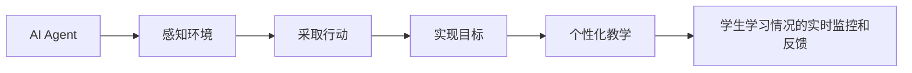

## 1.背景介绍

在过去的几十年中，人工智能(AI)在我们的生活中的影响越来越大，从自动驾驶汽车到自动化的家庭管理系统，甚至到现在的教育系统。AI Agent，作为AI的一种实现方式，正在对教育产生深远的影响。今天，我们将探讨AI Agent在教育领域的应用以及其对教育的影响。

## 2.核心概念与联系

AI Agent是一种可以感知环境并采取行动以实现某种目标的实体。在教育领域，AI Agent可以被用来进行个性化教学，通过对学生的学习情况进行实时监控和反馈，帮助学生更有效地学习。



## 3.核心算法原理具体操作步骤

AI Agent在教育中的应用主要依赖于机器学习算法。以下是具体的操作步骤：

1. 数据收集：收集学生的学习数据，包括成绩、学习时间、学习内容等。
2. 数据处理：对收集的数据进行处理，包括数据清洗、特征提取等。
3. 模型训练：使用机器学习算法对处理后的数据进行训练，生成模型。
4. 模型应用：将训练好的模型应用到实际的教学中，进行个性化教学。

## 4.数学模型和公式详细讲解举例说明

假设我们有一个学生的学习数据集，其中每个数据点包括学生的学习时间$x$和学生的成绩$y$。我们可以使用线性回归模型来预测学生的成绩。线性回归模型的公式为：

$$ y = ax + b $$

其中，$a$和$b$是模型的参数，需要通过训练数据来学习。

## 5.项目实践：代码实例和详细解释说明

以下是一个使用Python的sklearn库进行线性回归模型训练的例子：

```python
from sklearn.linear_model import LinearRegression

# 创建线性回归模型
model = LinearRegression()

# 训练模型
model.fit(X_train, y_train)

# 使用模型进行预测
y_pred = model.predict(X_test)
```

## 6.实际应用场景

AI Agent在教育领域的应用广泛，例如：

1. 个性化教学：AI Agent可以根据每个学生的学习情况提供个性化的教学内容和方式。
2. 自动化评分：AI Agent可以自动评估学生的作业和考试，节省教师的时间。

## 7.工具和资源推荐

以下是一些在教育领域使用AI Agent的工具和资源：

1. Google Classroom：这是一个在线教育平台，可以用来分配作业、评分和与学生沟通。
2. IBM Watson：这是一个AI平台，可以用来构建和训练AI模型。

## 8.总结：未来发展趋势与挑战

随着AI技术的发展，AI Agent在教育领域的应用将越来越广泛。然而，也面临着一些挑战，例如数据隐私、算法公平性等。

## 9.附录：常见问题与解答

1. 问题：AI Agent可以完全替代教师吗？
答：虽然AI Agent在教育中的应用越来越广泛，但它不能完全替代教师。教师不仅仅是传授知识，更重要的是激发学生的学习兴趣，培养学生的思考能力，这是AI Agent无法做到的。

作者：禅与计算机程序设计艺术 / Zen and the Art of Computer Programming