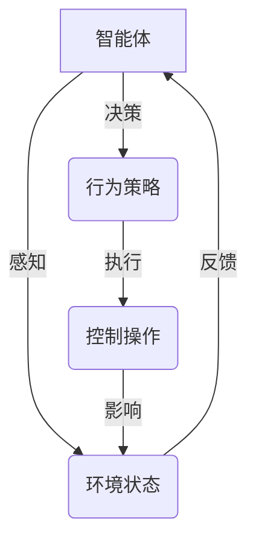
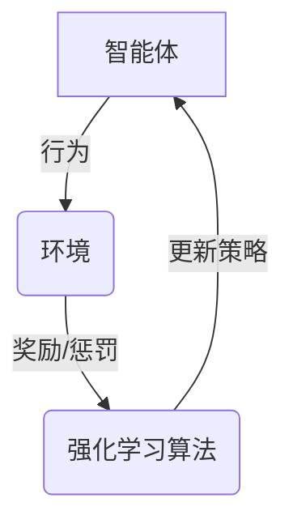
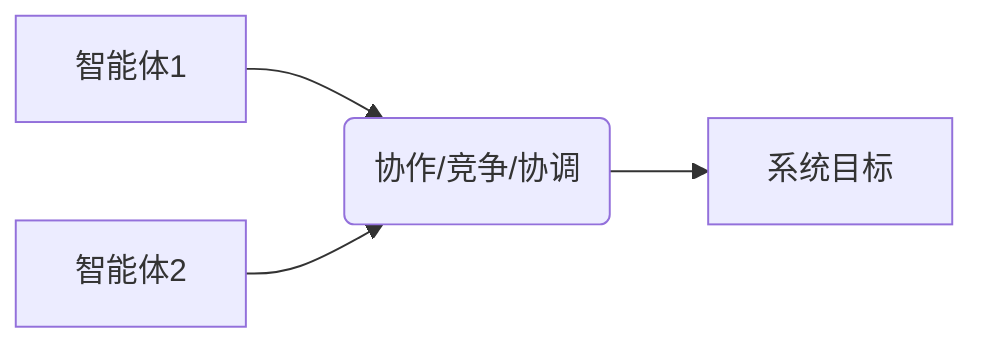
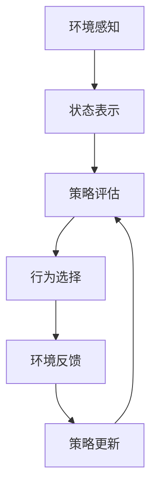

# AI人工智能 Agent：电力系统中智能体的应用

## 1. 背景介绍

### 1.1 电力系统的复杂性和挑战

电力系统是一个庞大而复杂的基础设施,负责为整个社会提供可靠、高效和经济的电力供应。它由发电厂、输电线路、变电站、配电网络和最终用户等多个组成部分组成,涉及广泛的地理区域。

电力系统面临着诸多挑战,例如:

- **供需平衡**:实时平衡电力供给和需求,确保系统的稳定运行。
- **可再生能源整合**:有效整合间歇性的可再生能源,如风能和太阳能。
- **负荷预测**:准确预测未来的电力需求,以优化资源调度。
- **故障检测和自愈**:快速检测并恢复系统故障,减少停电时间。
- **能源效率优化**:提高能源利用效率,降低运营成本和环境影响。

### 1.2 人工智能在电力系统中的作用

传统的电力系统控制和优化方法通常基于数学建模和规则,但由于系统的高度复杂性和动态性,这些方法往往存在局限性。人工智能(AI)技术为解决上述挑战提供了新的途径。

AI技术,特别是智能体(Agent)技术,具有自主学习、决策和行动的能力,可以有效地处理复杂的环境并作出优化决策。在电力系统中,智能体可以充当虚拟的控制器或决策者,通过感知系统状态、学习历史数据、预测未来趋势,并基于学习到的策略作出相应的控制和优化决策。

## 2. 核心概念与联系

### 2.1 智能体(Agent)

智能体是人工智能领域的一个核心概念,指的是一个感知环境、作出决策并采取行动的自主实体。智能体通过与环境的交互来学习和优化其行为策略,最终实现特定的目标。

在电力系统中,智能体可以被视为一个虚拟的控制器或决策者,负责监控系统状态、分析数据、制定策略并执行相应的控制操作。



### 2.2 强化学习(Reinforcement Learning)

强化学习是机器学习的一个重要分支,它关注于如何让智能体通过与环境的交互来学习采取最优策略,从而最大化长期累积奖励。

在电力系统中,强化学习可以用于训练智能体Agent,使其学习到最优的控制策略。智能体通过不断尝试不同的行为,观察环境的反馈(奖励或惩罚),并根据这些反馈调整其策略,最终达到优化目标(如降低成本、提高效率等)。



### 2.3 多智能体系统(Multi-Agent System)

电力系统是一个大规模的分布式系统,需要多个智能体协同工作以实现整体优化。多智能体系统(MAS)是一种由多个智能体组成的分布式人工智能系统,智能体之间可以通过协作、竞争或协调来完成复杂任务。

在电力系统中,不同的智能体可以负责不同的子系统或功能,如发电调度、输电优化、配电管理等。这些智能体需要相互协调,共享信息和资源,以实现整个系统的高效运行。



## 3. 核心算法原理具体操作步骤

### 3.1 智能体决策过程

智能体在电力系统中的决策过程通常包括以下步骤:

1. **环境感知**: 智能体从环境中获取相关信息,如电力负荷、发电量、线路状态等。
2. **状态表示**: 将获取的信息转换为内部状态表示,作为决策的输入。
3. **策略评估**: 根据当前状态和已学习的策略,评估可能的行为及其潜在回报。
4. **行为选择**: 根据评估结果,选择一个行为执行。
5. **环境反馈**: 观察执行行为后环境的变化,获得奖励或惩罚信号。
6. **策略更新**: 根据反馈信号,使用强化学习算法更新策略。
7. **重复迭代**: 重复上述过程,不断优化策略。



### 3.2 强化学习算法

强化学习算法是训练智能体策略的核心。常用的算法包括:

1. **Q-Learning**: 一种基于价值函数的算法,通过估计每个状态-行为对的长期回报(Q值)来学习最优策略。
2. **策略梯度算法(Policy Gradient)**: 直接优化策略参数,使得在给定环境下获得的期望回报最大化。
3. **Actor-Critic算法**: 结合了价值函数估计(Critic)和策略优化(Actor)的优点,常用于连续控制问题。
4. **深度强化学习(Deep Reinforcement Learning)**: 将深度神经网络应用于强化学习,可以处理高维状态和行为空间。

这些算法的具体实现细节较为复杂,需要根据具体问题和环境进行调整和优化。

### 3.3 多智能体协调算法

在多智能体系统中,需要设计协调机制来实现智能体之间的协作。常用的协调算法包括:

1. **契约网算法(Contract Net Protocol)**: 基于市场机制,智能体通过竞标任务实现分工协作。
2. **蚁群优化算法(Ant Colony Optimization)**: 模拟蚂蚁觅食行为,智能体通过释放和感知信息素实现协作。
3. **博弈论算法(Game Theory)**: 将智能体之间的互动建模为博弈,寻找纳什均衡解作为协调策略。
4. **多智能体强化学习(Multi-Agent Reinforcement Learning)**: 将强化学习扩展到多智能体场景,共同学习最优策略。

这些算法需要根据具体场景和目标进行选择和调整,以实现高效的多智能体协调。

## 4. 数学模型和公式详细讲解举例说明

在电力系统中应用智能体技术通常需要建立数学模型,用于描述系统状态、目标函数和约束条件。以下是一些常见的数学模型和公式:

### 4.1 电力系统优化目标

电力系统优化的目标通常是最小化运营成本或最大化效益,可以用如下目标函数表示:

$$J = \min\limits_u \sum\limits_{t=1}^T C_t(u_t, x_t)$$

其中:
- $J$是要最小化的总成本
- $T$是优化时间范围
- $C_t(u_t, x_t)$是在时间$t$下,给定控制输入$u_t$和系统状态$x_t$的运营成本
- $u_t$是在时间$t$下的控制变量,如发电机出力
- $x_t$是在时间$t$下的系统状态变量,如电力负荷

### 4.2 电力平衡约束

为了确保系统的稳定运行,必须满足电力供需平衡约束:

$$\sum\limits_{i=1}^N P_{G,i} = P_D + P_L$$

其中:
- $N$是发电机的数量
- $P_{G,i}$是第$i$台发电机的出力
- $P_D$是系统的总负荷需求
- $P_L$是输电线路的损耗

### 4.3 发电机出力约束

每台发电机的出力必须在其技术限制范围内:

$$P_{G,i}^{\min} \leq P_{G,i} \leq P_{G,i}^{\max}$$

其中$P_{G,i}^{\min}$和$P_{G,i}^{\max}$分别是第$i$台发电机的最小和最大出力限制。

### 4.4 线路传输约束

输电线路的传输功率不能超过其热稳定极限:

$$|P_{ij}| \leq P_{ij}^{\max}$$

其中$P_{ij}$是从节点$i$到节点$j$的线路功率传输,而$P_{ij}^{\max}$是该线路的热稳定极限。

### 4.5 强化学习中的奖励函数

在强化学习中,智能体的目标是最大化其获得的长期累积奖励。奖励函数$R(s, a)$定义了在状态$s$下执行行为$a$所获得的即时奖励。

对于电力系统优化问题,奖励函数可以设计为与运营成本或效益相关,例如:

$$R(s, a) = -C(u, x)$$

其中$C(u, x)$是给定控制输入$u$和系统状态$x$下的运营成本。通过最大化长期累积奖励,智能体可以学习到最小化运营成本的最优策略。

以上数学模型和公式为电力系统智能体应用奠定了理论基础,在实际应用中还需要根据具体场景进行调整和扩展。

## 5. 项目实践:代码实例和详细解释说明

为了更好地理解智能体在电力系统中的应用,我们将通过一个简化的发电调度示例来演示相关代码和实现细节。

### 5.1 问题描述

假设我们有一个包含多台发电机的电力系统,目标是通过控制每台发电机的出力来满足系统的总负荷需求,同时最小化总运营成本。我们将使用Q-Learning算法训练一个智能体Agent来学习最优的发电调度策略。

### 5.2 环境构建

首先,我们定义电力系统环境,包括发电机数量、发电机出力限制、负荷需求等参数:

```python
import numpy as np

class PowerSystemEnv:
    def __init__(self, num_generators, load_demand, generator_limits):
        self.num_generators = num_generators
        self.load_demand = load_demand
        self.generator_limits = generator_limits
        self.state = None
        self.reset()

    def reset(self):
        self.state = np.random.uniform(low=self.generator_limits[:, 0],
                                       high=self.generator_limits[:, 1],
                                       size=self.num_generators)
        return self.state

    def step(self, action):
        # 更新发电机出力
        self.state = action
        
        # 计算总发电量和运营成本
        total_generation = np.sum(self.state)
        operating_cost = np.sum(self.state ** 2)
        
        # 计算奖励
        demand_diff = self.load_demand - total_generation
        reward = -operating_cost - abs(demand_diff)
        
        # 检查是否满足约束条件
        done = bool(abs(demand_diff) < 1e-3)
        
        return self.state, reward, done
```

在这个示例中,我们假设发电机的运营成本与出力的平方成正比,奖励函数包括运营成本和满足负荷需求的惩罚项。

### 5.3 Q-Learning算法实现

接下来,我们实现Q-Learning算法来训练智能体Agent:

```python
import random
from collections import deque

class QLearningAgent:
    def __init__(self, env, learning_rate, discount_factor, epsilon, epsilon_decay):
        self.env = env
        self.learning_rate = learning_rate
        self.discount_factor = discount_factor
        self.epsilon = epsilon
        self.epsilon_decay = epsilon_decay
        self.q_table = {}
        self.replay_buffer = deque(maxlen=10000)

    def get_q_value(self, state, action):
        state_key = tuple(state)
        action_key = tuple(action)
        if (state_key, action_key) in self.q_table:
            return self.q_table[(state_key, action_key)]
        else:
            return 0

    def update_q_value(self, state, action, reward, next_state, done):
        state_key = tuple(state)
        action_key = tuple(action)
        next_state_key = tuple(next_state)

        q_value = self.get_q_value(state, action)
        next_q_value = max([self.get_q_value(next_state_key, a) for a in self.get_valid_actions(next_state)])

        if done