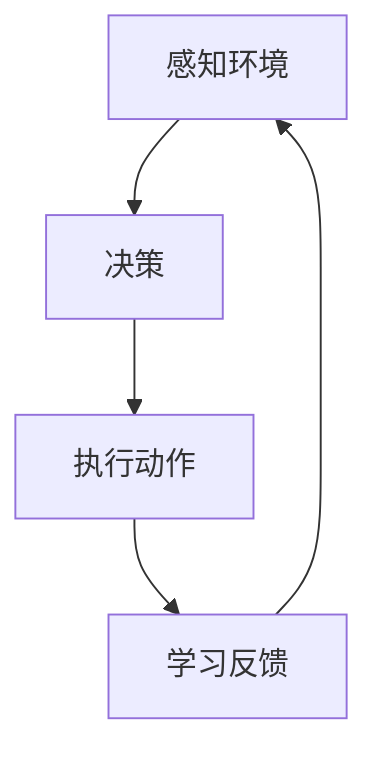

# AI人工智能代理工作流AI Agent WorkFlow：在电子商务中应用AI代理的策略

## 1.背景介绍

### 1.1 电子商务的发展与挑战

随着互联网技术的不断发展,电子商务已经成为了一种全新的商业模式,对传统商业带来了巨大的冲击。电子商务打破了时间和空间的限制,使得买家和卖家可以随时随地进行交易,极大地提高了交易效率。然而,电子商务也面临着诸多挑战,例如信息过载、个性化推荐、智能客服等问题。

### 1.2 人工智能在电子商务中的应用

人工智能技术为解决电子商务中的这些挑战提供了新的思路和方法。利用机器学习、自然语言处理、计算机视觉等技术,可以实现智能搜索、个性化推荐、智能客服等功能,提升用户体验,优化商业决策。

### 1.3 AI代理的概念

AI代理(AI Agent)是一种基于人工智能技术的软件系统,能够感知环境、做出决策并执行相应的动作。AI代理可以被视为一种虚拟助手,代表用户完成各种任务。在电子商务领域,AI代理可以协助用户进行购物决策、管理订单、处理客户服务等工作。

## 2.核心概念与联系

### 2.1 AI代理的工作流程

AI代理在电子商务中的工作流程可以概括为以下几个步骤:

1. **感知环境**:AI代理需要收集用户的偏好、购物历史、浏览记录等数据,以及电子商务平台上的商品信息、价格等数据,形成对当前环境的感知。

2. **决策**:基于感知到的环境信息,AI代理需要运行各种算法模型,做出相应的决策,例如推荐合适的商品、提供购物建议等。

3. **执行动作**:AI代理根据决策结果执行相应的动作,例如向用户展示推荐结果、自动下单、处理客户查询等。

4. **学习反馈**:AI代理需要根据用户的反馈(如购买行为、评价等)不断优化自身的决策模型,提高决策的准确性。

### 2.2 AI代理的核心技术

AI代理在电子商务中的应用涉及多种人工智能技术,包括但不限于:

- **机器学习**:用于构建商品推荐、用户画像、异常检测等模型。
- **自然语言处理**:用于智能问答、情感分析、文本挖掘等任务。
- **计算机视觉**:用于图像识别、视觉搜索、虚拟试衣间等应用。
- **规划与决策**:用于制定优化策略、资源调度、定价决策等。
- **多智能体系统**:用于模拟多个AI代理之间的交互与协作。

## 3.核心算法原理具体操作步骤

### 3.1 推荐系统算法

推荐系统是AI代理在电子商务中的一个核心应用,其目的是为用户推荐感兴趣的商品。常见的推荐算法包括:

#### 3.1.1 协同过滤算法

协同过滤算法是基于用户之间的相似性进行推荐的。具体步骤如下:

1. 计算用户之间的相似度,常用的方法有基于用户评分的余弦相似度、基于用户购买记录的Jaccard相似度等。

2. 对于目标用户,找到与其最相似的K个邻居用户。

3. 基于这K个邻居用户的历史行为,为目标用户生成推荐列表。

$$
\operatorname{sim}(u, v)=\frac{\sum_{i \in I_{u v}}\left(r_{u i}-\overline{r}_{u}\right)\left(r_{v i}-\overline{r}_{v}\right)}{\sqrt{\sum_{i \in I_{u}}\left(r_{u i}-\overline{r}_{u}\right)^{2}} \sqrt{\sum_{i \in I_{v}}\left(r_{v i}-\overline{r}_{v}\right)^{2}}}
$$

其中,$\operatorname{sim}(u, v)$表示用户u和用户v的相似度,$r_{ui}$表示用户u对商品i的评分,$\overline{r}_{u}$表示用户u的平均评分。

#### 3.1.2 基于内容的推荐算法

基于内容的推荐算法是根据商品的内容特征(如文本描述、图像等)为用户推荐与其历史偏好相似的商品。具体步骤如下:

1. 提取商品的内容特征,常用的方法有TF-IDF、Word2Vec、CNN等。

2. 计算用户的兴趣profile,即用户感兴趣的内容特征的集合。

3. 根据商品特征与用户兴趣profile的相似度为用户生成推荐列表。

$$
\operatorname{score}(u, i)=\overrightarrow{p_{u}} \cdot \overrightarrow{q_{i}}
$$

其中,$\operatorname{score}(u, i)$表示用户u对商品i的兴趣程度分数,$\overrightarrow{p_{u}}$表示用户u的兴趣profile向量,$\overrightarrow{q_{i}}$表示商品i的内容特征向量。

### 3.2 对话系统算法

对话系统是AI代理用于与用户进行自然语言交互的一种重要模块。常见的对话系统算法包括:

#### 3.2.1 检索式对话系统

检索式对话系统是基于预先构建的问答对知识库,根据用户的输入查找最匹配的回复。具体步骤如下:

1. 构建问答对知识库,可以通过人工编写或自动挖掘获得。

2. 对用户的输入进行预处理,如分词、去停用词等。

3. 计算用户输入与知识库中问题的相似度,常用的方法有BM25、EditDistance等。

4. 返回与用户输入最相似的问题对应的回复作为系统的输出。

#### 3.2.2 生成式对话系统

生成式对话系统是基于序列到序列(Seq2Seq)模型,根据上下文生成新的回复。具体步骤如下:

1. 构建对话语料库,包括上下文和回复两部分。

2. 使用Seq2Seq模型(如LSTM、Transformer等)在语料库上进行训练。

3. 在回复时,将用户的输入作为上下文输入模型,模型生成回复序列。

4. 对生成的回复进行后处理(如去重、过滤等),输出最终结果。

$$
P(Y | X)=\prod_{t=1}^{T} P\left(y_{t} | y_{<t}, X\right)
$$

其中,$X$表示输入序列,$Y$表示输出序列,$P(Y|X)$表示给定$X$时,$Y$的条件概率。

### 3.3 计算机视觉算法

计算机视觉技术在电子商务中有许多应用,如图像识别、视觉搜索、虚拟试衣间等。常见的计算机视觉算法包括:

#### 3.3.1 目标检测算法

目标检测算法用于在图像中定位并识别出感兴趣的目标物体。具体步骤如下:

1. 对输入图像进行预处理,如归一化、数据增强等。

2. 使用卷积神经网络(CNN)提取图像的特征。

3. 在特征图上应用先验框(Anchor Box)并生成候选框。

4. 对候选框进行分类(是否为目标物体)和回归(调整框的位置)。

5. 使用非极大值抑制(NMS)去除重叠的冗余框,输出最终检测结果。

$$
L\left(p_{i}, t_{i}\right)=\frac{1}{N}\left(\sum_{i} L_{c l s}\left(p_{i}, p_{i}^{*}\right)+\lambda \sum_{i} p_{i}^{*} L_{r e g}\left(t_{i}, t_{i}^{*}\right)\right)
$$

其中,$L_{cls}$表示分类损失,$L_{reg}$表示回归损失,$p_i$表示第i个锚框预测为目标的概率,$t_i$表示第i个锚框的坐标,$\lambda$是平衡两个损失的权重系数。

#### 3.3.2 图像分割算法

图像分割算法用于将图像分割成不同的语义区域,常用于虚拟试衣间等应用。具体步骤如下:

1. 对输入图像进行预处理,如归一化、数据增强等。

2. 使用编码器-解码器网络(如U-Net、Mask R-CNN等)提取图像特征并生成分割掩码。

3. 对分割掩码进行后处理,如去噪、修复等。

4. 输出最终的分割结果。

$$
L=\frac{1}{N} \sum_{i=1}^{N} L_{i}=-\frac{1}{N} \sum_{i=1}^{N}\left(\sum_{c=1}^{C} y_{i c} \log \left(p_{i c}\right)\right)
$$

其中,$L_i$表示第i个像素的交叉熵损失,$y_{ic}$表示第i个像素属于类别c的真实标签,$p_{ic}$表示第i个像素属于类别c的预测概率。

## 4.数学模型和公式详细讲解举例说明

### 4.1 推荐系统中的矩阵分解

推荐系统中常用的一种技术是矩阵分解,它将用户-商品的评分矩阵分解为用户特征矩阵和商品特征矩阵的乘积,从而学习出用户和商品的低维隐语义表示。具体做法如下:

假设有$M$个用户,$N$个商品,用$R_{M\times N}$表示用户-商品的评分矩阵,其中$R_{ij}$表示用户$i$对商品$j$的评分。我们的目标是找到$U_{M\times K}$和$V_{N\times K}$,使得:

$$
R \approx U^{T} V
$$

其中,$U$是用户特征矩阵,$V$是商品特征矩阵,$K$是隐语义的维度。

我们可以通过最小化如下目标函数来学习$U$和$V$:

$$
\min _{U, V} \sum_{(i, j) \in \mathcal{K}}\left(R_{i j}-U_{i}^{T} V_{j}\right)^{2}+\lambda\left(\|U\|_{F}^{2}+\|V\|_{F}^{2}\right)
$$

其中,$\mathcal{K}$是已知评分的集合,$\lambda$是正则化系数,用于防止过拟合。

学习完$U$和$V$之后,我们可以通过计算$U_i^TV_j$来预测用户$i$对商品$j$的评分,并基于此生成个性化推荐列表。

例如,假设有3个用户和4个商品,评分矩阵$R$如下:

$$
R=\begin{bmatrix}
5 & ? & ? & 1\\
? & 2 & 4 & ?\\
3 & ? & ? & 5
\end{bmatrix}
$$

我们可以将$R$分解为$U$和$V$的乘积:

$$
U=\begin{bmatrix}
0.8 & 0.1\\
0.2 & 0.7\\
0.6 & 0.3
\end{bmatrix},\quad V=\begin{bmatrix}
0.6 & 0.8\\
0.2 & 0.4\\
0.7 & 0.1\\
0.5 & 0.3
\end{bmatrix}
$$

则可以预测用户1对商品2和商品3的评分分别为:$0.8\times 0.2+0.1\times 0.4=0.26$和$0.8\times 0.7+0.1\times 0.1=0.59$。

### 4.2 对话系统中的注意力机制

在生成式对话系统中,注意力机制(Attention Mechanism)是一种重要的技术,它允许模型在生成回复时,动态地关注输入序列中的不同部分,从而捕获长期依赖关系。

具体来说,对于输入序列$X=(x_1,x_2,\dots,x_n)$和当前解码时刻$t$,注意力机制首先计算注意力权重$\alpha_t$:

$$
\alpha_{t}=\operatorname{softmax}\left(e_{t}\right), \quad e_{t i}=f\left(s_{t-1}, h_{i}\right)
$$

其中,$s_{t-1}$是解码器在时刻$t-1$的隐状态,$h_i$是编码器在位置$i$的隐状态,$f$是