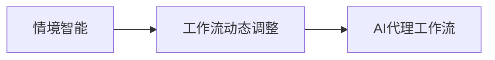

## 1.背景介绍

在过去的几年里，人工智能(AI)已经从科幻小说的概念转变为日常生活的一部分。我们每天都在与AI交互，无论是通过智能手机，还是通过智能家居设备。然而，AI的潜力远未被充分利用。在这篇文章中，我们将深入探讨AI代理工作流，特别是情境智能与工作流动态调整的概念。

## 2.核心概念与联系

AI代理工作流是AI系统的一个重要组成部分，它决定了AI如何执行任务。情境智能是指AI系统能够理解并适应其环境，而工作流动态调整则是指AI系统能够根据情境智能的输出动态调整其工作流。



## 3.核心算法原理具体操作步骤

AI代理工作流的核心算法可以分为三个步骤：

1. **情境感知**：AI系统通过传感器收集环境数据，然后使用机器学习算法理解这些数据。

2. **工作流动态调整**：根据情境感知的结果，AI系统动态调整其工作流。

3. **任务执行**：AI系统按照调整后的工作流执行任务。

## 4.数学模型和公式详细讲解举例说明

情境智能的一个关键组成部分是机器学习算法。例如，我们可以使用监督学习算法来训练AI系统识别特定的环境模式。假设我们有一个训练数据集$D = \{(x_i, y_i)\}_{i=1}^{n}$，其中$x_i$是环境数据，$y_i$是对应的环境标签。我们的目标是找到一个函数$f$，使得预测标签$f(x_i)$尽可能接近真实标签$y_i$。这可以通过最小化以下损失函数来实现：

$$
L(f) = \frac{1}{n} \sum_{i=1}^{n} (f(x_i) - y_i)^2
$$

## 5.项目实践：代码实例和详细解释说明

接下来，我们将使用Python的scikit-learn库来实现一个简单的情境智能系统。首先，我们需要导入必要的库：

```python
import numpy as np
from sklearn.model_selection import train_test_split
from sklearn.ensemble import RandomForestClassifier
```

接着，我们可以加载数据，划分训练集和测试集：

```python
X = np.load('data.npy')
y = np.load('labels.npy')
X_train, X_test, y_train, y_test = train_test_split(X, y, test_size=0.2, random_state=42)
```

然后，我们可以训练一个随机森林分类器：

```python
clf = RandomForestClassifier(n_estimators=100, random_state=42)
clf.fit(X_train, y_train)
```

最后，我们可以使用训练好的分类器来预测新的环境数据：

```python
y_pred = clf.predict(X_test)
```

## 6.实际应用场景

AI代理工作流可以应用于许多领域，包括但不限于自动驾驶、智能家居、健康监测等。例如，在自动驾驶中，AI系统需要根据环境数据（如交通状况、天气状况等）动态调整其驾驶策略。

## 7.工具和资源推荐

如果你对AI代理工作流感兴趣，以下是一些有用的工具和资源：

- **Python**：Python是一种广泛用于AI和机器学习的编程语言。

- **scikit-learn**：scikit-learn是一个开源的Python机器学习库，提供了大量的监督学习和无监督学习算法。

- **TensorFlow**：TensorFlow是一个开源的机器学习框架，由Google开发。

## 8.总结：未来发展趋势与挑战

随着技术的发展，AI代理工作流的应用将更加广泛。然而，也存在一些挑战，如如何提高AI系统的情境感知能力、如何设计更有效的工作流动态调整策略等。

## 9.附录：常见问题与解答

**Q: AI代理工作流是什么？**

A: AI代理工作流是AI系统的一个重要组成部分，它决定了AI如何执行任务。

**Q: 什么是情境智能？**

A: 情境智能是指AI系统能够理解并适应其环境。

**Q: 什么是工作流动态调整？**

A: 工作流动态调整是指AI系统能够根据情境智能的输出动态调整其工作流。

**Q: AI代理工作流有哪些应用？**

A: AI代理工作流可以应用于许多领域，包括但不限于自动驾驶、智能家居、健康监测等。

作者：禅与计算机程序设计艺术 / Zen and the Art of Computer Programming