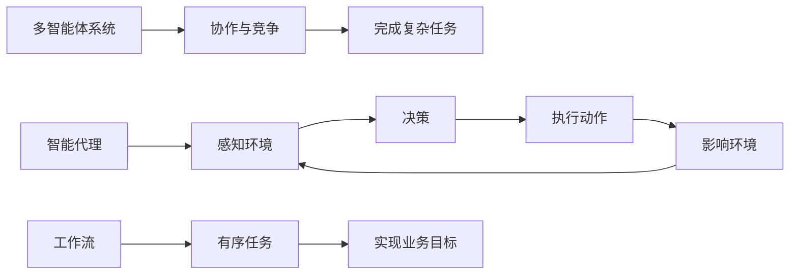

# AI人工智能代理工作流AI Agent WorkFlow：智能代理在智慧城市中的实践

## 1.背景介绍
### 1.1 智慧城市的兴起
随着科技的飞速发展,智慧城市已成为全球城市发展的重要趋势。通过利用物联网、大数据、人工智能等新兴技术,智慧城市旨在提高城市管理效率,改善居民生活质量,促进可持续发展。

### 1.2 人工智能在智慧城市中的应用
人工智能作为智慧城市建设的核心技术之一,在交通管理、公共安全、环境监测、能源优化等领域发挥着越来越重要的作用。通过部署智能代理,城市管理者可以实时监控城市运行状况,及时响应突发事件,优化资源配置,提升城市治理水平。

### 1.3 AI Agent的概念与优势
AI Agent,即人工智能代理,是一种能够自主感知环境、做出决策并执行任务的智能系统。与传统的规则驱动系统相比,AI Agent具有更强的适应性、灵活性和自主学习能力,能够在复杂多变的环境中高效完成任务。

## 2.核心概念与联系
### 2.1 智能代理(Intelligent Agent)
智能代理是一种具有自主性、社交能力、反应性和主动性的软件实体。它能够感知环境的变化,根据自身知识和目标做出决策,并通过执行动作来影响环境。

### 2.2 多智能体系统(Multi-Agent System, MAS)
多智能体系统由多个智能代理组成,通过协作与竞争来完成复杂任务。在MAS中,每个智能代理负责特定的子任务,通过相互通信和协调,共同实现系统的整体目标。

### 2.3 工作流(Workflow)
工作流是一系列有序的任务或活动,用于实现特定的业务目标。在智慧城市中,AI Agent通过执行预定义的工作流来完成各种管理和服务任务。

### 2.4 核心概念之间的联系
在智慧城市的AI Agent工作流中,多个智能代理协同工作,根据环境状态和任务需求动态调整工作流,以高效、灵活的方式完成城市管理和服务任务。



## 3.核心算法原理具体操作步骤
### 3.1 智能代理的BDI架构
BDI(Belief-Desire-Intention)是一种常用的智能代理架构,包括以下三个核心组件:
- Belief:代理对环境状态的认知和理解
- Desire:代理希望达成的目标或状态
- Intention:代理为实现目标而采取的行动计划

### 3.2 基于BDI的智能代理决策过程
1. 感知环境,更新Belief
2. 根据Belief和Desire,生成可能的行动方案
3. 从行动方案中选择最优的Intention
4. 执行Intention,更新环境状态
5. 重复步骤1-4,直到达成目标

### 3.3 多智能体协同算法
1. 任务分解:将复杂任务分解为多个子任务
2. 任务分配:根据智能代理的能力和负载,将子任务分配给合适的代理
3. 任务执行:智能代理独立完成分配的子任务
4. 结果整合:将各代理完成的子任务结果整合,得到最终结果
5. 冲突解决:当代理间出现冲突时,通过协商或仲裁机制解决

## 4.数学模型和公式详细讲解举例说明
### 4.1 马尔可夫决策过程(Markov Decision Process, MDP)
MDP是一种常用于建模智能代理决策过程的数学框架,由以下元素组成:

- 状态集合 $S$
- 动作集合 $A$
- 转移概率函数 $P(s'|s,a)$,表示在状态 $s$ 下执行动作 $a$ 后转移到状态 $s'$ 的概率
- 奖励函数 $R(s,a)$,表示在状态 $s$ 下执行动作 $a$ 获得的即时奖励

智能代理的目标是找到一个最优策略 $\pi^*$,使得在该策略下获得的期望累积奖励最大化:

$$\pi^* = \arg\max_\pi E\left[\sum_{t=0}^{\infty} \gamma^t R(s_t,a_t)\right]$$

其中, $\gamma \in [0,1]$ 是折扣因子,用于平衡即时奖励和长期奖励。

### 4.2 Q-Learning算法
Q-Learning是一种常用的强化学习算法,用于求解MDP问题。其核心思想是估计状态-动作值函数 $Q(s,a)$,表示在状态 $s$ 下执行动作 $a$ 的长期期望回报。

Q-Learning的更新公式如下:

$$Q(s,a) \leftarrow Q(s,a) + \alpha \left[R(s,a) + \gamma \max_{a'} Q(s',a') - Q(s,a)\right]$$

其中, $\alpha \in (0,1]$ 是学习率, $s'$ 是执行动作 $a$ 后转移到的新状态。

通过不断更新 $Q(s,a)$,最终可以得到最优策略:

$$\pi^*(s) = \arg\max_a Q(s,a)$$

### 4.3 举例说明
考虑一个简化的智慧交通场景,智能代理需要控制交通信号灯以最小化车辆等待时间。

- 状态 $s$:当前各车道的车辆数量
- 动作 $a$:选择下一个绿灯相位
- 转移概率 $P(s'|s,a)$:根据车流模型估计
- 奖励 $R(s,a)$:与车辆等待时间相关

智能代理通过Q-Learning算法不断试错和学习,最终得到一个最优的信号灯控制策略,以最小化整个路口的车辆等待时间。

## 5.项目实践：代码实例和详细解释说明
下面是一个使用Python实现的简单Q-Learning智能代理,用于解决上述智慧交通场景:

```python
import numpy as np

class TrafficLightAgent:
    def __init__(self, num_states, num_actions, alpha, gamma):
        self.num_states = num_states
        self.num_actions = num_actions
        self.alpha = alpha
        self.gamma = gamma
        self.Q = np.zeros((num_states, num_actions))

    def choose_action(self, state, epsilon):
        if np.random.uniform(0, 1) < epsilon:
            return np.random.randint(self.num_actions)
        else:
            return np.argmax(self.Q[state])

    def update_Q(self, state, action, reward, next_state):
        self.Q[state, action] += self.alpha * (reward + self.gamma * np.max(self.Q[next_state]) - self.Q[state, action])

# 初始化智能代理
agent = TrafficLightAgent(num_states=100, num_actions=4, alpha=0.1, gamma=0.9)

# 训练智能代理
for episode in range(1000):
    state = 0
    done = False
    while not done:
        action = agent.choose_action(state, epsilon=0.1)
        next_state, reward, done = get_next_state_and_reward(state, action)
        agent.update_Q(state, action, reward, next_state)
        state = next_state

# 应用训练好的智能代理
state = get_current_state()
action = agent.choose_action(state, epsilon=0)
set_traffic_light(action)
```

代码解释:
1. 定义了一个 `TrafficLightAgent` 类,包含Q值表 `Q` 以及选择动作和更新Q值的方法。
2. 初始化智能代理,设置状态数、动作数以及学习率和折扣因子。
3. 训练智能代理,在每个episode中:
   - 选择一个初始状态
   - 根据 $\epsilon$-greedy策略选择动作
   - 执行动作,获得下一个状态和奖励
   - 更新Q值
   - 重复上述步骤直到episode结束
4. 应用训练好的智能代理,根据当前状态选择最优动作,并设置交通信号灯。

## 6.实际应用场景
AI Agent工作流在智慧城市中有广泛的应用,例如:

### 6.1 智慧交通
- 交通信号灯控制:根据实时交通流量数据,动态调整信号灯时长,减少拥堵
- 公交车调度:根据乘客需求和道路状况,优化公交车调度,提高运营效率

### 6.2 智慧安防
- 异常行为检测:分析监控视频,实时识别可疑人员和行为,预防犯罪
- 应急响应:根据突发事件的类型和严重程度,自动调度最优救援方案

### 6.3 智慧环保
- 污染源监测:通过分布式传感器网络,实时监测空气、水质等环境指标
- 废弃物管理:优化垃圾收集和处理流程,减少环境影响

### 6.4 智慧能源
- 需求预测:根据历史数据和外部因素,预测未来能源需求,优化能源生产和分配
- 智能电网调度:实时平衡电力供需,提高电网稳定性和可靠性

## 7.工具和资源推荐
### 7.1 开发工具
- Python: 一种易学易用的高级编程语言,在AI和数据分析领域广泛使用
- TensorFlow: 由Google开发的开源机器学习框架,支持多种神经网络模型
- PyTorch: 由Facebook开发的开源机器学习库,提供动态计算图和自动微分功能

### 7.2 学习资源
- 《人工智能:一种现代的方法》:经典的AI教材,全面介绍了AI的基本概念和方法
- 《多智能体系统:原理与实践》:系统介绍了多智能体系统的理论基础和应用案例
- Coursera上的《人工智能规划》课程:由斯坦福大学开设,深入讲解了AI规划和决策的算法与实现

### 7.3 开源项目
- OpenAI Gym: 一个用于开发和比较强化学习算法的工具包,提供了多种标准化环境
- JADE: 一个用于构建多智能体系统的开源框架,支持FIPA标准和多种通信协议
- ROS: 一个用于机器人开发的开源平台,提供了大量的工具和库,方便智能代理的部署和测试

## 8.总结：未来发展趋势与挑战
### 8.1 发展趋势
- 智能代理的自主性和适应性不断提高,能够应对更加复杂多变的环境
- 多智能体系统的协同能力不断增强,能够解决更大规模的优化问题
- AI Agent工作流与其他技术(如区块链、边缘计算)深度融合,拓展应用场景

### 8.2 面临的挑战
- 智能代理的可解释性和可信赖性有待提高,需要开发更透明、更安全的算法
- 多智能体系统的通信和计算开销较大,需要探索更高效的分布式架构
- AI Agent工作流的设计和实现需要多学科知识,对从业人员的综合能力提出更高要求

### 8.3 总结
AI Agent工作流是智慧城市建设的重要利器,通过将人工智能与工作流管理相结合,可以显著提升城市管理和服务的效率与质量。未来,随着AI技术的不断进步,智能代理将在更广泛的领域发挥重要作用,为城市的可持续发展贡献力量。

## 9.附录：常见问题与解答
### 9.1 如何选择适合的智能代理架构?
根据具体应用场景和需求,选择合适的智能代理架构。对于需要快速响应的实时系统,反应式架构可能更适合;对于需要长期规划和推理的系统,BDI架构可能更合适。

### 9.2 如何处理多智能体系统中的通信瓶颈?
可以采用分布式通信架构,如发布-订阅模式,减少不必要的通信开销。同时,可以使用数据压缩、消息过滤等技术,提高通信效率。

### 9.3 如何保证智能代理的决策质量?
一方面,需要为智能代理提供高质