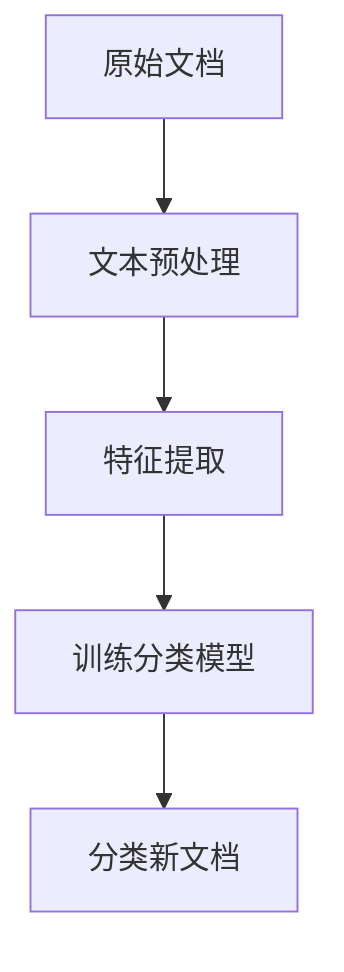
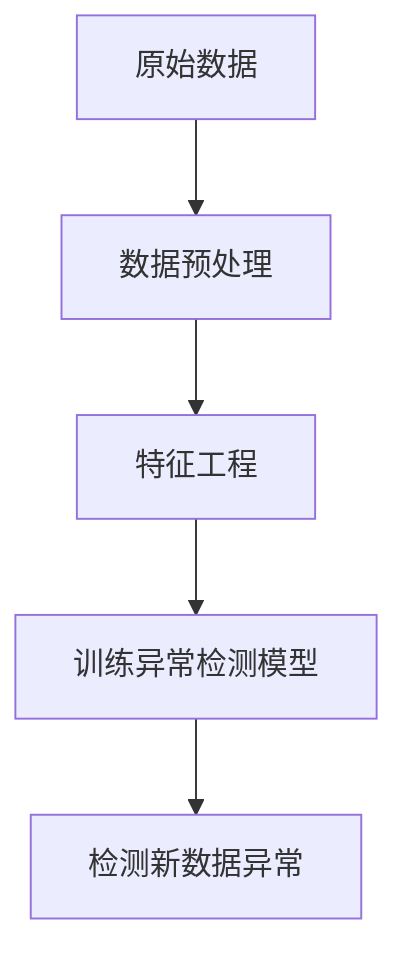
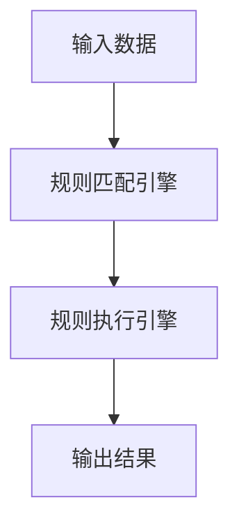

# AI人工智能代理工作流AI Agent WorkFlow：智能代理在档案管理系统中的应用

## 1.背景介绍

在当今数字化时代,信息量呈指数级增长,企业和组织面临着管理海量数据的巨大挑战。其中,档案管理系统作为组织记录和信息的核心枢纽,对于确保信息的完整性、安全性和可追溯性至关重要。然而,传统的手动档案管理方式已经无法满足现代化需求,效率低下、容易出错。因此,利用人工智能(AI)技术优化档案管理流程,提高效率和准确性迫在眉睫。

AI智能代理作为一种新兴的智能系统,通过集成自然语言处理、机器学习等技术,能够自主地执行复杂任务、做出智能决策。将AI智能代理应用于档案管理系统,可以极大地提高工作效率,减轻人工负担,同时确保数据质量和安全性。本文将探讨AI智能代理在档案管理系统中的应用,阐述其核心概念、算法原理、实现方式及未来发展趋势。

## 2.核心概念与联系

### 2.1 AI智能代理

AI智能代理是一种自主的软件实体,能够感知环境、处理信息、做出决策并执行相应操作。它具有以下几个关键特征:

1. 自主性(Autonomy):能够独立地做出决策和行为,而无需人工干预。
2. 反应性(Reactivity):能够及时感知环境变化并作出相应反应。
3. 主动性(Pro-activeness):不仅被动响应环境,还能主动地制定目标并采取行动。
4. 社会能力(Social Ability):能够与人类或其他代理进行交互和协作。

### 2.2 档案管理系统

档案管理系统是一种专门用于组织、存储和管理档案资料的信息系统。它的主要功能包括:

1. 档案收集和录入
2. 元数据管理
3. 档案存储和检索
4. 版本控制和审计跟踪
5. 安全访问控制
6. 长期保存和归档

### 2.3 AI智能代理与档案管理系统的联系

将AI智能代理引入档案管理系统,可以实现自动化的档案处理流程,提高效率和准确性。智能代理可以执行以下任务:

1. 自动化的文档分类和元数据提取
2. 智能检索和关联查询
3. 自动化的版本控制和审计跟踪
4. 基于规则的访问控制和安全审计
5. 主动发现异常情况并提醒管理员
6. 与用户进行自然语言交互

通过智能代理的介入,档案管理系统可以更高效、更智能地运作,为组织带来显著的生产力提升。

## 3.核心算法原理具体操作步骤

### 3.1 自然语言处理(NLP)

自然语言处理是AI智能代理能够理解和生成人类语言的基础。在档案管理系统中,NLP技术可以应用于以下场景:

1. **文档分类**:通过训练分类模型(如朴素贝叶斯、支持向量机等),对输入文档进行自动分类,为后续的元数据提取和存储奠定基础。
2. **命名实体识别**:利用序列标注算法(如条件随机场、BERT等),从文档中自动提取人名、地名、组织机构名等关键实体,为元数据管理提供支持。
3. **文本摘要**:使用抽取式或生成式文本摘要技术,自动生成文档的摘要内容,方便快速浏览和检索。
4. **自然语言查询**:通过语义解析和查询重写,将用户的自然语言查询转化为结构化查询语句,实现智能检索。

算法步骤(以文档分类为例):



### 3.2 机器学习与深度学习

机器学习和深度学习算法为AI智能代理提供了学习和决策的能力,在档案管理系统中可以广泛应用:

1. **异常检测**:通过训练无监督学习模型(如聚类算法、自编码器等),发现档案数据中的异常情况,如缺失值、格式错误等。
2. **版本控制**:利用序列模型(如循环神经网络)对文档版本进行差异比对,自动生成版本变更日志。
3. **访问控制**:基于用户行为和文档内容,训练分类模型实现智能访问控制策略,保护敏感信息。
4. **关联分析**:使用协同过滤或图神经网络,发现文档之间的潜在关联关系,为智能检索提供支持。

算法步骤(以异常检测为例):



### 3.3 规则引擎与知识图谱

除了基于机器学习的方法,AI智能代理还可以利用规则引擎和知识图谱等技术,实现更精确的决策和推理:

1. **规则引擎**:根据预定义的业务规则和策略,对档案数据执行复杂的检查、验证和操作,确保数据质量和合规性。
2. **知识图谱**:构建涵盖档案管理领域的本体知识库,对实体、概念及其关系进行形式化表示,支持智能查询和推理。

算法步骤(以规则引擎为例):



通过自然语言处理、机器学习、规则引擎和知识图谱等技术的有机结合,AI智能代理能够高效、智能地管理和处理档案数据,大幅提升档案管理系统的性能和可靠性。

## 4.数学模型和公式详细讲解举例说明

在AI智能代理的算法实现中,数学模型和公式扮演着重要角色。下面将详细介绍一些常用的模型和公式。

### 4.1 文本向量化

将文本数据转换为向量表示是自然语言处理任务的基础。常用的文本向量化方法包括:

1. **One-Hot编码**

对于词汇表$V$,每个单词$w$可以表示为一个|V|维的向量,向量中只有一个位置为1,其余全为0。

$$\vec{w} = (0, 0, \cdots, 1, \cdots, 0)$$

2. **TF-IDF**

考虑单词在文档中的词频(Term Frequency)和逆文档频率(Inverse Document Frequency),计算单词权重:

$$\mathrm{tfidf}(w, d) = \mathrm{tf}(w, d) \times \log\frac{N}{\mathrm{df}(w)}$$

其中,$\mathrm{tf}(w, d)$表示单词$w$在文档$d$中出现的次数,$\mathrm{df}(w)$表示单词$w$出现过的文档数量,$N$为总文档数量。

3. **Word Embedding**

通过神经网络模型(如Word2Vec、GloVe等)将单词映射到低维连续向量空间,向量值通过训练获得,能够很好地刻画词与词之间的语义关系。

### 4.2 文本分类算法

文本分类是自然语言处理的一个核心任务,常用的算法有:

1. **朴素贝叶斯分类器**

基于贝叶斯定理,计算文档$d$属于类别$c$的条件概率:

$$P(c|d) = \frac{P(d|c)P(c)}{P(d)}$$

由于计算$P(d)$较为困难,一般采用最大后验概率估计:

$$\hat{c} = \arg\max_{c \in C}P(d|c)P(c)$$

2. **支持向量机(SVM)**

SVM试图找到一个超平面将不同类别的样本分开,且与最近样本点的距离最大。对于线性可分的二分类问题,分类决策函数为:

$$f(x) = \vec{w}^T\vec{x} + b$$

其中,$\vec{w}$和$b$通过优化得到。对于非线性问题,可以引入核技巧将样本映射到高维空间。

3. **深度神经网络**

利用多层神经网络对文本进行表示学习和分类,常用的网络结构包括卷积神经网络(CNN)、循环神经网络(RNN)、注意力机制(Attention)等。

### 4.3 聚类算法

聚类算法通常应用于无监督学习场景,如异常检测、关联分析等,常用的算法有:

1. **K-Means聚类**

K-Means算法将$n$个样本点划分为$K$个簇,使得簇内样本点之间的平方和最小:

$$\arg\min_{S} \sum_{i=1}^{K}\sum_{x \in S_i}\|x - \mu_i\|^2$$

其中,$\mu_i$为第$i$个簇的质心。算法通过迭代优化簇划分和质心计算。

2. **层次聚类**

层次聚类按照样本之间的距离，通过聚合或分裂的策略，构建一棵层次聚类树。常用的距离度量包括欧氏距离、曼哈顿距离等。

3. **DBSCAN**

基于密度的聚类算法DBSCAN能够发现任意形状的簇,并识别噪声点。它以两个参数$\epsilon$和$\mathrm{MinPts}$为输入,将核心点及其$\epsilon$邻域内的所有点视为一个簇。

通过对上述数学模型和算法的应用,AI智能代理能够高效地处理文本数据,为档案管理系统提供智能化支持。

## 5.项目实践:代码实例和详细解释说明

为了更好地理解AI智能代理在档案管理系统中的应用,我们将通过一个实际项目案例,展示相关技术的具体实现。

### 5.1 项目概述

本项目旨在构建一个基于AI智能代理的档案管理系统原型,具备以下主要功能:

1. 自动文档分类和元数据提取
2. 智能文本检索
3. 版本控制和审计跟踪
4. 异常检测和安全审计

### 5.2 技术栈

- 编程语言: Python
- 自然语言处理库: NLTK, spaCy
- 机器学习库: Scikit-Learn, TensorFlow
- 规则引擎: Drools
- 知识图谱: Apache Jena
- 数据库: MongoDB
- Web框架: Flask

### 5.3 代码实例

以下是一个简单的文档分类器实现,用于对输入文档进行自动分类:

```python
import nltk
from nltk.corpus import stopwords
from sklearn.feature_extraction.text import TfidfVectorizer
from sklearn.naive_bayes import MultinomialNB

# 加载训练数据
with open('train_data.txt') as f:
    train_data = f.readlines()

# 预处理文本
stop_words = set(stopwords.words('english'))
def preprocess(text):
    tokens = nltk.word_tokenize(text.lower())
    filtered = [word for word in tokens if word not in stop_words]
    return ' '.join(filtered)

# 提取TF-IDF特征
vectorizer = TfidfVectorizer(preprocessor=preprocess)
X_train = vectorizer.fit_transform([doc.split('\t')[1] for doc in train_data])
y_train = [doc.split('\t')[0] for doc in train_data]

# 训练朴素贝叶斯分类器
clf = MultinomialNB()
clf.fit(X_train, y_train)

# 对新文档进行分类
def classify(text):
    X_new = vectorizer.transform([preprocess(text)])
    y_pred = clf.predict(X_new)
    return y_pred[0]
```

上述代码首先对训练数据进行预处理,移除停用词等无关词汇。然后使用TF-IDF向量化器将文本转换为特征向量,并训练一个朴素贝叶斯分类器。最后,我们可以调用`classify`函数对新文档进行分类。

### 5.4 系统架构

系统架构采用微服务设计,由多个模块组成:

```mermaid
graph TD
    A[Web界面] --> B[API网关]
    B --> C[文档处理服务]
    B --> D[检索服务]
    B --> E[版本控制服务]
    B --> F[安全审计服务]