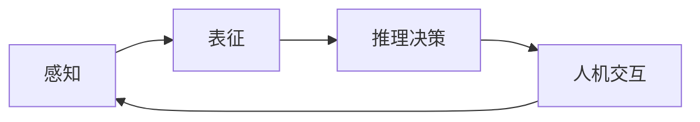

# AI人工智能代理工作流AI Agent WorkFlow：智能代理在重大事件预测系统中的应用

## 1.背景介绍

随着人工智能技术的快速发展，智能代理(Intelligent Agent)在各个领域得到了越来越广泛的应用。特别是在重大事件预测系统中，智能代理扮演着至关重要的角色。通过对海量数据的分析和建模，智能代理可以帮助我们更好地洞察事件发生的规律，提前预警潜在的风险，从而更好地应对未来的挑战。

### 1.1 智能代理的定义与特点

智能代理是一种能够感知环境、进行自主决策和执行任务的软件实体。它具有以下几个主要特点：

- 自主性：能够独立地执行任务，无需人工干预
- 社会性：能够与其他代理或人类进行交互和协作  
- 反应性：能够感知环境的变化并及时做出反应
- 主动性：能够主动地追求自己的目标

### 1.2 重大事件预测的意义

重大事件如自然灾害、社会动荡、经济危机等，往往会对社会稳定和人民生活造成重大影响。因此，提前预测和预警重大事件的发生，对于政府决策、企业运营乃至个人生活都有着重要意义。

### 1.3 智能代理在重大事件预测中的优势

传统的事件预测主要依赖专家经验和统计模型，存在主观性强、实时性差等问题。而智能代理凭借其强大的数据处理和机器学习能力，能够实现更加精准、实时、全面的事件预测。

## 2.核心概念与联系

要理解智能代理在重大事件预测中的应用，需要了解几个核心概念：

### 2.1 感知(Perception)

感知是指智能代理从环境中获取信息的过程。在重大事件预测中，感知主要包括从各种数据源(如新闻报道、社交媒体、物联网设备等)中提取事件相关的信息。

### 2.2 表征(Representation) 

将感知到的原始信息转化为计算机可以理解和处理的形式，称为表征。常见的表征方法包括：

- 符号表征：使用逻辑、规则等符号形式描述事件
- 分布式表征：使用向量、张量等分布式数据结构刻画事件
- 图表征：使用知识图谱等描述事件间的复杂关系

### 2.3 推理决策(Reasoning & Decision Making)

基于表征，智能代理需要进行推理和决策，判断事件发生的可能性及影响。常见的推理决策方法包括：

- 基于规则的推理：利用专家知识构建IF-THEN规则，进行事件推理
- 概率图模型推理：使用贝叶斯网络等概率图模型，对事件因果关系进行推理
- 深度学习模型：利用深度神经网络，端到端地学习事件预测

### 2.4 人机交互(Human-Agent Interaction)

智能代理的预测结果需要以恰当的方式呈现给用户，同时还要接受用户的反馈指令，形成人机交互闭环。常见的人机交互界面包括可视化仪表盘、自然语言对话系统等。

下图展示了智能代理在重大事件预测中的核心概念与联系：



## 3.核心算法原理具体操作步骤

智能代理的核心算法主要包括两大类：一是表征学习算法，用于从原始数据中提取事件特征；二是序列预测算法，用于根据历史事件序列预测未来事件。下面以图神经网络和Transformer为例，详细讲解其原理和操作步骤。

### 3.1 图神经网络用于事件表征学习

图神经网络(Graph Neural Network, GNN)能够直接在图结构数据上进行端到端学习，在事件表征中有着广泛应用。其基本步骤如下：

1. 构建事件知识图谱，节点表示事件实体，边表示事件间关系
2. 初始化节点和边的特征向量
3. 通过聚合函数(如求和、池化等)，更新节点表征
4. 通过注意力机制等方法，更新边表征 
5. 重复步骤3-4若干轮，得到最终的事件表征向量

常见的GNN模型包括图卷积网络(GCN)、图注意力网络(GAT)、图同构网络(GIN)等。

### 3.2 Transformer用于事件序列预测

Transformer是一种基于自注意力机制的序列建模方法，在自然语言处理领域取得了巨大成功。将其应用于事件序列预测的基本步骤如下：

1. 将历史事件序列输入Transformer的编码器，学习事件之间的依赖关系
2. 在编码器的最后一层输出基础上，叠加若干个解码器层
3. 在每个解码器层中：
   - 通过自注意力机制(Self-Attention)学习已生成事件序列的内部依赖
   - 通过编码-解码注意力机制(Encoder-Decoder Attention)学习当前时刻与历史事件的依赖
   - 通过前馈神经网络(Feed-Forward Network)进一步提取特征
4. 解码器最后一层输出通过Softmax层，得到下一时刻事件的概率分布

常见的Transformer变体有BERT、GPT、XLNet等，它们在预训练方式、目标函数等细节上有所不同。

## 4.数学模型和公式详细讲解举例说明

下面以图神经网络和Transformer中的关键数学模型为例，进行详细讲解。

### 4.1 图神经网络中的消息传递机制

图神经网络的核心是消息传递机制，即节点通过聚合邻居节点的信息来更新自身表征。设图 $G=(V,E)$，其中 $V$ 为节点集合，$E$ 为边集合。第 $l$ 层第 $i$ 个节点的隐状态为 $h_i^{(l)}$，则消息传递可以表示为：

$$
\begin{aligned}
m_i^{(l)} &= \mathop{AGG}\limits_{j \in N(i)} \left( \phi^{(l)} \left( h_i^{(l-1)}, h_j^{(l-1)}, e_{ij} \right) \right) \\
h_i^{(l)} &= \sigma \left( W^{(l)} \cdot \left[ h_i^{(l-1)}, m_i^{(l)} \right] \right)
\end{aligned}
$$

其中，$N(i)$ 表示节点 $i$ 的邻居节点集合，$e_{ij}$ 为节点 $i$ 到节点 $j$ 的边特征，$\phi^{(l)}$ 为消息函数，$\mathop{AGG}$ 为聚合函数，$\sigma$ 为激活函数，$W^{(l)}$ 为权重矩阵，$[\cdot,\cdot]$ 表示特征拼接。

举例来说，如果聚合函数选择求和，消息函数选择MLP，则上述公式可以具体化为：

$$
\begin{aligned}
m_i^{(l)} &= \sum_{j \in N(i)} \mathrm{MLP}^{(l)} \left( h_i^{(l-1)}, h_j^{(l-1)}, e_{ij} \right) \\
h_i^{(l)} &= \mathrm{ReLU} \left( W^{(l)} \cdot \left[ h_i^{(l-1)}, m_i^{(l)} \right] \right)
\end{aligned}
$$

### 4.2 Transformer中的自注意力机制

自注意力机制是Transformer的核心，它能够学习序列内部的长距离依赖关系。设输入序列为 $\mathbf{X} \in \mathbb{R}^{n \times d}$，其中 $n$ 为序列长度，$d$ 为特征维度。自注意力计算过程如下：

$$
\begin{aligned}
\mathbf{Q}, \mathbf{K}, \mathbf{V} &= \mathbf{X}\mathbf{W}^Q, \mathbf{X}\mathbf{W}^K, \mathbf{X}\mathbf{W}^V \\
\mathbf{A} &= \mathrm{softmax} \left( \frac{\mathbf{Q}\mathbf{K}^T}{\sqrt{d_k}} \right) \\
\mathrm{Attention}(\mathbf{Q},\mathbf{K},\mathbf{V}) &= \mathbf{A} \mathbf{V}
\end{aligned}
$$

其中，$\mathbf{Q}$, $\mathbf{K}$, $\mathbf{V}$ 分别为查询矩阵(Query)、键矩阵(Key)和值矩阵(Value)，它们是通过输入 $\mathbf{X}$ 乘以不同的权重矩阵得到的。$\mathbf{A}$ 为注意力矩阵，通过 $\mathbf{Q}$ 和 $\mathbf{K}$ 的点积并归一化得到，表示序列各个位置之间的相关性。最后将 $\mathbf{A}$ 乘以 $\mathbf{V}$ 得到注意力输出。

举例来说，假设输入序列 $\mathbf{X}$ 如下：

$$
\mathbf{X} = 
\begin{bmatrix}
0.1 & 0.2 & 0.3 \\
0.4 & 0.5 & 0.6 \\
0.7 & 0.8 & 0.9
\end{bmatrix}
$$

通过自注意力计算可得：

$$
\mathbf{Q}, \mathbf{K}, \mathbf{V} = 
\begin{bmatrix}
0.15 & 0.25 \\
0.45 & 0.55 \\
0.75 & 0.85
\end{bmatrix},
\begin{bmatrix}
0.12 & 0.22 \\
0.42 & 0.52 \\
0.72 & 0.82
\end{bmatrix},
\begin{bmatrix}
0.13 & 0.23 \\
0.43 & 0.53 \\
0.73 & 0.83
\end{bmatrix}
$$

$$
\mathbf{A} = 
\begin{bmatrix}
0.31 & 0.33 & 0.36 \\
0.29 & 0.34 & 0.37 \\  
0.28 & 0.35 & 0.37
\end{bmatrix}
$$

$$
\mathrm{Attention}(\mathbf{Q},\mathbf{K},\mathbf{V}) =
\begin{bmatrix}
0.29 & 0.39 \\
0.43 & 0.53 \\
0.57 & 0.67  
\end{bmatrix}
$$

可以看出，自注意力机制通过学习序列内部的依赖关系，得到了一个新的表征矩阵，突出了重要位置的信息。

## 5.项目实践：代码实例和详细解释说明

下面以PyTorch为例，给出图神经网络和Transformer的简要实现。

### 5.1 图神经网络代码实例

```python
import torch
import torch.nn as nn
import torch.nn.functional as F

class GCNLayer(nn.Module):
    def __init__(self, in_dim, out_dim):
        super().__init__()
        self.fc = nn.Linear(in_dim, out_dim)
        
    def forward(self, X, A):
        X = self.fc(X)
        X = torch.matmul(A, X)
        return X

class GCN(nn.Module):
    def __init__(self, in_dim, hidden_dim, out_dim):
        super().__init__()
        self.gcn1 = GCNLayer(in_dim, hidden_dim)
        self.gcn2 = GCNLayer(hidden_dim, out_dim)
        
    def forward(self, X, A):
        X = F.relu(self.gcn1(X, A))
        X = self.gcn2(X, A)
        return X
```

这里实现了一个简单的两层图卷积网络(GCN)。其中`GCNLayer`实现了单层GCN的计算逻辑，包括将节点特征 $\mathbf{X}$ 通过全连接层转换维度，然后左乘邻接矩阵 $\mathbf{A}$ 进行消息聚合。`GCN`类则将两个`GCNLayer`串联起来，构成完整的前向传播过程。

### 5.2 Transformer代码实例

```python
import torch
import torch.nn as nn
import torch.nn.functional as F

class MultiHeadAttention(nn.Module):
    def __init__(self, d_model, num_heads):
        super().__init__()
        self.d_model = d_model
        self.num_heads = num_heads
        self.head_dim = d_model // num_heads
        
        self.W_Q =