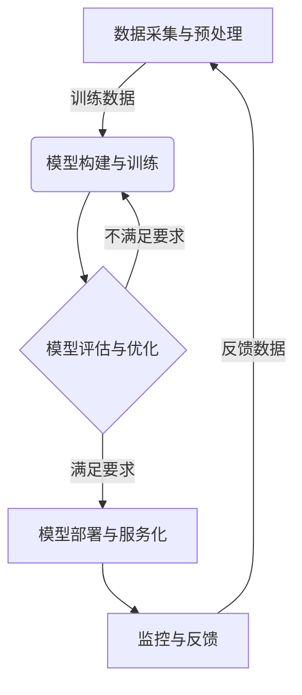

# AI人工智能核心算法原理与代码实例讲解：人工智能应用发展趋势

## 1.背景介绍

人工智能(Artificial Intelligence, AI)是当代科技发展的前沿领域,近年来受到了前所未有的关注和投资。AI技术的快速发展正在深刻影响和改变着各行各业,催生出新的商业模式和应用场景。本文将探讨AI核心算法原理、代码实现以及未来发展趋势,为读者提供全面的AI技术解析。

### 1.1 人工智能的定义

人工智能是一门研究如何用人工方式模拟、延伸和扩展人类智能的理论与方法的学科。它涉及计算机科学、数学、生物学、心理学等多个领域,旨在赋予机器人或计算机系统类似于人类的认知功能,如学习、推理、感知、规划和语言交互等。

### 1.2 人工智能的重要性

人工智能技术的发展将极大提高生产效率,优化资源配置,推动产业升级。在医疗、交通、教育、金融等诸多领域,AI都展现出巨大的应用潜力和价值。同时,AI也面临着算法偏差、隐私与安全、就业影响等诸多挑战和伦理道德问题。

## 2.核心概念与联系  

### 2.1 机器学习

机器学习(Machine Learning)是人工智能的核心子领域,旨在让计算机系统基于数据"学习"并优化任务执行。常见的机器学习算法包括监督学习、非监督学习和强化学习等。

#### 2.1.1 监督学习

监督学习利用带有正确答案的标注数据训练模型,常用于分类和回归任务。典型算法有线性回归、逻辑回归、支持向量机、决策树和神经网络等。

#### 2.1.2 非监督学习 

非监督学习则是从未标注的原始数据中发现内在模式和结构。常见算法包括聚类分析、关联规则挖掘和降维技术等,广泛应用于客户细分、异常检测和数据压缩等场景。

#### 2.1.3 强化学习

强化学习则是通过与环境的交互来学习执行最优策略,常用于控制、决策和规划等任务。算法包括Q-Learning、策略梯度等。

### 2.2 深度学习

深度学习(Deep Learning)是机器学习的一个新兴热点方向,其灵感来源于人脑的神经网络结构。通过构建多层非线性变换网络,深度学习能够自动从大量数据中学习出特征表示,在计算机视觉、自然语言处理等领域取得了突破性进展。

#### 2.2.1 卷积神经网络

卷积神经网络(Convolutional Neural Networks, CNN)是深度学习在计算机视觉领域的核心算法,通过卷积、池化等操作自动提取图像特征,在图像分类、目标检测等任务中表现卓越。

#### 2.2.2 循环神经网络

循环神经网络(Recurrent Neural Networks, RNN)则擅长处理序列数据,如文本和语音。通过内部状态的循环传递,RNN能够很好地捕捉序列中的长期依赖关系,常用于自然语言处理、语音识别等任务。

#### 2.2.3 transformer

Transformer是一种全新的基于注意力机制的神经网络架构,在机器翻译、问答系统等领域取得了优异表现,被认为是自然语言处理领域的里程碑式进展。

### 2.3 人工智能系统架构

构建人工智能系统通常需要以下几个核心组件:

1. **数据采集与预处理**:收集并清洗训练所需的高质量数据。
2. **模型构建与训练**:选择合适的算法,构建模型架构并使用训练数据进行模型训练。
3. **模型评估与优化**:在验证集上评估模型性能,并通过调参、集成等方法优化模型。
4. **模型部署与服务化**:将训练好的模型部署到生产环境,提供可靠高效的在线服务。
5. **监控与反馈**:持续监控模型在线表现,并根据用户反馈不断优化迭代。

## 3.核心算法原理具体操作步骤

### 3.1 监督学习算法

以线性回归和逻辑回归为例,介绍监督学习算法的原理与实现步骤。

#### 3.1.1 线性回归

线性回归试图学习出一个最佳拟合的线性方程,使预测值与真实值的残差平方和最小。算法步骤如下:

1. 准备数据,包括特征矩阵X和标签向量y。
2. 初始化权重向量w为0向量。
3. 计算预测值与真实值的残差:$r = y - Xw$
4. 计算残差平方和损失函数:$J(w) = \frac{1}{2}||r||_2^2$
5. 计算损失函数关于权重w的梯度:$\nabla J(w) = X^Tr$  
6. 使用梯度下降法更新权重:$w := w - \alpha \nabla J(w)$
7. 重复4-6步,直至收敛或达到停止条件。

#### 3.1.2 逻辑回归

逻辑回归用于二分类问题,通过对数几率回归模型估计样本属于正类的概率。算法步骤如下:

1. 准备数据,包括特征矩阵X和标签向量y。
2. 初始化权重向量w为0向量。
3. 计算样本的预测概率:$\hat{y} = \sigma(Xw)$,其中$\sigma$为Sigmoid函数。
4. 计算交叉熵损失函数:$J(w) = \frac{1}{m}\sum_{i=1}^m[-y_i\log\hat{y}_i - (1-y_i)\log(1-\hat{y}_i)]$
5. 计算损失函数关于权重w的梯度:$\nabla J(w) = \frac{1}{m}X^T(\hat{y} - y)$
6. 使用梯度下降法更新权重:$w := w - \alpha \nabla J(w)$  
7. 重复3-6步,直至收敛或达到停止条件。

### 3.2 非监督学习算法

以K-Means聚类和主成分分析(PCA)为例,介绍非监督学习算法原理。

#### 3.2.1 K-Means聚类

K-Means是一种常用的聚类分析算法,将n个样本划分到k个簇中,使簇内样本尽可能紧密,簇间样本尽可能疏远。算法步骤如下:

1. 随机初始化k个簇中心。
2. 对每个样本,计算到k个簇中心的距离,将其分配到最近的那一簇。
3. 对于每一簇,重新计算簇中所有样本的均值作为新的簇中心。
4. 重复步骤2-3,直至簇分配不再发生变化或达到最大迭代次数。

#### 3.2.2 主成分分析(PCA)

PCA是一种常用的数据降维技术,通过线性变换将高维数据投影到一个低维空间,同时保留数据的最大方差。算法步骤如下:

1. 对输入数据X进行归一化处理,使其均值为0。
2. 计算数据X的协方差矩阵:$\Sigma = \frac{1}{m}X^TX$
3. 计算协方差矩阵$\Sigma$的特征值和特征向量。
4. 选择前k个最大的特征值对应的特征向量,作为投影矩阵P。
5. 对原始数据X进行投影:$Z = XP$,得到降维后的低维数据Z。

### 3.3 强化学习算法 

以Q-Learning为例,介绍强化学习核心算法原理。

#### 3.3.1 Q-Learning

Q-Learning是一种常用的基于价值迭代的强化学习算法,不需要环境的模型即可学习最优策略。算法步骤如下:

1. 初始化Q表格,所有状态-动作对的Q值设为任意值。
2. 对当前状态s,根据策略选择动作a(如$\epsilon$-贪婪策略)。
3. 执行动作a,获得下一状态s'和即时奖励r。
4. 更新Q表格中(s,a)的Q值:
   $$Q(s,a) \leftarrow Q(s,a) + \alpha[r + \gamma\max_{a'}Q(s',a') - Q(s,a)]$$
   其中$\alpha$为学习率,$\gamma$为折扣因子。
5. 将s'设为新的当前状态,返回步骤2。
6. 重复上述过程,直至收敛到最优策略。

## 4.数学模型和公式详细讲解举例说明

### 4.1 线性回归模型

线性回归模型试图学习出一个最佳拟合的线性方程:

$$y = w_0 + w_1x_1 + w_2x_2 + ... + w_nx_n$$

其中y为预测目标值,x为输入特征向量,w为需要学习的权重参数。

我们的目标是最小化预测值与真实值之间的均方误差:

$$J(w) = \frac{1}{2m}\sum_{i=1}^m(y^{(i)} - \hat{y}^{(i)})^2$$

其中m为样本数量,$y^{(i)}$为第i个样本的真实值,$\hat{y}^{(i)}$为预测值。

通过梯度下降法可以有效优化权重w,使损失函数J(w)最小化。梯度计算公式如下:

$$\nabla J(w) = \frac{1}{m}X^T(Xw - y)$$

其中X为输入特征矩阵,y为标签向量。

例如,假设我们有一个包含2个特征的线性回归问题,其中$x_1$表示房屋面积,$x_2$表示房屋卧室数量,目标是预测房屋价格y。我们初始化权重为$w = [0, 0, 0]^T$,学习率$\alpha = 0.01$,样本数m = 1000。经过多次迭代,权重向量收敛为$w = [100, 50, 20]^T$,即:

$$y = 100 + 50 \times \text{面积} + 20 \times \text{卧室数}$$

这就是我们学习到的最佳线性模型,可以用于预测新房屋的价格。

### 4.2 逻辑回归模型

逻辑回归模型常用于二分类问题,通过对数几率回归模型估计样本属于正类的概率:

$$P(y=1|x) = \sigma(w_0 + w_1x_1 + ... + w_nx_n) = \frac{1}{1 + e^{-(w_0 + w_1x_1 + ... + w_nx_n)}}$$

其中$\sigma$为Sigmoid函数,将线性函数的值映射到(0,1)范围内,作为样本属于正类的概率估计值。

我们的目标是最小化交叉熵损失函数:

$$J(w) = -\frac{1}{m}\sum_{i=1}^m[y^{(i)}\log\hat{y}^{(i)} + (1-y^{(i)})\log(1-\hat{y}^{(i)})]$$

其中$\hat{y}^{(i)}$为第i个样本的预测概率。

同样通过梯度下降法优化权重w,梯度计算公式如下:

$$\nabla J(w) = \frac{1}{m}X^T(\hat{y} - y)$$

例如,假设我们有一个判断电子邮件是否为垃圾邮件的二分类问题,其中$x_1$表示邮件长度,$x_2$表示邮件包含"赢取"关键词的次数。我们初始化权重为$w = [0, 0, 0]^T$,学习率$\alpha = 0.01$,样本数m = 10000。经过多次迭代,权重向量收敛为$w = [-2, 0.01, 0.5]^T$,即:

$$P(\text{垃圾邮件}=1|x) = \sigma(-2 + 0.01 \times \text{邮件长度} + 0.5 \times \text{包含"赢取"次数})$$

我们可以根据这个模型,对新的邮件样本判断其是否为垃圾邮件。

###